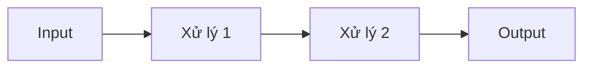

# Note Conventions — Cấu Trúc Ghi Chú & Template

## Cấu Trúc Thư Mục

```text
20_Areas/AI/Concepts/        ← Concept notes (khái niệm độc lập)
20_Areas/AI/MOC/             ← Map of Content (nhóm concept theo chủ đề)
10_Projects/D2L/             ← Session notes (buổi học cụ thể)
30_Resources/               ← Source notes (từ sách, paper, video)
  ├── Books/
  ├── Webs/
  └── Videos/
assets/attachments/<context>/ ← Hình ảnh, biểu đồ, code snippets
```

Quy tắc:

- Tối đa 3 cấp thư mục
- Dùng MOC thay vì thư mục con để nhóm notes
- Không tạo folder con quá sâu (ví dụ: `AI/NLP/Seq2Seq/Attention` → SAI)

---

## Frontmatter Schema

### Concept Note

```yaml
---
aliases: [tên viết tắt]
tags: [ai, deep-learning, #concept-name]
status: seedling|growth|evergreen
source: Tổng hợp từ D2L Ch.X, paper gốc, v.v.
created: YYYY-MM-DD
related:
  - "[[LSTM]]"
  - "[[Gradient Descent]]"
  - "[[Buổi 42 - Tuần 12]]"
---
```

### Session Note (Buổi học D2L)

```yaml
---
session: "D2L Tuần X, Buổi Y — Tên chủ đề"
aliases: ["Buổi N"]
tags: [d2l, deep-learning, #topic]
status: seedling|growth
source: "D2L Chapter X.Y — Section Name"
created: YYYY-MM-DD
related:
  - "[[Buổi N-1 - Tuần M]]"
  - "[[Concept Name]]"
---
```

### Source Note (Literature)

```yaml
---
title: Tên tài liệu
author: Tác giả / Nguồn
type: book|blog|paper|video|lecture
tags: [ai, #topic]
source: URL hoặc đường dẫn file
created: YYYY-MM-DD
summary: Tóm tắt 1-2 câu
related:
  - "[[Concept A]]"
  - "[[Concept B]]"
---
```

### MOC (Map of Content)

```yaml
---
title: <Tên chủ đề> — MOC
aliases: ["<viết tắt> MOC"]
tags: [moc, ai, #topic]
created: YYYY-MM-DD
description: Tổng hợp các ghi chú về <chủ đề>
---
```

---

## Concept Introduction Template (BẮT BUỘC cho mọi concept mới)

Khi giới thiệu bất kỳ concept mới nào, tuân thủ **3 tầng** theo đúng thứ tự:

### Tầng 1 — ELI5

```markdown
> [!NOTE] ELI5
>
> [Ẩn dụ đời thường cực kỳ đơn giản, 2-5 câu, KHÔNG dùng thuật ngữ chuyên ngành]
>
> Ví dụ cho "Padding trong NLP":
> "Khi bạn xếp những cuốn sách có độ dày khác nhau vào một kệ, bạn cần đệm thêm sách mỏng vào để tất cả đều cao bằng nhau. Padding trong NLP cũng vậy — câu ngắn được thêm từ giả vào cuối để tất cả các câu trong một batch có cùng độ dài."
```

### Tầng 2 — Định Nghĩa Kỹ Thuật (NGAY SAU ELI5)

```markdown
**Định nghĩa kỹ thuật:**

- **Đây là gì?** [1-2 câu định nghĩa chính xác]
- **Input/Output gì?** [Shape, type cụ thể — ví dụ: Input: (batch, seq_len), Output: (batch, seq_len, vocab_size)]
- **Giải quyết vấn đề gì?** [Vấn đề cụ thể mà concept này được tạo ra để giải quyết]
- **Thay thế/gợi ý giải pháp nào trước đây?** [Cách cũ, nếu có]

> [!IMPORTANT]
> Tầng này là **cầu nối** giữa ELI5 và cơ chế chi tiết. Người đọc phải hiểu **WHAT** và **WHY** trước khi đọc HOW.
```

### Tầng 3 — Cơ Chế Chi Tiết

```markdown
## Chi tiết

### Công thức / Code

$$
[ công thức ]
$$

**Từ điển ký hiệu:**
- $x$: ...
- $y$: ...

### Implementation

```python
# code với comment giải thích từng dòng
```

### Data Flow



### So sánh với concept liên quan

| Khía cạnh | [Concept A — đã biết] | [Concept mới — đang học] |
| --- | --- | --- |
| Vấn đề giải quyết | ... | ... |
| Cơ chế | ... | ... |
| Khi nào dùng | ... | ... |

### Failure Modes

- **Khi nào KHÔNG hoạt động:** [Mô tả edge cases]
- **Nếu bỏ đi:** [Điều gì sai]

---

## Session Note Template (Buổi học D2L)

```markdown
---
session: "D2L Tuần X, Buổi Y — Tên chủ đề"
aliases: ["Buổi N"]
tags: [d2l, deep-learning, #topic]
status: growth
source: "D2L Chapter X.Y — Section Name"
created: YYYY-MM-DD
related:
  - "[[Buổi N-1 - Tuần M]]"
  - "[[Concept Name]]"
---

# Buổi N — Tên Chủ Đề

> [!NOTE] Mục tiêu buổi học
> - [ ] Mục tiêu 1
> - [ ] Mục tiêu 2

## Active Recall

### Câu hỏi truy hồi (không nhìn tài liệu)

1. [Câu hỏi về concept buổi trước]
2. ...

### Trả lời nhanh

- **Q1:** [Claim] → [Reasoning] → [Evidence]
- ...

### Liên kết cần ôn lại

- [[Concept A]]
- [[Concept B]]

---

## Nội dung chính

### Section X.Y — Tên Section

> [!NOTE] ELI5
> [Ẩn dụ]

**Định nghĩa kỹ thuật:**
...

## Tóm tắt buổi

| Khái niệm | Hiểu | Cần ôn |
|-----------|------|--------|
| Concept A | ✅ | |
| Concept B | | ❌ |

## TODO

- [ ] Tạo concept note cho [[Concept X]]
- [ ] Tìm hiểu thêm về [vấn đề chưa rõ]
```

---

## Knowledge Gap Checklist (Trước Khi Đóng File)

Trước khi lưu file, tự kiểm tra:

```text
CHECKLIST — Kiến thức có bị nhồi nhét không?

□ Mọi tham số (như ignore_index, padding_idx) đều có giải thích ý nghĩa và tại sao cần nó
□ Mọi ký hiệu trong công thức đều có từ điển
□ Có ELI5 cho mỗi concept mới
□ Có so sánh với concept đã biết
□ Có nêu edge case / failure mode
□ Không wikilink chết (concept chưa tồn tại → tạo stub)
□ Frontmatter đầy đủ (session, tags, related)
□ Có Active Recall cho các concept từ buổi trước
```

---

## Dead Link Resolution Protocol

Khi gặp wikilink đến concept chưa tồn tại:

1. **Tạo stub ngay lập tức** trong `20_Areas/AI/Concepts/`
2. **Điền TODO** ở cuối stub để phát triển sau
3. **Đánh dấu** `status: seedling` trong frontmatter
4. **Link ngược** từ session note đang viết

```markdown
<!-- Stub template cho concept mới -->
---
aliases: [tên viết tắt]
tags: [ai, #topic]
status: seedling
source: Từ [[Buổi N - Tuần X]]
created: YYYY-MM-DD
related: []
---

# [Concept Name]

> [!TODO] Cần hoàn thiện
> - [ ] Tìm hiểu nguồn gốc / paper gốc
> - [ ] Viết ELI5
> - [ ] Viết định nghĩa kỹ thuật
> - [ ] Thêm công thức / code
> - [ ] So sánh với concept liên quan
```
