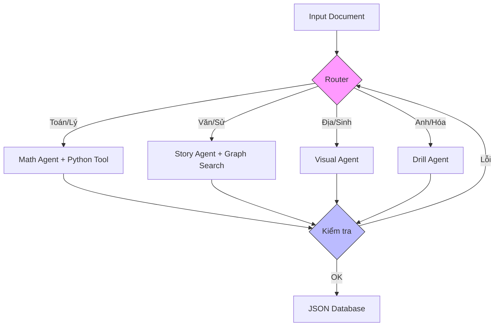

# Tìm hiểu công nghệ 
Để hiện thực hóa ý tưởng này bằng **LangGraph**, mô hình phù hợp nhất là **Supervisor Architecture (Kiến trúc Giám sát)**. Đây là mô hình mà một "Tổng đài viên" (Supervisor) sẽ đứng giữa, nhận yêu cầu và phân phối việc cho các nhân viên chuyên trách (Sub-agents), sau đó thu gom kết quả.

Dưới đây là thiết kế chi tiết về luồng (Flow) và vai trò của các Sub-agents:

### 1. Định nghĩa `State` (Trạng thái chung)

Trong LangGraph, các Agent giao tiếp bằng cách truyền tay nhau một cuốn sổ ghi chép gọi là `State`. Bạn cần định nghĩa cuốn sổ này trước.

Python

```python
class AgentState(TypedDict):
    input_doc: str          # Nội dung tài liệu gốc hoặc chunk đang xử lý
    doc_metadata: dict      # Môn học, Lớp, Chương (để Router quyết định dễ hơn)
    messages: list          # Lịch sử hội thoại
    generated_questions: list # Danh sách câu hỏi đã sinh ra
    errors: list            # Các lỗi phát hiện được (nếu có)
    next_step: str          # Hướng đi tiếp theo (do Router quyết định)
```

### 2. Thiết kế các Node (Các Sub-Agents)

Dựa trên 4 loại dữ liệu chúng ta đã phân tích, bạn sẽ dựng 4 "Worker Agents". Mỗi Agent là một node trong graph.

#### A. Node Supervisor (Router - Bộ điều hướng)

- **Nhiệm vụ:** Đọc `input_doc` và `doc_metadata` để quyết định xem đoạn văn bản này thuộc loại nào.
    
- **Prompt:** "Bạn là quản lý. Dựa vào nội dung văn bản (Toán, Sử, hay Hình ảnh...), hãy chọn worker phù hợp nhất: `MathAgent`, `StoryAgent`, `VisualAgent`, hay `DrillAgent`."
    
- **Output:** Tên của Agent tiếp theo.
    

#### B. Node 1: Math Agent (Xử lý Ký hiệu & Tính toán)

- **Chuyên môn:** Toán, Lý, Hóa (bài tập).
    
- **Tools:**
    
    - `Python REPL`: Để tính toán đáp án số học, giải phương trình.
        
    - `Wolfram Alpha` (nếu có): Để giải đại số phức tạp.
        
- **Luồng hoạt động:**
    
    1. Trích xuất công thức/số liệu từ text.
        
    2. Dùng Python viết code để giải bài toán gốc.
        
    3. Biến đổi số liệu (Data Augmentation) để tạo ra các đề bài tương tự (nhưng khác số).
        
    4. Trả về JSON: `{Question, CorrectAns, WrongAns_1 (lỗi tính sai), WrongAns_2 (lỗi sai công thức)}`.
        

#### C. Node 2: Story Agent (Xử lý Tường thuật)

- **Chuyên môn:** Văn, Sử, GDCD.
    
- **Tools:**
    
    - `GraphRAG Retriever` hoặc `VectorSearch`: Tìm kiếm ngữ cảnh rộng.
        
- **Luồng hoạt động:**
    
    1. Phân tích chuỗi sự kiện (Timeline) hoặc quan hệ nhân vật.
        
    2. Tạo câu hỏi tư duy: "Tại sao...", "Sự kiện nào dẫn đến...", "Sắp xếp theo thứ tự...".
        
    3. Trả về JSON phù hợp với Game cốt truyện/Timeline.
        

#### D. Node 3: Visual Agent (Xử lý Không gian)

- **Chuyên môn:** Địa, Sinh (Hình ảnh).
    
- **Input đặc biệt:** Nhận mô tả văn bản của hình ảnh (đã được xử lý ở bước Ingestion) hoặc Vector ảnh.
    
- **Luồng hoạt động:**
    
    1. Đọc mô tả ảnh (ví dụ: "Sơ đồ tế bào, phần A là nhân, B là màng...").
        
    2. Tạo câu hỏi che nhãn: "Phần B trong hình là gì?".
        
    3. Trả về JSON cho Game Labeling/Map.
        

#### E. Node 4: Drill Agent (Xử lý Taxonomy/Cấu trúc)

- **Chuyên môn:** Tiếng Anh (Ngữ pháp/Từ vựng), Hóa (Bảng tuần hoàn).
    
- **Tools:** `Pandas` (xử lý bảng), `JSON Parser`.
    
- **Luồng hoạt động:**
    
    1. Trích xuất dữ liệu thành dạng cặp (Key-Value). Ví dụ: `Word: Apple - Meaning: Quả táo`.
        
    2. Tạo bộ câu hỏi Matching hoặc Flashcard.
        

#### F. Node Reviewer (Chốt chặn chất lượng)

Đây là node quan trọng nhất để đảm bảo độ chính xác.

- **Nhiệm vụ:** Đóng vai một giáo viên khó tính.
    
- **Prompt:** "Kiểm tra danh sách câu hỏi trong `generated_questions`.
    
    1. Đáp án có đúng không? (Nếu là Toán, yêu cầu giải lại).
        
    2. Có phù hợp với học sinh cấp 3 không?
        
    3. Định dạng JSON có đúng schema không?"
        
- **Quyết định:**
    
    - Nếu Tốt -> Chuyển sang node **End**.
        
    - Nếu Tệ -> Gửi lại về cho Sub-Agent tương ứng sửa (Feedback Loop).
        

---

### 3. Sơ đồ Luồng đi (Workflow Diagram)

Code snippet



### 4. Ví dụ luồng chạy thực tế (Scenario)

Giả sử input là một trang PDF **Vật Lý 12: Dao động điều hòa**.

1. **Ingestion:** Hệ thống tách text, thấy có công thức $x = A\cos(\omega t + \phi)$.
    
2. **Supervisor:** Nhận thấy keyword "dao động", "tần số", và nhiều công thức -> **Route tới Math Agent**.
    
3. **Math Agent:**
    
    - Nhận yêu cầu.
        
    - Sinh câu hỏi: "Một vật dao động có phương trình $x = 4\cos(10\pi t)$. Tìm chu kỳ T."
        
    - _Dùng Tool Python:_ Chạy code `T = 2 * 3.14159 / (10 * 3.14159)` ra kết quả `0.2`.
        
    - Tạo đáp án nhiễu: `0.5` (tính ngược), `5` (quên chia $2\pi$).
        
    - Gửi kết quả sang Reviewer.
        
4. **Reviewer:**
    
    - Check JSON: Hợp lệ.
        
    - Check Logic: Đáp án 0.2s khớp với đề bài.
        
    - Check Level: Phù hợp Vật lý 12.
        
    - -> **Approve**.
        
5. **Output:** Lưu vào DB để Game engine load lên màn hình.
    

### 5. Công nghệ đề xuất cụ thể

Để xây dựng hệ thống sub-agents này, bạn cần cài đặt:

- **LangGraph:** Để dựng khung (Graph, State, Nodes).
    
- **LangChain Core:** Để viết PromptTemplate và tạo Chain cho từng Agent.
    
- **Pydantic:** Để định nghĩa class `MathQuestion`, `HistoryQuestion`... giúp ép kiểu dữ liệu đầu ra.
    
- **LLM Model:**
    
    - Supervisor & Reviewer: Nên dùng model thông minh nhất (GPT-4o, Claude 3.5 Sonnet, Gemini 1.5 Pro) để điều phối và chấm điểm chính xác.
        
    - Worker Agents: Có thể dùng model nhẹ hơn, rẻ hơn (GPT-4o-mini, Gemini Flash) để tiết kiệm chi phí vì nhiệm vụ đã được chia nhỏ cụ thể.
        

Bạn thấy luồng đi này đã đủ rõ ràng để bắt tay vào code phần khung (skeleton) chưa?