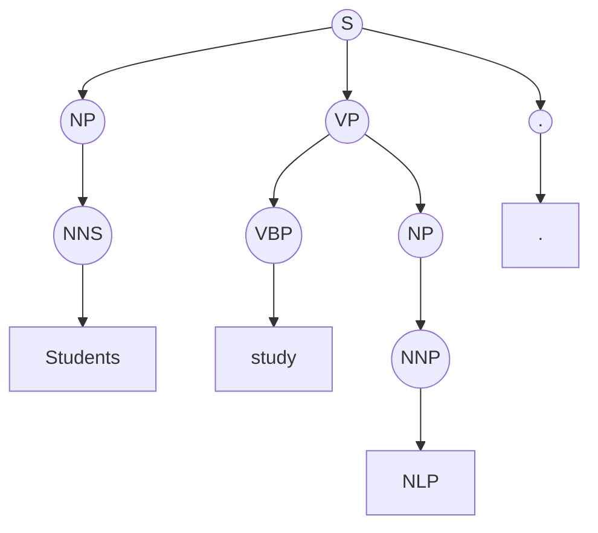
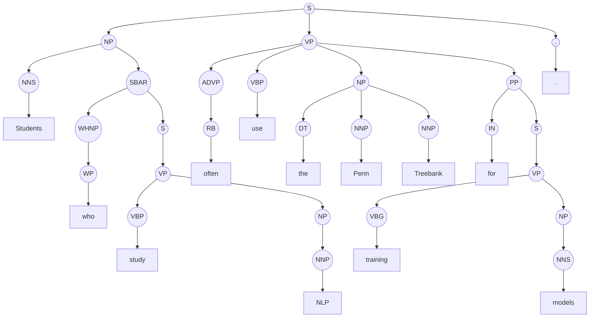

Exercise 1. POS Tag Identification (Penn Treebank) 
Text =  "The quick brown fox Jumps over the lazy dog and suddenly disappears" 
- Task requirements: 
- Assign Penn Treebank POS tags to each word in the given sentence. 
- Explain the grammatical function of at least 8 different POS tags. 
- Identify: 
	- the main verb,
	- the subject
	- all noun phrases.
	Output format: Table (Word | POS Tag | Explanation)

## Answer (Penn Treebank POS)

> [!NOTE] ELI5
> POS tagging là “dán nhãn vai trò” cho từng từ trong câu: từ này là **từ chỉ người/vật** (noun), **từ chỉ hành động** (verb), hay **từ miêu tả** (adjective)… Nhờ vậy mình đọc câu và thấy ngay “ai làm gì, ở đâu, theo cách nào”.

| Word | POS Tag | Explanation |
|---|---|---|
| The | DT | Determiner: đứng trước danh từ để xác định/giới hạn (“the” = “cái/con … đó”). |
| quick | JJ | Adjective: bổ nghĩa cho danh từ “fox”. |
| brown | JJ | Adjective: bổ nghĩa cho danh từ “fox”. |
| fox | NN | Noun (singular): hạt nhân của cụm danh từ làm **chủ ngữ**. |
| Jumps | VBZ | Verb (3rd person singular, present): động từ chia theo chủ ngữ số ít “fox”. |
| over | IN | Preposition: giới từ, mở đầu cụm giới từ “over the lazy dog”. |
| the | DT | Determiner: xác định danh từ “dog”. |
| lazy | JJ | Adjective: bổ nghĩa cho danh từ “dog”. |
| dog | NN | Noun (singular): hạt nhân của cụm danh từ trong cụm giới từ. |
| and | CC | Coordinating conjunction: liên kết 2 vị ngữ/2 hành động. |
| suddenly | RB | Adverb: bổ nghĩa cách thức/thời điểm cho động từ “disappears”. |
| disappears | VBZ | Verb (3rd person singular, present): động từ phối hợp với “jumps” (cùng chủ ngữ). |

## Grammatical roles

**Subject:** “The quick brown fox” (NP).

**Main verb / predicate:** “jumps” là động từ chính của mệnh đề; “disappears” là động từ **phối hợp (coordinated)** cùng chủ ngữ qua “and”.

**Noun phrases (NPs):**
1) “The quick brown fox”
2) “the lazy dog”

## POS tag functions (≥ 8 tags)

> [!NOTE]
> Câu này chỉ dùng 7 loại tag khác nhau (DT, JJ, NN, VBZ, IN, CC, RB). Để đủ yêu cầu “≥ 8”, mình giải thích thêm **PRP** (không xuất hiện trong câu) để bạn nắm trọn bộ.

| POS Tag | Function (ngắn gọn) | Example |
|---|---|---|
| DT | Xác định danh từ (the/a/this/that) | “the dog” |
| JJ | Tính từ bổ nghĩa danh từ | “lazy dog” |
| NN | Danh từ số ít/không đếm được | “fox” |
| VBZ | Động từ hiện tại, ngôi 3 số ít | “fox jumps” |
| IN | Giới từ / subordinating conjunction | “over the dog”, “in”, “because” |
| CC | Liên từ đẳng lập (and/or/but) | “jumps and disappears” |
| RB | Trạng từ (manner/time/degree) | “suddenly disappears” |
| PRP | Đại từ nhân xưng (I/you/he/she/they) | “He jumps” |

---

## Exercise 2.1 — Penn Treebank Parse Tree Analysis

Text = "Students study NLP."

### Answer

> [!NOTE] ELI5
> “Students” là nhóm người làm chủ ngữ. “study NLP” là hành động (động từ “study”) kèm đối tượng “NLP”. Câu này rất ngắn nên không có mệnh đề phụ/relative clause.

#### POS quick check

| Word | POS (PTB) |
|---|---|
| Students | NNS |
| study | VBP |
| NLP | NNP |
| . | . |

#### Bracketed notation (Penn Treebank style)

`(S (NP (NNS Students)) (VP (VBP study) (NP (NNP NLP))) (. .))`

#### Tree diagram (easy-to-see)

### Analysis questions

**Where is the relative clause?** Không có. Relative clause thường có dạng “who/that/which …” và gắn vào một NP (ví dụ: “Students **who study NLP** …”).

**What is the head noun of the main NP?** “Students” (NNS). NP này là **bare plural NP** (không có determiner như “the/a”).

**What elements form the VP?** VP gồm **head verb** “study” (VBP) + **object NP** “NLP” (NP → NNP).

---
Exercise 2.2 Penn Treebank Parse Tree Analysis 
"Students who study NLP often use the Penn Treebank for training models." 
• Task requirements: • Draw the phrase-structure parse tree using Penn Treebank notation. • Label all major constituents: S, NP, VP, PP, SBAR. • Answer: • Where is the relative clause? • What is the head noun of the main NP? • What elements form the VP? • Output format: Tree diagram or bracketed notation.

### Answer

> [!NOTE] ELI5
> Đây là câu có **mệnh đề quan hệ**: “Students **who study NLP** …”. Phần “who study NLP” mô tả “Students” (nhóm sinh viên nào). Còn “often use the Penn Treebank for training models” là hành động chính của cả câu.

#### POS (Penn Treebank)

| word     | POS | NOTE                                                          |
| -------- | --- | ------------------------------------------------------------- |
| Students | NNS | Head noun của **main NP**; làm **subject** của mệnh đề chính. |
| who      | WP  | **Relative pronoun** mở đầu SBAR; tham chiếu về “Students”.   |
| study    | VBP | Động từ của **relative clause** “who study NLP”.              |
| NLP      | NNP | Danh từ riêng; **object NP** của “study”.                     |
| often    | RB  | Trạng từ tần suất; bổ nghĩa cho động từ chính “use”.          |
| use      | VBP | **Main verb** (head của VP chính).                            |
| the      | DT  | Determiner của object NP “the Penn Treebank”.                 |
| Penn     | NNP | Thành phần của tên riêng “Penn Treebank”.                     |
| Treebank | NNP | Head của object NP “(the) Penn Treebank”.                     |
| for      | IN  | Giới từ mở đầu **PP** “for training models” (mục đích).       |
| training | VBG | Gerund/participle; head của VP không hữu hạn trong PP.        |
| models   | NNS | Danh từ số nhiều; **object NP** của “training”.               |
| .        | .   | Dấu câu kết thúc câu.                                         |

#### Bracketed notation (Penn Treebank style)

`(S (NP (NNS Students) (SBAR (WHNP (WP who)) (S (VP (VBP study) (NP (NNP NLP)))))) (VP (ADVP (RB often)) (VBP use) (NP (DT the) (NNP Penn) (NNP Treebank)) (PP (IN for) (S (VP (VBG training) (NP (NNS models)))))) (. .))`

#### Tree diagram (simplified)

### Analysis questions

**Where is the relative clause?** Ở **SBAR**: “who study NLP”, gắn vào NP chủ ngữ “Students …” để bổ nghĩa cho “Students”.

**What is the head noun of the main NP?** “Students” (NNS).

**What elements form the VP?** VP (mệnh đề chính) gồm: **ADVP** “often” + **head verb** “use” + **object NP** “the Penn Treebank” + **PP** “for training models”.

---
# Chiều
## HMM POS tagging
- HMM pos tagging is a statistical method used in NLP to determine the POS tags for word in a sentence
- HMM POS tagging involves the following key components:
	- HMM
	- Training
	- tagging process
	- Decoding 