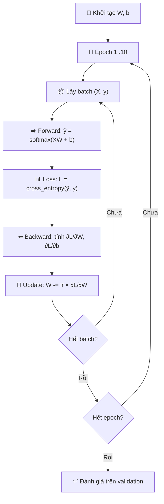

# Buổi 16 — Softmax Regression from Scratch: Tự tay code mọi thứ

> [!NOTE] ELI5
> Buổi 14 bạn biết **lý thuyết** (softmax, cross-entropy). Buổi 15 bạn biết **dữ liệu** (Fashion-MNIST). Buổi 16 bạn **tự tay lắp ráp** tất cả lại: viết hàm softmax, viết hàm loss, xây model, training loop — không dùng bất kỳ hàm sẵn nào. Giống như tự lắp xe đạp thay vì mua xe lắp sẵn — chậm hơn nhưng **hiểu trọn vẹn** từng bộ phận.

---

## 🎯 Mục tiêu buổi học

1. **Implement hàm softmax** từ đầu (3 bước: exp → sum → normalize)
2. Xây **model class** cho softmax regression (784 → 10)
3. **Implement cross-entropy loss** bằng indexing trick
4. Hiểu **training loop** đầy đủ: forward → loss → backward → update
5. **Prediction** và phân tích lỗi trên Fashion-MNIST

---

## Phần 1: Implement hàm Softmax

> [!NOTE] ELI5
> Softmax biến điểm thô thành xác suất. Code chỉ có 3 dòng: (1) lũy thừa, (2) cộng lại, (3) chia.

### 1.1 Recap công thức

$$\hat{y}_i = \frac{\exp(o_i)}{\sum_j \exp(o_j)}$$

### 1.2 Code Python

```python
import torch

def softmax(X):
    """
    Input:  X shape (n, q) — n mẫu, q classes
    Output: Y shape (n, q) — xác suất, mỗi hàng cộng lại = 1
    """
    X_exp = torch.exp(X)                          # Bước 1: lũy thừa
    partition = X_exp.sum(dim=1, keepdim=True)     # Bước 2: cộng theo hàng
    return X_exp / partition                       # Bước 3: chia (broadcasting)
```

### 1.3 Giải thích từng dòng

| Dòng | Input shape | Output shape | Giải thích |
| --- | --- | --- | --- |
| `torch.exp(X)` | $(n, q)$ | $(n, q)$ | Mỗi phần tử $x \to e^x$ → luôn dương |
| `.sum(dim=1, keepdim=True)` | $(n, q)$ | $(n, 1)$ | Cộng theo cột (dim=1) → mỗi hàng 1 tổng |
| `X_exp / partition` | $(n, q) / (n, 1)$ | $(n, q)$ | Broadcasting: chia mỗi phần tử cho tổng hàng |

### 1.4 Kiểm tra tính đúng

```python
X = torch.rand(2, 5)           # 2 mẫu, 5 classes
Y = softmax(X)
print(Y)                        # Tất cả > 0
print(Y.sum(dim=1))             # → tensor([1., 1.]) ✅
```

> [!WARNING] Cảnh báo: Code này KHÔNG numerical stable
> Nếu $o_i$ rất lớn (ví dụ 1000), `exp(1000)` sẽ **overflow** → `inf`. Framework (PyTorch) xử lý bằng cách trừ $\max_j o_j$ trước:
> ```python
> # Stable version (bên trong PyTorch)
> X_shifted = X - X.max(dim=1, keepdim=True).values
> X_exp = torch.exp(X_shifted)  # Giờ max = 0, exp(0) = 1
> ```
> Trong thực tế, **luôn dùng `torch.nn.functional.softmax()`** hoặc `nn.CrossEntropyLoss()` (đã xử lý sẵn).

> Xem thêm: [[Softmax Function]]

---

## Phần 2: Xây dựng Model

> [!NOTE] ELI5
> Model nhận ảnh 28×28, "duỗi phẳng" thành vector 784 phần tử, nhân với ma trận trọng số $\mathbf{W}$ (784×10), cộng bias $\mathbf{b}$ (10), rồi apply softmax → ra 10 xác suất.

### 2.1 Flatten — Duỗi phẳng ảnh 2D → 1D

```
Ảnh 28×28 → reshape → vector 784
```

**Tại sao flatten?** Mô hình tuyến tính cần input là **vector** (1D). Ảnh là **ma trận** (2D). Flatten chuyển đổi giữa hai dạng.

```python
# Ảnh gốc: (batch_size, 1, 28, 28)
# Sau flatten: (batch_size, 784)
X_flat = X.reshape(-1, 784)  # -1 = tự tính batch_size
```

> [!TIP] Hạn chế của Flatten
> Flatten mất hết **thông tin không gian** (pixel nào cạnh pixel nào). CNN (buổi sau) sẽ khắc phục bằng cách giữ cấu trúc 2D.

### 2.2 Khởi tạo tham số

```python
class SoftmaxRegressionScratch:
    def __init__(self, num_inputs=784, num_outputs=10, lr=0.1, sigma=0.01):
        # Trọng số: normal distribution, mean=0, std=0.01
        self.W = torch.normal(0, sigma,
                              size=(num_inputs, num_outputs),
                              requires_grad=True)
        # Bias: khởi tạo bằng 0
        self.b = torch.zeros(num_outputs, requires_grad=True)
        self.lr = lr
```

| Tham số      | Shape       | Giá trị khởi tạo       | Ý nghĩa                                     |
| ------------ | ----------- | ---------------------- | ------------------------------------------- |
| $\mathbf{W}$ | $(784, 10)$ | $\mathcal{N}(0, 0.01)$ | Ma trận trọng số: 784 features → 10 classes |
| $\mathbf{b}$ | $(10,)$     | $0$                    | Bias cho mỗi class                          |

**Tổng số tham số**: $784 \times 10 + 10 = 7,850$

> [!NOTE] Tại sao W khởi tạo nhỏ ($\sigma = 0.01$)?
> Nếu W quá lớn → logits quá lớn → softmax gần one-hot → gradient gần 0 → **không học được**. W nhỏ → logits nhỏ → softmax gần uniform → gradient đủ lớn để học.

### 2.3 Forward pass

```python
def forward(self, X):
    X = X.reshape(-1, self.W.shape[0])    # (batch, 1, 28, 28) → (batch, 784)
    return softmax(torch.matmul(X, self.W) + self.b)  # (batch, 10)
```

Pipeline:

```
X (64, 1, 28, 28) 
  → reshape → (64, 784) 
  → matmul(X, W) → (64, 10)     # logits
  → + b → (64, 10)              # logits + bias
  → softmax → (64, 10)          # xác suất
```

---

## Phần 3: Cross-Entropy Loss — Indexing trick

> [!NOTE] ELI5
> Thay vì nhân one-hot vector rồi cộng (chậm), ta dùng **indexing** để chọn thẳng xác suất của class đúng. Giống như trong danh sách 10 câu trả lời, ta chỉ cần nhìn vào 1 câu đúng — không cần đọc cả 10.

### 3.1 Indexing trick

```python
# y_hat: (2, 3) — 2 mẫu, 3 classes
y_hat = torch.tensor([[0.1, 0.3, 0.6],
                       [0.3, 0.2, 0.5]])
# y: labels
y = torch.tensor([0, 2])

# Trick: lấy y_hat[0, 0] và y_hat[1, 2]
y_hat[[0, 1], y]   # → tensor([0.1, 0.5])
```

Giải thích:
- Mẫu 0: class đúng = 0 → lấy `y_hat[0, 0]` = 0.1
- Mẫu 1: class đúng = 2 → lấy `y_hat[1, 2]` = 0.5

Thay vì tính $- \sum_j y_j \log \hat{y}_j$ (với one-hot), ta đơn giản hóa thành $-\log \hat{y}_c$.

### 3.2 Code cross-entropy

```python
def cross_entropy(y_hat, y):
    """
    y_hat: (n, q) — xác suất sau softmax
    y:     (n,)   — nhãn dạng integer (không phải one-hot)
    """
    return -torch.log(
        y_hat[range(len(y_hat)), y]   # Chọn xác suất class đúng
    ).mean()                           # Trung bình trên batch
```

### 3.3 Ví dụ tính tay

```python
cross_entropy(y_hat, y)
# = -mean(log(0.1), log(0.5))
# = -mean(-2.303, -0.693)
# = -(-1.498)
# = 1.498
```

> [!TIP] Tại sao dùng integer labels thay vì one-hot?
> 1. **Tiết kiệm bộ nhớ**: integer label 1 số vs one-hot 10 số
> 2. **Tính nhanh hơn**: indexing nhanh hơn nhân ma trận
> 3. **PyTorch convention**: `nn.CrossEntropyLoss()` nhận integer labels

> Xem thêm: [[Cross-Entropy Loss]]

---

## Phần 4: Training Loop — Gắn tất cả lại

> [!NOTE] ELI5
> Training = lặp đi lặp lại: (1) đoán → (2) tính sai bao nhiêu → (3) tìm hướng sửa → (4) sửa trọng số. Lặp đủ nhiều lần (epochs) thì mô hình sẽ đoán đúng hơn.

### 4.1 Flowchart Training Loop



### 4.2 Code training loop đầy đủ

```python
import torchvision
from torchvision import transforms
from torch.utils.data import DataLoader

# === 1. DATA ===
trans = transforms.Compose([transforms.ToTensor()])
train_data = torchvision.datasets.FashionMNIST(
    root='./data', train=True, transform=trans, download=True)
test_data = torchvision.datasets.FashionMNIST(
    root='./data', train=False, transform=trans, download=True)

train_loader = DataLoader(train_data, batch_size=256, shuffle=True)
test_loader  = DataLoader(test_data, batch_size=256, shuffle=False)

# === 2. MODEL ===
num_inputs = 784
num_outputs = 10
W = torch.normal(0, 0.01, size=(num_inputs, num_outputs), requires_grad=True)
b = torch.zeros(num_outputs, requires_grad=True)
lr = 0.1

# === 3. TRAINING LOOP ===
num_epochs = 10

for epoch in range(num_epochs):
    total_loss = 0
    total_correct = 0
    total_samples = 0
    
    for X, y in train_loader:
        # Forward pass
        X_flat = X.reshape(-1, num_inputs)       # (256, 784)
        y_hat = softmax(torch.matmul(X_flat, W) + b)  # (256, 10)
        
        # Compute loss
        loss = cross_entropy(y_hat, y)
        
        # Backward pass
        loss.backward()       # Tự tính gradient cho W và b
        
        # Update parameters (SGD)
        with torch.no_grad():
            W -= lr * W.grad
            b -= lr * b.grad
            W.grad.zero_()    # Reset gradient cho iteration tiếp
            b.grad.zero_()
        
        # Tracking
        total_loss += loss.item() * y.shape[0]
        total_correct += (y_hat.argmax(dim=1) == y).sum().item()
        total_samples += y.shape[0]
    
    train_loss = total_loss / total_samples
    train_acc = total_correct / total_samples
    print(f"Epoch {epoch+1:2d} | Loss: {train_loss:.4f} | Acc: {train_acc:.4f}")
```

### 4.3 Giải thích từng bước

| Bước | Code | Ý nghĩa |
| --- | --- | --- |
| **Forward** | `softmax(X @ W + b)` | Tính dự đoán |
| **Loss** | `cross_entropy(y_hat, y)` | Đo mức sai |
| **Backward** | `loss.backward()` | PyTorch tự tính gradient |
| **Update** | `W -= lr * W.grad` | Cập nhật trọng số theo SGD |
| **Zero grad** | `W.grad.zero_()` | Reset gradient (quan trọng!) |

> [!CAUTION] Phải zero gradient!
> PyTorch **cộng dồn** gradient mỗi lần `.backward()`. Nếu không `.zero_()`, gradient sẽ **tích lũy** qua các batch → kết quả sai hoàn toàn.

### 4.4 Hyperparameters

| Tham số | Giá trị | Ý nghĩa |
| --- | --- | --- |
| `batch_size` | 256 | Số mẫu mỗi batch |
| `lr` | 0.1 | Tốc độ học — bước nhảy khi update |
| `num_epochs` | 10 | Số lần duyệt hết dataset |

> [!TIP] Cách chọn hyperparameters
> - **`lr` quá lớn** → loss nhảy lung tung, không hội tụ
> - **`lr` quá nhỏ** → hội tụ chậm, có thể kẹt ở local minimum
> - **`batch_size` nhỏ** → gradient nhiều nhiễu nhưng generalize tốt hơn
> - **`batch_size` lớn** → gradient ổn định nhưng cần lr lớn hơn

---

## Phần 5: Prediction & Error Analysis

> [!NOTE] ELI5
> Sau khi train xong, ta đem model đi "thi thử" trên test set. Quan trọng hơn accuracy tổng thể: **xem xét những ảnh mà model đoán SAI** — chúng cho ta biết model yếu ở đâu.

### 5.1 Evaluate trên test set

```python
# Tính accuracy trên test (validation) set
correct = 0
total = 0
with torch.no_grad():
    for X, y in test_loader:
        X_flat = X.reshape(-1, num_inputs)
        y_hat = softmax(torch.matmul(X_flat, W) + b)
        preds = y_hat.argmax(dim=1)
        correct += (preds == y).sum().item()
        total += y.shape[0]

print(f"Test Accuracy: {correct/total:.4f}")
# Kỳ vọng: ~82-85% sau 10 epochs
```

### 5.2 Phân tích ảnh bị đoán sai

```python
# Tìm ảnh đoán sai
labels_map = ['t-shirt', 'trouser', 'pullover', 'dress', 'coat',
              'sandal', 'shirt', 'sneaker', 'bag', 'ankle boot']

X_test, y_test = next(iter(test_loader))
X_flat = X_test.reshape(-1, num_inputs)
y_hat = softmax(torch.matmul(X_flat, W) + b)
preds = y_hat.argmax(dim=1)

# Lọc ảnh sai
wrong_mask = preds != y_test
wrong_X = X_test[wrong_mask]
wrong_true = y_test[wrong_mask]
wrong_pred = preds[wrong_mask]

# In ra 5 ảnh đầu tiên bị sai
for i in range(min(5, len(wrong_X))):
    true_label = labels_map[wrong_true[i]]
    pred_label = labels_map[wrong_pred[i]]
    print(f"True: {true_label:12s} | Predicted: {pred_label}")
```

> [!IMPORTANT] Insight từ error analysis
> Các lỗi phổ biến nhất thường là:
> - **Shirt ↔ T-shirt** (trông giống nhau)
> - **Pullover ↔ Coat** (đều là áo dài tay)
> - **Sneaker ↔ Ankle boot** (đều là giày)
>
> Đây là dấu hiệu cho thấy model tuyến tính **không đủ mạnh** để nắm bắt sự khác biệt tinh tế → cần model phức tạp hơn (MLP, CNN).

---

## Phần 6: Tổng kết — Tất cả code trong 1 file

> [!NOTE] Code đầy đủ
> Dưới đây là toàn bộ pipeline gom lại, sẵn sàng chạy:

```python
import torch
import torchvision
from torchvision import transforms
from torch.utils.data import DataLoader

# ====== FUNCTIONS ======
def softmax(X):
    X_exp = torch.exp(X)
    partition = X_exp.sum(dim=1, keepdim=True)
    return X_exp / partition

def cross_entropy(y_hat, y):
    return -torch.log(y_hat[range(len(y_hat)), y]).mean()

# ====== DATA ======
trans = transforms.Compose([transforms.ToTensor()])
train_data = torchvision.datasets.FashionMNIST(
    './data', train=True, transform=trans, download=True)
test_data = torchvision.datasets.FashionMNIST(
    './data', train=False, transform=trans, download=True)
train_loader = DataLoader(train_data, batch_size=256, shuffle=True)
test_loader  = DataLoader(test_data, batch_size=256, shuffle=False)

# ====== MODEL ======
num_inputs, num_outputs, lr = 784, 10, 0.1
W = torch.normal(0, 0.01, size=(num_inputs, num_outputs), requires_grad=True)
b = torch.zeros(num_outputs, requires_grad=True)

# ====== TRAIN ======
for epoch in range(10):
    for X, y in train_loader:
        y_hat = softmax(X.reshape(-1, num_inputs) @ W + b)
        loss = cross_entropy(y_hat, y)
        loss.backward()
        with torch.no_grad():
            W -= lr * W.grad;  b -= lr * b.grad
            W.grad.zero_();    b.grad.zero_()

# ====== EVALUATE ======
correct, total = 0, 0
with torch.no_grad():
    for X, y in test_loader:
        y_hat = softmax(X.reshape(-1, num_inputs) @ W + b)
        correct += (y_hat.argmax(1) == y).sum().item()
        total += y.shape[0]
print(f"Test Accuracy: {correct/total:.2%}")
```

---

## 📖 Từ điển thuật ngữ Buổi 16

| Thuật ngữ | Dịch nghĩa | Nghĩa trong buổi này |
| --- | --- | --- |
| **from scratch** | Từ đầu | Tự code mọi thứ, không dùng hàm sẵn |
| **flatten** | Duỗi phẳng | (28,28) → (784,) — mất thông tin không gian |
| **logits** | Điểm thô | Output trước softmax: $\mathbf{o} = \mathbf{Wx} + \mathbf{b}$ |
| **partition function** | Hàm phân hoạch | $\sum_j \exp(o_j)$ — mẫu số trong softmax |
| **forward pass** | Lượt truyền xuôi | Input → model → output → loss |
| **backward pass** | Lượt truyền ngược | Tính gradient của loss theo tham số |
| **gradient** | Đạo hàm | Hướng và tốc độ tăng của loss theo mỗi tham số |
| **SGD** | Stochastic Gradient Descent | Update: $W \leftarrow W - \eta \nabla L$ |
| **zero_grad** | Xóa gradient | Reset gradient, tránh tích lũy |
| **requires_grad** | Yêu cầu gradient | Nói PyTorch theo dõi tensor này cho autograd |
| **broadcasting** | Phát tán | $(n, q) / (n, 1)$ → tự chia từng hàng |
| **numerical stability** | Ổn định số | Tránh overflow/underflow khi tính exp |
| **error analysis** | Phân tích lỗi | Xem ảnh model đoán sai → hiểu hạn chế |

---

## ✅ Bài tập / Tự kiểm tra

1. **Hands-on**: Chạy code Phần 6. Kết quả accuracy đạt được bao nhiêu? Có >80% không?
2. **Numerical stability**: Thử `softmax(torch.tensor([[1000., 0., 0.]]))` — chuyện gì xảy ra? Sửa bằng cách nào?
3. **Tại sao** phải `W.grad.zero_()` sau mỗi lần update? Thử comment dòng đó ra và xem kết quả.
4. Thay đổi `lr` thành 1.0 và 0.001. Observe sự khác biệt.
5. Tổng số tham số của model là bao nhiêu? Tính $784 \times 10 + 10 = ?$

---

## 🔗 Liên kết

- **Buổi trước**: [[Buổi 15 - Tuần 4]] — Fashion-MNIST Dataset
- **Buổi sau**: [[Buổi 17 - Tuần 4]] — Softmax Regression Concise (dùng PyTorch API)
- **Concept notes**: [[Softmax Function]], [[Cross-Entropy Loss]], [[Fashion-MNIST Dataset]], [[DataLoader (PyTorch)]]

## 📝 Kết luận

Buổi 16 là buổi **thực hành toàn diện nhất** cho đến giờ. Bạn đã tự tay implement:
- **Softmax** (3 dòng: exp → sum → divide)
- **Cross-Entropy Loss** (1 dòng với indexing trick)
- **Model** (flatten → matmul → softmax)
- **Training loop** (forward → loss → backward → update → zero_grad)

Accuracy ~82-85% trên Fashion-MNIST cho thấy: mô hình tuyến tính **có thể** phân loại nhưng **chưa thật sự giỏi**. Buổi 17 sẽ code lại toàn bộ bằng **PyTorch API** — chỉ vài dòng thay vì vài chục dòng.
