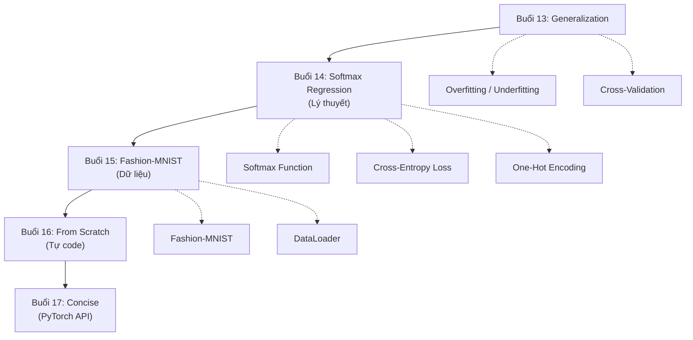

# Buổi 17 — Softmax Regression Concise: Dùng PyTorch API + Review Tuần 4

> [!NOTE] ELI5
> Buổi 16 bạn tự **lắp xe đạp từ từng bộ phận** (from scratch). Buổi 17 bạn dùng **xe đạp lắp sẵn** (PyTorch API) — chỉ 4 dòng code cho toàn bộ model. Nhanh hơn, an toàn hơn (xử lý sẵn numerical stability), nhưng bạn đã hiểu bên trong nhờ buổi 16.
>
> Cuối buổi: **Review toàn bộ Tuần 4** — từ Generalization đến Softmax Regression.

---

## 🎯 Mục tiêu buổi học

1. Xây softmax regression chỉ bằng **4 dòng PyTorch**
2. Hiểu **tại sao** `nn.CrossEntropyLoss` nhận **logits** (không phải probabilities)
3. Nắm **LogSumExp trick** cho numerical stability
4. So sánh **scratch vs concise**: code, performance, safety
5. **Review Tuần 4**: tổng kết 5 buổi (13-17)

---

## Phần 1: Model — 4 dòng thay 40 dòng

> [!NOTE] ELI5
> Buổi 16 bạn tự viết `softmax()`, `cross_entropy()`, tự khởi tạo `W`, `b`, tự code training loop. Giờ PyTorch gói gọn tất cả — bạn chỉ cần nói "tôi muốn mạng gồm: flatten + linear layer 10 outputs".

### 1.1 Code concise

```python
import torch
from torch import nn

class SoftmaxRegression(nn.Module):
    def __init__(self, num_outputs):
        super().__init__()
        self.net = nn.Sequential(
            nn.Flatten(),               # (batch, 1, 28, 28) → (batch, 784)
            nn.LazyLinear(num_outputs)   # (batch, 784) → (batch, 10)
        )

    def forward(self, X):
        return self.net(X)              # Output: logits (CHƯA qua softmax!)
```

### 1.2 So sánh Scratch vs Concise

| | Buổi 16 (Scratch) | Buổi 17 (Concise) |
| --- | --- | --- |
| **Khởi tạo W, b** | Tự viết (`torch.normal`, `torch.zeros`) | `nn.LazyLinear` tự lo |
| **Flatten** | `X.reshape(-1, 784)` | `nn.Flatten()` |
| **Forward** | `softmax(X @ W + b)` | `self.net(X)` |
| **Output** | Probabilities (sau softmax) | **Logits** (chưa qua softmax) |
| **Loss** | Tự viết `cross_entropy()` | `F.cross_entropy()` |
| **Update W** | Tự viết SGD | `torch.optim.SGD` |
| **Numerical stability** | ❌ Không có | ✅ LogSumExp trick |
| **Số dòng code** | ~40 dòng | ~10 dòng |

### 1.3 `nn.LazyLinear` — Linear layer "lười"

```python
nn.LazyLinear(10)   # Chỉ cần khai báo output size
# Input size tự suy ra khi forward pass đầu tiên
# Tương đương: nn.Linear(784, 10) nhưng không cần biết trước 784
```

> [!TIP] Tại sao "Lazy"?
> Khi bạn chưa biết chính xác input size (ví dụ: resize ảnh khác nhau), `LazyLinear` tiện hơn vì tự detect khi thấy data thật lần đầu.

---

## Phần 2: Numerical Stability — Tại sao output logits?

> [!NOTE] ELI5
> Tính $e^{1000}$ thì máy tính "toé lửa" (overflow). Tính $\log(e^{-1000})$ thì trả về $-\infty$. Nhưng nếu ta **gộp** softmax + log lại thành 1 phép tính, ta có thể dùng **trick toán học** để tránh hoàn toàn overflow/underflow.

### 2.1 Vấn đề: Overflow & Underflow

| Vấn đề | Khi nào xảy ra | Hậu quả |
| --- | --- | --- |
| **Overflow** | $o_i$ rất lớn → $\exp(o_i) = \infty$ | `inf`, rồi `NaN` |
| **Underflow** | $o_i$ rất nhỏ → $\exp(o_i) = 0$ | $\log(0) = -\infty$ → `NaN` |

Ví dụ: $\mathbf{o} = (1000, 1, 0.1)$

```python
# Scratch (BUG!)
softmax(torch.tensor([[1000., 1., 0.1]]))
# → tensor([[nan, nan, nan]])  ❌
```

### 2.2 Giải pháp: Trừ max trước

$$\hat{y}_j = \frac{\exp(o_j)}{\sum_k \exp(o_k)} = \frac{\exp(o_j - \bar{o})}{\sum_k \exp(o_k - \bar{o})}$$

trong đó $\bar{o} = \max_k o_k$. Kết quả toán học **không đổi** nhưng:
- Tất cả $o_j - \bar{o} \leq 0$ → $\exp(\text{≤ 0}) \leq 1$ → **không overflow**
- Ít nhất 1 phần tử = 0 → $\exp(0) = 1$ → **không underflow hoàn toàn**

### 2.3 LogSumExp Trick — Gộp softmax + log

Khi tính cross-entropy, ta cần $\log \hat{y}_j$. Thay vì tính softmax rồi lấy log riêng, ta gộp:

$$\log \hat{y}_j = o_j - \bar{o} - \log \sum_k \exp(o_k - \bar{o})$$

- **Không cần tính $\exp$ rồi lại $\log$** → tránh precision loss
- **$o_j - \bar{o}$** → tránh overflow
- Đây là lý do `nn.CrossEntropyLoss` nhận **logits** (chưa qua softmax)

> [!CAUTION] Sai lầm phổ biến nhất
> ```python
> # ❌ SAI — apply softmax rồi đưa vào CrossEntropyLoss
> probs = F.softmax(logits, dim=1)
> loss = F.cross_entropy(probs, y)
> 
> # ✅ ĐÚNG — đưa logits thẳng vào
> loss = F.cross_entropy(logits, y)
> ```
> `F.cross_entropy()` đã gộp sẵn softmax + log + NLL bên trong.

---

## Phần 3: Training Concise

### 3.1 Full code

```python
import torch
from torch import nn
from torch.nn import functional as F
import torchvision
from torchvision import transforms
from torch.utils.data import DataLoader

# ====== DATA ======
trans = transforms.Compose([transforms.ToTensor()])
train_data = torchvision.datasets.FashionMNIST(
    './data', train=True, transform=trans, download=True)
test_data = torchvision.datasets.FashionMNIST(
    './data', train=False, transform=trans, download=True)
train_loader = DataLoader(train_data, batch_size=256, shuffle=True)
test_loader  = DataLoader(test_data, batch_size=256, shuffle=False)

# ====== MODEL ======
model = nn.Sequential(nn.Flatten(), nn.LazyLinear(10))
# Hoặc dùng class như Phần 1

# ====== OPTIMIZER ======
optimizer = torch.optim.SGD(model.parameters(), lr=0.1)

# ====== TRAIN ======
for epoch in range(10):
    model.train()
    for X, y in train_loader:
        loss = F.cross_entropy(model(X), y)  # Forward + Loss
        optimizer.zero_grad()                 # Zero gradients
        loss.backward()                       # Backward
        optimizer.step()                      # Update params

    # Evaluate
    model.eval()
    correct, total = 0, 0
    with torch.no_grad():
        for X, y in test_loader:
            correct += (model(X).argmax(1) == y).sum().item()
            total += y.shape[0]
    print(f"Epoch {epoch+1:2d} | Test Acc: {correct/total:.4f}")
```

### 3.2 So sánh training loop

| Bước | Scratch (Buổi 16) | Concise (Buổi 17) |
| --- | --- | --- |
| Forward | `softmax(X @ W + b)` | `model(X)` |
| Loss | `cross_entropy(y_hat, y)` | `F.cross_entropy(model(X), y)` |
| Zero grad | `W.grad.zero_()` | `optimizer.zero_grad()` |
| Backward | `loss.backward()` | `loss.backward()` (giống!) |
| Update | `W -= lr * W.grad` | `optimizer.step()` |
| Eval mode | Không có | `model.eval()` / `model.train()` |

### 3.3 Kết quả kỳ vọng

| Metric | Scratch | Concise |
| --- | --- | --- |
| Test Accuracy | ~82-85% | ~82-85% |
| Sự khác biệt | Gần như không | Gần như không |

> [!NOTE] Tại sao accuracy gần giống?
> Cả hai dùng **cùng model** (linear 784→10), **cùng optimizer** (SGD, lr=0.1), **cùng data**. Chỉ khác cách viết code. Concise version an toàn hơn (numerical stability) nhưng performance tương đương.

---

## Phần 4: Khi nào dùng Scratch vs Concise?

| Tình huống | Nên dùng |
| --- | --- |
| **Học/hiểu** cơ chế hoạt động | Scratch |
| **Prototype nhanh** | Concise |
| **Production** / dự án thật | Concise |
| **Debug** model custom | Scratch (hiểu rõ từng bước) |
| **Research** kiến trúc mới | Scratch cho phần custom, Concise cho phần chuẩn |

> [!IMPORTANT] Lời khuyên từ D2L
> Framework giấu đi những chi tiết nguy hiểm (numerical stability) → *tiện nhưng cũng nguy hiểm*. Nếu bạn chỉ biết dùng API mà không hiểu bên trong, khi gặp bug sẽ **không biết sửa ở đâu**. Vì vậy, hãy học cả hai.

---

## 📝 REVIEW TUẦN 4: Linear Classification

> [!NOTE] Tổng kết 5 buổi
> Tuần 4 đưa bạn từ **regression** sang **classification** — một bước chuyển lớn.

### Bản đồ kiến thức Tuần 4



### Mini Test — Tự kiểm tra Tuần 4

> Trả lời từng câu **không nhìn note**. Nếu không trả lời được → đọc lại buổi tương ứng.

**Generalization (Buổi 13)**:
1. Training error thấp có đảm bảo generalization error thấp không?
2. Khi nào dùng K-fold cross-validation thay vì fixed split?

**Softmax & Cross-Entropy (Buổi 14)**:
3. Viết công thức softmax. Tổng output luôn bằng bao nhiêu?
4. Cross-entropy loss = $-\log(\hat{y}_c)$. Tại sao loss → ∞ khi $\hat{y}_c → 0$?

**Fashion-MNIST (Buổi 15)**:
5. Fashion-MNIST có bao nhiêu class? Kích thước mỗi ảnh?
6. `DataLoader(data, batch_size=64, shuffle=True)` — tại sao shuffle?

**From Scratch (Buổi 16)**:
7. Tại sao phải `W.grad.zero_()` sau mỗi step?
8. Viết 3 dòng code implement softmax.

**Concise (Buổi 17)**:
9. `F.cross_entropy()` nhận logits hay probabilities?
10. Giải thích LogSumExp trick trong 1 câu.

### Đáp án tóm tắt

> [!NOTE]- Bấm để xem đáp án
> 1. **Không.** Model có thể overfit (học thuộc train data nhưng sai trên data mới).
> 2. Khi data < vài nghìn mẫu, hoặc cần ước lượng ổn định.
> 3. $\hat{y}_i = \frac{e^{o_i}}{\sum_j e^{o_j}}$, tổng = 1.
> 4. Vì $-\log(x) → ∞$ khi $x → 0$. Phạt rất nặng khi model tự tin nhưng sai.
> 5. 10 classes, mỗi ảnh 28×28 pixel grayscale.
> 6. Shuffle giúp model không nhớ thứ tự data → tránh overfitting.
> 7. PyTorch cộng dồn gradient. Không zero → gradient tích lũy → sai.
> 8. `X_exp = torch.exp(X)` / `partition = X_exp.sum(1, keepdim=True)` / `return X_exp / partition`
> 9. **Logits** (chưa qua softmax). Nó tự apply softmax + log bên trong.
> 10. Gộp softmax + log thành $o_j - \max(o) - \log\sum_k e^{o_k - \max(o)}$ để tránh overflow/underflow.

---

## 📖 Từ điển thuật ngữ Buổi 17

| Thuật ngữ | Dịch nghĩa | Nghĩa trong buổi này |
| --- | --- | --- |
| **concise** | Súc tích | Dùng API sẵn, code ngắn gọn |
| **nn.Sequential** | Container tuần tự | Xếp các layer thành pipeline |
| **nn.Flatten** | Layer duỗi phẳng | 4D tensor → 2D tensor |
| **nn.LazyLinear** | Linear layer lười | Tự detect input size |
| **F.cross_entropy** | Cross-entropy loss | Gộp softmax + NLL, nhận logits |
| **LogSumExp** | Log-Sum-Exp trick | Tránh overflow khi tính log(softmax) |
| **overflow** | Tràn trên | $e^{1000} → \infty$ |
| **underflow** | Tràn dưới | $e^{-1000} → 0$, $\log(0) → -\infty$ |
| **optimizer** | Bộ tối ưu | `torch.optim.SGD` thay cho tự viết update |
| **model.eval()** | Chế độ đánh giá | Tắt dropout, batch norm (nếu có) |
| **model.train()** | Chế độ huấn luyện | Bật dropout, batch norm (nếu có) |

---

## 🔗 Liên kết

- **Buổi trước**: [[Buổi 16 - Tuần 4]] — Softmax Regression from Scratch
- **Tuần sau**: [[Buổi 18 - Tuần 5]] — MLP / Perceptrons (bắt đầu Deep Learning!)
- **Concept notes**: [[Softmax Function]], [[Cross-Entropy Loss]], [[Fashion-MNIST Dataset]]

## Kết luận Tuần 4

Tuần 4 hoàn thành **Linear Classification** — từ lý thuyết (softmax, cross-entropy) đến thực hành (Fashion-MNIST, from scratch, PyTorch API). Accuracy ~85% cho thấy mô hình tuyến tính **có giới hạn**. Tuần 5 sẽ phá giới hạn này bằng **Multilayer Perceptron (MLP)** — bước đầu tiên vào Deep Learning thật sự.
