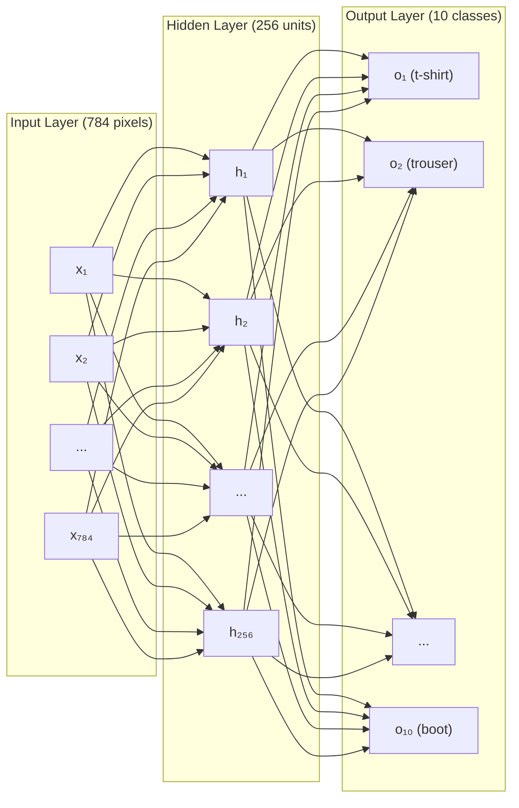

# Buổi 18 — Multilayer Perceptrons: Bước đầu tiên vào Deep Learning

> [!NOTE] ELI5
> Tuần 4, bạn dùng **1 tầng** để phân loại quần áo → accuracy ~85%. Nhưng 1 tầng chỉ vẽ được **đường thẳng** — nó không phân biệt nổi "áo thun" với "áo sơ mi" vì hai thứ đó nhìn pixel rất giống nhau.
> 
> Giải pháp: nhét thêm **tầng ẩn** ở giữa. Tầng ẩn này tự học cách nhìn ra những "nét" quan trọng (ví dụ: cổ áo, tay áo) mà mắt người thấy rõ nhưng pixel thô không thể hiện được. Tuy nhiên, chỉ thêm tầng chưa đủ — phải thêm cả "nút bẻ cong" (gọi là **activation function**) để đường phân chia không còn bắt buộc phải thẳng nữa.
> 
> Khi kết hợp **nhiều tầng** + **bẻ cong**, mạng có thể học được **bất kỳ quy luật nào**. Đó chính là deep learning.

---

## 🎯 Mục tiêu buổi học

1. Hiểu **tại sao** mô hình 1 tầng (linear) bị giới hạn
2. Hiểu **tầng ẩn (hidden layer)** làm gì, và cái bẫy "chồng tuyến tính vẫn là tuyến tính"
3. Biết 3 "nút bẻ cong" chính: **ReLU**, **Sigmoid**, **Tanh**
4. Hiểu **Universal Approximation Theorem** — và tại sao nó không "thần kỳ" như tên gọi
5. Biết cách đếm **số tầng** và **số tham số** (parameters) của MLP

---

## Phần 1: Giới hạn của mô hình 1 tầng (Linear Model)

> [!NOTE] ELI5
> Hãy tưởng tượng bạn chỉ có **1 cây thước kẻ** và phải chia một đám đông thành 2 nhóm. Nếu hai nhóm đứng **mỗi bên 1 phía** — dễ, kẻ 1 đường thẳng là xong. Nhưng nếu nhóm A xếp thành vòng tròn, nhóm B bao quanh bên ngoài — bạn không kẻ thẳng nào tách ra được.
> 
> Đó là giới hạn mô hình 1 tầng: nó chỉ "kẻ đường thẳng".

### 1.1 Tuyến tính ép bạn phải "luôn tăng" hoặc "luôn giảm"

Mô hình tuyến tính có dạng $y = wx + b$. Ý nghĩa: nếu tăng $x$ lên, $y$ sẽ **luôn tăng** (khi $w > 0$) hoặc **luôn giảm** (khi $w < 0$). Tính chất này gọi là **monotonicity** (tính đơn điệu) — tức là **không bao giờ đổi chiều**.

> [!question]- ❓ "Monotonicity" nghĩa là gì? Tại sao nó lại là vấn đề?
> **Monotonicity** = "chỉ đi 1 hướng". Hàm số tăng đều thì "monotonically increasing", giảm đều thì "monotonically decreasing".
>
> **Vấn đề:** Rất nhiều thứ trong đời thật KHÔNG đi 1 hướng:
> - **Nhiệt cơ thể**: 37°C bình thường — nhưng dù tăng hay giảm đều nguy hiểm → mối quan hệ **hình chữ U**, không phải đường thẳng.
> - **Thu nhập vs hạnh phúc**: Từ 0 → 50 triệu/tháng, mỗi đồng thêm rất quan trọng. Từ 1 tỷ → 1.05 tỷ? Gần như không khác biệt. → Đường cong, không phải đường thẳng.
> - **Nhận dạng ảnh**: Tăng giá trị pixel ở vị trí (13,17) lên không có nghĩa "luôn" tăng khả năng đó là ảnh con chó.
>
> Mô hình tuyến tính **bắt buộc** mọi thứ phải đi 1 hướng → nó không biểu diễn nổi những mối quan hệ phức tạp như trên.

### 1.2 Pixel đơn lẻ không có ý nghĩa

Trong phân loại ảnh:
- Nếu bạn **đảo ngược** ảnh (trắng → đen, đen → trắng), con vật trong ảnh **vẫn cùng loại**
- Nhưng **mọi pixel đã thay đổi** → mô hình tuyến tính (chỉ nhìn từng pixel) sẽ cho kết quả **khác hoàn toàn**
- Điều quan trọng không phải từng pixel riêng lẻ, mà là **cách các pixel kết hợp với nhau** (ngữ cảnh)

> [!question]- ❓ Vậy model tuyến tính "nhìn" ảnh kiểu gì?
> Model tuyến tính xem mỗi pixel như một con số **độc lập**. Nó gán "trọng số" cho từng pixel:
> - Pixel ở vị trí (5,5) có trọng số $w_{5,5}$
> - Pixel ở vị trí (10,10) có trọng số $w_{10,10}$
>
> Rồi nhân từng pixel với trọng số tương ứng, cộng lại → ra 1 số.
>
> Vấn đề: nó **không biết** pixel (5,5) nằm cạnh pixel (5,6). Nó xem từng pixel hoàn toàn riêng rẽ, không biết "đường viền", "hình dạng", "kết cấu". Giống như bạn đọc một câu văn nhưng **xáo trộn thứ tự tất cả chữ** — bạn không hiểu được ý nghĩa.

→ Chúng ta cần mô hình có thể tự **học cách nhìn** phù hợp, thay vì bắt nó nhìn pixel thô.

---

## Phần 2: Hidden Layers — Thêm "tầng trung gian"

> [!NOTE] ELI5
> Hãy tưởng tượng bạn là giám khảo cuộc thi nấu ăn. Thay vì nhìn nguyên liệu thô (gạo, thịt, rau) rồi chấm điểm ngay, bạn có **đội chuyên gia nếm thử** ở giữa. Đội này nếm và đánh giá: "độ mặn = 7/10", "độ giòn = 9/10", "hương vị tổng thể = 8/10". Bạn chỉ cần nhìn đánh giá của họ rồi ra quyết định.
>
> **Tầng ẩn** = đội chuyên gia ở giữa. Nó nhận dữ liệu thô (input), **tổng hợp** thành các chỉ số có ý nghĩa hơn, rồi chuyển cho tầng output quyết định.

### 2.1 Kiến trúc MLP với 1 tầng ẩn



Dữ liệu đi từ trái sang phải:
1. **Input**: 784 pixels (ảnh 28×28 duỗi thẳng thành 1 hàng)
2. **Hidden layer**: 256 "chuyên gia" — mỗi chuyên gia nhìn TẤT CẢ 784 pixels, rồi tổng hợp ra 1 con số
3. **Output**: 10 lớp quần áo — nhìn vào 256 đánh giá của tầng ẩn rồi đưa ra dự đoán

### 2.2 Công thức — từng bước phân tích

$$\begin{aligned}
\mathbf{H} &= \sigma(\mathbf{X}\mathbf{W}^{(1)} + \mathbf{b}^{(1)}) && \text{Bước 1: Tính tầng ẩn} \\
\mathbf{O} &= \mathbf{H}\mathbf{W}^{(2)} + \mathbf{b}^{(2)} && \text{Bước 2: Tính output}
\end{aligned}$$

> [!question]- ❓ Từng ký hiệu trong công thức nghĩa là gì?
> 
> | Ký hiệu | Kích thước (Fashion-MNIST) | Ý nghĩa bằng lời |
> | --- | --- | --- |
> | $\mathbf{X}$ | $(n, 784)$ | **Dữ liệu đầu vào**: $n$ ảnh, mỗi ảnh 784 pixels |
> | $\mathbf{W}^{(1)}$ | $(784, 256)$ | **Bảng trọng số thứ 1**: kết nối 784 pixels → 256 units ẩn. Mỗi ô trong bảng nói: "pixel thứ $j$ quan trọng bao nhiêu đối với unit ẩn thứ $k$" |
> | $\mathbf{b}^{(1)}$ | $(1, 256)$ | **Bias thứ 1**: mỗi unit ẩn có 1 "mức mặc định" ban đầu |
> | $\sigma$ | — | **Hàm bẻ cong** (activation function) — ví dụ ReLU. Xem [[Activation Function]] |
> | $\mathbf{H}$ | $(n, 256)$ | **Kết quả tầng ẩn**: mỗi ảnh giờ được "mô tả" bằng 256 đặc trưng mới, thay vì 784 pixels thô |
> | $\mathbf{W}^{(2)}$ | $(256, 10)$ | **Bảng trọng số thứ 2**: kết nối 256 đặc trưng → 10 lớp |
> | $\mathbf{b}^{(2)}$ | $(1, 10)$ | **Bias thứ 2**: mức mặc định cho mỗi lớp output |
> | $\mathbf{O}$ | $(n, 10)$ | **Output** (logits): 10 con số chưa chuẩn hóa → đưa qua softmax sẽ ra xác suất |

> [!question]- ❓ "Logits" là gì? Sao không phải xác suất luôn?
> **Logits** = output thô của tầng cuối, **chưa** qua softmax. Giá trị có thể âm, dương, lớn nhỏ tùy ý.
>
> Tại sao không tính softmax luôn?
> - Vì lý do **numerical stability** (ổn định số học) — đã học ở [[Buổi 17 - Tuần 4]]: gộp softmax + log vào 1 bước (LogSumExp trick) tránh overflow.
> - Trong code: `F.cross_entropy(logits, y)` **tự** tính softmax bên trong rồi.

### 2.3 Đếm số tham số

Mỗi kết nối giữa 2 tầng = 1 trọng số (weight). Mỗi unit = 1 bias. Tổng:

$$\underbrace{784 \times 256}_{W^{(1)}} + \underbrace{256}_{b^{(1)}} + \underbrace{256 \times 10}_{W^{(2)}} + \underbrace{10}_{b^{(2)}} = 203{,}530 \text{ tham số}$$

So với softmax regression (1 tầng): chỉ $784 \times 10 + 10 = 7{,}850$. MLP có **gấp 26 lần** số tham số!

> [!question]- ❓ Nhiều tham số hơn thì tốt hơn, đúng không?
> **Không hẳn.** Nhiều tham số = mạng "linh hoạt" hơn, CÓ THỂ học được quy luật phức tạp hơn, nhưng cũng:
> - **Dễ overfit**: mạng quá linh hoạt → "nhớ" luôn dữ liệu train thay vì học quy luật chung. (Xem lại [[Buổi 17 - Tuần 4|Buổi 13 — Generalization]])
> - **Cần nhiều dữ liệu** hơn để train
> - **Chậm hơn**: nhiều phép tính hơn
>
> Đây là sự đánh đổi **model capacity** (khả năng biểu diễn) vs **overfitting risk** (nguy cơ học tủ).

### 2.4 Đếm số tầng — Quy ước quan trọng

> [!IMPORTANT] Input layer KHÔNG được tính
> MLP trên có: input layer + 1 hidden layer + output layer  
> → Gọi là **2-layer MLP** (chỉ đếm tầng **có trọng số cần học**: hidden + output).
> 
> Tại sao không đếm input layer? Vì nó chỉ "nhận dữ liệu vào", không có trọng số nào cần học.

---

## Phần 3: Cái bẫy — Chồng tuyến tính vẫn là tuyến tính!

> [!NOTE] ELI5
> Bạn có 1 máy tính bỏ túi chỉ biết **nhân** và **cộng**.
> - Bấm: `2 × 3 = 6`
> - Lấy kết quả, bấm tiếp: `6 × 5 = 30`
>
> Kết quả cuối = `2 × 3 × 5 = 30`. Bạn có thể bấm `2 × 15 = 30` ngay từ đầu!
> 
> Tương tự: nếu mỗi tầng chỉ làm phép nhân + cộng (tuyến tính), thì **chồng 100 tầng cũng vô nghĩa** — kết quả luôn rút gọn thành 1 tầng duy nhất.

### 3.1 Chứng minh (không quá phức tạp!)

Không có hàm bẻ cong $\sigma$:

$$\mathbf{O} = (\mathbf{X}\mathbf{W}^{(1)} + \mathbf{b}^{(1)})\mathbf{W}^{(2)} + \mathbf{b}^{(2)}$$

Nhân ra:

$$\mathbf{O} = \mathbf{X}\underbrace{\mathbf{W}^{(1)}\mathbf{W}^{(2)}}_{\text{gộp thành 1 ma trận } \mathbf{W}} + \underbrace{\mathbf{b}^{(1)}\mathbf{W}^{(2)} + \mathbf{b}^{(2)}}_{\text{gộp thành 1 bias } \mathbf{b}}$$

→ Tương đương $\mathbf{O} = \mathbf{X}\mathbf{W} + \mathbf{b}$ = **1 tầng tuyến tính duy nhất!**

> [!question]- ❓ "Affine transformation" là gì? Nghe hoài trong deep learning?
> **Affine transformation** = phép biến đổi dạng $\mathbf{Y} = \mathbf{X}\mathbf{W} + \mathbf{b}$ — tức là **nhân với ma trận** (xoay, co giãn) rồi **cộng thêm bias** (dịch chuyển).
>
> Gọi là "affine" (nghĩa tiếng Anh: liên quan, gắn bó) vì nó **giữ nguyên** các đường thẳng song song và tỷ lệ khoảng cách. Tưởng tượng bạn có 1 lưới ô vuông trên giấy, rồi **kéo giãn** hoặc **nghiêng** tờ giấy — các ô vuông biến thành hình bình hành nhưng vẫn song song. Đó là affine.
>
> Vấn đề: affine chồng affine = vẫn affine. Nên cần "bẻ cong" thì mới thoát ra được.

### 3.2 Giải pháp: Thêm hàm bẻ cong (Activation Function)

Chèn $\sigma$ (một hàm phi tuyến) **giữa** mỗi tầng:

$$\mathbf{H} = \sigma(\mathbf{X}\mathbf{W}^{(1)} + \mathbf{b}^{(1)})$$

Bây giờ **không thể rút gọn** nữa → mạng thật sự "sâu" → có thể biểu diễn hàm phức tạp.

> [!CAUTION] Quy tắc vàng
> **Activation function đặt GIỮA các tầng**, không đặt ở output layer.
> 
> Output layer thường **không** apply activation (hoặc dùng softmax riêng cho bài toán phân loại).
> 
> Tại sao? Vì output cần giữ nguyên giá trị tự do: logits có thể âm, dương, lớn, nhỏ. Nếu ép qua ReLU (chặn âm thành 0), bạn mất thông tin.

---

## Phần 4: Ba "nút bẻ cong" cần biết (Activation Functions)

> [!NOTE] ELI5
> Bạn có 3 cái khuôn để uốn sợi dây thép:
> - **ReLU**: giữ nguyên phần dương, bẻ gập phần âm thành 0 (hình chữ V lật, rất sắc nét)
> - **Sigmoid**: ép mọi giá trị về khoảng 0→1 (hình chữ S nằm ngang)
> - **Tanh**: ép mọi giá trị về khoảng -1→1 (hình chữ S đi qua gốc tọa độ)

### 4.1 ReLU — "Siêu sao" của Deep Learning

$$\text{ReLU}(x) = \max(0, x)$$

Tiếng Việt rõ ràng: **nếu x âm → trả về 0; nếu x dương → giữ nguyên x**.

```python
import torch
x = torch.arange(-8, 8, 0.1, requires_grad=True)
y = torch.relu(x)
# Ví dụ: ReLU(-5) = 0, ReLU(3) = 3, ReLU(0) = 0
```

**Tại sao ReLU lại phổ biến nhất?**

| Lý do | Giải thích dễ hiểu |
| --- | --- |
| Cực kỳ đơn giản | Chỉ so sánh với 0 — máy tính làm trong 1 nano giây |
| Gradient không "biến mất" | Khi $x > 0$, đạo hàm = 1 → tín hiệu truyền ngược mạnh mẽ |
| Tự động "tắt" một số neuron | ~50% neurons nhận input âm → output = 0 → mạng "tập trung" vào neurons quan trọng |

> [!question]- ❓ "Gradient biến mất" (vanishing gradient) là gì? Tại sao đáng sợ?
> Khi train mạng, ta cần truyền "tín hiệu sửa lỗi" **ngược** từ output về input (gọi là **backpropagation**). Tín hiệu này chính là **gradient**.
>
> - Nếu ở mỗi tầng, gradient **bị nhân với 1 số < 1** (ví dụ 0.25), thì qua 10 tầng: $0.25^{10} ≈ 0.000001$.
> - Tín hiệu gần bằng 0 → tầng đầu tiên **không nhận được tín hiệu sửa** → **không học được gì**.
>
> Đây là vấn đề "**vanishing gradient**" — lý do chính khiến mạng sâu từng rất khó train trước khi ReLU xuất hiện.
>
> ReLU giải quyết vì: khi $x > 0$, gradient = **1** (không nhỏ đi qua từng tầng).

> [!question]- ❓ "Dead neuron" là gì? Sao ReLU lại gây ra nó?
> Nếu input của 1 neuron **luôn âm** (ví dụ vì trọng số khởi tạo xấu hoặc learning rate quá lớn), thì:
> - Output của ReLU = 0 **mãi mãi**
> - Gradient = 0 **mãi mãi**
> - Neuron đó **không bao giờ được cập nhật** → "chết"
>
> **Giải pháp**: dùng **Leaky ReLU** — thay vì trả 0 khi $x < 0$, trả về $0.01x$ (một giá trị rất nhỏ nhưng khác 0):
> $$\text{LeakyReLU}(x) = \max(0.01x, x)$$
> → Neuron vẫn có gradient nhỏ khi $x < 0$ → vẫn có cơ hội "sống lại".

### 4.2 Sigmoid — "Ông tổ" (vai trò niche hiện tại)

$$\sigma(x) = \frac{1}{1 + e^{-x}}, \qquad \text{Kết quả luôn nằm trong } (0, 1)$$

Tiếng Việt: **ép mọi số về khoảng 0→1**. Số rất âm → gần 0. Số rất dương → gần 1. Số = 0 → đúng 0.5.

**Đạo hàm**: $\sigma(x)(1 - \sigma(x))$ — giá trị lớn nhất chỉ **0.25** (tại $x = 0$).

> [!question]- ❓ Tại sao sigmoid gây vanishing gradient?
> Gradient max của sigmoid = 0.25. Nghĩa là:
> - Qua 1 tầng: tín hiệu bị nhân **tối đa 0.25** (mất 75%)
> - Qua 5 tầng: $0.25^5 ≈ 0.001$ (mất 99.9%)
> - Qua 10 tầng: $0.25^{10} ≈ 10^{-6}$ (gần bằng 0)
>
> → Các tầng đầu **không nhận được tín hiệu** sửa lỗi → **không học được**.
>
> Đây là lý do sigmoid **không còn được dùng** cho tầng ẩn nữa. Nhưng vẫn dùng ở:
> - **Output layer** cho phân loại nhị phân (binary: đúng/sai, mèo/không phải mèo) — vì output cần nằm trong (0,1) giống xác suất.
> - **Cổng** (gate) trong LSTM/GRU — cần giá trị 0→1 để "đóng" hoặc "mở" luồng thông tin.

### 4.3 Tanh — "Sigmoid cải tiến"

$$\tanh(x) = \frac{1 - e^{-2x}}{1 + e^{-2x}}, \qquad \text{Kết quả nằm trong } (-1, 1)$$

Tiếng Việt: giống sigmoid nhưng output **đối xứng qua 0** — có cả giá trị âm lẫn dương.

> [!question]- ❓ "Zero-centered" là gì? Tại sao quan trọng?
> **Zero-centered** = output trung bình bằng 0 (có cả giá trị âm lẫn dương, cân bằng quanh 0).
>
> **Sigmoid** không zero-centered: output luôn dương (0→1) → trung bình ≈ 0.5.
>
> Vấn đề khi KHÔNG zero-centered:
> - Gradient cập nhật trọng số sẽ **luôn cùng dấu** (đều dương hoặc đều âm)
> - → Tối ưu đi theo đường **zig-zag** thay vì đường thẳng → chậm hội tụ
>
> Tanh khắc phục vì output có cả âm lẫn dương → gradient đa dạng hơn → tối ưu mượt hơn.

**Mối quan hệ thú vị**: $\tanh(x) = 2\sigma(2x) - 1$. Tanh thực ra là sigmoid **co giãn + dịch chuyển**: nhân input ×2, nhân output ×2, trừ đi 1.

### 4.4 Bảng so sánh tổng hợp

| | ReLU | Sigmoid | Tanh |
| --- | --- | --- | --- |
| **Công thức** | $\max(0, x)$ | $\frac{1}{1+e^{-x}}$ | $\frac{1-e^{-2x}}{1+e^{-2x}}$ |
| **Kết quả** | $[0, +\infty)$ | $(0, 1)$ | $(-1, 1)$ |
| **Gradient lớn nhất** | 1 | 0.25 | 1 |
| **Vanishing gradient?** | ❌ Không (khi $x>0$) | ✅ Có, nghiêm trọng | ✅ Có (nhẹ hơn sigmoid) |
| **Zero-centered?** | ❌ Không | ❌ Không | ✅ Có |
| **Thường dùng ở** | Tầng ẩn (**mặc định**) | Output nhị phân | LSTM/GRU |
| **Tốc độ** | Rất nhanh (chỉ so sánh 0) | Chậm (tính $e^x$) | Chậm (tính $e^x$) |

### 4.5 Code trực quan hóa

```python
import torch
import matplotlib.pyplot as plt

x = torch.arange(-5, 5, 0.01)

fig, axes = plt.subplots(1, 3, figsize=(14, 4))

# ReLU
axes[0].plot(x, torch.relu(x), color='#2196F3', linewidth=2)
axes[0].set_title('ReLU: max(0, x)')
axes[0].axhline(0, color='gray', linewidth=0.5)
axes[0].axvline(0, color='gray', linewidth=0.5)

# Sigmoid
axes[1].plot(x, torch.sigmoid(x), color='#FF9800', linewidth=2)
axes[1].set_title('Sigmoid: 1/(1+e⁻ˣ)')
axes[1].axhline(0.5, color='gray', linewidth=0.5, linestyle='--')

# Tanh
axes[2].plot(x, torch.tanh(x), color='#4CAF50', linewidth=2)
axes[2].set_title('Tanh: (1-e⁻²ˣ)/(1+e⁻²ˣ)')
axes[2].axhline(0, color='gray', linewidth=0.5)

plt.tight_layout()
plt.show()
```

> Xem thêm chi tiết: [[Activation Function]]

---

## Phần 5: Định lý "Xấp xỉ Vạn năng" (Universal Approximation Theorem)

> [!NOTE] ELI5
> MLP chỉ cần **1 tầng ẩn** (với đủ nhiều neurons) là có thể "bắt chước" **BẤT KỲ** quy luật nào — dù cong, dù phức tạp đến đâu.
>
> Nghe thì "thần kỳ", nhưng tương tự việc nói: "Ngôn ngữ C có thể viết BẤT KỲ chương trình nào" — đúng về mặt lý thuyết, nhưng **viết ra chương trình đúng** thì là chuyện hoàn toàn khác.

### 5.1 Nội dung chính

> **Định lý (Cybenko, 1989)**: MLP với 1 tầng ẩn, $h$ units đủ lớn, và activation phi tuyến (ví dụ sigmoid), có thể **xấp xỉ** bất kỳ hàm liên tục nào trên tập compact, với sai số nhỏ tùy ý.

> [!question]- ❓ "Hàm liên tục" là gì? "Tập compact" là gì? Cần hiểu sâu không?
> **Hàm liên tục** = hàm "không nhảy". Tưởng tượng bạn vẽ đồ thị mà **không nhấc bút** — đó là hàm liên tục. Phần lớn hàm số trong thế giới thật (nhiệt độ, giá cổ phiếu) là liên tục hoặc gần liên tục.
>
> **Tập compact** (trong ngữ cảnh này) ≈ một vùng **có giới hạn và đóng** trên không gian số. Ví dụ: giá trị pixel từ 0 đến 255 — đây là 1 tập compact. Bạn không cần hiểu sâu khái niệm toán, chỉ cần biết: **trong thực tế, dữ liệu luôn nằm trong 1 vùng giới hạn → điều kiện này hầu như luôn thỏa mãn**.

### 5.2 Ba giới hạn quan trọng trong thực tế

| Vấn đề | Giải thích |
| --- | --- |
| "Đủ nhiều" = bao nhiêu? | Lý thuyết không nói cụ thể — có thể cần **hàng tỷ** units → không khả thi về bộ nhớ |
| **Tìm** được trọng số đúng | Định lý chỉ nói "có tồn tại bộ trọng số phù hợp" — **không nói cách tìm** nó! Quá trình tối ưu (training) có thể mắc kẹt |
| **Sâu hơn > Rộng hơn** | Thực tế: mạng **sâu** (nhiều tầng, ít units mỗi tầng) hiệu quả hơn mạng **rộng** (1 tầng, cực nhiều units) |

> [!question]- ❓ Tại sao sâu hơn lại tốt hơn rộng hơn?
> Hãy tưởng tượng bạn viết 1 chương trình phức tạp:
> - **Mạng rộng** (1 tầng) = viết TẤT CẢ code trong **1 hàm main()** duy nhất — có thể nhưng cực khó, cực dài, khó debug
> - **Mạng sâu** (nhiều tầng) = chia nhỏ thành **nhiều hàm nhỏ**, mỗi hàm xử lý 1 phần → dễ viết, dễ tái sử dụng
>
> Trong deep learning:
> - Tầng 1 có thể tự học "đường viền" (edge)
> - Tầng 2 ghép đường viền thành "hình dạng" (shape)
> - Tầng 3 ghép hình dạng thành "bộ phận" (mắt, mũi, miệng)
> - Tầng 4 ghép bộ phận thành "khuôn mặt"
>
> → Mỗi tầng xây trên tầng trước = **compositional** (tổ hợp). Cách này hiệu quả hơn nhiều so với 1 tầng khổng lồ cố "nhìn" mọi thứ cùng lúc.

> [!TIP] Ẩn dụ từ D2L
> MLP giống ngôn ngữ C: **có thể** viết bất kỳ chương trình nào, nhưng **viết đúng** chương trình bạn cần mới là thách thức thật sự. Universal approximation ≠ universal learnability.

> Xem thêm: [[Multilayer Perceptron]]

---

## 📖 Từ điển thuật ngữ Buổi 18

| Thuật ngữ | Dịch sang tiếng Việt | Nghĩa dễ hiểu |
| --- | --- | --- |
| **MLP** (Multilayer Perceptron) | Mạng đa tầng | Mạng có ≥1 tầng ẩn + activation |
| **Hidden layer** | Tầng ẩn | Tầng ở giữa input và output — tự học cách "nhìn" dữ liệu |
| **Activation function** | Hàm kích hoạt / "nút bẻ cong" | Thêm tính phi tuyến → mạng biểu diễn được hàm phức tạp |
| **ReLU** | Rectified Linear Unit | $\max(0, x)$ — nhanh, đơn giản, mặc định dùng |
| **Sigmoid** | Hàm sigmoid | Ép về (0,1) — dùng output nhị phân |
| **Tanh** | Hyperbolic tangent | Ép về (-1,1) — đối xứng qua 0 |
| **Nonlinearity** | Phi tuyến | Tính chất "không thẳng" — giúp mạng "sâu thật sự" |
| **Affine transformation** | Phép biến đổi affine | $\mathbf{Wx} + \mathbf{b}$ — nhân + cộng bias |
| **Monotonicity** | Tính đơn điệu | "Chỉ đi 1 hướng" — tăng hoặc giảm, không đổi chiều |
| **Universal Approximation** | Xấp xỉ vạn năng | Lý thuyết: 1 tầng ẩn đủ lớn có thể bắt chước mọi hàm liên tục |
| **Dead neurons** | Neuron chết | ReLU: input luôn < 0 → gradient = 0 mãi → không bao giờ cập nhật |
| **Vanishing gradient** | Gradient biến mất | Gradient qua nhiều tầng → nhỏ gần 0 → tầng đầu không học được |
| **Hidden representation** | Biểu diễn ẩn | $\mathbf{H}$ — bộ đặc trưng mới mà tầng ẩn tự tạo ra |
| **Logits** | Giá trị thô trước softmax | Output chưa chuẩn hóa — đưa qua softmax sẽ ra xác suất |

---

## ✅ Bài tự kiểm tra

1. Cho MLP: input 784, hidden 256, output 10. Tính **tổng số tham số** (gồm cả bias).
2. Tại sao chồng 10 tầng tuyến tính (không có activation) **không tốt hơn** 1 tầng tuyến tính?
3. Tính: ReLU(−5) = ? ReLU(3) = ? Sigmoid(0) = ? Tanh(0) = ?
4. Gradient max của sigmoid = 0.25. Qua 8 tầng sigmoid, gradient còn tối đa bao nhiêu?
5. "Universal Approximation Theorem nói 1 tầng ẩn đủ → vậy 1 tầng ẩn luôn đủ dùng trong thực tế". Đúng hay sai? Giải thích.

> [!NOTE]- 📝 Đáp án
> 1. $(784 \times 256 + 256) + (256 \times 10 + 10) = 200{,}704 + 2{,}570 + 256 + 10 = 203{,}530$
> 2. Vì phép tuyến tính chồng phép tuyến tính = vẫn tuyến tính. Ma trận $\mathbf{W}^{(1)}\mathbf{W}^{(2)}\cdots\mathbf{W}^{(10)}$ gộp thành 1 ma trận duy nhất. Không có activation → không có phi tuyến → mạng "sâu" nhưng **không mạnh hơn 1 tầng**.
> 3. ReLU(−5) = 0. ReLU(3) = 3. Sigmoid(0) = 0.5. Tanh(0) = 0.
> 4. $0.25^8 = 1.5 \times 10^{-5} ≈ 0.0000153$ → gần bằng 0 → tầng đầu gần như không học được gì.
> 5. **Sai.** Lý thuyết đúng nhưng thực tế: (a) "đủ nhiều units" có thể cần hàng tỷ, (b) tìm được trọng số đúng mới là khó, (c) mạng sâu (nhiều tầng ít units) **hiệu quả hơn** mạng rộng (1 tầng nhiều units) nhờ tính compositional.

---

## 🔗 Liên kết

- **Buổi trước**: [[Buổi 17 - Tuần 4]] — Softmax Concise + Review Tuần 4
- **Buổi sau**: [[Buổi 19 - Tuần 5]] — MLP Implementation (from scratch + concise)
- **Concept notes**: [[Multilayer Perceptron]], [[Activation Function]]

## 📝 Kết luận

Buổi 18 mở cánh cửa vào **Deep Learning thực sự**:
- Mô hình tuyến tính quá yếu → thêm **tầng ẩn** + **hàm bẻ cong (activation function)** = mạng có thể học bất kỳ quy luật nào.
- Ba activation cần nhớ: **ReLU** (mặc định, nhanh, gradient mạnh), **Sigmoid** (output nhị phân), **Tanh** (đối xứng, dùng trong LSTM).
- Universal Approximation: lý thuyết thì "vạn năng", nhưng thực tế cần mạng **sâu** chứ không chỉ **rộng**.

Buổi 19 sẽ **code MLP** trên Fashion-MNIST — kỳ vọng accuracy vượt 85% (hơn softmax regression!).
