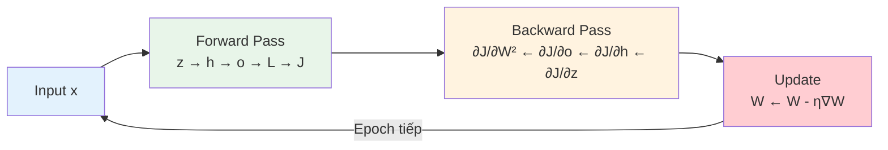

# Buổi 23 — Backpropagation: Máy tính tính gradient như thế nào?

> [!NOTE] ELI5
> Ở tất cả các buổi trước, khi train mạng ta gọi `loss.backward()` rồi gradient **tự xuất hiện**. Buổi 23 sẽ mở hộp đen:
>
> Tưởng tượng bạn nấu món ăn qua **5 bước**. Món ăn bị mặn. Bạn muốn biết **bước nào** gây mặn → bạn **truy ngược** từ kết quả: "mặn vì bước 5 cho nhiều nước mắm, mà bước 4 đã cho muối, mà bước 3…". Đó là **backpropagation** — truy ngược qua từng bước để tìm "thủ phạm" (gradient của từng tham số).
>
> Công cụ toán học: **Chain Rule** (quy tắc dây chuyền đạo hàm).

---

## 🎯 Mục tiêu buổi học

1. Hiểu **Forward Propagation** — tính output từ input, bước-từng-bước
2. Hiểu **Computational Graph** — sơ đồ thể hiện dòng dữ liệu
3. Hiểu **Backpropagation** — tính gradient bằng Chain Rule, đi ngược
4. Hiểu tại sao **training tốn bộ nhớ hơn nhiều** so với prediction

---

## Phần 1: Forward Propagation — Tính output

> [!NOTE] ELI5
> Forward = "đi xuôi": nhận input → tính qua từng tầng → ra output → tính loss.
> Giống dây chuyền nhà máy: nguyên liệu → máy 1 → máy 2 → … → sản phẩm.

### 1.1 Ví dụ: MLP 1 hidden layer

Cho input $\mathbf{x} \in \mathbb{R}^d$, MLP 1 hidden layer, weight decay:

| Bước | Phép tính | Ý nghĩa |
| --- | --- | --- |
| 1️⃣ | $\mathbf{z} = \mathbf{W}^{(1)}\mathbf{x}$ | Tầng 1: nhân input với trọng số |
| 2️⃣ | $\mathbf{h} = \phi(\mathbf{z})$ | Activation (ReLU/Sigmoid) |
| 3️⃣ | $\mathbf{o} = \mathbf{W}^{(2)}\mathbf{h}$ | Tầng output: nhân hidden với trọng số |
| 4️⃣ | $L = \ell(\mathbf{o}, y)$ | Tính loss (cross-entropy) |
| 5️⃣ | $s = \frac{\lambda}{2}(\|\mathbf{W}^{(1)}\|^2 + \|\mathbf{W}^{(2)}\|^2)$ | Weight decay penalty |
| 6️⃣ | $J = L + s$ | **Objective** = loss + penalty |

> [!question]- ❓ Tại sao gọi là "Forward"?
> Vì dữ liệu chảy **1 chiều**: input → hidden → output → loss. Giống đọc sách từ trái sang phải, đặt gọn thành: $J = L + s = \ell(\mathbf{W}^{(2)}\phi(\mathbf{W}^{(1)}\mathbf{x}), y) + \frac{\lambda}{2}(\|\mathbf{W}^{(1)}\|^2 + \|\mathbf{W}^{(2)}\|^2)$
>
> **Điểm quan trọng**: mỗi bước tạo ra **biến trung gian** ($\mathbf{z}, \mathbf{h}, \mathbf{o}$) phải **lưu lại** trong bộ nhớ — backward sẽ cần dùng!

### 1.2 Computational Graph

![[assets/attachments/D2L/Buoi23/computational_graph.png]]
*Sơ đồ forward: x và W^(1) → z → h → o → L → J. Vuông = biến số, tròn = phép tính.*

> [!question]- ❓ Computational Graph là gì? Có gì hay?
> Computational Graph (đồ thị tính toán) biểu diễn **mọi phép tính** dưới dạng đồ thị:
> - **Node** = biến số hoặc phép tính
> - **Edge** = dòng dữ liệu (input → output)
>
> **Cái hay**: 
> 1. Cho thấy **phụ thuộc** giữa các biến → biết cần gradient nào cho biến nào
> 2. PyTorch **tự xây** computational graph khi bạn gọi các phép tính → `loss.backward()` **đi ngược** qua graph này để tính gradient
> 3. Cho phép **tự động hóa** — không cần tay tính đạo hàm từng layer!

---

## Phần 2: Backpropagation — Tính gradient bằng Chain Rule

### 2.1 Chain Rule — Nền tảng toán học

> [!NOTE] ELI5
> Nếu $y = f(x)$ và $z = g(y)$, thì **đạo hàm $z$ theo $x$**:
>
> $$\frac{dz}{dx} = \frac{dz}{dy} \times \frac{dy}{dx}$$
>
> Giống lây lan: nếu $x$ thay đổi 1% → $y$ thay đổi 2% → $z$ thay đổi $2\% \times 3\% = 6\%$.
> Tức gradient = **tích** các gradient cục bộ.

Mở rộng cho **nhiều tầng**: nếu $z = f_3(f_2(f_1(x)))$:

$$\frac{dz}{dx} = \frac{dz}{df_2} \times \frac{df_2}{df_1} \times \frac{df_1}{dx}$$

→ Gradient = **tích của gradient mỗi tầng** — nhân từ output ngược về input!

### 2.2 Backprop từng bước cho MLP

![[assets/attachments/D2L/Buoi23/chain_rule.png]]
*Backprop: đi NGƯỢC từ J → L → o → h → z → W^(1). Mỗi bước dùng Chain Rule.*

Đi ngược từ $J$ về $\mathbf{W}^{(1)}$:

| Bước | Gradient | Công thức | Giải thích |
| --- | --- | --- | --- |
| 1️⃣ | $\frac{\partial J}{\partial L} = 1$, $\frac{\partial J}{\partial s} = 1$ | $J = L + s$ | Tổng → đạo hàm = 1 |
| 2️⃣ | $\frac{\partial J}{\partial \mathbf{o}}$ | $= \frac{\partial L}{\partial \mathbf{o}}$ | Phụ thuộc loss function (cross-entropy) |
| 3️⃣ | $\frac{\partial J}{\partial \mathbf{W}^{(2)}}$ | $= \frac{\partial J}{\partial \mathbf{o}}\mathbf{h}^T + \lambda\mathbf{W}^{(2)}$ | Gradient data + gradient penalty |
| 4️⃣ | $\frac{\partial J}{\partial \mathbf{h}}$ | $= {\mathbf{W}^{(2)}}^T \frac{\partial J}{\partial \mathbf{o}}$ | Truyền gradient ngược qua W^(2) |
| 5️⃣ | $\frac{\partial J}{\partial \mathbf{z}}$ | $= \frac{\partial J}{\partial \mathbf{h}} \odot \phi'(\mathbf{z})$ | Nhân element-wise với đạo hàm activation |
| 6️⃣ | $\frac{\partial J}{\partial \mathbf{W}^{(1)}}$ | $= \frac{\partial J}{\partial \mathbf{z}}\mathbf{x}^T + \lambda\mathbf{W}^{(1)}$ | Gradient cuối cùng cho W^(1)! |

> [!question]- ❓ $\odot$ (elementwise multiply) ở bước 5 là gì? Tại sao không phải nhân ma trận?
> Activation $\phi$ áp dụng **từng phần tử riêng lẻ**: $h_i = \phi(z_i)$.
>
> Nên đạo hàm cũng **từng phần tử**: $\frac{\partial h_i}{\partial z_i} = \phi'(z_i)$, và $\frac{\partial h_i}{\partial z_j} = 0$ khi $i \neq j$.
>
> → Jacobian là ma trận **đường chéo** → nhân Jacobian = **nhân element-wise** ($\odot$).
>
> Ví dụ ReLU: $\phi'(z_i) = \begin{cases} 1 & z_i > 0 \\ 0 & z_i \leq 0 \end{cases}$
> → Bước 5 = nhân gradient với mask 0/1 — **chính xác** giống forward pass của ReLU!

> [!question]- ❓ Tại sao gradient W^(2) = $\frac{\partial J}{\partial o} h^T$ + $\lambda W^{(2)}$?
> Hai thành phần:
> 1. **Gradient từ loss**: $\frac{\partial L}{\partial W^{(2)}}$. Vì $o = W^{(2)}h$, đạo hàm $o$ theo $W^{(2)}$ = $h^T$. Nhân với upstream gradient $\frac{\partial J}{\partial o}$ → được $\frac{\partial J}{\partial o} h^T$.
> 2. **Gradient từ weight decay**: $\frac{\partial}{\partial W^{(2)}}\frac{\lambda}{2}\|W^{(2)}\|^2 = \lambda W^{(2)}$.
>
> Tổng hai = gradient cuối cùng. Đây cũng giải thích **tại sao** weight decay = thêm $\lambda W$ vào gradient (đã nói ở Buổi 21).

### 2.3 Quy trình tổng quát

```
FORWARD (xuôi: input → output):
  Tính z, h, o, L, J ← LƯU tất cả biến trung gian

BACKWARD (ngược: output → input):
  ∂J/∂J = 1                        ← Bắt đầu
  ∂J/∂o = ∂L/∂o                    ← Chain Rule bước 1
  ∂J/∂W² = ∂J/∂o × h^T + λW²      ← Gradient tầng output
  ∂J/∂h  = W²^T × ∂J/∂o           ← Truyền ngược qua W²
  ∂J/∂z  = ∂J/∂h ⊙ ϕ'(z)          ← Qua activation
  ∂J/∂W¹ = ∂J/∂z × x^T + λW¹      ← Gradient tầng hidden

CẬP NHẬT:
  W¹ ← W¹ - η × ∂J/∂W¹
  W² ← W² - η × ∂J/∂W²
```

---

## Phần 3: Tại sao Training tốn bộ nhớ?

> [!NOTE] ELI5
> Khi **predict** (chỉ forward): tính xong tầng 1, bỏ, tính tầng 2, bỏ… → chỉ cần nhớ **1 tầng** tại mỗi thời điểm.
>
> Khi **train** (forward + backward): phải **lưu hết** tất cả biến trung gian (z, h, o…) vì backward sẽ **quay lại** dùng chúng. → Bộ nhớ ∝ **số tầng × batch size**.
>
> Đó là lý do GPU 8GB train được model nhỏ, nhưng **cần 80GB** cho model lớn!

![[assets/attachments/D2L/Buoi23/memory_tradeoff.png]]
*Forward lưu các biến trung gian. Backward tái sử dụng chúng → không tính lại.*

| | Prediction (Forward only) | Training (Forward + Backward) |
| --- | --- | --- |
| **Bộ nhớ** | Thấp (chỉ lưu output tầng hiện tại) | **Cao** (lưu TẤT CẢ biến trung gian) |
| **Tính toán** | 1 lượt forward | 1 forward + 1 backward ≈ **gấp 3×** |
| **Khi nào** | `model.eval()` + `torch.no_grad()` | `model.train()` |

> [!question]- ❓ Tại sao backward ≈ 2× cost forward (tổng ≈ 3×)?
> - Forward: tính $n$ phép nhân ma trận
> - Backward: **cũng** tính $n$ phép nhân ma trận (chain rule cho mỗi tầng), nhưng **ngược chiều**
> - Plus: cần thêm phép nhân để tính gradient cho **cả W lẫn input** mỗi tầng
>
> → Backward ≈ **2× forward** → Tổng train = forward + backward ≈ **3× forward**.
>
> Đây là lý do khi infer, luôn dùng `torch.no_grad()` — **tắt** lưu biến trung gian → nhanh 3× và tiết kiệm bộ nhớ!

> [!question]- ❓ `loss.backward()` và `torch.no_grad()` hoạt động thế nào "dưới hood"?
> ```python
> # Khi train (MẶC ĐỊNH):
> x = torch.randn(3, requires_grad=True)
> y = x * 2          # PyTorch TỰ XÂY computational graph
> z = y.sum()         # graph: x → y → z
> z.backward()        # ĐI NGƯỢC qua graph: ∂z/∂y → ∂z/∂x
> print(x.grad)       # → tensor([2., 2., 2.])
> 
> # Khi predict:
> with torch.no_grad():         # ← TẮT graph building
>     y = x * 2                  # Không lưu biến trung gian
>     # y.backward() → LỖI!     # Không thể backward
> ```
>
> `torch.no_grad()`:
> - **Không xây** computational graph → không lưu biến trung gian
> - Tính toán **nhanh hơn** (bỏ overhead ghi sổ)
> - **Tiết kiệm bộ nhớ** (không giữ tensors cho backward)

---

## Phần 4: Backprop trong PyTorch — Xem gradient thật

```python
import torch
import torch.nn as nn

# Model đơn giản: 4 → 3 → 2
model = nn.Sequential(
    nn.Linear(4, 3),
    nn.ReLU(),
    nn.Linear(3, 2)
)

x = torch.randn(1, 4)
y = torch.tensor([1])

# Forward
output = model(x)
loss = nn.CrossEntropyLoss()(output, y)
print(f"Loss: {loss.item():.4f}")

# Backward
loss.backward()

# Xem gradient!
for name, param in model.named_parameters():
    print(f"{name}: shape={param.grad.shape}, mean={param.grad.mean():.4f}")
```

Output (ví dụ):
```
Loss: 0.7612
0.weight: shape=torch.Size([3, 4]), mean=-0.0142
0.bias: shape=torch.Size([3]), mean=-0.0284
2.weight: shape=torch.Size([2, 3]), mean=0.0000
2.bias: shape=torch.Size([2]), mean=0.0000
```

> [!question]- ❓ Tại sao gradient layer 2 (gần output) thường LỚN hơn layer 0 (gần input)?
> Chain rule: gradient layer 0 = gradient layer 2 × **thêm nhiều phép nhân** (qua W, qua activation).
>
> Mỗi phép nhân thêm → gradient có thể **co lại** (vanishing) hoặc **phình ra** (exploding). Đây chính xác là vấn đề Buổi 22 đã giải quyết bằng Xavier/He init!

> [!question]- ❓ `.grad` lưu ở đâu? Khi nào bị xóa?
> - Mỗi `nn.Parameter` có thuộc tính `.grad` lưu gradient sau `backward()`
> - Gradient **tích lũy** (cộng dồn) nếu gọi `backward()` nhiều lần → phải `optimizer.zero_grad()` trước mỗi batch!
> - `optimizer.step()` dùng `.grad` để update W: `W -= lr × W.grad`
>
> ```python
> # Training loop chuẩn:
> for X, y in dataloader:
>     optimizer.zero_grad()   # 1. Xóa gradient cũ
>     loss = criterion(model(X), y)  # 2. Forward
>     loss.backward()         # 3. Backward (tính .grad)
>     optimizer.step()        # 4. Update W dùng .grad
> ```

---

## Phần 5: Tổng hợp — Forward + Backward + Update



| Giai đoạn | Code PyTorch | Hướng | Lưu biến? |
| --- | --- | --- | --- |
| **Forward** | `output = model(x)` | Xuôi: input → output | **Có** (cho backward) |
| **Loss** | `loss = criterion(output, y)` | — | Có |
| **Backward** | `loss.backward()` | **Ngược**: output → input | Tái sử dụng biến đã lưu |
| **Update** | `optimizer.step()` | — | Xóa biến trung gian |

---

## 📖 Từ điển thuật ngữ Buổi 23

| Thuật ngữ | Dịch sang tiếng Việt | Nghĩa dễ hiểu |
| --- | --- | --- |
| **Forward propagation** | Lan truyền xuôi | Tính output từ input, tầng-từng-tầng |
| **Backward propagation** | Lan truyền ngược | Tính gradient từ output ngược về input |
| **Chain Rule** | Quy tắc chuỗi | $\frac{dz}{dx} = \frac{dz}{dy}\frac{dy}{dx}$ — đạo hàm hàm hợp |
| **Computational Graph** | Đồ thị tính toán | Sơ đồ thể hiện dòng dữ liệu & phép tính |
| **Intermediate variable** | Biến trung gian | z, h, o — kết quả tạm giữa các tầng |
| **Jacobian** | Ma trận Jacobi | Ma trận đạo hàm riêng — $\frac{\partial \mathbf{y}}{\partial \mathbf{x}}$ |
| **Element-wise ($\odot$)** | Nhân từng phần tử | Nhân 2 tensor cùng shape, phần tử-phần tử |
| **Objective function** | Hàm mục tiêu | $J = L + s$ — cái cần minimize |
| **loss.backward()** | Tính gradient tự động | PyTorch đi ngược computational graph |
| **torch.no_grad()** | Tắt đồ thị | Không lưu biến trung gian → tiết kiệm bộ nhớ |
| **.grad** | Gradient | Thuộc tính chứa gradient sau backward |
| **zero_grad()** | Xóa gradient | Reset .grad về 0 trước batch mới |

---

## ✅ Bài tự kiểm tra

1. Forward propagation đi hướng nào? Backward đi hướng nào?
2. Chain Rule cho $z = f(g(h(x)))$: $\frac{dz}{dx} = ?$
3. Tại sao training tốn **gấp 3 lần** bộ nhớ so với prediction?
4. `optimizer.zero_grad()` để làm gì? Không gọi thì sao?
5. `torch.no_grad()` làm gì? Khi nào dùng?

> [!NOTE]- 📝 Đáp án
> 1. Forward: **input → output** (xuôi). Backward: **output → input** (ngược).
> 2. $\frac{dz}{dx} = \frac{dz}{df} \cdot \frac{df}{dg} \cdot \frac{dg}{dh} \cdot \frac{dh}{dx}$ — nhân chuỗi gradient từng tầng.
> 3. Forward lưu **tất cả biến trung gian** (z, h, o…). Backward **tái sử dụng** chúng. Prediction chỉ cần forward → không lưu → ít bộ nhớ. Training = forward (1×) + backward (≈2×) = ≈3× tổng.
> 4. Reset `.grad` về 0. Nếu không: gradient **cộng dồn** từ batch trước → update sai → model không hội tụ.
> 5. Tắt xây computational graph → không lưu biến trung gian → **nhanh hơn + tiết kiệm bộ nhớ**. Dùng khi **predict/evaluate** (không cần gradient).

---

## 🔗 Liên kết

- **Buổi trước**: [[Buổi 22 - Tuần 6]] — Numerical Stability & Weight Init
- **Buổi sau**: [[Buổi 24 - Tuần 7]] — Kaggle House Price Prediction (thực hành tổng hợp)
- **Concept notes**: [[Multilayer Perceptron]], [[Activation Function]]

## 📝 Kết luận

Buổi 23 hoàn thành **nền tảng lý thuyết** của deep learning training:
- **Forward**: tính output từ input, **lưu** biến trung gian
- **Backward**: tính gradient bằng **Chain Rule**, đi **ngược** qua computational graph
- PyTorch **tự động** xây graph (forward) và đi ngược (`.backward()`) → không cần tính tay!
- Training tốn **3× bộ nhớ** so với prediction → luôn dùng `torch.no_grad()` khi infer
- 3 lệnh quan trọng: `zero_grad()` → `backward()` → `step()`

Buổi 24 sẽ áp dụng **tất cả** kiến thức MLP (Buổi 18-23) vào bài toán thực tế: **Kaggle House Price Prediction**.
