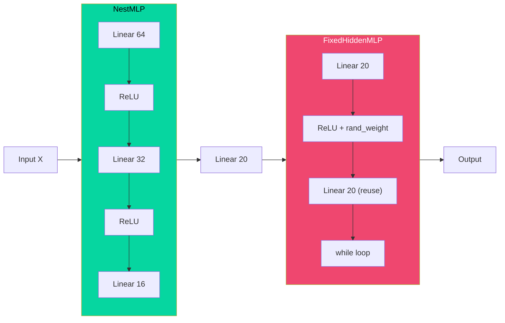

# Buổi 24 — Builders Guide: Tổ chức code Deep Learning chuyên nghiệp

> [!NOTE] ELI5
> Từ Buổi 18→23, mỗi lần xây model bạn gọi `nn.Sequential(...)` rồi liệt kê layers. Nó giống như lắp LEGO theo **hướng dẫn có sẵn** — chỉ xếp gạch thẳng hàng.
>
> Nhưng nếu bạn muốn xây **con rồng LEGO** (có cánh nhọn, đuôi cong, miệng phun lửa)? Bạn cần tự **thiết kế từng bộ phận** (cánh, đuôi, đầu), rồi **ghép chúng lại**.
>
> Buổi 24 dạy bạn cách: **(1)** tự tạo "bộ phận" (Custom Module), **(2)** quản lý "phụ kiện" bên trong mỗi bộ phận (Parameters), và **(3)** tự chế "gạch LEGO mới" (Custom Layer). Đây là kỹ năng **bắt buộc** để xây ResNet, Transformer sau này.

---

## 🎯 Mục tiêu buổi học

1. Hiểu **Module (Block)** — đơn vị tổ chức code trong deep learning
2. Phân biệt **`nn.Sequential`** vs **Custom `nn.Module`** — khi nào dùng cái nào
3. **Truy cập và quản lý Parameters** — xem, sửa, chia sẻ trọng số
4. Tự tạo **Custom Layer** — layer không có sẵn trong PyTorch
5. Hiểu **Tied Parameters** (chia sẻ trọng số) — 2 layers dùng chung W

---

## Phần 1: Module — Đơn vị tổ chức của Neural Network

> [!NOTE] ELI5
> Hãy tưởng tượng bạn xây nhà. Bạn không xây từng viên gạch riêng lẻ — bạn xây **từng tầng** (tầng 1, tầng 2), rồi **gộp các tầng** thành ngôi nhà.
>
> Trong deep learning:
> - **Neuron** = viên gạch
> - **Layer** = hàng gạch (ví dụ `nn.Linear`)
> - **Module/Block** = một tầng nhà (gồm nhiều layers)
> - **Model** = ngôi nhà (gồm nhiều modules)
>
> Và điều hay nhất: **tầng nhà cũng là module, ngôi nhà cũng là module**! Tất cả đều kế thừa từ `nn.Module`.

![[assets/attachments/D2L/Buoi24/module_hierarchy.png]]
*Phân cấp Module: Layers → Blocks → Models. Tất cả đều là `nn.Module`.*

### 1.1 Mọi thứ đều là nn.Module

Trong PyTorch, **mọi component** (từ 1 layer đến cả model) đều kế thừa từ `nn.Module`. Mỗi `nn.Module` phải làm 3 việc:

| Chức năng | Mô tả | Ví dụ |
| --- | --- | --- |
| **Nhận input** | Lấy tensor đầu vào | `forward(self, X)` |
| **Tạo output** | Tính toán và trả về tensor đầu ra | `return self.linear(X)` |
| **Lưu parameters** | Chứa các trọng số cần train | `self.weight`, `self.bias` |

```python
import torch
from torch import nn
from torch.nn import functional as F

# Mọi thứ đều là nn.Module:
print(isinstance(nn.Linear(4, 3), nn.Module))       # True — 1 layer
print(isinstance(nn.Sequential(), nn.Module))        # True — container
print(isinstance(nn.ReLU(), nn.Module))              # True — activation
```

> [!question]- ❓ Tại sao cần Module? Không viết function bình thường được sao?
> **Được**, nhưng function **không tự lưu trạng thái** (parameters). Khi bạn viết:
>
> ```python
> def mlp(X, W1, b1, W2, b2):
>     h = F.relu(X @ W1 + b1)
>     return h @ W2 + b2
> ```
>
> Bạn phải **tự quản lý** `W1, b1, W2, b2` — rất phiền khi model có hàng trăm tầng!
>
> `nn.Module` giải quyết bằng cách:
> 1. **Tự lưu** parameters trong `self.xxx`
> 2. **Tự đăng ký** để optimizer biết cần update cái nào
> 3. **Tự tính** gradient (nhờ autograd)
> 4. **Tự chuyển** sang GPU khi gọi `.cuda()`
> 5. **Tự lưu/load** model (`.state_dict()`)

### 1.2 Ôn lại: nn.Sequential — Cách đơn giản nhất

```python
# Cách quen thuộc từ Buổi 18-23:
net = nn.Sequential(
    nn.LazyLinear(256),  # Tầng hidden: ? → 256
    nn.ReLU(),           # Activation
    nn.LazyLinear(10)    # Tầng output: 256 → 10
)

X = torch.rand(2, 20)   # Batch 2, input 20 features
print(net(X).shape)      # torch.Size([2, 10])
```

`nn.Sequential` làm gì?
1. **Lưu** danh sách các layers theo thứ tự
2. **Forward**: truyền output layer trước → input layer sau (dây chuyền)
3. Tương đương: `output = layer3(layer2(layer1(X)))`

> [!CAUTION] Hạn chế của Sequential
> `nn.Sequential` **chỉ** hỗ trợ **dây chuyền thẳng**: Layer1 → Layer2 → Layer3.
>
> Nếu bạn cần:
> - **Rẽ nhánh** (2 đường đi song song rồi gộp lại) → ❌ Không được
> - **Skip connection** (nhảy qua 1 tầng, cộng output) → ❌ Không được
> - **Control flow** (if/while trong forward) → ❌ Không được
>
> → Phải dùng **Custom Module**!

---

## Phần 2: Custom nn.Module — Tự thiết kế model

> [!NOTE] ELI5
> `nn.Sequential` giống xếp LEGO theo hướng dẫn — chỉ được xếp **thẳng**.
> Custom `nn.Module` giống tự **vẽ bản thiết kế LEGO** — muốn xếp kiểu gì cũng được!

![[assets/attachments/D2L/Buoi24/sequential_vs_custom.png]]
*Trái: nn.Sequential chỉ xếp thẳng. Phải: Custom nn.Module cho phép bất kỳ logic nào.*

### 2.1 Template cơ bản

```python
class MLP(nn.Module):
    def __init__(self):
        super().__init__()              # ① BẮT BUỘC: gọi constructor cha
        self.hidden = nn.LazyLinear(256)  # ② Khai báo layers
        self.out = nn.LazyLinear(10)

    def forward(self, X):               # ③ Định nghĩa đường đi của data
        return self.out(F.relu(self.hidden(X)))
```

Có **đúng 2 method** cần implement:

| Method | Chức năng | Quy tắc |
| --- | --- | --- |
| `__init__` | Khai báo layers + đăng ký parameters | **Phải** gọi `super().__init__()` |
| `forward` | Định nghĩa data đi qua model thế nào | **Không bao giờ** gọi trực tiếp — gọi `net(X)` thay vì `net.forward(X)` |

```python
# Sử dụng:
net = MLP()
print(net(X).shape)   # torch.Size([2, 10]) — giống hệt Sequential!
```

> [!question]- ❓ Tại sao gọi `net(X)` thay vì `net.forward(X)`?
> Khi gọi `net(X)`, Python thực tế gọi `net.__call__(X)`. Method `__call__` của `nn.Module` làm **nhiều hơn** chỉ forward:
>
> ```python
> # Bên trong nn.Module.__call__(self, X):
> # 1. Chạy các hooks (nếu có)
> # 2. Gọi self.forward(X)
> # 3. Chạy các backward hooks
> # 4. Ghi lại computational graph cho autograd
> ```
>
> Nếu gọi `.forward(X)` trực tiếp → **bỏ qua** tất cả hooks và tracking → gradient sai!
>
> **Quy tắc**: luôn dùng `net(X)`, KHÔNG BAO GIỜ gọi `net.forward(X)`.

### 2.2 Ví dụ thực tế: FixedHiddenMLP

Đây là ví dụ cho thấy Custom Module **linh hoạt** hơn Sequential rất nhiều:

```python
class FixedHiddenMLP(nn.Module):
    def __init__(self):
        super().__init__()
        # ① Trọng số CỐ ĐỊNH — không train, không có gradient
        self.rand_weight = torch.rand((20, 20))
        self.linear = nn.LazyLinear(20)

    def forward(self, X):
        X = self.linear(X)
        # ② Dùng trọng số cố định (constant parameter)
        X = F.relu(X @ self.rand_weight + 1)
        # ③ Tái sử dụng layer (parameter sharing!)
        X = self.linear(X)
        # ④ Control flow — KHÔNG THỂ LÀM ĐƯỢC với Sequential!
        while X.abs().sum() > 1:
            X /= 2
        return X.sum()
```

3 điều **không thể** làm với `nn.Sequential`:

| Tính năng | Code | Giải thích |
| --- | --- | --- |
| **Constant parameter** | `self.rand_weight = torch.rand(...)` | Trọng số không thay đổi khi train |
| **Layer reuse** | Gọi `self.linear(X)` **2 lần** | Cùng 1 layer, cùng trọng số |
| **Control flow** | `while X.abs().sum() > 1` | Logic điều kiện trong forward |

> [!question]- ❓ `torch.rand(...)` vs `nn.Parameter(torch.rand(...))` — khác gì?
> | | `torch.rand(...)` | `nn.Parameter(torch.rand(...))` |
> | --- | --- | --- |
> | **Có gradient?** | ❌ Không | ✅ Có |
> | **Optimizer update?** | ❌ Không | ✅ Có |
> | **Hiện trong `model.parameters()`?** | ❌ Không | ✅ Có |
> | **Lưu khi `torch.save()`?** | ❌ Không (trừ khi `register_buffer`) | ✅ Có |
> | **Dùng khi nào?** | Trọng số cố định, random projection | Trọng số cần học |
>
> **Rule**: cần **train** → `nn.Parameter`. Không train nhưng muốn **lưu** → `register_buffer`. Hoàn toàn không cần → `torch.rand()`.

### 2.3 Nesting Modules — Ghép blocks lại

Sức mạnh thực sự: **module chứa module chứa module**:

```python
class NestMLP(nn.Module):
    def __init__(self):
        super().__init__()
        self.net = nn.Sequential(
            nn.LazyLinear(64), nn.ReLU(),
            nn.LazyLinear(32), nn.ReLU()
        )
        self.linear = nn.LazyLinear(16)

    def forward(self, X):
        return self.linear(self.net(X))

# Ghép: NestMLP → Linear → FixedHiddenMLP
chimera = nn.Sequential(NestMLP(), nn.LazyLinear(20), FixedHiddenMLP())
print(chimera(X))
```



> [!TIP] Pattern quan trọng
> Mọi model phức tạp đều xây theo pattern này:
> - **ResNet**: `ResBlock` (Conv + BN + Skip) → xếp 50+ blocks
> - **Transformer**: `EncoderBlock` (Self-Attention + FFN) → xếp 12+ blocks
> - **GPT-3**: 96 `TransformerBlock`, mỗi block chứa ~10 sub-modules
>
> Bạn chỉ thiết kế **1 block**, rồi xếp chồng N lần!

---

## Phần 3: Tự implement MySequential

> [!NOTE] ELI5
> Để hiểu `nn.Sequential` hoạt động ra sao, ta **tự viết lại** nó. Chỉ cần ~5 dòng code!

```python
class MySequential(nn.Module):
    def __init__(self, *args):
        super().__init__()
        for idx, module in enumerate(args):
            self.add_module(str(idx), module)  # đăng ký module con

    def forward(self, X):
        for module in self.children():
            X = module(X)
        return X
```

```python
# Tương đương nn.Sequential!
net = MySequential(nn.LazyLinear(256), nn.ReLU(), nn.LazyLinear(10))
print(net(X).shape)  # torch.Size([2, 10])
```

> [!question]- ❓ Tại sao dùng `add_module` thay vì Python list?
> ```python
> # ❌ SAI — PyTorch KHÔNG biết modules trong Python list!
> class BadSequential(nn.Module):
>     def __init__(self, *args):
>         super().__init__()
>         self.modules_list = list(args)  # Python list bình thường
> ```
>
> **Vấn đề**: `model.parameters()` **không thấy** parameters trong Python list! → optimizer **không update** → model **không train**!
>
> **Giải pháp**: `add_module()` hoặc `nn.ModuleList` — đăng ký chính thức với PyTorch.
>
> ```python
> # ✅ ĐÚNG — Dùng nn.ModuleList
> class GoodSequential(nn.Module):
>     def __init__(self, *args):
>         super().__init__()
>         self.layers = nn.ModuleList(args)  # PyTorch biết!
> ```
>
> **Quy tắc**: mọi sub-module phải lưu qua `self.xxx = nn.Module(...)`, `add_module()`, `nn.ModuleList`, hoặc `nn.ModuleDict`. **KHÔNG BAO GIỜ** dùng Python list/dict bình thường!

---

## Phần 4: Parameter Management — Quản lý trọng số

> [!NOTE] ELI5
> Sau khi xây xong model, bạn muốn **mở nắp máy** xem bên trong có gì: trọng số bao nhiêu? Shape thế nào? Gradient ra sao? Phần này dạy cách **moi ruột** model.

### 4.1 Truy cập Parameters

```python
net = nn.Sequential(nn.LazyLinear(8), nn.ReLU(), nn.LazyLinear(1))
X = torch.rand(size=(2, 4))
net(X)  # Phải forward 1 lần để LazyLinear biết input size!

# Xem parameters tầng output (index 2):
print(net[2].state_dict())
# OrderedDict([('weight', tensor([[...]])), ('bias', tensor([...]))])
```

| Method | Trả về | Ví dụ |
| --- | --- | --- |
| `net[2].state_dict()` | Dict: `{name: tensor}` | Tất cả params của layer 2 |
| `net[2].weight` | Đối tượng `Parameter` | Trọng số W |
| `net[2].weight.data` | Tensor **giá trị** | Tensor thuần (không gradient) |
| `net[2].weight.grad` | Tensor **gradient** | `None` nếu chưa backward |
| `net[2].bias` | Đối tượng `Parameter` | Bias b |

```python
# Xem chi tiết:
print(type(net[2].bias))        # <class 'torch.nn.parameter.Parameter'>
print(net[2].bias.data)          # tensor([0.0729]) — giá trị thực
print(net[2].bias.grad)          # None — chưa backward
```

### 4.2 Xem tất cả Parameters cùng lúc

```python
for name, param in net.named_parameters():
    print(f"{name:15s} | shape: {str(param.shape):15s} | values: {param.data.flatten()[:3]}")
```

Output:
```
0.weight        | shape: torch.Size([8, 4]) | values: tensor([-0.0398, -0.2356,  0.2783])
0.bias          | shape: torch.Size([8])    | values: tensor([-0.0052, -0.1419,  0.1327])
2.weight        | shape: torch.Size([1, 8]) | values: tensor([ 0.2891, -0.0648,  0.2420])
2.bias          | shape: torch.Size([1])    | values: tensor([0.0729])
```

> [!question]- ❓ Tại sao layer `1` (ReLU) không có parameters?
> `nn.ReLU()` chỉ áp dụng hàm $\max(0, x)$ — **không có** trọng số nào cần train!
>
> Layers **không có** parameters: `nn.ReLU`, `nn.Sigmoid`, `nn.Tanh`, `nn.Dropout`, `nn.Flatten`, `nn.MaxPool2d`
>
> Layers **có** parameters: `nn.Linear` (weight + bias), `nn.Conv2d` (weight + bias), `nn.BatchNorm1d` (gamma + beta), `nn.Embedding` (embedding matrix)

### 4.3 Truy cập Parameters trong Nested Modules

```python
def block1():
    return nn.Sequential(nn.LazyLinear(32), nn.ReLU(),
                         nn.LazyLinear(16), nn.ReLU())

def block2():
    net = nn.Sequential()
    for i in range(4):
        net.add_module(f'block{i}', block1())
    return net

rgnet = nn.Sequential(block2(), nn.LazyLinear(10))
rgnet(X)

# Truy cập sâu: block2 → block 0 → layer 0 → bias
print(rgnet[0][0][0].bias.data)
```

---

## Phần 5: Tied Parameters — Chia sẻ trọng số

> [!NOTE] ELI5
> Bình thường mỗi layer có **bộ trọng số riêng**. Nhưng đôi khi bạn muốn **2 layers dùng chung 1 bộ trọng số** — giống 2 cửa sổ Excel mở **cùng 1 file** — sửa ở cửa sổ nào thì cửa sổ kia cũng thay đổi!

![[assets/attachments/D2L/Buoi24/tied_parameters.png]]
*Layer 2 và Layer 4 dùng chung 1 bộ trọng số — thay đổi 1 → cái kia tự đổi theo.*

### 5.1 Code chia sẻ trọng số

```python
shared = nn.LazyLinear(8)

net = nn.Sequential(
    nn.LazyLinear(8), nn.ReLU(),
    shared, nn.ReLU(),           # ← dùng shared lần 1
    shared, nn.ReLU(),           # ← dùng shared lần 2 (CÙNG ĐỐI TƯỢNG)
    nn.LazyLinear(1)
)

net(X)

# Kiểm chứng: parameters CÓ CÙNG giá trị
print(net[2].weight.data[0] == net[4].weight.data[0])
# tensor([True, True, True, True, True, True, True, True])

# Thay đổi 1 → cái kia tự đổi
net[2].weight.data[0, 0] = 100
print(net[4].weight.data[0, 0])  # tensor(100.)
```

### 5.2 Gradient khi chia sẻ trọng số

> [!question]- ❓ Gradient tính thế nào khi 2 layers dùng chung W?
> PyTorch **cộng** 2 gradients lại:
> $$\text{grad}_{total} = \text{grad}_{\text{layer 2}} + \text{grad}_{\text{layer 4}}$$
>
> **Ứng dụng thực tế**:
> - **Autoencoders**: encoder weight = transpose(decoder weight)
> - **Siamese networks**: 2 nhánh dùng chung CNN weights
> - **ALBERT**: tất cả transformer layers **dùng chung** trọng số → giảm params 18× so với BERT!

---

## Phần 6: Custom Layers — Tự chế layer mới

> [!NOTE] ELI5
> PyTorch cung cấp sẵn `nn.Linear`, `nn.Conv2d`, `nn.ReLU`... Nhưng đôi khi bạn cần layer **chưa ai làm**. Giống nấu ăn: siêu thị có sẵn nước sốt, nhưng đôi khi bạn muốn tự **pha sốt riêng**.

### 6.1 Layer không có Parameters

```python
class CenteredLayer(nn.Module):
    """Trừ mean khỏi input — center data về 0"""
    def __init__(self):
        super().__init__()

    def forward(self, X):
        return X - X.mean()

# Test:
layer = CenteredLayer()
print(layer(torch.tensor([1.0, 2, 3, 4, 5])))
# tensor([-2., -1.,  0.,  1.,  2.]) ← center về mean = 0

# Ghép vào model:
net = nn.Sequential(nn.LazyLinear(128), CenteredLayer())
Y = net(torch.rand(4, 8))
print(Y.mean())  # tensor(~0.0)
```

### 6.2 Layer có Parameters

```python
class MyLinear(nn.Module):
    """Tự implement fully-connected layer + ReLU"""
    def __init__(self, in_units, units):
        super().__init__()
        self.weight = nn.Parameter(torch.randn(in_units, units))
        self.bias = nn.Parameter(torch.randn(units,))

    def forward(self, X):
        linear = torch.matmul(X, self.weight.data) + self.bias.data
        return F.relu(linear)

# Dùng trong model:
net = nn.Sequential(MyLinear(64, 8), MyLinear(8, 1))
print(net(torch.rand(2, 64)).shape)  # torch.Size([2, 1])
```

### 6.3 So sánh tổng hợp

| | `nn.Sequential` | Custom `nn.Module` | Custom Layer |
| --- | --- | --- | --- |
| **Độ phức tạp** | ⭐ Đơn giản | ⭐⭐ Trung bình | ⭐⭐⭐ Nâng cao |
| **Linh hoạt** | Chỉ dây chuyền thẳng | Bất kỳ logic nào | Phép tính mới hoàn toàn |
| **Khi nào dùng** | MLP đơn giản, prototype | ResNet, Transformer | Layer chưa có sẵn |

---

## Phần 7: Ví dụ tổng hợp — MLPBlock chuyên nghiệp

```python
class MLPBlock(nn.Module):
    """Block: Linear → BN → ReLU → Dropout"""
    def __init__(self, in_features, out_features, dropout=0.5):
        super().__init__()
        self.linear = nn.Linear(in_features, out_features)
        self.bn = nn.BatchNorm1d(out_features)
        self.relu = nn.ReLU()
        self.dropout = nn.Dropout(dropout)

    def forward(self, X):
        return self.dropout(self.relu(self.bn(self.linear(X))))


class DeepMLP(nn.Module):
    """Model MLP sâu, xây từ blocks."""
    def __init__(self, input_dim, hidden_dims, output_dim, dropout=0.5):
        super().__init__()
        layers = []
        prev_dim = input_dim
        for h_dim in hidden_dims:
            layers.append(MLPBlock(prev_dim, h_dim, dropout))
            prev_dim = h_dim
        self.backbone = nn.Sequential(*layers)
        self.head = nn.Linear(prev_dim, output_dim)

    def forward(self, X):
        return self.head(self.backbone(X))


# Sử dụng:
model = DeepMLP(input_dim=784, hidden_dims=[256, 128, 64],
                output_dim=10, dropout=0.3)
X = torch.randn(32, 784)
print(model(X).shape)       # torch.Size([32, 10]) ✓
total_params = sum(p.numel() for p in model.parameters())
print(f"Total parameters: {total_params:,}")  # ~246,922
```

> [!TIP] Best Practices khi viết Custom Module
> 1. **Đặt tên rõ ràng**: `self.backbone`, `self.head`, `self.encoder` — không dùng `self.net1`, `self.net2`
> 2. **Tách block nhỏ**: mỗi block làm 1 việc (Single Responsibility)
> 3. **Dùng `nn.ModuleList`** cho danh sách layers — KHÔNG dùng Python list
> 4. **Truyền hyperparameters** qua `__init__` — không hardcode
> 5. **Docstring** mô tả input/output shape

---

## 📖 Từ điển thuật ngữ

| Thuật ngữ | Nghĩa dễ hiểu |
| --- | --- |
| **nn.Module** | Class cha mà mọi layer/model phải kế thừa |
| **nn.Sequential** | Container xếp layers theo dây chuyền thẳng |
| **forward()** | Method định nghĩa data đi qua model thế nào |
| **super().__init__()** | Bắt buộc gọi đầu tiên trong `__init__` |
| **nn.ModuleList** | Python list "biết PyTorch" — params được tracking |
| **state_dict()** | Dict chứa tất cả parameters (tên → tensor) |
| **named_parameters()** | Iterator trả về `(name, param)` cho mọi tham số |
| **nn.Parameter** | Tensor đặc biệt — PyTorch biết cần tính gradient |
| **Tied Parameters** | 2+ layers dùng chung 1 bộ trọng số |
| **register_buffer** | Tensor không train nhưng muốn save/load |

---

## ✅ Bài tự kiểm tra

1. `nn.Sequential` có hạn chế gì? Cho 2 ví dụ phải dùng Custom `nn.Module`.
2. Khi viết `nn.Module`, 2 method bắt buộc là gì? Tại sao gọi `net(X)` thay vì `net.forward(X)`?
3. Tied Parameters hoạt động thế nào? Gradient tính ra sao khi 2 layers chung W?
4. Tại sao **không được** lưu sub-modules trong Python list bình thường?
5. Viết Custom Layer `ScaleLayer(factor)` — nhân input với `factor` (trainable parameter).

> [!NOTE]- 📝 Đáp án
> 1. Sequential chỉ dây chuyền thẳng. Phải dùng Custom khi cần: **(a)** skip connection, **(b)** control flow (if/while).
> 2. `__init__` (khai báo layers) và `forward` (data flow). Gọi `net(X)` vì `__call__` thêm hook + gradient tracking.
> 3. Cùng 1 Python object → cùng tensor. Gradient = **tổng** gradient từ tất cả vị trí.
> 4. `model.parameters()` không thấy → optimizer không update → model không train!
> 5. ```python
>    class ScaleLayer(nn.Module):
>        def __init__(self, factor=1.0):
>            super().__init__()
>            self.factor = nn.Parameter(torch.tensor(factor))
>        def forward(self, X):
>            return X * self.factor
>    ```

---

## 🔗 Liên kết

- **Buổi trước**: [[Buổi 23 - Tuần 6]] — Backpropagation
- **Buổi sau**: [[Buổi 25 - Tuần 7]] — Save/Load Models & GPU Training
- **Concepts**: [[Multilayer Perceptron]], [[Activation Function]]
