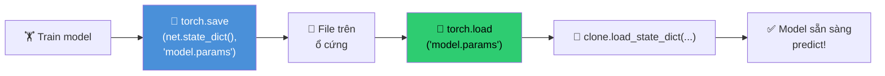

# Buổi 25 — Save/Load Models & GPU Training

> [!NOTE] ELI5
> Bạn đã biết xây model, train model, quản lý parameters (Buổi 24). Nhưng có 2 câu hỏi thực tế:
>
> 1. **"Train xong rồi tắt máy thì model đi đâu?"** → Bạn cần **lưu** model ra file, rồi **load** lại sau.
> 2. **"Train trên CPU quá chậm, làm sao dùng GPU?"** → Bạn cần chuyển data + model sang **GPU**.
>
> Buổi 25 giải quyết 2 bài toán rất "đời thường" nhưng **cực kỳ quan trọng** này.

---

## 🎯 Mục tiêu buổi học

1. **Lưu/Load tensors** — `torch.save()` và `torch.load()`
2. **Lưu/Load model parameters** — `state_dict()`, `load_state_dict()`
3. Hiểu tại sao **chỉ lưu parameters**, không lưu toàn bộ model
4. **GPU concepts** — device, data transfer, `model.to(device)`
5. Tránh **bẫy hiệu năng** khi dùng GPU

---

## Phần 1: Lưu & Load Tensors

> [!NOTE] ELI5
> `torch.save()` giống nút **Save** trong Word — lưu dữ liệu ra file trên ổ cứng.
> `torch.load()` giống nút **Open** — đọc file đã lưu và đưa lại vào bộ nhớ.
>
> Bạn có thể lưu: **1 tensor**, **danh sách tensors**, hoặc **dictionary of tensors**.

### 1.1 Lưu 1 tensor

```python
import torch
from torch import nn
from torch.nn import functional as F

x = torch.arange(4)
torch.save(x, 'x-file')       # ← Lưu tensor x ra file 'x-file'

x2 = torch.load('x-file')     # ← Load lại
print(x2)                      # tensor([0, 1, 2, 3]) ✓
```

### 1.2 Lưu danh sách tensors

```python
y = torch.zeros(4)
torch.save([x, y], 'xy-files')          # Lưu LIST

x2, y2 = torch.load('xy-files')         # Unpack ngược lại
print(x2, y2)
# tensor([0, 1, 2, 3]) tensor([0., 0., 0., 0.])
```

### 1.3 Lưu dictionary of tensors

```python
mydict = {'x': x, 'y': y}
torch.save(mydict, 'mydict')            # Lưu DICT

mydict2 = torch.load('mydict')
print(mydict2)
# {'x': tensor([0, 1, 2, 3]), 'y': tensor([0., 0., 0., 0.])}
```

> [!TIP] Khi nào dùng dict?
> Lưu dictionary **rất phổ biến** vì `model.state_dict()` trả về dictionary — mỗi key là tên parameter, mỗi value là tensor trọng số. Đây chính là cách lưu model!

---

## Phần 2: Lưu & Load Model Parameters

> [!NOTE] ELI5
> Lưu model = lưu **bộ não** (trọng số đã train). Khi load lại, bạn cần:
> 1. **Xây lại cái đầu** (tạo model cùng kiến trúc)
> 2. **Nhét bộ não vào** (load trọng số từ file)
>
> PyTorch **chỉ lưu trọng số** (parameters), không lưu code kiến trúc. Vì code Python không thể serialize tự nhiên.

![[assets/attachments/D2L/Buoi25/save_load_workflow.png]]
*Workflow Save/Load: Train → Save state_dict → Load vào clone model → Kết quả giống hệt.*

### 2.1 Tạo model, train, rồi lưu

```python
class MLP(nn.Module):
    def __init__(self):
        super().__init__()
        self.hidden = nn.LazyLinear(256)
        self.output = nn.LazyLinear(10)

    def forward(self, x):
        return self.output(F.relu(self.hidden(x)))

# ① Tạo model và forward 1 lần (để khởi tạo lazy layers)
net = MLP()
X = torch.randn(size=(2, 20))
Y = net(X)

# ② LƯU parameters ra file
torch.save(net.state_dict(), 'mlp.params')
print("Đã lưu!")
```

### 2.2 Load lại

```python
# ③ Tạo model MỚI với CÙNG kiến trúc
clone = MLP()

# ④ LOAD parameters từ file
clone.load_state_dict(torch.load('mlp.params'))
clone.eval()  # Chuyển sang evaluation mode

# ⑤ Kiểm chứng: output GIỐNG HỆT
Y_clone = clone(X)
print(Y_clone == Y)
# tensor([[True, True, ..., True],
#         [True, True, ..., True]])  ← Mọi giá trị giống nhau!
```

### 2.3 Tóm tắt Save/Load Pipeline



| Bước | Code | Giải thích |
| --- | --- | --- |
| Lưu | `torch.save(net.state_dict(), 'file.pt')` | Lưu dict `{name: tensor}` |
| Load dict | `state = torch.load('file.pt')` | Đọc dict từ file |
| Load vào model | `clone.load_state_dict(state)` | Gán trọng số cho model mới |
| Eval mode | `clone.eval()` | Tắt Dropout/BN training mode |

> [!CAUTION] 3 lỗi phổ biến khi Save/Load
>
> **Lỗi 1**: Lưu cả model thay vì state_dict
> ```python
> # ❌ SAI — không nên
> torch.save(net, 'model.pkl')
> # Vấn đề: phụ thuộc vào đường dẫn code, dễ lỗi khi chuyển máy
>
> # ✅ ĐÚNG — chỉ lưu parameters
> torch.save(net.state_dict(), 'model.pt')
> ```
>
> **Lỗi 2**: Quên tạo model cùng kiến trúc trước khi load
> ```python
> # ❌ SAI
> clone = torch.load('model.pt')  # Đây là dict, không phải model!
>
> # ✅ ĐÚNG
> clone = MLP()                    # Tạo model trước
> clone.load_state_dict(torch.load('model.pt'))
> ```
>
> **Lỗi 3**: Quên `clone.eval()` sau khi load
> ```python
> # ❌ Dropout vẫn bật → kết quả dao động mỗi lần predict!
> clone.load_state_dict(torch.load('model.pt'))
> clone(X)  # Kết quả KHÁC mỗi lần (do Dropout random)
>
> # ✅ Tắt Dropout/BN
> clone.eval()
> clone(X)  # Kết quả GIỐNG mỗi lần ✓
> ```

> [!question]- ❓ Tại sao không lưu luôn cả model (kiến trúc + parameters)?
> **Có thể** (`torch.save(net, 'file.pkl')`), nhưng **không nên** vì:
>
> 1. **Python pickle** lưu toàn bộ code → nếu đổi tên class, đổi thư mục → **lỗi load**
> 2. **Không portable** — file tạo trên máy A có thể không load được trên máy B
> 3. **Bảo mật** — pickle có thể chạy arbitrary code khi load → nguy hiểm
>
> Best practice: lưu **state_dict** + viết code kiến trúc model rõ ràng.

### 2.4 Ứng dụng thực tế: Checkpointing

Khi train model lớn (nhiều giờ/ngày), nên **lưu định kỳ** để không mất công:

```python
for epoch in range(100):
    train_one_epoch(model, dataloader, optimizer)
    
    # Lưu checkpoint mỗi 10 epochs
    if (epoch + 1) % 10 == 0:
        torch.save({
            'epoch': epoch,
            'model_state_dict': model.state_dict(),
            'optimizer_state_dict': optimizer.state_dict(),
            'loss': loss,
        }, f'checkpoint_epoch{epoch+1}.pt')

# Load checkpoint để tiếp tục train:
checkpoint = torch.load('checkpoint_epoch50.pt')
model.load_state_dict(checkpoint['model_state_dict'])
optimizer.load_state_dict(checkpoint['optimizer_state_dict'])
start_epoch = checkpoint['epoch'] + 1
```

> [!TIP] Tại sao lưu cả optimizer state?
> Optimizer (ví dụ Adam) lưu **momentum** cho mỗi parameter. Nếu không lưu optimizer state → khi resume training, momentum reset về 0 → model train **tệ hơn** ban đầu — giống bạn đang chạy bộ tốc lực rồi bị dừng lại rồi bắt đầu chạy lại từ đầu.

---

## Phần 3: GPU — Tăng tốc tính toán

> [!NOTE] ELI5
> **CPU** giống 1 đầu bếp giỏi — làm **1 việc** rất nhanh, rất chính xác.
> **GPU** giống **1000 đầu bếp** — mỗi người kém hơn, nhưng cùng lúc nấu **1000 món** song song.
>
> Deep learning = nhân ma trận = làm **rất nhiều phép tính giống nhau** → GPU nhanh hơn CPU 10-100×!

![[assets/attachments/D2L/Buoi25/cpu_vs_gpu.png]]
*CPU xử lý tuần tự (ít core, mạnh). GPU xử lý song song (nhiều core). Data phải ở cùng device!*

### 3.1 Kiểm tra GPU

```python
import torch

# Kiểm tra GPU có sẵn không
print(torch.cuda.is_available())      # True nếu có NVIDIA GPU + CUDA
print(torch.cuda.device_count())      # Số GPU (ví dụ: 1, 2, 4, 8)
print(torch.cuda.get_device_name(0))  # Tên GPU (ví dụ: "NVIDIA RTX 4090")
```

### 3.2 Device trong PyTorch

```python
# Các cách chỉ định device:
cpu = torch.device('cpu')
gpu0 = torch.device('cuda:0')   # GPU đầu tiên
gpu1 = torch.device('cuda:1')   # GPU thứ hai (nếu có)

# Helper function an toàn:
def try_gpu(i=0):
    """Trả về gpu(i) nếu có, ngược lại trả về cpu."""
    if torch.cuda.device_count() >= i + 1:
        return torch.device(f'cuda:{i}')
    return torch.device('cpu')

print(try_gpu())  # device(type='cuda', index=0) hoặc device(type='cpu')
```

### 3.3 Tensors trên GPU

```python
# Mặc định: tensor trên CPU
x = torch.tensor([1, 2, 3])
print(x.device)  # cpu

# Tạo tensor TRỰC TIẾP trên GPU (nhanh nhất!)
X = torch.ones(2, 3, device=try_gpu())
print(X.device)  # cuda:0

# Hoặc CHUYỂN tensor từ CPU sang GPU
x_gpu = x.to(try_gpu())     # hoặc x.cuda()
print(x_gpu.device)         # cuda:0
```

### 3.4 Quy tắc VÀNG: Data phải ở cùng device!

> [!CAUTION] Quy tắc quan trọng nhất
> **Tất cả** tensors tham gia phép tính phải **ở cùng device!**
>
> ```python
> x_cpu = torch.tensor([1, 2, 3])           # CPU
> y_gpu = torch.tensor([4, 5, 6]).cuda()     # GPU
>
> # ❌ LỖI! Không thể cộng tensor CPU với tensor GPU
> # z = x_cpu + y_gpu   # RuntimeError: Expected all tensors on same device
>
> # ✅ Chuyển về cùng device trước
> z = x_cpu.cuda() + y_gpu   # OK — cả hai trên GPU
> ```

### 3.5 Chuyển Model sang GPU

```python
# Tạo model
net = nn.Sequential(nn.LazyLinear(1))

# Chuyển MỌI parameters sang GPU
net = net.to(device=try_gpu())

# Kiểm tra parameters đã trên GPU chưa
print(net[0].weight.data.device)  # cuda:0 ✓

# Forward — INPUT cũng phải trên GPU!
X = torch.ones(2, 3, device=try_gpu())
print(net(X))  # Tính toán trên GPU ✓
```

### 3.6 Training Pipeline đầy đủ với GPU

```python
device = try_gpu()
print(f"Training on: {device}")

# ① Model → GPU
model = MLP()
model.to(device)

# ② Optimizer (tự động theo model)
optimizer = torch.optim.SGD(model.parameters(), lr=0.1)

# ③ Training loop
for epoch in range(num_epochs):
    model.train()
    for X, y in train_loader:
        # ④ Data → GPU (mỗi batch!)
        X, y = X.to(device), y.to(device)
        
        loss = F.cross_entropy(model(X), y)
        optimizer.zero_grad()
        loss.backward()
        optimizer.step()
    
    model.eval()
    # ⑤ Validation — data cũng phải trên GPU
    with torch.no_grad():
        for X, y in val_loader:
            X, y = X.to(device), y.to(device)
            # ... evaluate
```

> [!TIP] Pattern chuẩn
> ```python
> device = torch.device('cuda' if torch.cuda.is_available() else 'cpu')
> model.to(device)
> # Trong training loop:
> X, y = X.to(device), y.to(device)
> ```
> Chỉ 3 dòng code — model chạy trên GPU nếu có, fallback CPU nếu không!

---

## Phần 4: Bẫy hiệu năng khi dùng GPU

> [!NOTE] ELI5
> GPU nhanh như xe Ferrari, nhưng đường từ nhà bạn (CPU RAM) đến đường đua (GPU VRAM) rất **tắc**. Nếu cứ chạy qua chạy lại giữa nhà và đường đua → **chậm hơn** cả đi xe đạp!

### 4.1 Tránh chuyển data không cần thiết

```python
# ❌ CHẬM — chuyển result về CPU mỗi step chỉ để print
for i in range(1000):
    Y = model(X_gpu)
    print(Y.item())     # ← .item() kéo data về CPU → CHẬM!

# ✅ NHANH — giữ mọi thứ trên GPU, chỉ print cuối cùng
losses = []
for i in range(1000):
    Y = model(X_gpu)
    losses.append(Y)    # Vẫn trên GPU

# Chỉ lấy về CPU khi thật sự cần
final_losses = torch.stack(losses).cpu().numpy()
print(final_losses[-1])
```

### 4.2 Tạo tensor trực tiếp trên GPU

```python
# ❌ CHẬM — tạo trên CPU rồi chuyển
X = torch.rand(1000, 1000)          # CPU
X = X.cuda()                         # Copy CPU → GPU (tốn thời gian!)

# ✅ NHANH — tạo thẳng trên GPU
X = torch.rand(1000, 1000, device='cuda')  # Không cần copy!
```

### 4.3 Tổng hợp: Quy tắc dùng GPU hiệu quả

| Quy tắc | Giải thích |
| --- | --- |
| **Giữ data trên GPU** | Tránh `.item()`, `.cpu()`, `.numpy()` trong training loop |
| **Batch lớn hơn** | GPU mạnh ở parallel → batch lớn = tận dụng tốt hơn |
| **Tạo trực tiếp** | `torch.rand(..., device='cuda')` thay vì tạo CPU rồi copy |
| **Ít operations nhỏ** | 1 phép nhân lớn nhanh hơn 1000 phép nhân nhỏ trên GPU |
| **Tránh print trong loop** | `print()` buộc CPU chờ GPU → blocking |

> [!WARNING] Khi nào GPU KHÔNG nhanh hơn CPU?
> - **Data quá nhỏ** (tensor vài chục phần tử) → overhead copy > thời gian tính
> - **Operations tuần tự** (for loops trong Python) → GPU không song song được
> - **RAM GPU không đủ** → phải swap ↔ CPU → chậm kinh khủng
>
> **Rule of thumb**: batch_size × model_size ≥ vài MB → GPU mới có lợi.

---

## Phần 5: Kết hợp tất cả — Full Pipeline

```python
import torch
from torch import nn
from torch.nn import functional as F
from torch.utils.data import DataLoader
from torchvision import datasets, transforms

# ═══ Setup ═══
device = torch.device('cuda' if torch.cuda.is_available() else 'cpu')
print(f"Using device: {device}")

# ═══ Data ═══
transform = transforms.Compose([transforms.ToTensor()])
train_data = datasets.FashionMNIST('./data', train=True, download=True,
                                    transform=transform)
test_data  = datasets.FashionMNIST('./data', train=False, transform=transform)

train_loader = DataLoader(train_data, batch_size=256, shuffle=True)
test_loader  = DataLoader(test_data, batch_size=256)

# ═══ Model ═══
class FashionMLP(nn.Module):
    def __init__(self):
        super().__init__()
        self.flatten = nn.Flatten()
        self.net = nn.Sequential(
            nn.Linear(784, 256), nn.ReLU(), nn.Dropout(0.3),
            nn.Linear(256, 128), nn.ReLU(), nn.Dropout(0.3),
            nn.Linear(128, 10)
        )
    def forward(self, X):
        return self.net(self.flatten(X))

model = FashionMLP().to(device)         # ← Model → GPU
optimizer = torch.optim.Adam(model.parameters(), lr=1e-3)

# ═══ Train ═══
for epoch in range(10):
    model.train()
    total_loss = 0
    for X, y in train_loader:
        X, y = X.to(device), y.to(device)  # ← Data → GPU
        loss = F.cross_entropy(model(X), y)
        optimizer.zero_grad()
        loss.backward()
        optimizer.step()
        total_loss += loss.item() * X.size(0)
    
    # Evaluate
    model.eval()
    correct = 0
    with torch.no_grad():
        for X, y in test_loader:
            X, y = X.to(device), y.to(device)
            correct += (model(X).argmax(1) == y).sum().item()
    
    acc = correct / len(test_data) * 100
    avg_loss = total_loss / len(train_data)
    print(f"Epoch {epoch+1:2d} | Loss: {avg_loss:.4f} | Acc: {acc:.1f}%")

# ═══ Save ═══
torch.save(model.state_dict(), 'fashion_mlp.pt')
print("Model saved!")

# ═══ Load (ở phiên làm việc khác) ═══
clone = FashionMLP().to(device)
clone.load_state_dict(torch.load('fashion_mlp.pt'))
clone.eval()
print("Model loaded! Ready for prediction.")
```

---

## 📖 Từ điển thuật ngữ

| Thuật ngữ | Nghĩa dễ hiểu |
| --- | --- |
| **torch.save()** | Lưu tensor/dict ra file trên ổ cứng |
| **torch.load()** | Đọc file đã lưu và đưa vào bộ nhớ |
| **state_dict()** | Dict chứa tất cả parameters: `{tên: tensor}` |
| **load_state_dict()** | Gán trọng số từ dict vào model |
| **Checkpointing** | Lưu model định kỳ khi train → không mất công khi crash |
| **device** | Nơi tensor/model đang sống: `cpu` hoặc `cuda:i` |
| **model.to(device)** | Chuyển tất cả parameters sang device mới |
| **X.to(device)** | Chuyển tensor X sang device mới |
| **torch.cuda.is_available()** | Kiểm tra có GPU NVIDIA + CUDA không |
| **VRAM** | Video RAM — bộ nhớ riêng của GPU, thường 4-24 GB |

---

## ✅ Bài tự kiểm tra

1. Tại sao nên lưu `state_dict()` thay vì lưu cả model bằng `torch.save(net, ...)`?
2. Viết code lưu model + optimizer state vào 1 file checkpoint.
3. Khi load model để predict, bước nào **bắt buộc** phải làm trước khi `model(X)`?
4. Tại sao câu lệnh `loss.item()` trong training loop có thể **làm chậm** GPU?
5. `X_cpu + Y_gpu` sẽ xảy ra điều gì? Cách khắc phục?

> [!NOTE]- 📝 Đáp án
> 1. `state_dict()` chỉ lưu trọng số → **portable**, không phụ thuộc đường dẫn code. Lưu cả model dùng pickle → dễ lỗi khi đổi tên file/class, không an toàn.
> 2. ```python
>    torch.save({
>        'model': model.state_dict(),
>        'optimizer': optimizer.state_dict(),
>        'epoch': epoch,
>    }, 'checkpoint.pt')
>    ```
> 3. **(a)** Tạo model cùng kiến trúc, **(b)** `load_state_dict(torch.load(...))`, **(c)** `model.eval()` — tắt Dropout/BN, **(d)** chuyển input X lên cùng device với model.
> 4. `.item()` **buộc GPU đồng bộ** (synchronize) với CPU → CPU phải **chờ** GPU tính xong → phá vỡ pipeline song song → chậm.
> 5. **RuntimeError** — tensors phải ở cùng device. Khắc phục: `X_cpu.to(Y_gpu.device) + Y_gpu` hoặc `X_cpu.cuda() + Y_gpu`.

---

## 🔗 Liên kết

- **Buổi trước**: [[Buổi 24 - Tuần 7]] — Builders Guide: nn.Module & Parameters
- **Buổi sau**: [[Buổi 26 - Tuần 8]] — Convolutions for Images
- **Concepts**: [[Multilayer Perceptron]]
