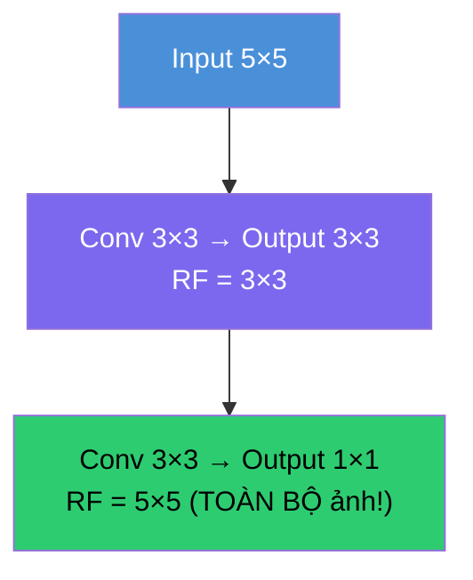

# Buổi 26 — Convolutions for Images: Bước nhảy từ MLP sang CNN

> [!NOTE] ELI5
> Từ Buổi 18→25, mọi model đều **dùng MLP** — `nn.Linear` — mỗi neuron kết nối với **tất cả** pixels. Ảnh 28×28 = 784 inputs → quản lý được. Nhưng ảnh 1920×1080 = **2 triệu** inputs → MLP cần hàng **tỷ** tham số → **bất khả thi**!
>
> **CNN** (Convolutional Neural Network) giải quyết bằng cách: thay vì nhìn **toàn bộ** ảnh, mỗi neuron chỉ nhìn **1 vùng nhỏ** (3×3, 5×5 pixels). Giống bạn đọc sách: bạn không nhìn **cả trang** cùng lúc mà **rà mắt** từ trái sang phải, từ trên xuống dưới.
>
> Buổi 26 là **bước nhảy quan trọng nhất** trong lộ trình — từ đây, mọi model ảnh (ResNet, VGG, Object Detection, Image Generation) đều dựa trên convolution.

---

## 🎯 Mục tiêu buổi học

1. Hiểu **tại sao MLP không phù hợp** cho ảnh (bùng nổ tham số)
2. Nắm 2 nguyên tắc cốt lõi: **Translation Invariance** & **Locality**
3. Hiểu phép **Cross-Correlation** (convolution trong thực tế)
4. Tự implement **Conv2D from scratch**
5. Hiểu **Padding** & **Stride** — kiểm soát kích thước output
6. Thấy convolution **tự học** được kernel (edge detection)

---

## Phần 1: Tại sao MLP thất bại với ảnh?

> [!NOTE] ELI5
> Hãy tưởng tượng bạn tìm Wally (Where's Waldo). Bạn không cần xem **tất cả** 10 triệu pixel cùng lúc. Bạn chỉ cần:
> 1. **Quét từng vùng nhỏ** (locality) — nhìn mỗi vùng 50×50 pixel
> 2. **Cách quét giống nhau** ở mọi nơi (translation invariance) — Wally trông giống nhau dù ở góc trái hay phải
>
> MLP **không biết** 2 điều này → phải học lại mọi thứ ở mọi vị trí → cần quá nhiều tham số.

### 1.1 Bài toán kích thước

| Ảnh | Input size | MLP Hidden=1000 | Tham số |
| --- | --- | --- | --- |
| Fashion-MNIST (28×28) | 784 | 784 × 1000 | **784,000** ← quản lý được |
| Ảnh HD (1000×1000) | 1,000,000 | 10⁶ × 10³ | **10⁹ = 1 tỷ** ← BẤT KHẢ THI |
| Ảnh 4K (3840×2160) | 8,294,400 | 8.3×10⁶ × 10³ | **8.3 tỷ** ← điên rồ |

### 1.2 Hai nguyên tắc cứu vãn tình hình

CNN giải quyết bằng 2 nguyên tắc đơn giản nhưng cực kỳ mạnh:

| Nguyên tắc | Ý nghĩa | Hệ quả |
| --- | --- | --- |
| **Translation Invariance** | Cùng 1 pattern (mèo, cạnh) trông **giống nhau** dù ở đâu trong ảnh | **Dùng chung bộ lọc** cho mọi vị trí → giảm params |
| **Locality** | Pixel ở góc trái **không liên quan** đến pixel ở góc phải | Mỗi neuron chỉ nhìn **vùng nhỏ** (3×3, 5×5) → giảm params |

**Kết quả giảm tham số:**

$$\underbrace{10^{12}}_{\text{MLP (fully connected)}} \xrightarrow{\text{Translation Invariance}} \underbrace{4 \times 10^6}_{\text{Shared weights}} \xrightarrow{\text{Locality } (\Delta=5)} \underbrace{100}_{\text{Kernel 5×5 + bias}} $$

> [!question]- ❓ Giải thích toán học: Từ MLP → Convolution
> **MLP** cho ảnh 2D:
> $$[\mathbf{H}]_{i,j} = [\mathbf{U}]_{i,j} + \sum_a \sum_b [\mathsf{V}]_{i,j,a,b} \cdot [\mathbf{X}]_{i+a, j+b}$$
>
> Áp **Translation Invariance** ($\mathsf{V}$ không phụ thuộc vị trí $(i,j)$):
> $$[\mathbf{H}]_{i,j} = u + \sum_a \sum_b [\mathbf{V}]_{a,b} \cdot [\mathbf{X}]_{i+a, j+b}$$
>
> Áp **Locality** (chỉ xét $|a| \leq \Delta, |b| \leq \Delta$):
> $$[\mathbf{H}]_{i,j} = u + \sum_{a=-\Delta}^{\Delta} \sum_{b=-\Delta}^{\Delta} [\mathbf{V}]_{a,b} \cdot [\mathbf{X}]_{i+a, j+b}$$
>
> → Đây chính là **Convolution**! $\mathbf{V}$ gọi là **kernel** (bộ lọc), kích thước $(2\Delta+1) \times (2\Delta+1)$.

---

## Phần 2: Cross-Correlation — Phép tính cốt lõi của CNN

> [!NOTE] ELI5
> Convolution = **trượt bộ lọc nhỏ** (kernel) qua toàn bộ ảnh. Tại mỗi vị trí:
> 1. **Đặt** kernel lên vùng ảnh
> 2. **Nhân** từng phần tử tương ứng
> 3. **Cộng** tất cả → được **1 số**
> 4. **Trượt** sang vị trí tiếp theo → lặp lại
>
> Giống bạn dùng **kính lúp nhỏ** rà qua tấm ảnh — mỗi lần nhìn 1 vùng nhỏ → ghi lại "thấy gì".

![[assets/attachments/D2L/Buoi26/cross_correlation_op.png]]
*Cross-correlation: Input 3×3 ⊛ Kernel 2×2 = Output 2×2. Mỗi ô output = tổng tích element-wise.*

### 2.1 Tính tay 1 ví dụ

Input $3 \times 3$:
$$\mathbf{X} = \begin{pmatrix} 0 & 1 & 2 \\ 3 & 4 & 5 \\ 6 & 7 & 8 \end{pmatrix}, \quad \text{Kernel } 2 \times 2: \quad \mathbf{K} = \begin{pmatrix} 0 & 1 \\ 2 & 3 \end{pmatrix}$$

**Vị trí (0,0)**:
$$0 \times 0 + 1 \times 1 + 3 \times 2 + 4 \times 3 = 0 + 1 + 6 + 12 = \mathbf{19}$$

**Vị trí (0,1)**:
$$1 \times 0 + 2 \times 1 + 4 \times 2 + 5 \times 3 = 0 + 2 + 8 + 15 = \mathbf{25}$$

**Vị trí (1,0)**:
$$3 \times 0 + 4 \times 1 + 6 \times 2 + 7 \times 3 = 0 + 4 + 12 + 21 = \mathbf{37}$$

**Vị trí (1,1)**:
$$4 \times 0 + 5 \times 1 + 7 \times 2 + 8 \times 3 = 0 + 5 + 14 + 24 = \mathbf{43}$$

$$\text{Output} = \begin{pmatrix} 19 & 25 \\ 37 & 43 \end{pmatrix}$$

### 2.2 Công thức kích thước output

$$\text{Output size} = (n_h - k_h + 1) \times (n_w - k_w + 1)$$

| Input | Kernel | Output |
| --- | --- | --- |
| 3 × 3 | 2 × 2 | **2 × 2** |
| 8 × 8 | 3 × 3 | **6 × 6** |
| 28 × 28 | 5 × 5 | **24 × 24** |
| 240 × 240 | 5 × 5 | **236 × 236** |

> [!WARNING] Output co lại!
> Mỗi tầng convolution, output **nhỏ hơn** input! 10 tầng convolution 5×5 trên ảnh 240×240:
> $240 - 10 \times 4 = 200$ → mất **30%** pixels viền! → Cần **Padding** (Phần 4).

### 2.3 Implement từ scratch

```python
import torch
from torch import nn

def corr2d(X, K):
    """Compute 2D cross-correlation."""
    h, w = K.shape
    Y = torch.zeros((X.shape[0] - h + 1, X.shape[1] - w + 1))
    for i in range(Y.shape[0]):
        for j in range(Y.shape[1]):
            Y[i, j] = (X[i:i+h, j:j+w] * K).sum()
    return Y

# Test với ví dụ ở trên:
X = torch.tensor([[0.0, 1, 2], [3, 4, 5], [6, 7, 8]])
K = torch.tensor([[0.0, 1], [2, 3]])
print(corr2d(X, K))
# tensor([[19., 25.],
#         [37., 43.]])  ✓
```

### 2.4 Convolutional Layer = Cross-correlation + Bias

```python
class Conv2D(nn.Module):
    def __init__(self, kernel_size):
        super().__init__()
        self.weight = nn.Parameter(torch.rand(kernel_size))
        self.bias = nn.Parameter(torch.zeros(1))

    def forward(self, x):
        return corr2d(x, self.weight) + self.bias
```

> [!question]- ❓ Cross-correlation vs Convolution — khác gì?
> Về toán học:
> - **Convolution**: $\sum f(a,b) \cdot g(i-a, j-b)$ → kernel bị **flip** (lật ngang + dọc)
> - **Cross-correlation**: $\sum f(a,b) \cdot g(i+a, j+b)$ → kernel **giữ nguyên**
>
> Trong deep learning: **KHÔNG quan trọng**! Vì kernel được **học từ data** — nếu convolution cần kernel K, thì cross-correlation sẽ tự học K' = flip(K). Kết quả **hoàn toàn giống nhau**.
>
> PyTorch's `nn.Conv2d` thực tế dùng **cross-correlation** nhưng vẫn gọi là "convolution". Đây là quy ước chung trong deep learning.

---

## Phần 3: Edge Detection — Ứng dụng đầu tiên

> [!NOTE] ELI5
> Kernel đơn giản nhất: `[1, -1]`. Nó phát hiện **sự thay đổi** giữa 2 pixels liền kề:
> - Pixel trắng (1) cạnh pixel đen (0): $1 \times 1 + 0 \times (-1) = \mathbf{1}$ (cạnh!)
> - 2 pixel cùng màu: $1 \times 1 + 1 \times (-1) = \mathbf{0}$ (không có cạnh)

![[assets/attachments/D2L/Buoi26/edge_detection.png]]
*Kernel $[1, -1]$ phát hiện cạnh dọc (+1 = trắng→đen, -1 = đen→trắng). Xoay ảnh → kernel không phát hiện cạnh ngang!*

### 3.1 Code edge detection

```python
# Ảnh 6×8: trắng (1) viền, đen (0) giữa
X = torch.ones((6, 8))
X[:, 2:6] = 0
print(X)
# tensor([[1., 1., 0., 0., 0., 0., 1., 1.],
#         [1., 1., 0., 0., 0., 0., 1., 1.],
#         ...])

# Kernel phát hiện cạnh dọc
K = torch.tensor([[1.0, -1.0]])

# Áp convolution
Y = corr2d(X, K)
print(Y)
# tensor([[ 0.,  1.,  0.,  0.,  0., -1.,  0.],
#         [ 0.,  1.,  0.,  0.,  0., -1.,  0.],
#         ...])
# +1 = cạnh trắng→đen, -1 = cạnh đen→trắng, 0 = không phải cạnh

# Xoay ảnh → kernel KHÔNG phát hiện cạnh ngang!
print(corr2d(X.t(), K))
# tensor toàn 0 — kernel chỉ detect cạnh DỌC!
```

### 3.2 Machine Learning: Tự học kernel!

Thay vì thiết kế kernel bằng tay, ta để **model tự học** kernel nào tốt nhất:

```python
# Tạo conv layer — kernel init random
conv2d = nn.LazyConv2d(1, kernel_size=(1, 2), bias=False)

# Reshape data: (batch=1, channels=1, H=6, W=8)
X = X.reshape((1, 1, 6, 8))
Y = Y.reshape((1, 1, 6, 7))  # Target output

# Train: tự học kernel!
lr = 3e-2
for i in range(10):
    Y_hat = conv2d(X)
    l = (Y_hat - Y) ** 2
    conv2d.zero_grad()
    l.sum().backward()
    conv2d.weight.data[:] -= lr * conv2d.weight.grad
    if (i + 1) % 2 == 0:
        print(f'epoch {i+1}, loss {l.sum():.3f}')

# Kernel đã HỌC ĐƯỢC gì?
print(conv2d.weight.data.reshape(1, 2))
# tensor([[ 0.9995, -0.9995]])  ← Gần giống [1, -1]! 🎉
```

> [!TIP] Insight quan trọng
> Model **tự phát hiện** ra kernel `[1, -1]` chỉ từ data input-output!
>
> Đây là lý do CNN mạnh: ta **không cần** thiết kế features bằng tay — model tự tìm kernels phù hợp (edge detectors, texture detectors, shape detectors...) thông qua backpropagation.

---

## Phần 4: Padding — Giữ nguyên kích thước

> [!NOTE] ELI5
> Mỗi tầng conv, output nhỏ hơn input. 10 tầng → ảnh co lại rất nhiều, mất thông tin ở viền!
>
> **Padding** = thêm **0** xung quanh ảnh trước khi conv → output **giữ nguyên** kích thước.
> Giống thêm **khung trắng** quanh tấm ảnh trước khi scan.

### 4.1 Padding giữ kích thước

```python
# Không padding: 8×8 → 6×6 (co lại 2)
conv = nn.LazyConv2d(1, kernel_size=3, padding=0)
X = torch.rand(1, 1, 8, 8)
print(conv(X).shape)  # torch.Size([1, 1, 6, 6])

# Padding=1: 8×8 → 8×8 (giữ nguyên!)
conv = nn.LazyConv2d(1, kernel_size=3, padding=1)
print(conv(X).shape)  # torch.Size([1, 1, 8, 8]) ✓
```

### 4.2 Công thức với padding

$$\text{Output} = (n_h - k_h + p_h + 1) \times (n_w - k_w + p_w + 1)$$

Để **giữ nguyên kích thước**: $p_h = k_h - 1$, $p_w = k_w - 1$.

| Kernel | Padding cần | Ví dụ: Input 8×8 |
| --- | --- | --- |
| 1 × 1 | 0 | 8 × 8 |
| 3 × 3 | 1 | 8 × 8 |
| 5 × 5 | 2 | 8 × 8 |
| 7 × 7 | 3 | 8 × 8 |

> [!TIP] Tại sao kernel **lẻ** (1, 3, 5, 7)?
> Kernel lẻ → padding **đối xứng** (thêm bằng nhau trên/dưới, trái/phải). Kernel chẵn → padding **không đối xứng** → phức tạp, ít dùng.

### 4.3 Padding khác nhau cho height/width

```python
# Kernel 5×3 → padding (2,1) để giữ kích thước
conv = nn.LazyConv2d(1, kernel_size=(5, 3), padding=(2, 1))
print(conv(X).shape)  # torch.Size([1, 1, 8, 8]) ✓
```

---

## Phần 5: Stride — Giảm kích thước có kiểm soát

> [!NOTE] ELI5
> Mặc định kernel trượt **1 pixel** mỗi bước. Nếu stride = 2, kernel **nhảy 2 pixel** mỗi bước → output **nhỏ đi một nửa**.
>
> Giống đọc sách: stride=1 đọc từng dòng, stride=2 đọc cách dòng (lướt nhanh hơn, nhưng mất chi tiết).

### 5.1 Stride giảm kích thước

```python
# Stride 1 (mặc định): 8×8 → 8×8 (padding=1)
conv = nn.LazyConv2d(1, kernel_size=3, padding=1, stride=1)
print(conv(X).shape)  # torch.Size([1, 1, 8, 8])

# Stride 2: 8×8 → 4×4 (giảm một nửa!)
conv = nn.LazyConv2d(1, kernel_size=3, padding=1, stride=2)
print(conv(X).shape)  # torch.Size([1, 1, 4, 4])
```

### 5.2 Công thức chung (Padding + Stride)

$$\text{Output} = \left\lfloor \frac{n_h - k_h + p_h + s_h}{s_h} \right\rfloor \times \left\lfloor \frac{n_w - k_w + p_w + s_w}{s_w} \right\rfloor$$

Trường hợp đặc biệt ($p = k-1$, input chia hết cho $s$):

$$\text{Output} = \frac{n_h}{s_h} \times \frac{n_w}{s_w}$$

| Input | Kernel | Padding | Stride | Output |
| --- | --- | --- | --- | --- |
| 8 × 8 | 3 × 3 | 1 | 1 | **8 × 8** |
| 8 × 8 | 3 × 3 | 1 | 2 | **4 × 4** |
| 8 × 8 | 5 × 5 | 2 | 2 | **4 × 4** |
| 224 × 224 | 7 × 7 | 3 | 2 | **112 × 112** |

> [!question]- ❓ Stride 2 có gì hay hơn dùng pooling?
> Cả stride=2 và max pooling 2×2 đều **giảm kích thước 2×**. Sự khác biệt:
>
> | | Stride 2 (Conv) | MaxPool 2×2 |
> | --- | --- | --- |
> | **Có parameters?** | ✅ (kernel weights) | ❌ (just takes max) |
> | **Learnable?** | ✅ Model tự quyết giảm thế nào | ❌ Fixed operation |
> | **Trend** | Ngày càng phổ biến | Vẫn dùng nhưng giảm dần |
>
> Xu hướng hiện đại: dùng **strided convolution** thay max pooling (ví dụ: ResNet, EfficientNet).

---

## Phần 6: Feature Map & Receptive Field

> [!NOTE] ELI5
> - **Feature map** = output của tầng conv — "bản đồ đặc trưng". Mỗi pixel trên feature map **đại diện cho 1 vùng** trên ảnh gốc.
> - **Receptive field** = vùng trên ảnh gốc mà 1 pixel output **nhìn thấy**. Mạng càng **sâu** → receptive field càng **rộng** → nhìn thấy vùng lớn hơn trên ảnh gốc.



| Tầng | Output size | Receptive field | Nhìn thấy gì? |
| --- | --- | --- | --- |
| Tầng 1 Conv 3×3 | Nhỏ hơn 2px | 3 × 3 | **Edges** (cạnh, góc) |
| Tầng 2 Conv 3×3 | Nhỏ hơn 4px | 5 × 5 | **Textures** (vân, họa tiết) |
| Tầng 3 Conv 3×3 | Nhỏ hơn 6px | 7 × 7 | **Parts** (mắt, tai, bánh xe) |
| Tầng 10+ | Rất nhỏ | Rất rộng | **Objects** (mèo, xe hơi) |

> [!TIP] Tại sao xếp NHIỀU tầng conv 3×3 thay vì 1 tầng conv lớn?
> **2 tầng** Conv 3×3 liên tiếp có receptive field **5×5** nhưng chỉ dùng:
> - $2 \times (3^2) = 18$ parameters
>
> **1 tầng** Conv 5×5 cũng receptive field 5×5 nhưng dùng:
> - $5^2 = 25$ parameters
>
> → Ít params hơn + thêm 1 ReLU giữa 2 tầng → **mạnh hơn**! Đây là triết lý VGG (2014).

---

## Phần 7: So sánh MLP vs CNN

| | MLP (`nn.Linear`) | CNN (`nn.Conv2d`) |
| --- | --- | --- |
| **Kết nối** | Mọi input → mọi output (fully connected) | Mỗi output chỉ kết nối **vùng nhỏ** (local) |
| **Chia sẻ trọng số** | ❌ Mỗi kết nối có W riêng | ✅ Cùng kernel cho mọi vị trí |
| **Params (1000×1000→1000×1000)** | **10⁹** (1 tỷ) | **~100** (kernel 10×10) |
| **Hiểu cấu trúc ảnh** | ❌ Coi ảnh = vector phẳng | ✅ Giữ thông tin 2D spatial |
| **Translation invariant** | ❌ | ✅ |
| **Dùng cho** | Tabular data, MLP classifier head | Ảnh, video, âm thanh |

---

## Phần 8: Ví dụ tổng hợp — Conv2D PyTorch

```python
import torch
from torch import nn

# ═══ Ví dụ Conv2D chuẩn PyTorch ═══

# Input: batch=1, channels=1, H=8, W=8
X = torch.rand(1, 1, 8, 8)

# ═══ Kernel 3×3, padding=1 → giữ size ═══
conv1 = nn.Conv2d(
    in_channels=1,     # 1 channel (grayscale)
    out_channels=16,   # 16 filters → 16 feature maps
    kernel_size=3,     # Kernel 3×3
    padding=1,         # Pad 1 → giữ kích thước
    stride=1           # Mỗi bước trượt 1 pixel
)
out1 = conv1(X)
print(f"Input:  {X.shape}")       # [1, 1, 8, 8]
print(f"Output: {out1.shape}")    # [1, 16, 8, 8] — 16 feature maps!

# ═══ Stride=2 → giảm size một nửa ═══
conv2 = nn.Conv2d(16, 32, kernel_size=3, padding=1, stride=2)
out2 = conv2(out1)
print(f"Output stride=2: {out2.shape}")  # [1, 32, 4, 4]

# ═══ Đếm parameters ═══
print(f"\nconv1 params: {sum(p.numel() for p in conv1.parameters()):,}")
# 1*(3*3)*16 + 16 = 160 (rất ít so với Linear!)

print(f"conv2 params: {sum(p.numel() for p in conv2.parameters()):,}")
# 16*(3*3)*32 + 32 = 4,640
```

> [!question]- ❓ `out_channels=16` nghĩa là gì?
> Model có **16 kernels** khác nhau, mỗi kernel 3×3. Mỗi kernel **quét toàn bộ** ảnh → tạo ra **1 feature map**. 16 kernels → **16 feature maps**.
>
> Mỗi kernel **học phát hiện 1 pattern** khác nhau:
> - Kernel 1 → phát hiện **cạnh dọc**
> - Kernel 2 → phát hiện **cạnh ngang**
> - Kernel 3 → phát hiện **góc**
> - Kernel 4-16 → phát hiện các pattern phức tạp hơn
>
> → **channels = số loại "mắt"** mà model dùng để nhìn ảnh!

---

## 📖 Từ điển thuật ngữ

| Thuật ngữ | Nghĩa dễ hiểu |
| --- | --- |
| **Convolution** | Phép trượt kernel qua input, nhân rồi cộng |
| **Cross-correlation** | Bản "không flip" của convolution — DL dùng cái này |
| **Kernel (Filter)** | Ma trận nhỏ (3×3, 5×5) dùng để quét ảnh — là **learnable parameter** |
| **Feature map** | Output của tầng conv — "bản đồ đặc trưng" |
| **Receptive field** | Vùng ảnh gốc mà 1 pixel output nhìn thấy |
| **Translation Invariance** | Cùng pattern trông giống nhau dù ở đâu |
| **Locality** | Chỉ xét vùng lân cận nhỏ |
| **Padding** | Thêm 0 xung quanh input → giữ kích thước output |
| **Stride** | Số pixel kernel nhảy mỗi bước → giảm kích thước output |
| **in_channels** | Số channels đầu vào (1 = grayscale, 3 = RGB) |
| **out_channels** | Số kernels/filters = số feature maps đầu ra |

---

## ✅ Bài tự kiểm tra

1. MLP dùng cho ảnh 1000×1000 với hidden=1000 cần bao nhiêu tham số? CNN kernel 5×5 cần bao nhiêu?
2. Tính tay cross-correlation: Input $\begin{pmatrix} 1 & 2 \\ 3 & 4 \end{pmatrix}$, Kernel $\begin{pmatrix} 0 & 1 \\ 1 & 0 \end{pmatrix}$. Output = ?
3. Input 28×28, kernel 5×5, padding=2, stride=1 → Output size = ?
4. Input 224×224, kernel 7×7, padding=3, stride=2 → Output size = ?
5. Tại sao 2 tầng Conv 3×3 tốt hơn 1 tầng Conv 5×5? (Cùng receptive field)
6. Viết `corr2d` từ scratch (không nhìn code mẫu).

> [!NOTE]- 📝 Đáp án
> 1. MLP: $10^6 \times 10^3 = 10^9 = $ **1 tỷ** parameters. CNN: $5 \times 5 + 1 = $ **26** parameters (1 kernel + bias). Chênh lệch **40 triệu lần**!
> 2. Chỉ 1 vị trí (output 1×1): $1 \times 0 + 2 \times 1 + 3 \times 1 + 4 \times 0 = 2 + 3 = $ **5**. Output = $\begin{pmatrix} 5 \end{pmatrix}$.
> 3. $(28 - 5 + 2 \times 2 + 1) \times (...) = 28 \times 28$ → **giữ nguyên** ✓ (vì $p = (k-1)/2 = 2$).
> 4. $\lfloor(224 - 7 + 6 + 2)/2\rfloor = \lfloor 225/2 \rfloor = 112$. Output = **112 × 112**.
> 5. **(a)** Ít params hơn: $2 \times 9 = 18$ vs $25$. **(b)** Thêm 1 ReLU → model biểu diễn phong phú hơn (phi tuyến mạnh hơn). **(c)** Training dễ hơn (gradient không bị vanish nhanh). Đây là triết lý VGGNet.
> 6. ```python
>    def corr2d(X, K):
>        h, w = K.shape
>        Y = torch.zeros(X.shape[0]-h+1, X.shape[1]-w+1)
>        for i in range(Y.shape[0]):
>            for j in range(Y.shape[1]):
>                Y[i,j] = (X[i:i+h, j:j+w] * K).sum()
>        return Y
>    ```

---

## 🔗 Liên kết

- **Buổi trước**: [[Buổi 25 - Tuần 7]] — Save/Load Models & GPU Training
- **Buổi sau**: [[Buổi 27 - Tuần 8]] — Pooling Layers
- **Concepts**: [[Multilayer Perceptron]], [[Activation Function]]

---

## 📝 Kết luận

Buổi 26 đánh dấu **bước chuyển lớn nhất** trong lộ trình: từ **MLP** (fully connected) sang **CNN** (convolution).

| Khái niệm | Ý nghĩa |
| --- | --- |
| **Translation Invariance + Locality** | 2 nguyên tắc biến MLP → Conv, giảm **tỷ** params xuống **trăm** |
| **Cross-correlation** | Phép tính cốt lõi: trượt kernel qua ảnh, nhân rồi cộng |
| **Kernel tự học được** | Model tự tìm edge detector, texture detector thông qua SGD |
| **Padding** | Thêm 0 xung quanh → giữ kích thước qua nhiều tầng |
| **Stride** | Nhảy nhiều pixel → giảm kích thước có kiểm soát |
| **Receptive field** | Mạng sâu hơn → nhìn vùng rộng hơn → hiểu context lớn hơn |

Từ buổi sau: **Pooling** (rút gọn feature map), rồi **LeNet** (CNN đầu tiên hoàn chỉnh) — áp dụng convolution để **phân loại ảnh thật**.
