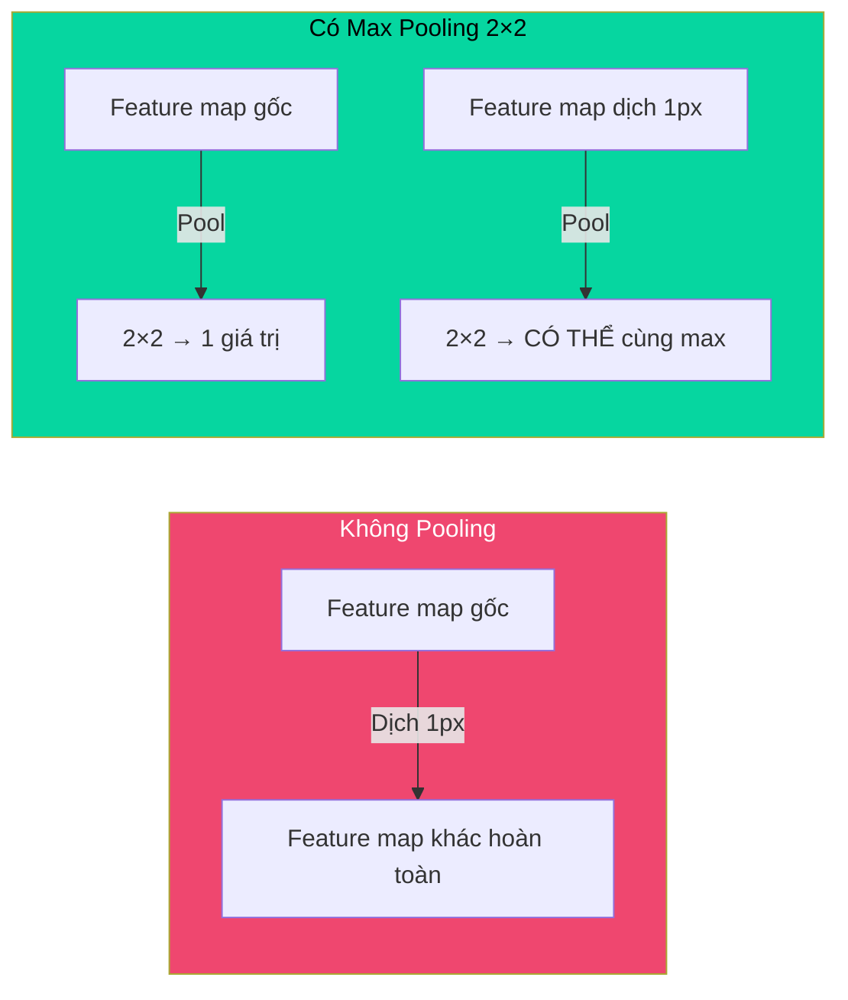
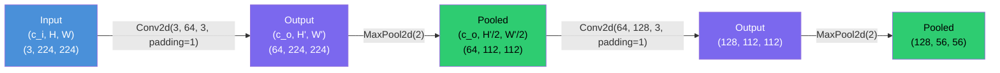

# Buổi 27 — Pooling & Multiple Channels

> [!NOTE] ELI5
> Buổi 26 đã dạy convolution — trượt kernel qua ảnh để phát hiện features. Nhưng còn 2 vấn đề:
>
> 1. **Feature map quá lớn** — ảnh 224×224 qua conv 3×3 vẫn ra 224×224 (nếu padding=1). Cần **rút gọn** kích thước → đó là **Pooling**.
> 2. **Ảnh có 3 kênh màu** (RGB) — kernel phải xử lý **nhiều channels** cùng lúc, và tạo ra **nhiều feature maps** → đó là **Multiple Channels**.
>
> Sau buổi này, bạn đã có đủ "linh kiện" để xây CNN hoàn chỉnh (LeNet) ở buổi sau!

---

## 🎯 Mục tiêu buổi học

1. Hiểu **Pooling** — rút gọn spatial resolution, tăng translation invariance
2. Phân biệt **Max Pooling** vs **Average Pooling** — khi nào dùng cái nào
3. Implement **pool2d from scratch**
4. Hiểu **Multiple Input Channels** — kernel 3D xử lý ảnh RGB
5. Hiểu **Multiple Output Channels** — nhiều kernels = nhiều feature maps
6. Hiểu **1×1 Convolution** — "fully connected layer" giữa channels

---

## Phần 1: Pooling — Rút gọn có chọn lọc

> [!NOTE] ELI5
> Bạn đọc 1 bài báo dài 10 trang. Bạn không nhớ **từng chữ** — bạn chỉ nhớ **ý chính** mỗi đoạn. Đó chính là pooling: từ 1 vùng pixels, chỉ giữ lại **1 giá trị đại diện** (lớn nhất hoặc trung bình).
>
> **Tại sao cần?**
> - **Giảm kích thước** → tính toán nhanh hơn, ít bộ nhớ hơn
> - **Translation invariance** → vật thể dịch 1-2 pixel → output gần như không đổi
> - **Tăng receptive field** → tầng sau "nhìn" vùng rộng hơn trên ảnh gốc

![[assets/attachments/D2L/Buoi27/pooling_maxavg.png]]
*Max Pooling lấy giá trị LỚN NHẤT. Average Pooling lấy giá trị TRUNG BÌNH.*

### 1.1 Max Pooling

Mỗi cửa sổ $p \times q$ → lấy **giá trị lớn nhất**:

$$\text{MaxPool}(\text{window}) = \max(x_1, x_2, \ldots, x_{p \cdot q})$$

Ví dụ — Max Pooling 2×2 trên input 3×3:

$$\mathbf{X} = \begin{pmatrix} 0 & 1 & 2 \\ 3 & 4 & 5 \\ 6 & 7 & 8 \end{pmatrix} \xrightarrow{\text{MaxPool 2×2}} \begin{pmatrix} \max(0,1,3,4) & \max(1,2,4,5) \\ \max(3,4,6,7) & \max(4,5,7,8) \end{pmatrix} = \begin{pmatrix} 4 & 5 \\ 7 & 8 \end{pmatrix}$$

### 1.2 Average Pooling

Mỗi cửa sổ → lấy **giá trị trung bình**:

$$\text{AvgPool}(\text{window}) = \frac{1}{p \cdot q}\sum_{i=1}^{p \cdot q} x_i$$

$$\mathbf{X} = \begin{pmatrix} 0 & 1 & 2 \\ 3 & 4 & 5 \\ 6 & 7 & 8 \end{pmatrix} \xrightarrow{\text{AvgPool 2×2}} \begin{pmatrix} 2.0 & 3.0 \\ 5.0 & 6.0 \end{pmatrix}$$

### 1.3 So sánh Max vs Average

| | Max Pooling ⭐ | Average Pooling |
| --- | --- | --- |
| **Giữ lại** | Giá trị **nổi bật nhất** (đỉnh) | Giá trị **trung bình** (tổng hợp) |
| **Nhạy với** | Texture, edges, sharp features | Smooth features, general structure |
| **Translation invariance** | **Tốt hơn** — vật dịch ít → max vẫn giống | Kém hơn — trung bình thay đổi |
| **Phổ biến** | ✅ Dùng **mặc định** ở hầu hết CNN | Dùng ở tầng cuối (Global Average Pooling) |
| **Ví dụ** | ResNet, VGG, AlexNet (hidden layers) | GoogLeNet, EfficientNet (tầng cuối) |

> [!TIP] Khi nào dùng Max vs Average?
> - **Hidden layers** → **Max Pooling** (giữ features nổi bật, bỏ background yên tĩnh)
> - **Tầng cuối cùng** trước classifier → **Global Average Pooling** (rút 7×7×512 thành 1×1×512 — thay thế Flatten + FC)

### 1.4 Implement từ scratch

```python
import torch
from torch import nn

def pool2d(X, pool_size, mode='max'):
    """2D Pooling — max hoặc average."""
    p_h, p_w = pool_size
    Y = torch.zeros((X.shape[0] - p_h + 1, X.shape[1] - p_w + 1))
    for i in range(Y.shape[0]):
        for j in range(Y.shape[1]):
            if mode == 'max':
                Y[i, j] = X[i:i+p_h, j:j+p_w].max()
            elif mode == 'avg':
                Y[i, j] = X[i:i+p_h, j:j+p_w].mean()
    return Y

# Test:
X = torch.tensor([[0.0, 1, 2], [3, 4, 5], [6, 7, 8]])

print("Max Pooling 2×2:")
print(pool2d(X, (2, 2)))
# tensor([[4., 5.],
#         [7., 8.]])

print("\nAverage Pooling 2×2:")
print(pool2d(X, (2, 2), 'avg'))
# tensor([[2., 3.],
#         [5., 6.]])
```

> [!question]- ❓ Pooling có parameters không?
> **Không!** Pooling hoàn toàn **deterministic** — chỉ lấy max hoặc mean, không có trọng số nào cần learn.
>
> | | Convolution | Pooling |
> | --- | --- | --- |
> | **Parameters** | ✅ Kernel weights (learnable) | ❌ Không có |
> | **Operation** | Nhân rồi cộng | Max hoặc Mean |
> | **Cần init?** | ✅ (He, Xavier...) | ❌ |
> | **Cần backward?** | ✅ (update kernel) | Chỉ truyền gradient qua |
>
> Đây là lý do pooling **nhanh** — không cần tính gradient cho parameters!

---

## Phần 2: Pooling trong PyTorch

### 2.1 nn.MaxPool2d cơ bản

```python
# Input: (batch=1, channels=1, H=4, W=4)
X = torch.arange(16, dtype=torch.float32).reshape(1, 1, 4, 4)
print(X)
# tensor([[[[ 0.,  1.,  2.,  3.],
#           [ 4.,  5.,  6.,  7.],
#           [ 8.,  9., 10., 11.],
#           [12., 13., 14., 15.]]]])
```

> [!CAUTION] Mặc định: stride = pool_size!
> Khác với Conv (stride=1 mặc định), PyTorch đặt **stride = kernel_size** cho pooling!
> ```python
> pool = nn.MaxPool2d(3)           # pool_size=3, stride=3 (mặc định!)
> print(pool(X).shape)              # [1, 1, 1, 1] — chỉ 1 giá trị!
> print(pool(X))                    # tensor([[[[10.]]]])
> # Vì stride=3 trên input 4×4 → chỉ fit 1 cửa sổ
> ```

### 2.2 Padding và Stride tùy chỉnh

```python
# Pool 3×3 + padding=1 + stride=2 → giảm 1 nửa
pool = nn.MaxPool2d(3, padding=1, stride=2)
print(pool(X).shape)
# torch.Size([1, 1, 2, 2])
print(pool(X))
# tensor([[[[ 5.,  7.],
#           [13., 15.]]]])
```

### 2.3 Pool size khác nhau cho H/W

```python
# Pool (2, 3) + padding (0, 1) + stride (2, 3)
pool = nn.MaxPool2d((2, 3), stride=(2, 3), padding=(0, 1))
print(pool(X).shape)
# torch.Size([1, 1, 2, 2])
print(pool(X))
# tensor([[[[ 5.,  7.],
#           [13., 15.]]]])
```

### 2.4 Pooling qua nhiều channels

> [!IMPORTANT] Pooling xử lý TỪNG channel riêng biệt!
> Khác convolution (cộng qua channels), pooling **không** mix channels — channel in = channel out.

```python
# 2 channels:
X = torch.cat((X, X + 1), dim=1)  # shape: [1, 2, 4, 4]
print(X.shape)  # torch.Size([1, 2, 4, 4])

pool = nn.MaxPool2d(3, padding=1, stride=2)
out = pool(X)
print(out.shape)  # torch.Size([1, 2, 2, 2]) — vẫn 2 channels!
```

---

## Phần 3: Translation Invariance — Tại sao Pooling quan trọng?

> [!NOTE] ELI5
> Bạn chụp ảnh con mèo. Ảnh 1: mèo ở chính giữa. Ảnh 2: mèo **dịch sang phải 2 pixel**.
>
> Với **convolution thuần**: output feature map cũng **dịch 2 pixel** → tầng sau thấy **hoàn toàn khác**!
>
> Với **max pooling 2×2**: nếu mèo dịch 1 pixel → max trong cửa sổ 2×2 có thể **vẫn giống** → output ổn định hơn → model robust hơn!

```python
# Demo translation invariance:
# Input gốc:
X1 = torch.tensor([[0., 0., 0., 1., 0.],
                    [0., 0., 1., 1., 0.],
                    [0., 0., 0., 0., 0.]])

# Input dịch phải 1 pixel:
X2 = torch.tensor([[0., 0., 0., 0., 1.],
                    [0., 0., 0., 1., 1.],
                    [0., 0., 0., 0., 0.]])

print("Pool X1:", pool2d(X1, (2, 2)))
# tensor([[0., 1., 1.],
#         [0., 1., 0.]])

print("Pool X2:", pool2d(X2, (2, 2)))
# tensor([[0., 0., 1.],
#         [0., 0., 1.]])
# Khác ở vị trí nhưng vẫn phát hiện pattern [1] tồn tại!
```



---

## Phần 4: Multiple Input Channels — Ảnh RGB

> [!NOTE] ELI5
> Ảnh Fashion-MNIST = **grayscale** (1 channel). Ảnh thật = **RGB** (3 channels: Đỏ, Xanh lá, Xanh dương).
>
> Khi input có 3 channels, kernel cũng phải **dày 3 lớp** — 1 lớp cho mỗi channel. Tính convolution cho từng channel riêng, rồi **cộng lại** → ra **1 số** cho mỗi vị trí.

![[assets/attachments/D2L/Buoi27/channels_concept.png]]
*Ảnh RGB (3 channels) × Kernel 3D (cùng depth) = Cộng qua channels → 1 feature map. 16 kernels → 16 feature maps.*

### 4.1 Cách tính — Multi-input channel convolution

```python
def corr2d(X, K):
    """Single-channel 2D cross-correlation."""
    h, w = K.shape
    Y = torch.zeros((X.shape[0] - h + 1, X.shape[1] - w + 1))
    for i in range(Y.shape[0]):
        for j in range(Y.shape[1]):
            Y[i, j] = (X[i:i+h, j:j+w] * K).sum()
    return Y

def corr2d_multi_in(X, K):
    """Multi-input-channel cross-correlation.
    X: (c_i, H, W), K: (c_i, k_h, k_w) → Output: (H', W')
    """
    # Conv riêng từng channel, rồi CỘNG LẠI
    return sum(corr2d(x, k) for x, k in zip(X, K))
```

```python
# Input: 2 channels, 3×3
X = torch.tensor([[[0.0, 1, 2], [3, 4, 5], [6, 7, 8]],     # Channel 0
                   [[1.0, 2, 3], [4, 5, 6], [7, 8, 9]]])     # Channel 1

# Kernel: 2 channels (match input), 2×2
K = torch.tensor([[[0.0, 1], [2, 3]],    # Kernel cho channel 0
                   [[1.0, 2], [3, 4]]])    # Kernel cho channel 1

print(corr2d_multi_in(X, K))
# tensor([[56., 72.],
#         [104., 120.]])
# = corr2d(X[0], K[0]) + corr2d(X[1], K[1])
```

**Tính tay** vị trí (0,0):
- Channel 0: $0 \times 0 + 1 \times 1 + 3 \times 2 + 4 \times 3 = 19$
- Channel 1: $1 \times 1 + 2 \times 2 + 4 \times 3 + 5 \times 4 = 37$
- **Tổng**: $19 + 37 = \mathbf{56}$ ✓

### 4.2 Quy tắc kích thước kernel

| Input | Kernel 1 filter | Output |
| --- | --- | --- |
| $(c_i, H, W)$ | $(c_i, k_h, k_w)$ | $(1, H', W')$ |
| (3, 224, 224) RGB | (3, 3, 3) | (1, 224, 224) |

> [!IMPORTANT] Kernel depth = Input channels!
> Nếu input có $c_i$ channels → mỗi kernel **phải** có $c_i$ lớp. Đây là khác biệt lớn nhất so với Buổi 26 (single channel).

---

## Phần 5: Multiple Output Channels — Nhiều feature maps

> [!NOTE] ELI5
> 1 kernel 3D tạo ra **1 feature map** (1 output channel). Nhưng bạn muốn phát hiện **nhiều loại features** (cạnh dọc, cạnh ngang, góc, texture...) → cần **nhiều kernels** → nhiều output channels.
>
> **$c_o$ output channels = $c_o$ kernels khác nhau**, mỗi kernel có shape $(c_i, k_h, k_w)$.

### 5.1 Kernel shape đầy đủ

$$\text{Kernel shape (Conv2d)} = (c_o, c_i, k_h, k_w)$$

| Thành phần | Ý nghĩa | Ví dụ |
| --- | --- | --- |
| $c_o$ | Số output channels (=số kernels) | 16 |
| $c_i$ | Số input channels (=depth mỗi kernel) | 3 (RGB) |
| $k_h$ | Chiều cao kernel | 3 |
| $k_w$ | Chiều rộng kernel | 3 |

**Ví dụ**: `nn.Conv2d(3, 16, kernel_size=3)`
- Kernel shape: $(16, 3, 3, 3)$
- Số parameters: $16 \times 3 \times 3 \times 3 + 16 = \mathbf{448}$ (weights + biases)

### 5.2 Implement

```python
def corr2d_multi_in_out(X, K):
    """Multi-input, multi-output channel cross-correlation.
    X: (c_i, H, W), K: (c_o, c_i, k_h, k_w) → Output: (c_o, H', W')
    """
    # Mỗi K[i] tạo 1 output channel
    return torch.stack([corr2d_multi_in(X, k) for k in K], 0)

# 3 output channels = 3 kernels:
K3 = torch.stack((K, K + 1, K + 2), 0)
print(K3.shape)  # torch.Size([3, 2, 2, 2]) = (c_o=3, c_i=2, k_h=2, k_w=2)

output = corr2d_multi_in_out(X, K3)
print(output.shape)  # torch.Size([3, 2, 2]) = (3 feature maps, 2×2 each)
```

### 5.3 Tóm tắt flow kích thước



> [!TIP] Pattern quan trọng nhất trong CNN
> **Channels tăng, spatial giảm** — đây là pattern xuyên suốt mọi CNN:
>
> | Giai đoạn | Channels | Spatial | Thông tin |
> | --- | --- | --- | --- |
> | Input | 3 | 224×224 | Pixel thô |
> | Sau Conv1+Pool | 64 | 112×112 | Edges |
> | Sau Conv2+Pool | 128 | 56×56 | Textures |
> | Sau Conv3+Pool | 256 | 28×28 | Parts |
> | Sau Conv4+Pool | 512 | 7×7 | Objects |
> | Global Avg Pool | 512 | 1×1 | Features vector → FC → Class |

---

## Phần 6: 1×1 Convolution — "Fully Connected" giữa channels

> [!NOTE] ELI5
> 1×1 convolution ban đầu nghe vô lý — kernel 1 pixel thì "quét" gì? Nhưng nó không quét **spatial** — nó quét **channels**!
>
> Hãy tưởng tượng bạn có **64 bản đồ đặc trưng** (64 channels). 1×1 conv **trộn** 64 channels tại **mỗi pixel** → tạo ra combination mới. Giống bạn có 64 ý kiến khác nhau tại mỗi vị trí → 1×1 conv **tổng hợp** thành 32 ý kiến (nếu out_channels=32).

### 6.1 1×1 Conv = FC per pixel

$$\text{Output}_{d}(i,j) = \sum_{c=0}^{c_i-1} \mathbf{K}_{d,c} \cdot \mathbf{X}_{c}(i,j)$$

Tại **mỗi pixel** $(i,j)$: lấy vector $c_i$ channels → nhân với ma trận $(c_o, c_i)$ → ra vector $c_o$ channels.

→ Tương đương **FC layer** $c_i \to c_o$ áp dụng **riêng cho từng pixel**!

```python
def corr2d_multi_in_out_1x1(X, K):
    """1×1 conv = matrix multiplication per pixel."""
    c_i, h, w = X.shape
    c_o = K.shape[0]
    X = X.reshape(c_i, h * w)      # (c_i, H*W)
    K = K.reshape(c_o, c_i)         # (c_o, c_i)
    Y = K @ X                       # (c_o, H*W) — just matmul!
    return Y.reshape(c_o, h, w)     # (c_o, H, W)
```

### 6.2 Ứng dụng của 1×1 Conv

| Ứng dụng | Ví dụ | Giải thích |
| --- | --- | --- |
| **Giảm channels** | 256 → 64 → Conv 3×3 nhanh hơn | "Bottleneck" trong ResNet |
| **Tăng channels** | 64 → 256 → nhiều features hơn | Expansion trong MobileNet |
| **Thêm phi tuyến** | 1×1 Conv + ReLU | Thêm capacity mà không thay đổi spatial |
| **Cross-channel interaction** | Mix thông tin giữa channels | Network in Network (NiN) |

### 6.3 So sánh Conv 1×1 vs 3×3 vs FC

| | Conv 3×3 | Conv 1×1 | FC (Linear) |
| --- | --- | --- | --- |
| **Spatial** | ✅ Quét vùng 3×3 | ❌ Chỉ 1 pixel | ❌ Không có spatial |
| **Channels** | ✅ Mix channels | ✅ Mix channels | ✅ Mix tất cả |
| **Shared weights** | ✅ Cùng kernel mọi vị trí | ✅ Cùng kernel mọi vị trí | ❌ Mỗi input riêng |
| **Params** (64→128, 7×7) | $64 \times 128 \times 9 = 73K$ | $64 \times 128 = 8K$ | $64 \times 49 \times 128 \times 49 = 24M$ |

---

## Phần 7: Đếm Parameters — Bài tập thiết yếu

Công thức đếm params cho `nn.Conv2d(c_i, c_o, k, bias=True)`:

$$\text{Params} = c_o \times c_i \times k_h \times k_w + c_o$$

| Layer | $c_i$ | $c_o$ | Kernel | Params |
| --- | --- | --- | --- | --- |
| `Conv2d(1, 6, 5)` | 1 | 6 | 5×5 | $6 \times 1 \times 25 + 6 = \mathbf{156}$ |
| `Conv2d(6, 16, 5)` | 6 | 16 | 5×5 | $16 \times 6 \times 25 + 16 = \mathbf{2,416}$ |
| `Conv2d(3, 64, 3)` | 3 | 64 | 3×3 | $64 \times 3 \times 9 + 64 = \mathbf{1,792}$ |
| `Conv2d(64, 128, 3)` | 64 | 128 | 3×3 | $128 \times 64 \times 9 + 128 = \mathbf{73,856}$ |
| `Conv2d(256, 64, 1)` | 256 | 64 | 1×1 | $64 \times 256 \times 1 + 64 = \mathbf{16,448}$ |

> [!question]- ❓ Tại sao MaxPool2d không có params nhưng Conv2d có?
> - **Conv2d** cần **kernel weights** (learnable) + bias → có parameters
> - **MaxPool2d** chỉ lấy **max** — phép toán cố định, không cần learn → **0 parameters**
> - **Hệ quả**: pooling **không tốn bộ nhớ** cho optimizer (không có gradient cho params)

---

## Phần 8: Ví dụ tổng hợp — CNN block chuẩn

```python
import torch
from torch import nn

# ═══ CNN Block chuẩn: Conv → BN → ReLU → Pool ═══
class ConvBlock(nn.Module):
    def __init__(self, in_channels, out_channels, kernel_size=3, 
                 padding=1, pool=True):
        super().__init__()
        self.conv = nn.Conv2d(in_channels, out_channels, 
                              kernel_size, padding=padding)
        self.bn = nn.BatchNorm2d(out_channels)
        self.relu = nn.ReLU()
        self.pool = nn.MaxPool2d(2) if pool else nn.Identity()
    
    def forward(self, x):
        return self.pool(self.relu(self.bn(self.conv(x))))

# ═══ Xây CNN đơn giản ═══
class SimpleCNN(nn.Module):
    def __init__(self):
        super().__init__()
        self.features = nn.Sequential(
            ConvBlock(1, 16),      # (1, 28, 28) → (16, 14, 14)
            ConvBlock(16, 32),     # (16, 14, 14) → (32, 7, 7)
            ConvBlock(32, 64, pool=False),  # (32, 7, 7) → (64, 7, 7)
        )
        self.classifier = nn.Sequential(
            nn.AdaptiveAvgPool2d(1),  # (64, 7, 7) → (64, 1, 1)
            nn.Flatten(),             # (64, 1, 1) → (64,)
            nn.Linear(64, 10)         # (64,) → (10,)
        )
    
    def forward(self, x):
        return self.classifier(self.features(x))

# Test:
model = SimpleCNN()
X = torch.randn(4, 1, 28, 28)  # Batch=4, grayscale Fashion-MNIST
print(model(X).shape)  # torch.Size([4, 10]) ✓

# Đếm params:
total = sum(p.numel() for p in model.parameters())
print(f"Total params: {total:,}")  # ~20K — rất ít so với MLP!
```

> [!TIP] So sánh CNN vs MLP cho Fashion-MNIST
> | | MLP (Buổi 19) | CNN (trên) |
> | --- | --- | --- |
> | **Parameters** | ~200K | ~20K |
> | **Accuracy** | ~87-88% | ~90-92% |
> | **Lý do** | Không hiểu spatial structure | Exploit locality + translation invariance |

---

## 📖 Từ điển thuật ngữ

| Thuật ngữ | Nghĩa dễ hiểu |
| --- | --- |
| **Max Pooling** | Lấy giá trị lớn nhất trong cửa sổ — giữ features nổi bật |
| **Average Pooling** | Lấy giá trị trung bình — smooth features |
| **Global Avg Pool** | Pool **toàn bộ** spatial → 1×1 — thay thế Flatten+FC |
| **Input channels ($c_i$)** | Số "lớp" input (1=grayscale, 3=RGB, 64=feature maps) |
| **Output channels ($c_o$)** | Số kernels = số feature maps output |
| **1×1 Convolution** | "FC layer per pixel" — mix channels, không quét spatial |
| **Bottleneck** | 1×1 conv giảm channels → conv 3×3 nhanh hơn → 1×1 expand |
| **Feature map** | Output 2D của 1 kernel — "bản đồ" 1 loại feature |
| **Translation invariance** | Vật dịch ít pixel → output gần như không đổi |

---

## ✅ Bài tự kiểm tra

1. Max Pooling 2×2 trên $\begin{pmatrix} 1 & 5 & 3 & 2 \\ 8 & 4 & 7 & 6 \\ 9 & 3 & 2 & 1 \\ 0 & 5 & 4 & 8 \end{pmatrix}$ (stride=2) = ?
2. Pooling layer có **bao nhiêu** trainable parameters?
3. `nn.Conv2d(3, 64, 3)` → kernel shape? Số params (có bias)?
4. 1×1 convolution dùng làm gì? Cho 2 ví dụ.
5. Tại sao CNN pattern luôn là "channels tăng, spatial giảm"?
6. Implement `pool2d` hỗ trợ cả `stride` parameter.

> [!NOTE]- 📝 Đáp án
> 1. Stride=2 → không overlap:
>    - $\max(1,5,8,4)=8$, $\max(3,2,7,6)=7$
>    - $\max(9,3,0,5)=9$, $\max(2,1,4,8)=8$
>    - Output: $\begin{pmatrix} 8 & 7 \\ 9 & 8 \end{pmatrix}$
> 2. **0** — pooling không có parameters (chỉ lấy max/mean).
> 3. Kernel shape: $(64, 3, 3, 3)$. Params: $64 \times 3 \times 3 \times 3 + 64 = 1{,}792$.
> 4. **(a)** Giảm channels (bottleneck) — 256→64 trước Conv 3×3 tốn ít compute hơn. **(b)** Cross-channel interaction — mix thông tin giữa feature maps.
> 5. **(a)** **Spatial giảm** → receptive field tương đối rộng hơn → model "thấy" context lớn hơn. **(b)** **Channels tăng** → bù đắp thông tin mất do giảm spatial — encode **language phong phú hơn** về features. **(c)** Giữ tổng lượng computation ổn định: $c \times H \times W \approx const$.
> 6. ```python
>    def pool2d(X, pool_size, mode='max', stride=None):
>        p_h, p_w = pool_size
>        s_h, s_w = stride or pool_size  # default stride = pool_size
>        out_h = (X.shape[0] - p_h) // s_h + 1
>        out_w = (X.shape[1] - p_w) // s_w + 1
>        Y = torch.zeros(out_h, out_w)
>        for i in range(out_h):
>            for j in range(out_w):
>                window = X[i*s_h:i*s_h+p_h, j*s_w:j*s_w+p_w]
>                Y[i, j] = window.max() if mode == 'max' else window.mean()
>        return Y
>    ```

---

## 🔗 Liên kết

- **Buổi trước**: [[Buổi 26 - Tuần 8]] — Convolutions for Images
- **Buổi sau**: [[Buổi 28 - Tuần 8]] — LeNet
- **Concepts**: [[Multilayer Perceptron]], [[Activation Function]]

---

## 📝 Kết luận

Sau Buổi 27, bạn đã có **đầy đủ linh kiện** để xây CNN:

| Linh kiện | Buổi | Chức năng |
| --- | --- | --- |
| **Conv2D** | 26 | Phát hiện local features (edges, textures) |
| **Padding & Stride** | 26 | Kiểm soát kích thước output |
| **Max/Avg Pooling** | 27 | Rút gọn spatial, tăng invariance |
| **Multi-channel Conv** | 27 | Xử lý RGB, tạo nhiều feature maps |
| **1×1 Conv** | 27 | Mix channels, giảm/tăng depth |

**Buổi sau**: ghép tất cả lại → **LeNet** — CNN đầu tiên hoàn chỉnh phân loại ảnh MNIST!
