# Buổi 31 — 8.3 Network in Network (NiN)

> [!NOTE] ELI5
> Hãy tưởng tượng bạn có một nhà máy sản xuất giày (CNN):
> - **AlexNet/VGG** = Phân xưởng sản xuất (conv layers) rất tốt, nhưng cuối dây chuyền có 3 **phòng kiểm tra khổng lồ** (FC layers) chiếm hết diện tích nhà máy và cần hàng trăm nhân viên.
> - **NiN** hỏi: "Tại sao con phải xây 3 phòng kiểm tra to vật vã? Con chỉ cần đặt **1 máy kiểm tra nhỏ tại mỗi vị trí** trên dây chuyền (conv 1×1), rồi cuối cùng lấy **trung bình** kết quả (Global Average Pooling) là xong!"
>
> Kết quả: NiN **bỏ hoàn toàn FC layers**, giảm hàng trăm triệu parameters, mà accuracy không giảm đáng kể. Hai ý tưởng — **conv 1×1** và **Global Average Pooling** — trở thành standard trong mọi CNN hiện đại.

---

## 1. Hai vấn đề của LeNet/AlexNet/VGG

> [!NOTE] ELI5
> Ba thế hệ CNN đầu tiên (LeNet → AlexNet → VGG) đều chia sẻ cùng một công thức: "dùng convolution trích features, rồi dùng Fully Connected layers phân loại". VGG làm phần conv rất tốt (block-based design), nhưng vẫn **giữ nguyên** 3 FC layers cồng kềnh từ AlexNet. NiN nhận ra: FC layers chính là **vấn đề**, không phải giải pháp.

LeNet, AlexNet, và VGG đều chia sẻ **cùng một design pattern**:

```
[Conv + Pool] × N → Flatten → [FC] × 3 → Output
     ↑ trích xuất features         ↑ phân loại
     (spatial structure)          (destroy spatial info)
```

Pattern này tạo ra **hai vấn đề nghiêm trọng**:

### Vấn đề 1: FC layers ngốn quá nhiều parameters

FC layers cuối mạng **chiếm phần lớn parameters** — đây là "Achilles heel" mà ta đã nhắc đến ở Buổi 30.

| Mạng | Tổng params | FC params | FC chiếm |
| --- | --- | --- | --- |
| **AlexNet** | ~62M | ~55M | **~89%** |
| **VGG-11** | ~133M | ~124M | **~93%** |
| **VGG-16** | ~138M | ~124M | **~90%** |

> [!WARNING] Hệ quả thực tế
> VGG-11 cần ~400MB RAM chỉ để lưu trữ weights ở **single precision (FP32)**. Vào thời VGG ra đời (2014), điện thoại cao cấp nhất (iPhone 4S) chỉ có **512MB RAM** — không đủ để load model! Ngay cả trên server, 400MB cho 1 model là chi phí lớn, đặc biệt khi muốn serve nhiều model cùng lúc.
>
> Vấn đề này đặc biệt nghiêm trọng cho **mobile và embedded devices** — đây là motivation chính để NiN tìm cách loại bỏ FC layers.

### Vấn đề 2: Không thể thêm FC layers giữa chừng

Nếu ta muốn tăng **nonlinearity** (tính phi tuyến) của mạng — để model "biểu cảm" hơn — ta có thể thêm FC layers. Nhưng:

- Thêm FC layers vào **cuối mạng**: phải flatten trước → **phá hủy spatial structure** → mất thông tin vị trí
- Thêm FC layers vào **giữa mạng** (trước flatten): **không thể** — FC layer cần input 1D, nhưng feature maps ở giữa mạng là tensor 4D $(N, C, H, W)$
- Thêm FC layers → tăng **memory khổng lồ** (vì mỗi FC layer nhân ma trận lớn)

> [!IMPORTANT] Tóm lại
> Cần một cách để:
> 1. ✅ **Thêm nonlinearity** vào mạng mà **không phá hủy spatial structure**
> 2. ✅ **Loại bỏ FC layers** ở cuối mạng mà **không mất accuracy**
> 
> NiN giải quyết **cả hai** vấn đề bằng **1 chiến lược đơn giản**: conv 1×1 + Global Average Pooling.

---

## 2. NiN Blocks — "Mạng trong mạng"

> [!NOTE] ELI5
> Tên "Network in Network" (mạng trong mạng) nghe rất fancy, nhưng bản chất cực đơn giản:
> - Thay vì chỉ dùng 1 convolution lớn (3×3 hoặc 5×5), NiN **thêm 2 conv 1×1 phía sau** — giống đặt thêm 2 "bộ não nhỏ" tại **mỗi pixel** để xử lý thông tin giữa các channels.
> - Conv 1×1 hoạt động **chính xác** như 1 FC layer, nhưng chỉ tác động tại **từng pixel riêng lẻ** — không phá hủy spatial structure!
> - Paper gốc gọi đây là "mlpconv" — "multi-layer perceptron convolution".

### 2.1 Conv 1×1 là gì? — FC layer cho mỗi pixel

**Conv 1×1** (còn gọi là **pointwise convolution**) là phép convolution với kernel kích thước $1 \times 1$. Khác với conv 3×3 hay 5×5, nó **không nhìn** vào pixels xung quanh — thay vào đó, nó **trộn thông tin giữa các channels** tại **cùng 1 vị trí spatial**.

- **Đây là gì?** Một convolutional layer với kernel size = 1: mỗi filter chỉ "nhìn" 1 pixel duy nhất, nhưng nhìn **tất cả channels** tại pixel đó.
- **Input/Output:** Input $(C_{in}, H, W)$ → Output $(C_{out}, H, W)$. Spatial dimensions **không đổi**, chỉ số channels thay đổi.
- **Tại sao cần?** Conv 1×1 hoạt động **chính xác** như 1 Fully Connected (FC) layer, nhưng áp dụng **độc lập tại mỗi pixel** — cho phép thêm nonlinearity vào mạng mà **không phá hủy spatial structure** (vấn đề mà FC layers không giải quyết được, xem Section 1).

Cụ thể hơn:

- Input: tensor $(C_{in}, H, W)$
- Conv 1×1 với $C_{out}$ filters: mỗi filter có kích thước $(C_{in}, 1, 1)$ — chỉ nhìn 1 pixel, nhưng nhìn **tất cả channels**
- Output: tensor $(C_{out}, H, W)$ — cùng spatial size, khác channels

**Tại sao conv 1×1 = FC layer cho mỗi pixel?**

Xét 1 pixel cụ thể tại vị trí $(h, w)$:
- Input tại pixel đó: vector $\mathbf{x} \in \mathbb{R}^{C_{in}}$ (giá trị ở tất cả channels tại vị trí đó)
- Conv 1×1 output tại pixel đó: $\mathbf{y} = W\mathbf{x} + \mathbf{b}$, trong đó $W \in \mathbb{R}^{C_{out} \times C_{in}}$

Đây **chính xác** là phép tính của 1 FC layer! Điểm khác biệt duy nhất: phép tính này được **áp dụng độc lập** tại **mỗi pixel** — tất cả $H \times W$ vị trí dùng **cùng bộ weights** $W$.

> [!question]- ❓ Lý giải toán học chi tiết: conv 1×1 ≡ FC per pixel
> Conv 1×1 với input $X \in \mathbb{R}^{C_{in} \times H \times W}$:
> 
> $$Y[c_{out}, h, w] = \sum_{c_{in}=0}^{C_{in}-1} W[c_{out}, c_{in}] \cdot X[c_{in}, h, w] + b[c_{out}]$$
> 
> Với mỗi pixel $(h, w)$ cố định, đặt $\mathbf{x}_{h,w} = X[:, h, w] \in \mathbb{R}^{C_{in}}$ và $\mathbf{y}_{h,w} = Y[:, h, w] \in \mathbb{R}^{C_{out}}$:
> 
> $$\mathbf{y}_{h,w} = W \cdot \mathbf{x}_{h,w} + \mathbf{b}$$
> 
> Đây chính là FC layer: nhân ma trận $W \in \mathbb{R}^{C_{out} \times C_{in}}$ với input vector → output vector. Và phép tính này **giống hệt nhau** tại mọi pixel $(h, w)$ — weight sharing, giống cách conv chia sẻ kernel.

### 2.2 Cấu trúc NiN Block

**NiN Block** (hay **mlpconv** trong paper gốc) là đơn vị xây dựng cơ bản của mạng NiN. Nó mở rộng convolution thông thường bằng cách thêm 2 conv $1 \times 1$ phía sau.

- **Đây là gì?** Một block gồm 3 conv layers liên tiếp: 1 conv $k \times k$ (spatial) + 2 conv $1 \times 1$ (channel mixing), mỗi conv đi kèm ReLU.
- **Input/Output:** Input $(C_{in}, H, W)$ → Output $(C_{out}, H', W')$. Spatial thay đổi tùy thuộc conv đầu (kernel size, stride, padding). Channels = `out_channels`.
- **Tại sao cần?** Conv $k \times k$ chỉ trích features spatial. Thêm 2 conv $1 \times 1$ tạo thành **mini MLP 3 layers tại mỗi pixel** — tăng expressive power (nonlinearity xuyên channels) mà không tăng spatial compute. Paper gốc (Lin et al., 2013) gọi đây là "mlpconv" — "mạng trong mạng" = MLP nhỏ nằm bên trong mỗi "neuron" của mạng lớn.

![[assets/attachments/d2l-buoi-31/nin_block_vs_vgg.png]]

```python
import torch
from torch import nn

def nin_block(out_channels: int, kernel_size: int, 
              strides: int, padding: int) -> nn.Sequential:
    """Tạo một NiN block: 1 conv k×k + 2 conv 1×1.
    
    Args:
        out_channels: Số output channels
        kernel_size: Kernel size cho conv đầu tiên (spatial)
        strides: Stride cho conv đầu tiên
        padding: Padding cho conv đầu tiên
    
    Returns:
        nn.Sequential chứa [Conv_k×k + ReLU] + [Conv_1×1 + ReLU] × 2
    """
    return nn.Sequential(
        nn.LazyConv2d(out_channels, kernel_size, strides, padding), nn.ReLU(),
        nn.LazyConv2d(out_channels, kernel_size=1), nn.ReLU(),
        nn.LazyConv2d(out_channels, kernel_size=1), nn.ReLU()
    )
```

> [!question]- ❓ Tại sao 2 conv 1×1, không phải 1 hoặc 3?
> Đây là lựa chọn thiết kế mang tính thực nghiệm (empirical):
> - **1 conv 1×1**: MLP chỉ có 2 layers (conv k×k → conv 1×1) — chưa đủ nonlinearity
> - **2 conv 1×1**: MLP có 3 layers — đủ expressive power (theo Universal Approximation Theorem, 2 hidden layers đủ xấp xỉ hầu hết hàm liên tục)
> - **3+ conv 1×1**: Tăng params và compute mà không cải thiện accuracy đáng kể
>
> Exercise 1 của d2l.ai yêu cầu bạn thử thay đổi số lượng conv 1×1 để verify.

### 2.3 So sánh VGG Block vs NiN Block

| Tiêu chí | VGG Block | NiN Block |
| --- | --- | --- |
| **Spatial conv** | 2-4 conv $3 \times 3$ | 1 conv $k \times k$ (k = 11, 5, hoặc 3) |
| **Channel mixing** | Implicit trong conv 3×3 | Explicit qua **2 conv 1×1** |
| **Nonlinearity** | 1 ReLU per conv | **3 ReLU** (1 per conv) |
| **Pooling** | MaxPool nằm **trong** block | MaxPool nằm **ngoài** block (giữa 2 blocks) |
| **Vai trò** | Trích features + giảm resolution | Trích features + **thêm nonlinearity xuyên channels** |

> [!TIP] Điểm mấu chốt
> VGG dùng nhiều conv 3×3 liên tiếp → trích features **spatial** sâu hơn.  
> NiN dùng 1 conv lớn + 2 conv 1×1 → trích features spatial **rồi** thêm nonlinearity **xuyên channels**.
> 
> Hai cách tiếp cận bổ sung cho nhau — GoogLeNet (Buổi 32) sẽ kết hợp cả hai.

---

## 3. Global Average Pooling — Thay thế FC layers

> [!NOTE] ELI5
> Global Average Pooling (GAP) đơn giản đến bất ngờ: tại mỗi channel, **lấy trung bình** tất cả giá trị trong feature map. Ví dụ feature map 10×5×5 (10 channels, mỗi channel 5×5) → lấy trung bình 25 giá trị ở mỗi channel → ra vector 10 phần tử. Xong! Không cần FC layer nào cả.
>
> Nhưng tại sao lấy trung bình lại ra kết quả phân loại? Bí quyết: NiN block cuối cùng có **đúng `num_classes` channels** (ví dụ 10 cho Fashion-MNIST). Mỗi channel tương ứng 1 class → trung bình mỗi channel = "confidence" cho class đó.

**Global Average Pooling (GAP)** là phép pooling đặc biệt: thay vì lấy max/avg trên cửa sổ nhỏ (2×2, 3×3) như MaxPool thông thường, GAP lấy trung bình trên **toàn bộ** spatial dimensions ($H \times W$) của mỗi channel.

- **Đây là gì?** Một pooling operation **không có learnable parameters** — chỉ tính trung bình cộng (arithmetic mean) tất cả giá trị spatial trong mỗi channel.
- **Input/Output:** Input $(C, H, W)$ → Output $(C, 1, 1)$. Mỗi channel $H \times W$ pixels → **1 con số**. Sau Flatten: vector $C$ chiều.
- **Tại sao cần?** GAP **thay thế hoàn toàn** 3 FC layers ở cuối CNN (VGG: ~124M params, AlexNet: ~55M params) bằng 1 phép toán averaging **không có params trainable** → giảm hàng trăm triệu parameters, giảm overfitting, tăng translation invariance.

### 3.1 GAP hoạt động như thế nào?

![[assets/attachments/d2l-buoi-31/global_avg_pooling.png]]

Giả sử feature maps cuối cùng có shape $(C, H, W)$. Global Average Pooling tính:

$$\text{GAP}(X)[c] = \frac{1}{H \times W} \sum_{h=0}^{H-1} \sum_{w=0}^{W-1} X[c, h, w]$$

Kết quả: vector $C$ chiều — mỗi phần tử là **trung bình** toàn bộ spatial positions của 1 channel.

Trong PyTorch:
```python
# AdaptiveAvgPool2d((1, 1)) = Global Average Pooling
# Output: (batch, channels, 1, 1) → sau Flatten: (batch, channels)
gap = nn.AdaptiveAvgPool2d((1, 1))
```

### 3.2 Tại sao GAP hoạt động? — Thiết kế thông minh

GAP **không hoạt động một mình** — nó chỉ hiệu quả **khi kết hợp** với NiN block cuối cùng có `num_classes` channels.

**Luồng logic:**


1. NiN block cuối tạo **10 feature maps** (1 per class)
2. Mỗi feature map $5 \times 5$ chứa "evidence" cho class đó tại các vị trí khác nhau
3. GAP **tổng hợp** evidence từ tất cả vị trí → 1 con số = confidence cho class đó
4. 10 con số này = **logits** → đưa qua softmax → probabilities

> [!IMPORTANT] Tại sao GAP tốt hơn FC layers?
> 1. **Không có learnable parameters**: GAP chỉ tính trung bình → **0 parameters trainable**. So với VGG: FC layers chiếm ~124M params → GAP giảm gần **toàn bộ** params dư thừa.
> 2. **Translation invariance**: GAP lấy trung bình qua tất cả vị trí → nếu vật thể dịch chuyển trong ảnh, kết quả **không đổi**. FC layer thì **phụ thuộc vào vị trí** (vì flatten → mỗi pixel có 1 weight riêng).
> 3. **Không overfit**: Không có params nên không có gì để overfit. VGG FC layers rất dễ overfit vì ~124M params cần regularize.
>
> Điều bất ngờ: khi NiN paper ra đời, nhiều nhà nghiên cứu **không tin** rằng bỏ FC layers mà vẫn giữ accuracy. Kết quả thực nghiệm đã chứng minh họ sai — và GAP nhanh chóng trở thành **standard** trong CNN hiện đại. 

> [!question]- ❓ Nhưng lấy trung bình averaging thì bị mất thông tin?
> Đúng — GAP mất thông tin về **vị trí** features trong feature map. Nhưng:
> 
> 1. Ở tầng cuối CNN, spatial resolution đã rất nhỏ (5×5 hoặc 7×7) → thông tin vị trí **ít quan trọng** ở giai đoạn này
> 2. Conv 1×1 trước GAP đã "compressed" thông tin channels xuống chỉ `num_classes` → mỗi channel đã encode **1 loại thông tin cụ thể** (evidence cho 1 class)
> 3. Averaging qua low-resolution representation (nhiều channels) **thêm translation invariance** — tính chất mong muốn cho image classification
>
> Lưu ý: GAP **chỉ hiệu quả** khi có đủ nonlinearity trước nó (nhờ conv 1×1). Nếu bỏ conv 1×1 và chỉ dùng GAP trực tiếp, accuracy sẽ **giảm đáng kể**. Đây là insight quan trọng mà d2l.ai nhấn mạnh.

---

## 4. NiN Network — Kiến trúc đầy đủ

> [!NOTE] ELI5
> NiN dùng **cùng kernel sizes** như AlexNet (11×11, 5×5, 3×3) — vì NiN ra đời ngay sau AlexNet (2013) và muốn **so sánh công bằng**. Khác biệt: AlexNet kết thúc bằng 3 FC layers khổng lồ, NiN kết thúc bằng 1 NiN block "phân loại" + GAP. Đơn giản hơn rất nhiều!

![[assets/attachments/d2l-buoi-31/nin_architecture.png]]

### 4.1 Kiến trúc chi tiết

NiN gồm **4 NiN blocks**, trong đó 3 blocks đầu trích features và block cuối làm classifier:

```python
class NiN(nn.Module):
    """Network in Network — Không có FC layers!
    
    4 NiN blocks + Global Average Pooling.
    Block cuối có num_classes channels → GAP → logits.
    """
    def __init__(self, num_classes=10):
        super().__init__()
        self.net = nn.Sequential(
            # === FEATURE EXTRACTION — giống AlexNet conv sizes ===
            # NiN Block 1: Conv 11×11, stride 4 → giống AlexNet Conv1
            nin_block(96, kernel_size=11, strides=4, padding=0),
            nn.MaxPool2d(3, stride=2),
            
            # NiN Block 2: Conv 5×5 → giống AlexNet Conv2
            nin_block(256, kernel_size=5, strides=1, padding=2),
            nn.MaxPool2d(3, stride=2),
            
            # NiN Block 3: Conv 3×3 → giống AlexNet Conv3
            nin_block(384, kernel_size=3, strides=1, padding=1),
            nn.MaxPool2d(3, stride=2),
            
            # === CLASSIFIER — thay thế 3 FC layers của AlexNet ===
            nn.Dropout(0.5),  # Regularization trước block cuối
            
            # NiN Block 4: num_classes channels → 1 channel per class
            nin_block(num_classes, kernel_size=3, strides=1, padding=1),
            
            # Global Average Pooling → vector num_classes dim
            nn.AdaptiveAvgPool2d((1, 1)),
            nn.Flatten()
        )
    
    def forward(self, x):
        return self.net(x)
```

> [!IMPORTANT] Thiết kế quan trọng — NiN Block 4 là "classifier"
> Block cuối có `num_classes` channels (= 10 cho Fashion-MNIST). Đây **không phải** feature extractor — nó là **classifier** nằm hoàn toàn trong convolutional domain:
> 
> - Conv 3×3: nhìn spatial context, output 10 channels
> - 2 conv 1×1: thêm nonlinearity xuyên 10 channels
> - GAP: tổng hợp → 10 logits
> 
> Hiệu quả: thay 3 FC layers (~124M params cho VGG) bằng 1 NiN block (~vài chục K params) + GAP (**0 params**).

### 4.2 Data flow analysis

```python
model = NiN()
X = torch.randn(1, 1, 224, 224)

for i, block in enumerate(model.net):
    X = block(X)
    print(f"Block {i:2d} ({block.__class__.__name__:20s}) → {str(X.shape):30s}")
```

```
Block  0 (Sequential          ) → torch.Size([1, 96, 54, 54])     ← NiN Block 1
Block  1 (MaxPool2d            ) → torch.Size([1, 96, 26, 26])    
Block  2 (Sequential          ) → torch.Size([1, 256, 26, 26])    ← NiN Block 2
Block  3 (MaxPool2d            ) → torch.Size([1, 256, 12, 12])   
Block  4 (Sequential          ) → torch.Size([1, 384, 12, 12])    ← NiN Block 3
Block  5 (MaxPool2d            ) → torch.Size([1, 384, 5, 5])     
Block  6 (Dropout              ) → torch.Size([1, 384, 5, 5])     ← Dropout 0.5
Block  7 (Sequential          ) → torch.Size([1, 10, 5, 5])       ← NiN Block 4 ⭐
Block  8 (AdaptiveAvgPool2d   ) → torch.Size([1, 10, 1, 1])       ← GAP
Block  9 (Flatten              ) → torch.Size([1, 10])             ← Output logits
```

> [!TIP] Đọc patterns — Điểm khác biệt quan trọng
> 1. **Spatial**: 224 → 54 → 26 → 12 → 5 → **1** (giảm từ 224 xuống 1 qua conv + pool + GAP)
> 2. **Channels**: 96 → 256 → 384 → **10** → 10 (block cuối giảm xuống **đúng số classes**)
> 3. **Không có Flatten lớn**: Thay vì flatten 25,088 (VGG) hay 6,400 (AlexNet), NiN flatten chỉ $10 \times 1 \times 1 = 10$!
> 4. **Block 7 là chìa khóa**: output $(1, 10, 5, 5)$ — 10 channels tương ứng 10 classes, mỗi channel có 25 "evidence" values. GAP tổng hợp 25 values → 1 logit per class.

---

## 5. So sánh NiN vs AlexNet vs VGG

### 5.1 Kiến trúc

```mermaid
flowchart TD
    subgraph AlexNet["AlexNet — FC layers khong lo"]
        direction LR
        A1["Conv 11x11"] --> A2["Conv 5x5"]
        A2 --> A3["Conv 3x3 x3"]
        A3 --> A4["Flatten<br>6400"]
        A4 --> A5["FC 4096"]
        A5 --> A6["FC 4096"]
        A6 --> A7["FC 10"]
    end
    
    subgraph NiN_graph["NiN — Khong co FC layers"]
        direction LR
        N1["NiN Block<br>11x11, 96"] --> N2["NiN Block<br>5x5, 256"]
        N2 --> N3["NiN Block<br>3x3, 384"]
        N3 --> N4["NiN Block<br>3x3, 10"]
        N4 --> N5["GAP<br>10"]
    end
    
    style A4 fill:#ef476f,color:#fff
    style A5 fill:#ef476f,color:#fff
    style A6 fill:#ef476f,color:#fff
    style A7 fill:#ef476f,color:#fff
    style N4 fill:#06D6A0,color:#fff
    style N5 fill:#06D6A0,color:#fff
```



### 5.2 Bảng so sánh chi tiết

| Tiêu chí | AlexNet | VGG-11 | **NiN** |
| --- | --- | --- | --- |
| **Conv layers** | 5 | 8 | 4 NiN blocks (= 12 conv layers) |
| **FC layers** | 3 (nặng!) | 3 (rất nặng!) | **0** ✅ |
| **Classification** | FC 4096→4096→10 | FC 4096→4096→10 | **Conv 1×1 → GAP** ✅ |
| **Total params** | ~62M | ~133M | **~2M** (giảm **60×** so với VGG!) |
| **FC params** | ~55M | ~124M | **0** |
| **1×1 convs** | Không | Không | **Có** (2 per block) |
| **Flatten size** | 6,400 | 25,088 | **10** (= num_classes) |

> [!WARNING] Trade-off: Params giảm, Training time tăng
> NiN giảm **dramatically** số params (từ 133M xuống ~2M — giảm ~60×). Tuy nhiên, d2l.ai note rằng training time có thể **tăng** — vì GAP cung cấp ít "tín hiệu gradient trực tiếp" hơn FC layers, model cần nhiều epochs hơn để converge.
>
> Đây là **trade-off** phổ biến trong deep learning: ít params → khó overfit nhưng có thể khó optimize hơn.

---

## 6. Training trên Fashion-MNIST

```python
from torchvision import datasets, transforms
from torch.utils.data import DataLoader
import torch.nn.functional as F

transform = transforms.Compose([
    transforms.Resize((224, 224)),
    transforms.ToTensor(),
])

train_data = datasets.FashionMNIST('./data', train=True,
                                    download=True, transform=transform)
test_data  = datasets.FashionMNIST('./data', train=False,
                                    transform=transform)
train_loader = DataLoader(train_data, batch_size=128, shuffle=True)
test_loader  = DataLoader(test_data, batch_size=128)

device = torch.device('cuda' if torch.cuda.is_available() else 'cpu')
model = NiN().to(device)

# Xavier initialization
def init_weights(m):
    if isinstance(m, (nn.Conv2d, nn.Linear)):
        nn.init.xavier_uniform_(m.weight)
model.apply(init_weights)

# Lưu ý: lr = 0.05 — cao hơn VGG (0.01) vì ít params → cần gradient steps lớn hơn
optimizer = torch.optim.SGD(model.parameters(), lr=0.05)

EPOCHS = 10
for epoch in range(EPOCHS):
    model.train()
    total_loss, correct, total = 0, 0, 0
    
    for X, y in train_loader:
        X, y = X.to(device), y.to(device)
        y_hat = model(X)
        loss = F.cross_entropy(y_hat, y)
        
        optimizer.zero_grad()
        loss.backward()
        optimizer.step()
        
        total_loss += loss.item() * y.size(0)
        correct += (y_hat.argmax(1) == y).sum().item()
        total += y.size(0)
    
    model.eval()
    test_correct = 0
    with torch.no_grad():
        for X, y in test_loader:
            X, y = X.to(device), y.to(device)
            test_correct += (model(X).argmax(1) == y).sum().item()
    
    train_acc = correct / total
    test_acc = test_correct / len(test_data)
    print(f"Epoch {epoch+1:2d} | "
          f"Loss: {total_loss/total:.4f} | "
          f"Train: {train_acc*100:.1f}% | "
          f"Test: {test_acc*100:.1f}%")
```

> [!TIP] Phân tích training
> 1. **Learning rate = 0.05** — cao hơn AlexNet/VGG (0.01). Lý do: NiN có **ít params hơn nhiều** → cần learning steps lớn hơn để compensate, và overfitting risk thấp hơn nên lr cao hơn vẫn an toàn.
> 2. **Accuracy kỳ vọng**: ~90-91% test accuracy — tương đương VGG nhưng với **ít params hơn ~60×**.
> 3. **Training/validation gap**: Rất nhỏ → gần như **không overfit**. Đây là ưu điểm chính của GAP.
> 4. **Dropout 0.5**: Đặt **trước** NiN block cuối (không phải sau) — regularize thêm 1 lớp.

---

## 7. Discussion — Di sản của NiN

### 7.1 Tại sao NiN ít nổi tiếng nhưng cực kỳ quan trọng?

NiN (Lin et al., 2013) ít được nhắc đến so với AlexNet hay VGG trong giới đại chúng, nhưng **ảnh hưởng kỹ thuật** của nó lên mọi CNN hiện đại là **rất lớn**. Hai di sản chính:

**Di sản 1: Conv 1×1 — "Cross-channel FC"**

Conv 1×1 trở thành thành phần **không thể thiếu** trong gần như mọi kiến trúc CNN sau NiN:

| Kiến trúc | Sử dụng Conv 1×1 | Mục đích |
| --- | --- | --- |
| **GoogLeNet / Inception** (2014) | ✅ | Giảm channels trước conv 3×3 và 5×5 (bottleneck) |
| **ResNet** (2015) | ✅ | Bottleneck block: 1×1 → 3×3 → 1×1 |
| **MobileNet** (2017) | ✅ | Depthwise separable: depthwise 3×3 → pointwise 1×1 |
| **Squeeze-and-Excitation** (2018) | ✅ | Channel attention |
| **EfficientNet** (2019) | ✅ | Inverted residual blocks |

**Di sản 2: Global Average Pooling — Bỏ FC layers**

GAP trở thành **default** ở cuối CNN hiện đại. Hầu như không có kiến trúc CNN nào sau 2014 còn dùng FC layers lớn ở cuối:

| Kiến trúc | Classifier | FC params |
| --- | --- | --- |
| AlexNet (2012) | 3 FC layers | ~55M |
| VGG-16 (2014) | 3 FC layers | ~124M |
| **GoogLeNet** (2014) | **GAP + 1 FC** | ~1M |
| **ResNet** (2015) | **GAP + 1 FC** | ~2K-60K |
| **MobileNet** (2017) | **GAP + 1 FC** | ~1M |
| **EfficientNet** (2019) | **GAP + 1 FC** | <1M |

> [!TIP] Tóm lại
> NiN không phải mạng tốt nhất trên ImageNet — nhưng nó đưa ra **2 ý tưởng thay đổi game**: conv 1×1 cho channel mixing và GAP thay FC layers. Cả 2 ý tưởng đều xuất hiện trong **mọi kiến trúc CNN hiện đại** kể từ 2014. Nếu VGG dạy ta "think in blocks", NiN dạy ta "**FC layers không cần thiết**".

### 7.2 Hạn chế

1. **Kernel sizes vẫn theo AlexNet**: NiN vẫn dùng 11×11, 5×5, 3×3 — chưa áp dụng insight "deep and narrow" của VGG
2. **Training chậm hơn**: GAP cho gradient "mờ" hơn FC → cần nhiều epochs hoặc lr cao hơn
3. **Không có skip connections**: Giống VGG, vẫn gặp degradation problem với mạng rất sâu

### 7.3 Nhìn về phía trước

d2l.ai nhấn mạnh 2 insight kỹ thuật:

1. **Conv 1×1 + ReLU = nonlinearity cục bộ xuyên channels**: Thêm "sức biểu diễn" mà không tăng spatial compute. Đây là cách **rẻ nhất** để tăng model expressiveness.

2. **GAP trên representation có nhiều channels cũng thêm translation invariance**: Khi average qua spatial dimensions ở low resolution (5×5), model bỏ qua vị trí chính xác của features → robust hơn với translation (dịch chuyển).

Cả hai insight này sẽ được kết hợp mạnh mẽ trong **GoogLeNet** (Buổi 32) — architecture sử dụng cả conv 1×1 và GAP, nhưng thêm ý tưởng mới: **multi-scale parallel processing** (Inception modules).

---

## 8. Exercises (từ d2l.ai)

> [!NOTE] Bài tập gốc từ sách — nên làm để hiểu sâu hơn.

1. **Tại sao 2 conv 1×1 per NiN block?** Tăng lên 3. Giảm xuống 1. Accuracy thay đổi thế nào? Tại sao?

2. **Thay conv 1×1 bằng conv 3×3.** Điều gì xảy ra? (Gợi ý: params tăng bao nhiêu? Spatial dimensions có thay đổi?)

3. **Thay GAP bằng FC layer.** So sánh: speed, accuracy, number of params. (Gợi ý: như quay lại AlexNet ending)

4. **Tính resource usage cho NiN:**
   - (a) Số parameters tổng?
   - (b) Lượng computation (FLOPs)?
   - (c) Memory cần khi training?
   - (d) Memory cần khi inference?

5. **Giảm $384 \times 5 \times 5$ xuống $10 \times 5 \times 5$ trong 1 bước** có vấn đề gì? (Gợi ý: information bottleneck — nén quá mạnh → mất thông tin)

6. **Thiết kế NiN family** tương tự VGG family (VGG-11/13/16/19). Dùng VGG structural decisions để tạo NiN-S, NiN-M, NiN-L.

---

## 📖 Từ điển thuật ngữ

| Thuật ngữ | Nghĩa tiếng Việt | Chi tiết |
| --- | --- | --- |
| **NiN** | Network in Network | Kiến trúc CNN dùng conv 1×1 thay FC (Lin et al., 2013) |
| **Conv 1×1** | Tích chập 1×1 | Trộn thông tin xuyên channels tại mỗi pixel, hoạt động như FC per pixel |
| **mlpconv** | MLP convolution | Tên gốc trong NiN paper: conv k×k + 2 conv 1×1 = mini MLP tại mỗi pixel |
| **Global Average Pooling (GAP)** | Gộp trung bình toàn cục | Lấy trung bình tất cả giá trị spatial $(H \times W)$ trong mỗi channel → giảm $(C, H, W)$ còn $(C, 1, 1)$ |
| **AdaptiveAvgPool2d** | — | PyTorch implementation của GAP: `nn.AdaptiveAvgPool2d((1, 1))` |
| **Channel mixing** | Trộn kênh | Kết hợp thông tin từ nhiều channels tại cùng vị trí spatial — vai trò chính của conv 1×1 |
| **Information bottleneck** | Nút thắt thông tin | Khi nén representation quá mạnh (ví dụ 384→10 channels), mất thông tin quan trọng |
| **Translation invariance** | Bất biến tịnh tiến | Tính chất: kết quả không đổi khi ảnh bị dịch chuyển. GAP tăng cường tính chất này |
| **Pointwise convolution** | Tích chập điểm | Tên khác của conv 1×1 — dùng phổ biến trong MobileNet |
| **Bottleneck** | Cổ chai | Layer giảm channels để tiết kiệm compute trước khi tăng lại |
| **Weight sharing** | Chia sẻ trọng số | Conv 1×1 dùng cùng weights $W$ tại mọi vị trí pixel — giống cách conv chia sẻ kernel |
| **Logits** | — | Output thô trước softmax — vector scores cho mỗi class |

---

## ✅ Bài tự kiểm tra

1. Kể 2 vấn đề chính của FC layers trong LeNet/AlexNet/VGG mà NiN giải quyết.
2. Conv 1×1 hoạt động chính xác như gì? Viết công thức cho 1 pixel cụ thể.
3. NiN block gồm những thành phần gì? So sánh với VGG block.
4. Global Average Pooling làm gì? Công thức? Có bao nhiêu learnable params?
5. Tại sao GAP **chỉ hoạt động** khi NiN block cuối có `num_classes` channels?
6. So sánh params: AlexNet vs VGG-11 vs NiN (ước lượng). NiN giảm bao nhiêu lần?
7. Kể 3 kiến trúc CNN hiện đại sử dụng conv 1×1 và mục đích tương ứng.
8. Hạn chế nào của NiN mà GoogLeNet (Buổi 32) sẽ cải thiện?

> [!NOTE]- 📝 Đáp án gợi ý
> 1. **(a)** FC layers chiếm ~90% params → tốn memory, chậm, dễ overfit. **(b)** Không thể thêm FC giữa chừng mà không phá spatial structure.
> 2. Conv 1×1 = FC layer **tại mỗi pixel**. Với pixel $(h, w)$: $\mathbf{y}_{h,w} = W \cdot \mathbf{x}_{h,w} + \mathbf{b}$ — nhân ma trận $W \in \mathbb{R}^{C_{out} \times C_{in}}$ với channel-vector tại pixel đó.
> 3. NiN block = 1 conv $k \times k$ + **2 conv 1×1** (mỗi cái kèm ReLU). VGG block = nhiều conv 3×3 + MaxPool. NiN không có MaxPool bên trong block.
> 4. GAP: $\text{GAP}(X)[c] = \frac{1}{HW} \sum_h \sum_w X[c,h,w]$. Ra vector $C$ chiều. **0 learnable params** — chỉ tính trung bình.
> 5. Vì GAP biến $(C, H, W)$ → $(C,)$. Nếu $C \neq$ num_classes thì output dimension sai. NiN block cuối ép $C =$ num_classes → mỗi channel = evidence cho 1 class.
> 6. AlexNet ~62M, VGG-11 ~133M, NiN ~**2M** → giảm ~**30× so với AlexNet**, ~**60× so với VGG-11**.
> 7. **(a)** GoogLeNet: bottleneck — giảm channels trước conv lớn. **(b)** ResNet: bottleneck block 1×1 → 3×3 → 1×1. **(c)** MobileNet: pointwise conv sau depthwise conv.
> 8. NiN vẫn dùng kernel sizes (11, 5, 3) theo AlexNet — chưa áp dụng insight "deep narrow" của VGG. GoogLeNet kết hợp nhiều kernel sizes **song song** (1×1, 3×3, 5×5) trong Inception module, thay vì chọn 1 size.

---

## 🔗 Liên kết

- **Buổi trước**: [[Buổi 30 - Tuần 8]] — 8.2 VGG: Networks Using Blocks
- **Buổi sau**: [[Buổi 32 - Tuần 8]] — 8.4 GoogLeNet: Multi-scale parallel processing
- **Concepts**: [[Activation Function]], [[Dropout]]
- **Source**: [d2l.ai — 8.3 NiN](https://d2l.ai/chapter_convolutional-modern/nin.html)
