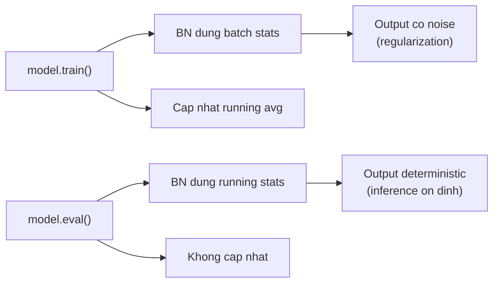

# Buổi 33 — 8.5 Batch Normalization

> [!NOTE] ELI5
> Hãy tưởng tượng bạn đang nấu ăn trong một nhà bếp lớn với nhiều đầu bếp (layers). Đầu bếp đầu tiên chuẩn bị nguyên liệu, rồi chuyển cho đầu bếp thứ hai chế biến tiếp, v.v. Vấn đề là: mỗi lần đầu bếp trước thay đổi cách chuẩn bị (vì đang "học"), đầu bếp sau phải **đoán lại** nguyên liệu mình nhận được trông như thế nào — quá mặn? quá nhạt? Kết quả: cả đội làm chậm vì ai cũng đang "chạy theo" người trước.
>
> **Batch Normalization** = đặt một "thanh tra chất lượng" giữa mỗi đầu bếp. Thanh tra này **chuẩn hóa** mọi nguyên liệu về "vị chuẩn" (mean=0, variance=1) trước khi chuyển tiếp. Nhờ đó, đầu bếp sau luôn nhận nguyên liệu ở trạng thái ổn định — **training nhanh hơn, ổn định hơn**.

---

## 1. Bối cảnh — Tại sao Training mạng sâu lại khó?

> [!NOTE] ELI5
> Mạng 5-10 layers thì train dễ. Nhưng lên 20, 50, 100 layers thì rất khó hội tụ — loss giật lung tung, gradient biến mất hoặc bùng nổ. Batch Normalization là "thần dược" giúp mạng sâu train được bình thường.

**Batch Normalization** (Ioffe & Szegedy, 2015) là kỹ thuật **tăng tốc hội tụ** cho mạng sâu và đã trở thành thành phần **không thể thiếu** trong hầu hết CNN hiện đại. Cùng với Residual connections (Buổi 34), BN giúp huấn luyện được mạng hàng trăm layers.

- **Đây là gì?** Một layer đặc biệt, chèn vào giữa các layers trong mạng, có nhiệm vụ **chuẩn hóa** (normalize) activations về mean=0, variance=1, rồi **scale & shift** lại bằng 2 learnable parameters $\gamma$ (scale) và $\beta$ (shift).
- **Nó làm gì?** Input: tensor activations từ layer trước. Output: tensor cùng shape nhưng đã được chuẩn hóa. Mạng vẫn có khả năng biểu diễn đầy đủ nhờ $\gamma, \beta$ học được.
- **Tại sao cần?** Ba lý do chính:

### 1.1 Lý do 1: Preprocessing bên trong mạng

Ta đã nhiều lần dùng **chuẩn hóa input** (zero mean, unit variance) để làm dữ liệu vào ổn định hơn trước khi train. Nhưng đó chỉ là ở **đầu vào** — còn các **intermediate layers** bên trong mạng thì sao? Activations ở layer thứ 10 có thể có mean=500, variance=0.001; ở layer thứ 11 thì mean=-200, variance=10000.

> [!NOTE] Ôn nhanh: chuẩn hóa input là gì?
> Với mỗi feature đầu vào $x$, ta biến đổi thành:
> $$x' = \frac{x - \mu_{\text{train}}}{\sigma_{\text{train}} + \epsilon}$$
>
> - $\mu_{\text{train}}$: mean của feature trên tập train
> - $\sigma_{\text{train}}$: độ lệch chuẩn trên tập train
> - Mục tiêu: đưa các feature về cùng thang đo để optimizer cập nhật ổn định hơn, giảm hiện tượng feature lớn "lấn át" feature nhỏ.
>
> Điểm mấu chốt: chuẩn hóa input chỉ xử lý **lớp dữ liệu đầu vào**. BN mở rộng ý tưởng này vào **bên trong mạng** bằng cách chuẩn hóa activations sau từng layer.

> [!IMPORTANT] Insight cốt lõi
> Nếu standardize input tốt, tại sao không standardize **mọi intermediate activation** bên trong mạng? Đây chính là ý tưởng nền tảng của Batch Normalization: **preprocessing tại mỗi layer**.

### 1.2 Lý do 2: Ổn định số học (Numerical Stability)

Khi mạng sâu, activations có thể **phân kỳ** (diverge) — giá trị ở layer sâu trở nên cực lớn hoặc cực nhỏ. Điều này gây:

- **Gradient vanishing**: gradient nhỏ dần về 0 → layers gần input không học được gì
- **Gradient exploding**: gradient bùng nổ → weights cập nhật quá lớn → training bất ổn

BN giữ activations trong phạm vi ổn định bằng cách liên tục **kéo chúng về** mean=0, variance=1. Nhờ đó, optimizer (SGD, Adam...) không cần phải "bù" cho sự chênh lệch scale giữa các layers.

### 1.3 Lý do 3: Regularization (tác dụng phụ tích cực)

BN sử dụng **batch statistics** (mean, variance tính trên minibatch hiện tại), không phải trên toàn bộ dataset. Thống kê từ minibatch là **ước lượng nhiễu** (noisy estimate) → đưa nhiễu vào mạng → hoạt động như một dạng **regularization** tương tự [[Dropout]].

> [!TIP] Batch size và regularization
> Batch size 50-100 cho hiệu quả regularization tốt nhất (theo Teye et al., 2018):
>
> - Batch quá lớn → statistics chính xác → ít noise → ít regularization
> - Batch quá nhỏ → statistics quá noisy → phá hỏng tín hiệu hữu ích
> - Batch size **1** → mean = chính giá trị đó → chuẩn hóa thành 0 → **không học được gì!**

---

## 2. Công thức Batch Normalization

> [!NOTE] ELI5
> BN làm 2 bước đơn giản: (1) "Kéo" tất cả activations về "vị trí chuẩn" (giống điều chỉnh cân về 0 trước khi cân), rồi (2) "cho phép mạng tự quyết định" muốn dịch đi đâu bằng 2 nút vặn ($\gamma$ và $\beta$).

**Batch Normalization** (BN) gồm 2 bước:

**Bước 1 — Standardize** (chuẩn hóa): Cho minibatch $\mathcal{B}$ và input $\mathbf{x} \in \mathcal{B}$:

$$\hat{\boldsymbol{\mu}}_\mathcal{B} = \frac{1}{|\mathcal{B}|} \sum_{\mathbf{x} \in \mathcal{B}} \mathbf{x}$$

$$\hat{\boldsymbol{\sigma}}^2_\mathcal{B} = \frac{1}{|\mathcal{B}|} \sum_{\mathbf{x} \in \mathcal{B}} (\mathbf{x} - \hat{\boldsymbol{\mu}}_\mathcal{B})^2$$

$$\hat{\mathbf{x}} = \frac{\mathbf{x} - \hat{\boldsymbol{\mu}}_\mathcal{B}}{\sqrt{\hat{\boldsymbol{\sigma}}^2_\mathcal{B} + \epsilon}}$$

Trong đó $\epsilon > 0$ (thường $10^{-5}$) là hằng số nhỏ để tránh chia cho 0.

**Bước 2 — Scale & Shift** (co giãn và dịch):

$$\mathbf{y} = \boldsymbol{\gamma} \odot \hat{\mathbf{x}} + \boldsymbol{\beta}$$

Trong đó:

- $\boldsymbol{\gamma}$ (**scale parameter**): khởi tạo = 1, **learnable** — cho phép mạng quyết định variance thực tế
- $\boldsymbol{\beta}$ (**shift parameter**): khởi tạo = 0, **learnable** — cho phép mạng quyết định mean thực tế
- $\odot$: phép nhân element-wise

![[assets/attachments/d2l-buoi-33/bn_computation_flow.png]]

> [!question]- Tại sao cần $\gamma$ và $\beta$ sau khi đã chuẩn hóa?
> Nếu chỉ chuẩn hóa (mean=0, variance=1) mà không cho mạng điều chỉnh lại, ta đã **mất đi khả năng biểu diễn**. Ví dụ: nếu layer mong muốn activations tập trung quanh 5 (không phải 0), BN sẽ ép về 0 → phá hỏng.
>
> $\gamma$ và $\beta$ giải quyết vấn đề này: nếu mạng muốn "bỏ" BN, nó có thể học $\gamma = \hat{\sigma}_\mathcal{B}$ và $\beta = \hat{\mu}_\mathcal{B}$ → output **giống hệt input** (identity transformation).
>
> Nói cách khác: BN đặt **default** là "chuẩn hóa", nhưng cho mạng **quyền veto** nếu chuẩn hóa không tốt.

> [!question]- Tại sao có thể bỏ bias $b$ trong Conv/FC trước BN?
> Công thức FC: $\mathbf{h} = \phi(\text{BN}(\mathbf{W}\mathbf{x} + \mathbf{b}))$. Bước đầu tiên của BN là trừ đi mean → bias $\mathbf{b}$ bị **hấp thụ** vào mean rồi bị trừ đi → vô nghĩa. Tham số $\beta$ của BN **thay thế** vai trò của bias.
>
> Vì vậy, khi dùng BN, ta thường set `bias=False` trong Conv2d/Linear → tiết kiệm params.

---

## 3. BN cho Fully Connected vs Convolutional Layers

> [!NOTE] ELI5
> Với FC layer (mỗi neuron có 1 con số), BN tính mean/variance **theo batch** cho từng neuron. Với Conv layer (mỗi channel là 1 bản đồ 2D), BN tính mean/variance **theo batch VÀ theo spatial** cho từng channel — vì ta muốn cùng 1 filter nhìn thấy dữ liệu ổn định ở **mọi vị trí** trên ảnh.

**Đây là gì?** BN hoạt động khác nhau tùy loại layer, vì tensor shape khác nhau:

- **FC layer**: input shape $(N, D)$ — $N$ samples, $D$ features
- **Conv layer**: input shape $(N, C, H, W)$ — $N$ samples, $C$ channels, $H \times W$ spatial

**Sự khác biệt cốt lõi:** tính mean/variance theo **chiều nào?**

### 3.1 Fully Connected Layers — BN trên dim=0

Input shape: $(N, D)$

```
# Tính mean/var theo batch dimension (dim=0)
mean = X.mean(dim=0)          # shape: (D,)
var  = ((X - mean)**2).mean(dim=0)  # shape: (D,)
```

- **Mỗi feature** có riêng 1 mean và 1 variance (tính trên $N$ samples trong batch)
- $\gamma, \beta$ có shape $(D,)$ — mỗi feature 1 cặp scale/shift
- **Tổng BN params cho FC**: $2 \times D$

### 3.2 Convolutional Layers — BN trên dim=(0, 2, 3)

Input shape: $(N, C, H, W)$

```
# Tính mean/var theo batch VÀ spatial dimensions
mean = X.mean(dim=(0, 2, 3), keepdim=True)  # shape: (1, C, 1, 1)
var  = ((X - mean)**2).mean(dim=(0, 2, 3), keepdim=True)  # shape: (1, C, 1, 1)
```

- **Mỗi channel** có riêng 1 mean và 1 variance (tính trên $N \times H \times W$ giá trị)
- $\gamma, \beta$ có shape $(C,)$ — mỗi channel 1 cặp scale/shift
- **Tổng BN params cho Conv**: $2 \times C$

> [!IMPORTANT] Tại sao Conv BN normalize per-channel chứ không per-element?
> Nhớ lại nguyên tắc **translation invariance** (Buổi 26): một con mèo ở góc trái hay góc phải đều là con mèo. Filter (channel) phải phản hồi giống nhau ở mọi vị trí → mean/variance phải **chung** cho toàn bộ spatial dimensions trong cùng 1 channel.
>
> Nếu normalize per-element (mỗi pixel riêng), ta sẽ phá vỡ translation invariance!

![[assets/attachments/d2l-buoi-33/bn_fc_vs_conv.png]]

### 3.3 So sánh BN for FC vs Conv

| Tiêu chí                     | FC Layer               | Conv Layer                           |
| ---------------------------- | ---------------------- | ------------------------------------ |
| **Input shape**              | $(N, D)$               | $(N, C, H, W)$                       |
| **Normalize theo**           | dim=0 (batch)          | dim=(0,2,3) (batch + spatial)        |
| **Số nghĩa thống kê**        | $D$ means, $D$ vars    | $C$ means, $C$ vars                  |
| **Số values để tính 1 mean** | $N$                    | $N \times H \times W$                |
| **Learnable params**         | $2D$ ($\gamma, \beta$) | $2C$ ($\gamma, \beta$)               |
| **Lý do**                    | Mỗi feature 1 scale    | Translation invariance → per-channel |

---

## 4. Layer Normalization — So sánh với BN

> [!NOTE] ELI5
> Batch Normalization tính thống kê **qua batch** (gộp nhiều ảnh để tính mean). Layer Normalization tính thống kê **trong 1 ảnh** (gộp tất cả features/channels của chính ảnh đó). LN không cần batch → hoạt động với batch size 1 → rất phù hợp cho Transformers/RNNs.

**Layer Normalization** (Ba et al., 2016) là biến thể quan trọng của BN:

- **Batch Norm**: normalize **across batch** (dùng batch statistics) → phụ thuộc batch size, khác nhau giữa training và inference
- **Layer Norm**: normalize **within one sample** (dùng statistics của 1 sample) → **không phụ thuộc batch**, giống nhau giữa training và inference

**Công thức Layer Norm** cho vector $\mathbf{x}$ $n$-chiều:

$$\mathbf{x} \to \text{LN}(\mathbf{x}) = \frac{\mathbf{x} - \hat{\mu}}{\hat{\sigma}}$$

Trong đó $\hat{\mu} = \frac{1}{n}\sum_{i=1}^{n}x_i$ và $\hat{\sigma}^2 = \frac{1}{n}\sum_{i=1}^{n}(x_i - \hat{\mu})^2$ (tính trên 1 observation).

| Tiêu chí                  | Batch Norm            | Layer Norm                                                       |
| ------------------------- | --------------------- | ---------------------------------------------------------------- |
| **Tính mean/var trên**    | Batch (nhiều samples) | 1 sample (tất cả features)                                       |
| **Phụ thuộc batch size**  | Co                    | Khong                                                            |
| **Training vs Inference** | Khac nhau             | Giong nhau                                                       |
| **Batch size 1**          | Khong hoat dong       | Hoat dong binh thuong                                            |
| **Dùng phổ biến ở**       | CNN                   | **Transformer**, RNN                                             |
| **Scale-independent**     | Khong                 | Co ($\text{LN}(\alpha\mathbf{x}) \approx \text{LN}(\mathbf{x})$) |

> [!TIP] Khi nào dùng BN vs LN?
>
> - **CNN trên ảnh** → dùng **Batch Norm** (batch thường đủ lớn, translation invariance quan trọng)
> - **Transformer, RNN, NLP** → dùng **Layer Norm** (sequence length thay đổi, batch size nhỏ, cần deterministic behavior)
> - **Cả hai** → **thử cả hai** và so sánh (không có quy tắc tuyệt đối)

---

## 5. Training vs Prediction — Hai chế độ hoạt động

> [!NOTE] ELI5
> Khi training, BN dùng mean/variance **của batch hiện tại** (noisy, nhưng tốt cho regularization). Khi inference (dự đoán trên 1 ảnh mới), không có batch → BN dùng **running average** của mean/variance đã thu thập suốt quá trình training.

Đây là điểm giống giữa BN và [[Dropout]]: cả hai **hoạt động khác nhau** ở training mode vs eval mode.

### 5.1 Training mode (`model.train()`)

```python
# Sử dụng batch statistics
mean = X.mean(dim=...)           # tính trên minibatch hiện tại
var  = ((X - mean)**2).mean(dim=...)

# Cập nhật running statistics (exponential moving average)
moving_mean = (1 - momentum) * moving_mean + momentum * mean
moving_var  = (1 - momentum) * moving_var  + momentum * var
```

- Mean/variance tính **trên minibatch đang train**
- **Cập nhật** running statistics (moving average) để dùng khi inference
- `momentum` thường = 0.1 (PyTorch default), tức mỗi step cập nhật 10% từ batch mới

### 5.2 Prediction mode (`model.eval()`)

```python
# Sử dụng running statistics (đã tích lũy từ training)
X_hat = (X - moving_mean) / torch.sqrt(moving_var + eps)
Y = gamma * X_hat + beta
```

- Mean/variance dùng **running statistics** đã tích lũy
- **Deterministic**: cùng input → luôn cùng output (khác training mode: kết quả phụ thuộc batch)
- **Phải gọi `model.eval()`** trước inference, nếu không BN sẽ dùng batch statistics → kết quả sai!

> [!WARNING] Lỗi phổ biến: quên `model.eval()`
> Nếu quên chuyển sang eval mode khi inference:
>
> 1. BN sẽ tính mean/var trên batch **test** thay vì dùng running stats
> 2. Nếu batch test chỉ có 1 sample → BN normalize thành 0 → output vô nghĩa
> 3. Running stats tiếp tục bị cập nhật bởi test data → "ô nhiễm" model



---

## 6. Implementation from Scratch

> [!NOTE] ELI5
> Ta sẽ tự viết BN từ đầu để hiểu cơ chế bên trong — rồi so sánh với `nn.BatchNorm2d` của PyTorch (chỉ khác ở tốc độ, kết quả giống).

### 6.1 Hàm `batch_norm` — core algorithm

```python
import torch
from torch import nn
from torch.nn import functional as F

def batch_norm(X, gamma, beta, moving_mean, moving_var, eps, momentum):
    """Core Batch Normalization calculation.

    Args:
        X: input tensor, shape (N, D) cho FC hoặc (N, C, H, W) cho Conv
        gamma: scale parameter (learnable)
        beta: shift parameter (learnable)
        moving_mean: running mean (không phải model param)
        moving_var: running variance (không phải model param)
        eps: epsilon tránh chia 0 (thường 1e-5)
        momentum: hệ số cập nhật running stats (thường 0.1)

    Returns:
        Y: output cùng shape với X
        moving_mean: updated running mean
        moving_var: updated running variance
    """
    if not torch.is_grad_enabled():
        # ═══ PREDICTION MODE ═══
        # Dùng running statistics (đã tích lũy từ training)
        X_hat = (X - moving_mean) / torch.sqrt(moving_var + eps)
    else:
        # ═══ TRAINING MODE ═══
        assert len(X.shape) in (2, 4)

        if len(X.shape) == 2:
            # FC layer: tính mean/var theo dim=0 (batch)
            mean = X.mean(dim=0)
            var = ((X - mean) ** 2).mean(dim=0)
        else:
            # Conv layer: tính mean/var theo dim=(0,2,3) (batch + spatial)
            mean = X.mean(dim=(0, 2, 3), keepdim=True)
            var = ((X - mean) ** 2).mean(dim=(0, 2, 3), keepdim=True)

        # Standardize
        X_hat = (X - mean) / torch.sqrt(var + eps)

        # Cập nhật running statistics (exponential moving average)
        moving_mean = (1.0 - momentum) * moving_mean + momentum * mean
        moving_var  = (1.0 - momentum) * moving_var  + momentum * var

    # Scale & Shift (learnable)
    Y = gamma * X_hat + beta
    return Y, moving_mean.data, moving_var.data
```

> [!question]- Tại sao `keepdim=True` chỉ cần cho Conv mà không cần cho FC?
> Với Conv: input $(N, C, H, W)$, mean tính trên dim=(0,2,3) → shape $(C,)$. Nhưng để trừ `X - mean` cần broadcasting → mean phải có shape $(1, C, 1, 1)$ → cần `keepdim=True`.
>
> Với FC: input $(N, D)$, mean tính trên dim=0 → shape $(D,)$. Trừ `X - mean` broadcast tự nhiên (mỗi sample $D$-dim trừ vector $D$-dim) → không cần `keepdim`.

### 6.2 Class `BatchNorm` — module hoàn chỉnh

```python
class BatchNorm(nn.Module):
    """Batch Normalization layer.

    Args:
        num_features: số features (FC) hoặc số output channels (Conv)
        num_dims: 2 cho FC, 4 cho Conv
    """
    def __init__(self, num_features, num_dims):
        super().__init__()
        if num_dims == 2:
            shape = (1, num_features)      # FC: (1, D)
        else:
            shape = (1, num_features, 1, 1) # Conv: (1, C, 1, 1)

        # ═══ LEARNABLE PARAMETERS ═══
        self.gamma = nn.Parameter(torch.ones(shape))   # scale, init=1
        self.beta  = nn.Parameter(torch.zeros(shape))  # shift, init=0

        # ═══ NON-LEARNABLE BUFFERS ═══
        # Không phải model params → không tham gia gradient
        self.moving_mean = torch.zeros(shape)
        self.moving_var  = torch.ones(shape)

    def forward(self, X):
        # Di chuyển buffers sang cùng device với X
        if self.moving_mean.device != X.device:
            self.moving_mean = self.moving_mean.to(X.device)
            self.moving_var = self.moving_var.to(X.device)

        Y, self.moving_mean, self.moving_var = batch_norm(
            X, self.gamma, self.beta,
            self.moving_mean, self.moving_var,
            eps=1e-5, momentum=0.1)
        return Y
```

**Phân tích params:**

| Parameter     | Vai trò          | Learnable?     | Init | Shape                        |
| ------------- | ---------------- | -------------- | ---- | ---------------------------- |
| $\gamma$      | Scale            | Co (gradient)  | 1    | $(1, C, 1, 1)$ hoặc $(1, D)$ |
| $\beta$       | Shift            | Co (gradient)  | 0    | $(1, C, 1, 1)$ hoặc $(1, D)$ |
| `moving_mean` | Running mean     | Khong (buffer) | 0    | $(1, C, 1, 1)$ hoặc $(1, D)$ |
| `moving_var`  | Running variance | Khong (buffer) | 1    | $(1, C, 1, 1)$ hoặc $(1, D)$ |

> [!TIP] Tại sao gamma init=1, beta init=0?
> Khi init: $\gamma=1, \beta=0$ → $\mathbf{y} = 1 \cdot \hat{\mathbf{x}} + 0 = \hat{\mathbf{x}}$ → BN **bắt đầu** bằng việc chỉ standardize input.
> Trong quá trình training, mạng **tự học** $\gamma, \beta$ tối ưu — có thể giữ nguyên standardization hoặc "undo" nó nếu cần.

---

## 7. LeNet với Batch Normalization

> [!NOTE] ELI5
> Ta chèn BN **sau mỗi Conv/FC** nhưng **trước activation function** (Sigmoid/ReLU). Kết quả: training nhanh hơn và ổn định hơn — có thể dùng learning rate cao hơn.

**Vị trí chèn BN:** Theo paper gốc (Ioffe & Szegedy, 2015), BN được đặt **sau affine transformation** (Conv/FC) nhưng **trước nonlinear activation** (ReLU/Sigmoid):

$$\mathbf{h} = \phi(\text{BN}(\mathbf{W}\mathbf{x}))$$

Tức là: **Linear → BN → Activation** (không phải Linear → Activation → BN).

### 7.1 BNLeNet — Implementation

```python
class BNLeNet(nn.Module):
    """LeNet với Batch Normalization ở mọi layer."""
    def __init__(self, num_classes=10):
        super().__init__()
        self.net = nn.Sequential(
            # ═══ CONV BLOCK 1 ═══
            nn.LazyConv2d(6, kernel_size=5),
            BatchNorm(6, num_dims=4),          # BN cho Conv (4D)
            nn.Sigmoid(),
            nn.AvgPool2d(kernel_size=2, stride=2),

            # ═══ CONV BLOCK 2 ═══
            nn.LazyConv2d(16, kernel_size=5),
            BatchNorm(16, num_dims=4),         # BN cho Conv (4D)
            nn.Sigmoid(),
            nn.AvgPool2d(kernel_size=2, stride=2),

            # ═══ FLATTEN ═══
            nn.Flatten(),

            # ═══ FC BLOCK 1 ═══
            nn.LazyLinear(120),
            BatchNorm(120, num_dims=2),        # BN cho FC (2D)
            nn.Sigmoid(),

            # ═══ FC BLOCK 2 ═══
            nn.LazyLinear(84),
            BatchNorm(84, num_dims=2),         # BN cho FC (2D)
            nn.Sigmoid(),

            # ═══ OUTPUT ═══
            nn.LazyLinear(num_classes)         # Không có BN ở output!
        )

    def forward(self, x):
        return self.net(x)
```

> [!question]- Tại sao không đặt BN **sau** output layer?
> Output layer cho ra **logits** (unnormalized scores cho từng class). Nếu BN normalize logits về mean=0, variance=1, ta sẽ phá hỏng **calibration** của mô hình — xác suất sau softmax sẽ bị méo. BN chỉ đặt ở **hidden layers**.

### 7.2 Training BNLeNet trên Fashion-MNIST

```python
from torchvision import datasets, transforms
from torch.utils.data import DataLoader

transform = transforms.Compose([
    transforms.ToTensor(),
])

train_data = datasets.FashionMNIST('./data', train=True,
                                    download=True, transform=transform)
test_data  = datasets.FashionMNIST('./data', train=False,
                                    transform=transform)
train_loader = DataLoader(train_data, batch_size=128, shuffle=True)
test_loader  = DataLoader(test_data, batch_size=128)

device = torch.device('cuda' if torch.cuda.is_available() else 'cpu')
model = BNLeNet().to(device)

def init_weights(m):
    if isinstance(m, (nn.Conv2d, nn.Linear)):
        nn.init.xavier_uniform_(m.weight)
model.apply(init_weights)

optimizer = torch.optim.SGD(model.parameters(), lr=0.1)  # lr cao hơn nhờ có BN!

EPOCHS = 10
for epoch in range(EPOCHS):
    model.train()  # ← QUAN TRỌNG: bật training mode cho BN
    total_loss, correct, total = 0, 0, 0
    for X, y in train_loader:
        X, y = X.to(device), y.to(device)
        y_hat = model(X)
        loss = F.cross_entropy(y_hat, y)
        optimizer.zero_grad()
        loss.backward()
        optimizer.step()
        total_loss += loss.item() * y.size(0)
        correct += (y_hat.argmax(1) == y).sum().item()
        total += y.size(0)

    model.eval()  # ← QUAN TRỌNG: bật eval mode cho BN
    test_correct = 0
    with torch.no_grad():
        for X, y in test_loader:
            X, y = X.to(device), y.to(device)
            test_correct += (model(X).argmax(1) == y).sum().item()

    print(f"Epoch {epoch+1:2d} | "
          f"Loss: {total_loss/total:.4f} | "
          f"Train: {correct/total*100:.1f}% | "
          f"Test: {test_correct/len(test_data)*100:.1f}%")
```

> [!TIP] Phân tích hiệu quả BN trên LeNet
>
> 1. **Learning rate cao hơn**: LeNet gốc (Buổi 28) dùng lr=0.01. Với BN → có thể dùng **lr=0.1** (gấp 10x!) mà vẫn ổn định.
> 2. **Hội tụ nhanh hơn**: Đạt ~90% test accuracy sớm hơn nhiều so với không có BN.
> 3. **Training ổn định hơn**: Loss giảm đều, ít giật (jitter) hơn.

### 7.3 Kiểm tra $\gamma$ và $\beta$ sau training

```python
# Xem gamma và beta của BN layer đầu tiên (sau Conv 1)
gamma_1 = model.net[1].gamma.reshape((-1,))
beta_1  = model.net[1].beta.reshape((-1,))

print(f"gamma (layer 1): {gamma_1.data}")
print(f"beta  (layer 1): {beta_1.data}")
```

Kết quả điển hình:

```
gamma (layer 1): tensor([1.43, 1.99, 1.86, 2.07, 2.05, 1.89])
beta  (layer 1): tensor([ 0.74, -1.35, -0.26, -1.00, -0.30,  1.31])
```

**Phân tích:**

- $\gamma$ **khác 1** → mạng đã học rằng standardization **cần điều chỉnh** scale cho từng channel
- $\beta$ **khác 0** → mạng đã học rằng activations **không nên** center tại 0 — mỗi channel cần offset khác nhau
- Giá trị $\gamma > 1$ cho thấy BN đã "cho phép" variance lớn hơn 1 ở một số channels — có lẽ những channels này chứa features quan trọng cần phạm vi rộng hơn

---

## 8. Concise Implementation — Dùng PyTorch API

> [!NOTE] ELI5
> PyTorch đã tích hợp sẵn BN: `nn.BatchNorm2d` cho Conv, `nn.BatchNorm1d` cho FC. Code ngắn hơn và chạy nhanh hơn (compiled C++/CUDA). Kết quả giống hệt bản scratch.

```python
class BNLeNetConcise(nn.Module):
    """LeNet + BN dùng PyTorch built-in BatchNorm."""
    def __init__(self, num_classes=10):
        super().__init__()
        self.net = nn.Sequential(
            nn.LazyConv2d(6, kernel_size=5),
            nn.LazyBatchNorm2d(),    # ← Thay BatchNorm(6, 4)
            nn.Sigmoid(),
            nn.AvgPool2d(kernel_size=2, stride=2),

            nn.LazyConv2d(16, kernel_size=5),
            nn.LazyBatchNorm2d(),    # ← Tự suy luận num_features
            nn.Sigmoid(),
            nn.AvgPool2d(kernel_size=2, stride=2),

            nn.Flatten(),
            nn.LazyLinear(120),
            nn.LazyBatchNorm1d(),    # ← Cho FC layer
            nn.Sigmoid(),

            nn.LazyLinear(84),
            nn.LazyBatchNorm1d(),
            nn.Sigmoid(),

            nn.LazyLinear(num_classes)
        )

    def forward(self, x):
        return self.net(x)
```

**So sánh scratch vs concise:**

| Tiêu chí                  | Scratch (tự viết)          | Concise (PyTorch)                       |
| ------------------------- | -------------------------- | --------------------------------------- |
| **Cần chỉ định**          | `num_features`, `num_dims` | Tự suy luận (Lazy)                      |
| **Tốc độ**                | Python interpreted         | C++/CUDA compiled (**nhanh hơn nhiều**) |
| **Kết quả toán học**      | Giống nhau                 | Giống nhau                              |
| **Sử dụng trong thực tế** | Không (chỉ để học)         | **Luôn dùng cách này**                  |
| **API**                   | `BatchNorm(6, num_dims=4)` | `nn.LazyBatchNorm2d()`                  |

---

## 9. Discussion

### 9.1 BN thực sự hoạt động vì lý do gì?

Paper gốc (Ioffe & Szegedy, 2015) giải thích BN hoạt động nhờ giảm **"Internal Covariate Shift"** — sự thay đổi phân phối của activations ở intermediate layers khi weights được cập nhật. Tuy nhiên, giải thích này đã bị **phản bác** mạnh mẽ:

- **Santurkar et al. (2018)** chứng minh BN thực ra **không** giảm internal covariate shift — và thậm chí hoạt động tốt dù có covariate shift.
- **Ali Rahimi (NeurIPS 2017)** so sánh deep learning với "alchemy" (giả kim thuật) — dùng internal covariate shift làm ví dụ tiêu biểu cho việc DL thiếu lý thuyết vững chắc.

**Giải thích được chấp nhận rộng rãi hơn hiện nay:**

1. **Landscape smoothing**: BN làm **loss landscape mượt hơn** (gradients biến đổi nhẹ nhàng hơn) → optimizer đi theo hướng tốt hơn (Santurkar et al., 2018)
2. **Implicit regularization**: Noise từ batch statistics hoạt động như regularization (tương tự Dropout)
3. **Scale stabilization**: BN ngăn activations phân kỳ → cho phép lr cao hơn → hội tụ nhanh hơn

> [!WARNING] Internal Covariate Shift — Tên đúng nhưng giải thích sai
> Thuật ngữ "Internal Covariate Shift" đã trở nên phổ biến đến mức mọi người vẫn sử dụng nó, nhưng cần hiểu rằng giải thích ban đầu **chưa được chứng minh** là cơ chế thực sự. d2l.ai nhấn mạnh: "we must be careful to distinguish between speculative intuitions and true explanations."

### 9.2 BN trong các mạng hiện đại

| Mạng                          | Sử dụng BN? | Ghi chú                              |
| ----------------------------- | ----------- | ------------------------------------ |
| **AlexNet** (2012)            | Khong       | Chưa có BN                           |
| **VGG** (2014)                | Khong       | Chưa có BN                           |
| **GoogLeNet v1** (2014)       | Khong       | Dùng auxiliary classifiers thay      |
| **GoogLeNet v2** (2015)       | **Co**      | Cùng nhóm tác giả! (Ioffe & Szegedy) |
| **ResNet** (2015)             | **Co**      | BN là thành phần cốt yếu             |
| **DenseNet** (2017)           | **Co**      | BN-ReLU-Conv pattern                 |
| **EfficientNet** (2019)       | **Co**      | Kết hợp BN + Swish                   |
| **Vision Transformer** (2020) | **Khong**   | Dùng **Layer Norm** thay             |
| **ConvNeXt** (2022)           | **Khong**   | Dùng **Layer Norm** thay (theo ViT)  |

> [!TIP] Xu hướng mới nhất
> Xu hướng hiện đại (2022+) đang **từ bỏ BN** theo hướng dùng **Layer Normalization** cho cả CNN (ConvNeXt). Lý do: LN đơn giản hơn (không phụ thuộc batch size, không cần mode train/eval khác nhau), và thực nghiệm cho thấy hiệu quả tương đương hoặc tốt hơn khi kết hợp với các kỹ thuật thiết kế hiện đại.
>
> Tuy nhiên, BN vẫn là **default** cho CNN cổ điển (ResNet, EfficientNet) và vẫn xuất hiện trong phần lớn production models.

### 9.3 Tóm tắt các điểm thực tiễn

1. BN **liên tục chuẩn hóa** intermediate activations về mean/variance ổn định → mạng train ổn định hơn
2. BN cho FC khác Conv: FC normalize per-feature (dim=0), Conv normalize **per-channel** (dim=0,2,3)
3. BN có **2 chế độ**: training (dùng batch stats + cập nhật running stats) vs inference (dùng running stats)
4. BN vừa **tăng tốc** (cho phép lr cao hơn) vừa **regularize** (noise từ batch stats)
5. Nếu mô hình cần **robust** hơn trước input perturbation, cân nhắc **bỏ BN** (Wang et al., 2022)

---

## 10. Exercises (từ d2l.ai)

1. **Bỏ bias trước BN?** Có nên bỏ bias parameter trong Conv/FC layer ngay trước BN? Tại sao?

2. **So sánh learning rates**: Train LeNet **có** và **không có** BN:
   - (a) Plot validation accuracy qua epochs
   - (b) Learning rate tối đa trước khi diverge? (LeNet gốc vs BNLeNet)

3. **BN ở mọi layer?** Thử chỉ đặt BN ở một số layers (chỉ Conv, hoặc chỉ FC). Có cần BN ở mọi layer không?

4. **"Lite" BN**: Implement 2 phiên bản:
   - (a) Chỉ trừ mean (không chia std)
   - (b) Chỉ chia std (không trừ mean)
   - So sánh: phiên bản nào quan trọng hơn?

5. **Fix $\gamma$ và $\beta$**: Không cho $\gamma, \beta$ train (freeze). Kết quả thay đổi thế nào?

6. **BN thay Dropout?** Thay Dropout bằng BN. Behavior thay đổi ra sao?

---

## Từ điển thuật ngữ

| Thuật ngữ                      | Nghĩa tiếng Việt          | Chi tiết                                                                           |
| ------------------------------ | ------------------------- | ---------------------------------------------------------------------------------- |
| **Batch Normalization**        | Chuẩn hóa theo batch      | Normalize activations trên minibatch, sau đó scale/shift bằng learnable params     |
| **Internal Covariate Shift**   | Dịch chuyển hiệp biến nội | (Giải thích gốc, bị tranh cãi) Phân phối activations thay đổi khi weights cập nhật |
| **Scale parameter ($\gamma$)** | Tham số tỉ lệ             | Learnable, init=1, scale đầu ra sau standardization                                |
| **Shift parameter ($\beta$)**  | Tham số dịch              | Learnable, init=0, dịch trung bình sau standardization                             |
| **Moving average**             | Trung bình trượt          | Running statistics tích lũy qua training, dùng khi inference                       |
| **Momentum** (BN context)      | Hệ số cập nhật            | Tỉ lệ cập nhật running stats mỗi step (thường 0.1)                                 |
| **Layer Normalization**        | Chuẩn hóa theo layer      | Normalize trên tất cả features **trong 1 sample**, không phụ thuộc batch           |
| **Standardize**                | Chuẩn hóa                 | Biến đổi về mean=0, variance=1                                                     |
| **Epsilon ($\epsilon$)**       | Hằng số ổn định           | Giá trị nhỏ (thường $10^{-5}$) thêm vào variance để tránh chia 0                   |
| **Per-channel normalization**  | Chuẩn hóa theo kênh       | Trong Conv: mỗi channel có riêng mean/var, tính trên batch + spatial               |
| **Buffer**                     | Bộ đệm                    | Biến không tham gia gradient (`moving_mean`, `moving_var`)                         |
| **Landscape smoothing**        | Làm mượt bề mặt loss      | Giải thích hiện đại cho BN: loss surface trở nên mượt hơn → optimize dễ hơn        |

---

## Bài tự kiểm tra

1. Batch Normalization normalize theo chiều nào ở FC layer? Ở Conv layer? Tại sao khác nhau?
2. BN có bao nhiêu learnable parameters per layer? Chúng init bằng bao nhiêu?
3. BN hoạt động khác nhau thế nào ở training mode vs eval mode?
4. Tại sao có thể bỏ bias trong Conv/FC layer khi dùng BN?
5. Tại sao BN cho phép dùng learning rate **cao hơn**?
6. So sánh Batch Norm vs Layer Norm: khi nào dùng cái nào?
7. Tại sao BN không hoạt động với batch size 1?
8. Nêu 2 lợi ích và 1 hạn chế của BN.

> [!NOTE]- Đáp án gợi ý
>
> 1. **FC**: normalize theo dim=0 (across batch, per-feature). **Conv**: normalize theo dim=(0,2,3) (across batch + spatial, per-channel). Khác nhau vì Conv cần **translation invariance** — cùng filter phải "nhìn" dữ liệu ổn định ở mọi vị trí spatial.
> 2. **2 learnable params per layer**: $\gamma$ (scale, init=1) và $\beta$ (shift, init=0). Shape: $(C,)$ cho Conv, $(D,)$ cho FC. Ngoài ra có 2 buffers (moving_mean, moving_var) nhưng không learnable.
> 3. **Training**: dùng batch statistics (noisy), cập nhật running stats. **Eval**: dùng running stats (deterministic), không cập nhật. Phải gọi `model.eval()` trước inference!
> 4. BN trừ mean → bias bị hấp thụ vào mean rồi trừ đi → vô nghĩa. $\beta$ của BN thay thế bias.
> 5. BN giữ activations ổn định (mean~0, var~1) → gradients không bùng nổ dù lr cao → optimizer ổn định hơn.
> 6. **BN**: dùng cho CNN (batch đủ lớn, cần translation invariance). **LN**: dùng cho Transformer/RNN (batch nhỏ, sequence length thay đổi, cần deterministic). LN không phụ thuộc batch size.
> 7. Batch size 1: mean = chính giá trị đó → chuẩn hóa = 0 → mọi activation = 0 → mạng không học được.
> 8. **Lợi ích**: (a) tăng tốc hội tụ (cho phép lr cao hơn), (b) regularization tự nhiên (noise từ batch statistics). **Hạn chế**: phụ thuộc batch size (batch nhỏ → noisy statistics → kém hiệu quả), hành vi khác nhau giữa train/eval gây nhầm lẫn.

---

## Liên kết

- **Buổi trước**: [[Buổi 32 - Tuần 8]] — 8.4 GoogLeNet (Inception)
- **Buổi sau**: [[Buổi 34 - Tuần 9]] — 8.6 Residual Networks (ResNet)
- **Concepts**: [[Activation Function]], [[Dropout]], [[Batch Normalization]]
- **Source**: [d2l.ai — 8.5 Batch Normalization](https://d2l.ai/chapter_convolutional-modern/batch-norm.html)
