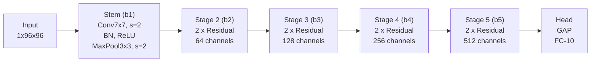

# Buổi 34 — 8.6 Residual Networks (ResNet) and ResNeXt

> **Nguồn:** [d2l.ai — 8.6](https://d2l.ai/chapter_convolutional-modern/resnet.html)
> **Buổi trước:** [[Buổi 33 - Tuần 9]] — Batch Normalization
> **Buổi sau:** [[Buổi 35 - Tuần 9]] — DenseNet

---

## Mục tiêu buổi học

1. Hiểu **Degradation Problem** — tại sao mạng sâu hơn lại có thể tệ hơn mạng nông
2. Nắm vững lý thuyết **Function Classes lồng nhau** — nền tảng toán học của ResNet
3. Hiểu cơ chế **Residual Block** và **Skip Connection** — giải pháp cho gradient flow
4. Triển khai **ResNet-18** từ đầu bằng PyTorch
5. Làm quen với **ResNeXt** — mở rộng ResNet bằng grouped convolution

---

## 1. Bối cảnh: Tại sao mạng sâu hơn lại tệ hơn?

> [!NOTE] ELI5
> Hãy tưởng tượng bạn đang xây một tòa nhà. Theo lý thuyết, thêm tầng thì tòa nhà mạnh hơn vì nó có thêm phòng để chứa đồ. Nhưng thực tế, nếu bạn cứ xây thêm tầng mà không có **thang máy** (elevator), thì người ở tầng 50 không thể giao tiếp với tầng 1. Thông tin bị "mất" trên đường đi. **Skip connection** chính là cái thang máy đó — nó cho phép thông tin "đi tắt" từ tầng dưới lên tầng trên mà không bị biến dạng.

**Residual Connection (Skip Connection)** là kỹ thuật cho phép input của một block được **cộng trực tiếp** vào output, thay vì buộc toàn bộ thông tin phải đi qua tất cả các layers. Cụ thể:

- **Input:** Tensor $\mathbf{x}$ (activations từ layer trước)
- **Output:** $f(\mathbf{x}) = g(\mathbf{x}) + \mathbf{x}$, trong đó $g(\mathbf{x})$ là phần mạng phải học (2 conv layers)
- **Giải quyết:** Degradation problem — hiện tượng mạng sâu hơn lại cho training error **cao hơn** mạng nông

### 1.1 Degradation Problem — Bằng chứng thực nghiệm

Trước ResNet (2015), cộng đồng deep learning đã quan sát thấy một nghịch lý:

| Số layers | Training error | Test error | Kỳ vọng |
|-----------|---------------|------------|---------|
| 20 layers | Thấp | Thấp | Baseline |
| 56 layers | **Cao hơn** 20 layers | **Cao hơn** 20 layers | Thấp hơn 20 layers |

> [!IMPORTANT] Đây KHÔNG phải overfitting!
> Nếu là overfitting, **training error** phải **thấp** trong khi test error cao. Nhưng ở đây, cả **training error lẫn test error đều tăng** khi thêm layers. Vấn đề nằm ở chỗ mạng đã **không thể tối ưu hóa** (optimization difficulty), không phải do mô hình quá phức tạp.

**Nguyên nhân gốc rễ:** Khi mạng rất sâu:

1. **Vanishing/Exploding Gradients**: Gradient phải nhân qua hàng chục ma trận khi backprop. Nếu mỗi ma trận có eigenvalue < 1, gradient "teo" dần → layers đầu không cập nhật được. Ngược lại nếu > 1 thì gradient "nổ".
2. **Optimization landscape phức tạp**: Thêm layers làm loss surface trở nên gồ ghề hơn, optimizer dễ bị kẹt ở local minima hoặc saddle points.
3. **Identity mapping khó học**: Nếu một layer "thừa" (mạng đã đủ sâu), lý tưởng nhất là nó nên học $f(\mathbf{x}) = \mathbf{x}$ (identity). Nhưng tối ưu hóa một hàm phi tuyến phức tạp để ra identity là **rất khó**.

### 1.2 Function Classes — Nền tảng toán học

Để hiểu tại sao thêm layers không đảm bảo tốt hơn, ta cần xem xét khái niệm **function class** (lớp hàm).

> [!NOTE] ELI5
> Function class giống như một "bộ sưu tập" các hàm mà một kiến trúc mạng có thể biểu diễn. Mạng 20 layers có bộ sưu tập $\mathcal{F}_1$, mạng 56 layers có bộ sưu tập $\mathcal{F}_2$. Câu hỏi quan trọng: $\mathcal{F}_1$ có **nằm bên trong** $\mathcal{F}_2$ không? Nếu không, thì mạng lớn hơn chưa chắc đã tốt hơn!

Gọi $\mathcal{F}$ là tập hợp tất cả các hàm mà một kiến trúc mạng cụ thể có thể biểu diễn. Gọi $f^*$ là hàm "lý tưởng" (truth function) mà ta muốn tìm. Ta tìm:

$$f^*_{\mathcal{F}} = \underset{f \in \mathcal{F}}{\arg\min} \; L(\mathbf{X}, \mathbf{y}, f)$$

Nếu ta thiết kế kiến trúc mạnh hơn $\mathcal{F}'$, ta **kỳ vọng** $f^*_{\mathcal{F}'}$ tốt hơn $f^*_{\mathcal{F}}$. Nhưng điều này **chỉ đúng khi** $\mathcal{F} \subseteq \mathcal{F}'$ (nested / lồng nhau).

![[assets/attachments/d2l-buoi-34/resnet_function_classes.png]]
*Hình 1: Non-nested vs Nested function classes. ResNet đảm bảo nesting bằng cách cho phép layer mới học identity function.*

**Hai trường hợp:**

| | Non-nested ($\mathcal{F} \not\subseteq \mathcal{F}'$) | Nested ($\mathcal{F} \subseteq \mathcal{F}'$) |
|---|---|---|
| **Thêm layers** | Có thể tốt hơn HOẶC tệ hơn | Luôn tốt hơn hoặc bằng |
| **Ví dụ** | $\mathcal{F}_3$ gần $f^*$ nhưng $\mathcal{F}_6$ xa hơn | $\mathcal{F}_6 \supseteq \mathcal{F}_5 \supseteq \cdots \supseteq \mathcal{F}_1$ |
| **Đảm bảo** | Không có | $f^*_{\mathcal{F}_6} \leq f^*_{\mathcal{F}_5} \leq \cdots$ |

> [!IMPORTANT] Insight then chốt
> Để **đảm bảo nesting**, ta cần kiến trúc mà khi thêm layers, mô hình mới **ít nhất cũng biểu diễn được** mọi thứ mô hình cũ có thể. Cách dễ nhất: cho phép layer mới dễ dàng học **identity function** $f(\mathbf{x}) = \mathbf{x}$. Nếu layer mới = identity → mạng mới = mạng cũ → ít nhất không tệ hơn.

---

## 2. Residual Block — Giải pháp

### 2.1 Ý tưởng cốt lõi: Học phần dư thay vì học trực tiếp

> [!NOTE] ELI5
> Thay vì bắt mạng học "một bức tranh hoàn chỉnh" $f(\mathbf{x})$, ta bảo nó chỉ cần **vẽ thêm phần khác biệt** $g(\mathbf{x})$ so với bức ảnh gốc $\mathbf{x}$. Nếu bức ảnh gốc đã hoàn hảo rồi, mạng chỉ cần vẽ thêm $g(\mathbf{x}) = 0$ (không vẽ gì cả) — điều này **dễ hơn nhiều** so với học $f(\mathbf{x}) = \mathbf{x}$ trực tiếp.

Trong một **regular block** (trái hình dưới):
- Mạng phải học trực tiếp ánh xạ $f(\mathbf{x})$
- Để layer "thừa" không gây hại, cần $f(\mathbf{x}) = \mathbf{x}$ → khó tối ưu

Trong một **residual block** (phải hình dưới):
- Mạng chỉ cần học **phần dư** (residual) $g(\mathbf{x}) = f(\mathbf{x}) - \mathbf{x}$
- Output cuối cùng: $f(\mathbf{x}) = g(\mathbf{x}) + \mathbf{x}$
- Để layer "thừa": chỉ cần $g(\mathbf{x}) = 0$ → **đẩy tất cả weights về 0** — dễ hơn rất nhiều!

![[assets/attachments/d2l-buoi-34/resnet_residual_block.png]]
*Hình 2: Regular block (trái) phải học f(x) trực tiếp. Residual block (phải) chỉ học phần dư g(x) = f(x) - x, với skip connection mang x qua.*

### 2.2 Cấu trúc chi tiết của Residual Block

Mỗi residual block trong ResNet bao gồm:

```
Input x
  |
  |---> Conv 3x3 --> BN --> ReLU --> Conv 3x3 --> BN ---> (+) ---> ReLU ---> Output
  |                                                       ^
  |                                                       |
  +------- Skip Connection (identity hoặc 1x1 conv) -----+
```

**Hai loại Residual Block:**

#### Loại 1: Identity Shortcut (khi input và output cùng shape)

```python
# use_1x1conv=False: Input shape == Output shape
Y = ReLU(BN(Conv3x3(x)))    # Conv đầu tiên
Y = BN(Conv3x3(Y))          # Conv thứ hai (KHÔNG có ReLU)
return ReLU(Y + x)           # Cộng input, rồi mới ReLU
```

- Input $(C, H, W)$ → Output $(C, H, W)$: cùng channels, cùng spatial size
- Skip connection chỉ đơn giản là **x** (identity)

#### Loại 2: Projection Shortcut (khi cần thay đổi channels/size)

```python
# use_1x1conv=True, strides=2: Thay đổi channels VÀ giảm spatial
Y = ReLU(BN(Conv3x3(x, stride=2)))   # Conv đầu: giảm H,W đi 2x
Y = BN(Conv3x3(Y))                    # Conv thứ hai
X_proj = Conv1x1(x, stride=2)         # PROJECTION: đưa x về cùng shape
return ReLU(Y + X_proj)
```

- Input $(C_{in}, H, W)$ → Output $(C_{out}, H/2, W/2)$: đổi channels, giảm spatial
- Skip connection dùng **Conv 1×1 với stride=2** để match shape

> [!WARNING] Tại sao ReLU nằm SAU phép cộng?
> Thứ tự là: `Conv → BN → ReLU → Conv → BN → (+x) → ReLU`.
> - ReLU **cuối cùng** nằm **sau phép cộng** vì ta muốn x và g(x) được cộng trước khi áp dụng nonlinearity.
> - Conv thứ 2 **không có ReLU** ngay sau nó để tránh "cắt" thông tin trước khi cộng.
> - Đây là thiết kế ban đầu (pre-activation ResNet v2 đảo thứ tự BN-ReLU-Conv, xem phần Discussion).

### 2.3 Implementation: Residual Block

```python
import torch
from torch import nn
from torch.nn import functional as F

class Residual(nn.Module):
    """The Residual block of ResNet models."""
    def __init__(self, num_channels, use_1x1conv=False, strides=1):
        super().__init__()
        # Nhánh chính: 2 conv layers
        self.conv1 = nn.LazyConv2d(num_channels, kernel_size=3,
                                    padding=1, stride=strides)
        self.conv2 = nn.LazyConv2d(num_channels, kernel_size=3,
                                    padding=1)
        # Nhánh shortcut: 1x1 conv nếu cần projection
        if use_1x1conv:
            self.conv3 = nn.LazyConv2d(num_channels, kernel_size=1,
                                        stride=strides)
        else:
            self.conv3 = None
        
        self.bn1 = nn.LazyBatchNorm2d()
        self.bn2 = nn.LazyBatchNorm2d()
    
    def forward(self, X):
        Y = F.relu(self.bn1(self.conv1(X)))  # Conv1 → BN → ReLU
        Y = self.bn2(self.conv2(Y))           # Conv2 → BN (NO ReLU)
        if self.conv3:
            X = self.conv3(X)                 # Projection shortcut
        Y += X                                # Skip connection: cộng!
        return F.relu(Y)                      # ReLU cuối cùng
```

> [!NOTE] Giải thích từng dòng
> - `conv1` với `stride=strides`: khi `strides=2`, conv này giảm spatial size đi 2x
> - `conv2` với `stride=1` (mặc định): giữ nguyên spatial size
> - `conv3` (1×1 conv): chỉ tồn tại khi cần projection — biến input x về cùng shape với Y
> - `Y += X`: **phép cộng element-wise** — đây chính là skip connection!
> - ReLU nằm **sau** phép cộng, không phải sau conv2

**Kiểm tra shape:**

```python
# Loại 1: Identity shortcut — input/output cùng shape
blk = Residual(3)
X = torch.randn(4, 3, 6, 6)  # (batch=4, channels=3, H=6, W=6)
print(blk(X).shape)           # torch.Size([4, 3, 6, 6]) ✓

# Loại 2: Projection shortcut — đổi channels, giảm spatial
blk = Residual(6, use_1x1conv=True, strides=2)
print(blk(X).shape)           # torch.Size([4, 6, 3, 3]) ✓
#                                channels: 3→6, spatial: 6→3
```

### 2.4 Gradient Flow — Tại sao skip connection giải quyết vanishing gradient

Xét output $y = g(x) + x$. Khi backpropagation:

$$\frac{\partial L}{\partial x} = \frac{\partial L}{\partial y} \cdot \frac{\partial y}{\partial x} = \frac{\partial L}{\partial y} \cdot \left(\frac{\partial g(x)}{\partial x} + \mathbf{I}\right)$$

Điều quan trọng nằm ở thành phần $+\mathbf{I}$ (identity matrix):

| Không có skip connection | Có skip connection |
|---|---|
| $\frac{\partial L}{\partial x} = \frac{\partial L}{\partial y} \cdot \frac{\partial f(x)}{\partial x}$ | $\frac{\partial L}{\partial x} = \frac{\partial L}{\partial y} \cdot \left(\frac{\partial g(x)}{\partial x} + \mathbf{I}\right)$ |
| Gradient phải nhân qua $\frac{\partial f}{\partial x}$ | Gradient **luôn có thành phần $\mathbf{I}$** |
| Nếu $\frac{\partial f}{\partial x} \approx 0$ → gradient biến mất | Dù $\frac{\partial g}{\partial x} \approx 0$, gradient **vẫn chảy qua** $\mathbf{I}$ |

> [!IMPORTANT] Ý nghĩa thực tiễn
> Qua $L$ residual blocks, gradient có dạng:
> $$\frac{\partial L}{\partial x_0} = \frac{\partial L}{\partial x_L} \cdot \prod_{l=0}^{L-1} \left(\mathbf{I} + \frac{\partial g_l}{\partial x_l}\right)$$
> Khi khai triển tích này, ta được **tổng của $2^L$ đường đi** (paths), trong đó **mỗi đường đi bao gồm subset các layers**. Ngay cả khi gradient qua một vài layers bị yếu, tổng các đường đi khác vẫn đảm bảo gradient đến được các layers đầu tiên.

---

## 3. ResNet Model — Kiến trúc đầy đủ

### 3.1 Tổng quan ResNet-18

ResNet-18 tuân theo mô hình **Stem → Body → Head** quen thuộc (giống GoogLeNet):



### 3.2 Chi tiết kiến trúc — Bảng Data Flow

| Stage | Thành phần | Output Shape | Ghi chú |
|-------|-----------|-------------|---------|
| **Input** | — | $(1, 1, 96, 96)$ | Grayscale Fashion-MNIST resized |
| **b1 (Stem)** | Conv 7×7, s=2, p=3 → BN → ReLU → MaxPool 3×3, s=2, p=1 | $(1, 64, 24, 24)$ | Aggressive downsampling |
| **b2** | 2 × Residual(64) | $(1, 64, 24, 24)$ | `first_block=True` → identity shortcut, không giảm size |
| **b3** | 2 × Residual(128) | $(1, 128, 12, 12)$ | Block đầu: 1×1conv + stride=2 |
| **b4** | 2 × Residual(256) | $(1, 256, 6, 6)$ | Block đầu: 1×1conv + stride=2 |
| **b5** | 2 × Residual(512) | $(1, 512, 3, 3)$ | Block đầu: 1×1conv + stride=2 |
| **Head** | AdaptiveAvgPool → Flatten → Linear | $(1, 10)$ | GAP giảm spatial xuống 1×1 |

> [!NOTE] Tại sao b2 không giảm spatial size?
> Vì Stem đã dùng MaxPool stride=2 rồi ($96 \to 24$). Stage 2 giữ nguyên $24 \times 24$ để không mất quá nhiều thông tin ở đầu mạng. Từ b3 trở đi, mỗi stage giảm 2x spatial nhờ block đầu tiên có `strides=2`.

### 3.3 Tên gọi: Tại sao "ResNet-18"?

Đếm tất cả layers có **learnable weights**:

| Component | Layers |
|-----------|--------|
| Stem: Conv 7×7 | 1 |
| b2: 2 blocks × 2 conv = 4 conv | 4 |
| b3: 2 blocks × 2 conv = 4 conv | 4 |
| b4: 2 blocks × 2 conv = 4 conv | 4 |
| b5: 2 blocks × 2 conv = 4 conv | 4 |
| Head: FC layer | 1 |
| **Tổng** | **18** |

> [!NOTE] Các biến thể ResNet
> Bằng cách thay đổi số blocks trong mỗi stage, ta có:
> - **ResNet-18**: (2, 2, 2, 2) — mỗi stage 2 blocks
> - **ResNet-34**: (3, 4, 6, 3) — tổng 34 layers
> - **ResNet-50/101/152**: Dùng **bottleneck block** (3 conv: 1×1 → 3×3 → 1×1) thay vì basic block (2 conv: 3×3 → 3×3)

### 3.4 Implementation: ResNet-18

```python
class ResNet(d2l.Classifier):
    """ResNet architecture."""
    def b1(self):
        """Stem: aggressive downsampling."""
        return nn.Sequential(
            nn.LazyConv2d(64, kernel_size=7, stride=2, padding=3),
            nn.LazyBatchNorm2d(),
            nn.ReLU(),
            nn.MaxPool2d(kernel_size=3, stride=2, padding=1))
    
    def block(self, num_residuals, num_channels, first_block=False):
        """Một stage gồm nhiều residual blocks."""
        blk = []
        for i in range(num_residuals):
            if i == 0 and not first_block:
                # Block đầu tiên của mỗi stage (trừ b2):
                # Giảm spatial 2x + tăng channels
                blk.append(Residual(num_channels,
                                    use_1x1conv=True, strides=2))
            else:
                # Các blocks còn lại: giữ nguyên shape
                blk.append(Residual(num_channels))
        return nn.Sequential(*blk)
    
    def __init__(self, arch, lr=0.1, num_classes=10):
        super(ResNet, self).__init__()
        self.save_hyperparameters()
        self.net = nn.Sequential(self.b1())
        for i, b in enumerate(arch):
            self.net.add_module(f'b{i+2}',
                                self.block(*b, first_block=(i==0)))
        self.net.add_module('last', nn.Sequential(
            nn.AdaptiveAvgPool2d((1, 1)),  # GAP: (C,H,W) → (C,1,1)
            nn.Flatten(),                   # (C,1,1) → (C,)
            nn.LazyLinear(num_classes)))    # (C,) → (num_classes,)
        self.net.apply(d2l.init_cnn)
```

> [!NOTE] Giải thích tham số `arch`
> `arch` là tuple chứa cấu hình các stage:
> ```python
> # ResNet-18: 4 stages, mỗi stage 2 residual blocks
> arch = ((2, 64), (2, 128), (2, 256), (2, 512))
> #        ^   ^
> #        |   |
> #  num_residuals  num_channels
> ```
> - `(2, 64)`: Stage b2 — 2 blocks, 64 channels
> - `(2, 128)`: Stage b3 — 2 blocks, 128 channels (block đầu: stride=2)
> - ...

**Kiểm tra data flow:**

```python
class ResNet18(ResNet):
    def __init__(self, lr=0.1, num_classes=10):
        super().__init__(((2, 64), (2, 128), (2, 256), (2, 512)),
                         lr, num_classes)

ResNet18().layer_summary((1, 1, 96, 96))
```

**Output:**

```
Sequential output shape:    torch.Size([1, 64, 24, 24])   # Stem
Sequential output shape:    torch.Size([1, 64, 24, 24])   # b2: giữ nguyên
Sequential output shape:    torch.Size([1, 128, 12, 12])  # b3: ↓2x spatial, ↑2x channels
Sequential output shape:    torch.Size([1, 256, 6, 6])    # b4: ↓2x spatial, ↑2x channels
Sequential output shape:    torch.Size([1, 512, 3, 3])    # b5: ↓2x spatial, ↑2x channels
Sequential output shape:    torch.Size([1, 10])            # Head: GAP + FC
```

> [!NOTE] Pattern nhất quán
> Mỗi stage (trừ b2): **channels ×2, spatial ÷2**. Tổng computation cho mỗi stage gần bằng nhau vì $C \times H \times W$ xấp xỉ constant. Đây là design principle quan trọng mà RegNet sẽ phân tích kỹ hơn ở chương 8.8.

### 3.5 So sánh ResNet với các kiến trúc trước

Residual block có thể được xem là **trường hợp đặc biệt** của Inception block:

| Đặc điểm | VGG | GoogLeNet | ResNet |
|-----------|-----|-----------|--------|
| **Block** | VGG block (n conv layers) | Inception block (4 branches) | Residual block (2 conv + skip) |
| **Chiến lược** | Sequential depth | Multi-scale parallel | Identity preservation |
| **Số nhánh** | 1 | 4 | 2 (main + identity) |
| **Giảm spatial** | MaxPool | MaxPool + stride | Stride trong conv |
| **BN** | Không (2014) | Không (2014) | Có (2015) |
| **Depth thực tế** | 16-19 | 22 | 18-152+ |
| **Ý tưởng chính** | Deeper = better | Wider + multi-scale | Deeper + shortcut |

---

## 4. Training ResNet-18

```python
model = ResNet18(lr=0.01)
trainer = d2l.Trainer(max_epochs=10, num_gpus=1)
data = d2l.FashionMNIST(batch_size=128, resize=(96, 96))
model.apply_init([next(iter(data.get_dataloader(True)))[0]], d2l.init_cnn)
trainer.fit(model, data)
```

**Quan sát:**

- ResNet-18 cho **training loss thấp hơn** đáng kể so với các kiến trúc trước (VGG, GoogLeNet)
- Nhưng **gap giữa train và validation** khá lớn → mạng có đủ capacity để overfit
- Cần thêm data augmentation hoặc regularization cho bài toán thực tế

> [!TIP] Tại sao lr=0.01 chứ không phải lr=0.1?
> ResNet dùng BN nên về lý thuyết có thể dùng learning rate cao hơn. Tuy nhiên, trên Fashion-MNIST (dataset nhỏ), lr=0.01 cho convergence ổn định hơn. Trên ImageNet, paper gốc dùng lr=0.1 với lr scheduling (giảm 10x sau mỗi 30 epochs).

---

## 5. ResNeXt — Mở rộng bằng Grouped Convolution

### 5.1 Vấn đề: Trade-off giữa width và depth

> [!NOTE] ELI5
> Hãy tưởng tượng bạn muốn nâng cấp một nhà máy. Bạn có 2 lựa chọn: (A) Thuê 1 nhóm 100 công nhân làm chung → chi phí tỷ lệ $100^2$ vì ai cũng phải giao tiếp với nhau; (B) Thuê 10 nhóm nhỏ, mỗi nhóm 10 người → chi phí $10 \times 10^2 = 1000$ (chỉ bằng 1/10!). ResNeXt chọn cách B: chia convolution thành nhiều nhóm nhỏ.

**Grouped Convolution** là kỹ thuật chia input channels thành $g$ nhóm, mỗi nhóm xử lý độc lập rồi ghép lại:

- **Input:** $c_i$ channels, **Output:** $c_o$ channels
- **Standard conv:** Chi phí $\mathcal{O}(c_i \cdot c_o)$ — **quadratic**
- **Grouped conv ($g$ groups):** Chi phí $\mathcal{O}(c_i \cdot c_o / g)$ — giảm $g$ lần!

### 5.2 Bottleneck Design: 1×1 → 3×3 (grouped) → 1×1

ResNeXt kết hợp ý tưởng bottleneck từ GoogLeNet (1×1 conv) với grouped convolution:

```
Input (c channels)
  |
  ├──→ Conv 1x1 (c → b channels, giảm)     ← Squeeze
  ├──→ Conv 3x3 grouped (b channels, g groups) ← Transform (rẻ)
  ├──→ Conv 1x1 (b → c channels, tăng)      ← Expand
  |
  ├──→ (+) ← Skip connection
  └──→ ReLU
```

**Chi phí tính toán:**

| Component | Chi phí |
|-----------|---------|
| 1×1 conv (squeeze): $c \to b$ | $\mathcal{O}(c \cdot b)$ |
| 3×3 grouped conv: $b$ channels, $g$ groups | $\mathcal{O}(b^2 / g \cdot 9)$ |
| 1×1 conv (expand): $b \to c$ | $\mathcal{O}(b \cdot c)$ |
| **Tổng** | $\mathcal{O}(2cb + 9b^2/g)$ |

So với standard 3×3 conv ($\mathcal{O}(9c^2)$): khi $b < c$ và $g > 1$, tiết kiệm **đáng kể**.

### 5.3 Implementation: ResNeXtBlock

```python
class ResNeXtBlock(nn.Module):
    """The ResNeXt block."""
    def __init__(self, num_channels, groups, bot_mul,
                 use_1x1conv=False, strides=1):
        super().__init__()
        bot_channels = int(round(num_channels * bot_mul))
        
        # Bottleneck: 1x1 → 3x3 grouped → 1x1
        self.conv1 = nn.LazyConv2d(bot_channels, kernel_size=1, stride=1)
        self.conv2 = nn.LazyConv2d(bot_channels, kernel_size=3,
                                    stride=strides, padding=1,
                                    groups=bot_channels // groups)
        self.conv3 = nn.LazyConv2d(num_channels, kernel_size=1, stride=1)
        
        self.bn1 = nn.LazyBatchNorm2d()
        self.bn2 = nn.LazyBatchNorm2d()
        self.bn3 = nn.LazyBatchNorm2d()
        
        if use_1x1conv:
            self.conv4 = nn.LazyConv2d(num_channels, kernel_size=1,
                                        stride=strides)
            self.bn4 = nn.LazyBatchNorm2d()
        else:
            self.conv4 = None
    
    def forward(self, X):
        Y = F.relu(self.bn1(self.conv1(X)))  # 1x1: squeeze
        Y = F.relu(self.bn2(self.conv2(Y)))  # 3x3: grouped transform
        Y = self.bn3(self.conv3(Y))           # 1x1: expand (no ReLU)
        if self.conv4:
            X = self.bn4(self.conv4(X))       # Projection shortcut
        return F.relu(Y + X)
```

> [!NOTE] Giải thích tham số
> - `num_channels`: Số channels output (= input nếu không projection)
> - `groups` ($g$): Số nhóm trong grouped convolution
> - `bot_mul`: Bottleneck multiplier — `bot_channels = num_channels * bot_mul`
> - Khi `bot_mul < 1`: Bottleneck (squeeze channels trước 3×3)
> - Khi `bot_mul = 1`: Không squeeze, chỉ grouped

**Kiểm tra:**

```python
# Giữ nguyên shape
blk = ResNeXtBlock(32, 16, 1)
X = torch.randn(4, 32, 96, 96)
print(blk(X).shape)  # torch.Size([4, 32, 96, 96]) ✓

# Giảm spatial, tăng channels
blk = ResNeXtBlock(64, 16, 1, use_1x1conv=True, strides=2)
print(blk(X).shape)  # torch.Size([4, 64, 48, 48]) ✓
```

### 5.4 So sánh ResNet Block vs ResNeXt Block

| Đặc điểm | ResNet Block | ResNeXt Block |
|-----------|-------------|---------------|
| **Cấu trúc** | Conv 3×3 → Conv 3×3 | Conv 1×1 → Conv 3×3 grouped → Conv 1×1 |
| **Tên gọi** | Basic block | Bottleneck block |
| **Chi phí** | $\mathcal{O}(9c^2)$ | $\mathcal{O}(2cb + 9b^2/g)$ |
| **Số conv layers** | 2 per block | 3 per block |
| **ResNet-18/34** | Dùng basic block | — |
| **ResNet-50+** | — | Dùng bottleneck block |
| **Ý tưởng** | Depth (thêm layers) | Width (nhiều groups) |

---

## 6. Summary and Discussion

### 6.1 Tại sao ResNet lại quan trọng đến vậy?

ResNet không chỉ giải quyết degradation problem mà còn **thay đổi paradigm** trong deep learning:

1. **Mở đường cho mạng cực sâu:** Từ 20 layers (VGG) → 152 layers (ResNet-152) → 1000+ layers (trong research)
2. **Ảnh hưởng rộng rãi:** Skip connections được dùng trong:
   - **Transformers** (Vaswani et al., 2017): residual connection sau mỗi attention/FFN block
   - **RNNs** (Kim et al., 2017): cải thiện gradient flow qua time steps
   - **U-Net** (Ronneberger et al., 2015): skip connections giữa encoder/decoder
   - **Graph Neural Networks** (Kipf & Welling, 2016)
3. **Thay đổi inductive bias:** Từ "default = zero function" ($f(\mathbf{x}) = 0$) sang "default = identity function" ($f(\mathbf{x}) = \mathbf{x}$)

### 6.2 Highway Networks — Tiền thân

Highway Networks (Srivastava et al., 2015) ra đời trước ResNet và cũng dùng gating mechanism để cho phép thông tin "đi tắt":

$$y = T(\mathbf{x}) \cdot H(\mathbf{x}) + (1 - T(\mathbf{x})) \cdot \mathbf{x}$$

- $T(\mathbf{x})$: Transform gate (learnable, 0 đến 1)
- $H(\mathbf{x})$: Hidden transformation
- Khi $T = 0$: $y = \mathbf{x}$ (identity)
- Khi $T = 1$: $y = H(\mathbf{x})$ (transform hoàn toàn)

ResNet **đơn giản hóa** ý tưởng này: bỏ gate, luôn cộng trực tiếp. Sự đơn giản này paradoxically lại **hiệu quả hơn** vì:
- Ít tham số hơn (không cần gate network)
- Gradient flow rõ ràng hơn (luôn có $+\mathbf{I}$)
- Dễ implement và scale

### 6.3 Pre-activation ResNet (ResNet v2)

Paper tiếp theo của He et al. (2016b) đề xuất thay đổi thứ tự:

| ResNet v1 (gốc) | ResNet v2 (pre-activation) |
|---|---|
| Conv → BN → ReLU → Conv → BN → (+) → ReLU | BN → ReLU → Conv → BN → ReLU → Conv → (+) |
| "Post-activation" | "Pre-activation" |
| ReLU sau phép cộng | ReLU **trước** Conv |

Pre-activation ResNet cho kết quả tốt hơn nhẹ vì:  
- Skip connection trong v2 là **pure identity** (không bị ReLU "cắt")
- Gradient chảy **thẳng** từ output về input mà không qua bất kỳ nonlinearity nào

---

## 7. Exercises (D2L gốc)

### 7.1 Câu hỏi từ sách

1. **Inception vs Residual:** So sánh Inception block vs Residual block về: computation, accuracy, và function classes.
2. **ResNet variants:** Implement ResNet-34, ResNet-50 bằng cách thay đổi `arch` parameter.
3. **Bottleneck architecture:** Implement bottleneck block (1×1 → 3×3 → 1×1) cho ResNet-50+.
4. **Pre-activation:** Thay đổi thứ tự BN-ReLU-Conv (ResNet v2). So sánh kết quả.
5. **Function class complexity:** Tại sao không thể tăng complexity vô hạn, dù function classes là nested?

### 7.2 Tự kiểm tra

> [!TIP] Trả lời nhanh trong đầu trước khi xem đáp án

1. Degradation problem **khác** overfitting ở điểm nào cốt lõi?
2. Viết lại công thức gradient flow qua 1 residual block. Tại sao có thành phần $+\mathbf{I}$?
3. Khi nào cần `use_1x1conv=True` trong Residual block? Cho ví dụ cụ thể.
4. ResNet-18 có bao nhiêu residual blocks? Bao nhiêu conv layers tổng cộng?
5. Tại sao conv thứ 2 trong residual block **không có ReLU** ngay sau nó?
6. Grouped convolution giảm chi phí bao nhiêu lần so với standard convolution?
7. ResNeXt block có mấy conv layers? Vai trò của từng conv?
8. Pre-activation ResNet v2 khác v1 ở thứ tự gì? Tại sao tốt hơn?

---

## 8. Bảng thuật ngữ

| Thuật ngữ | Tiếng Việt | Giải thích |
|-----------|-----------|------------|
| **Residual Connection** | Kết nối phần dư | Đường tắt cộng input vào output: $y = g(x) + x$ |
| **Skip Connection** | Kết nối nhảy cóc | Tên gọi khác của residual connection |
| **Shortcut Connection** | Kết nối tắt | Tên gọi khác (paper gốc) |
| **Degradation Problem** | Vấn đề suy thoái | Mạng sâu hơn cho training error cao hơn |
| **Function Class** | Lớp hàm | Tập hợp các hàm mà kiến trúc có thể biểu diễn |
| **Nested** | Lồng nhau | $\mathcal{F}_1 \subseteq \mathcal{F}_2$ — mạng lớn hơn chứa mạng nhỏ hơn |
| **Identity Mapping** | Ánh xạ đồng nhất | $f(\mathbf{x}) = \mathbf{x}$ — giữ nguyên input |
| **Residual Mapping** | Ánh xạ phần dư | $g(\mathbf{x}) = f(\mathbf{x}) - \mathbf{x}$ — phần mạng phải học |
| **Projection Shortcut** | Shortcut chiếu | 1×1 conv để match shape khi channels/size thay đổi |
| **Bottleneck Block** | Block cổ chai | 1×1 → 3×3 → 1×1, giảm computation |
| **Grouped Convolution** | Tích chập nhóm | Chia channels thành g nhóm xử lý độc lập |
| **Pre-activation** | Tiền kích hoạt | BN→ReLU→Conv thay vì Conv→BN→ReLU |
| **Highway Network** | Mạng xa lộ | Tiền thân ResNet, dùng gating mechanism |

---

## Mapping với D2L gốc

| Section trong D2L | Section trong note này |
|---|---|
| 8.6.1 Function Classes | §1.2 Function Classes |
| 8.6.2 Residual Blocks | §2 Residual Block |
| 8.6.3 ResNet Model | §3 ResNet Model |
| 8.6.4 Training | §4 Training |
| 8.6.5 ResNeXt | §5 ResNeXt |
| 8.6.6 Summary and Discussion | §6 Summary and Discussion |
| 8.6.7 Exercises | §7 Exercises |
