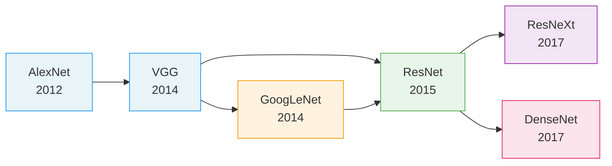

# Buổi 35 — 8.7 Densely Connected Networks (DenseNet)

> **Nguồn:** [d2l.ai — 8.7](https://d2l.ai/chapter_convolutional-modern/densenet.html)
> **Buổi trước:** [[Buổi 34 - Tuần 9]] — Residual Networks (ResNet) and ResNeXt
> **Buổi sau:** [[Buổi 36 - Tuần 10]] — Designing Convolution Network Architectures

---

## Mục tiêu buổi học

1. Hiểu **động lực toán học** từ ResNet dẫn đến DenseNet — từ Taylor expansion đến dense connections
2. Nắm vững cơ chế **Dense Block** — concatenation thay vì addition
3. Hiểu **Growth Rate** — tham số kiểm soát tăng trưởng channels
4. Nắm vai trò **Transition Layer** — kiểm soát độ phức tạp mô hình
5. Triển khai **DenseNet** hoàn chỉnh bằng PyTorch
6. So sánh **ResNet vs DenseNet** — ưu/nhược điểm và trade-offs

---

## Active Recall — Kiến thức cũ

### Câu hỏi truy hồi (không nhìn tài liệu)

1. Skip connection trong ResNet giải quyết vấn đề gì cụ thể? Cơ chế toán học là gì?
2. Tại sao ResNet sử dụng **addition** cho skip connection? Điều kiện nào phải thỏa mãn để cộng được?
3. Grouped Convolution trong ResNeXt giúp giảm chi phí tính toán bằng cách nào?
4. BatchNorm hoạt động khác nhau ở training vs inference ra sao?
5. Conv 1×1 đóng vai trò gì trong bottleneck block?
6. Degradation Problem khác Overfitting ở điểm cốt lõi nào?
7. Pre-activation ResNet (BN → ReLU → Conv) có lợi gì so với post-activation?
8. Cardinality trong ResNeXt là gì và tại sao tăng cardinality hiệu quả hơn tăng depth/width?

### Tự trả lời ngắn (Claim → Reasoning → Evidence)

1. **Claim:** Skip connection giải quyết gradient vanishing trong mạng sâu.
   **Reasoning:** Gradient flow được bổ sung đường tắt ($+ \mathbf{I}$), nên gradient không bị triệt tiêu qua nhiều layers.
   **Evidence:** Buổi 34: $\frac{\partial f}{\partial \mathbf{x}} = \frac{\partial g}{\partial \mathbf{x}} + \mathbf{I}$ — thành phần $\mathbf{I}$ đảm bảo gradient luôn chảy ngược.

2. **Claim:** Addition yêu cầu input và output cùng shape.
   **Reasoning:** Phép cộng element-wise đòi hỏi tensor cùng kích thước trên mọi chiều.
   **Evidence:** Buổi 34: khi channels thay đổi, ResNet phải dùng conv 1×1 projection trên shortcut.

3. **Claim:** Grouped conv chia input channels thành G nhóm, mỗi nhóm xử lý độc lập.
   **Reasoning:** Thay vì 1 conv xử lý toàn bộ $C_{in}$ channels, ta có $G$ conv nhỏ mỗi cái chỉ xử lý $C_{in}/G$ channels.
   **Evidence:** Buổi 34: FLOPs giảm theo hệ số $1/G$.

4. **Claim:** Train dùng batch statistics, inference dùng running statistics.
   **Reasoning:** Lúc train, mỗi mini-batch tính mean/var riêng; lúc inference cần kết quả ổn định nên dùng EMA.
   **Evidence:** Buổi 33: `model.eval()` chuyển BN sang dùng running_mean/running_var.

### Concept notes cần ôn lại

- [[Residual Connection]]
- [[Batch Normalization]]
- [[Skip Connection]]
- [[Grouped Convolution]]
- [[Growth Rate]]

---

## 1. Từ ResNet đến DenseNet — Động lực toán học

### 1.1. Taylor Expansion và cách nhìn theo chuỗi hàm

> [!NOTE] ELI5
> Tưởng tượng bạn viết một bài luận. ResNet giống như viết "bản nháp + phần chỉnh sửa" — bạn lấy bản nháp cộng thêm phần sửa để ra bản cuối. DenseNet giống như viết "bản nháp + ghi chú 1 + ghi chú 2 + ghi chú 3 + ..." — bạn **giữ lại tất cả** ghi chú từ mọi bước trước đó, nối chúng lại với nhau để có bản cuối đầy đủ nhất.

**Định nghĩa kỹ thuật:** DenseNet (Densely Connected Convolutional Network) là kiến trúc CNN trong đó mỗi layer nhận input là **concatenation** của feature maps từ **tất cả** các layers trước đó trong cùng một dense block, thay vì chỉ nhận output của layer ngay trước. Điều này tối đa hóa **feature reuse** — mọi feature đã học được bảo toàn và truyền đi xuyên suốt mạng.

Nhớ lại **Taylor expansion** của hàm $f$ tại $x = 0$:

$$f(x) = f(0) + f'(0) \cdot x + \frac{f''(0)}{2!} \cdot x^2 + \frac{f'''(0)}{3!} \cdot x^3 + \cdots$$

Ý tưởng cốt lõi: phân tích một hàm phức tạp thành **tổng của nhiều thành phần** có bậc tăng dần.

**ResNet áp dụng ý tưởng tương tự**, nhưng chỉ với 2 thành phần:

$$f(\mathbf{x}) = \mathbf{x} + g(\mathbf{x})$$

Tức là: "hàm mục tiêu = input gốc + phần hiệu chỉnh phi tuyến".

> [!WARNING] Câu hỏi then chốt
> Nếu Taylor expansion cho phép ta giữ lại **nhiều bậc** (term order 0, 1, 2, 3, ...), tại sao ResNet chỉ giữ 2 thành phần? Nếu ta muốn giữ lại **tất cả** thành phần trung gian thì sao?

### 1.2. DenseNet: Giữ lại tất cả thành phần trung gian

Đây chính là ý tưởng cốt lõi của DenseNet: thay vì **cộng** (addition) như ResNet, ta **nối** (concatenation) tất cả output từ các layers trước:

$$\mathbf{x} \to \left[\mathbf{x}, \; f_1(\mathbf{x}), \; f_2\left([\mathbf{x}, f_1(\mathbf{x})]\right), \; f_3\left([\mathbf{x}, f_1(\mathbf{x}), f_2(\cdot)]\right), \; \ldots \right]$$

Trong đó $[\cdot, \cdot]$ ký hiệu phép **concatenation theo chiều channels**.

![[assets/attachments/d2l-buoi-35/resnet_vs_densenet.png]]
_So sánh cơ chế kết nối: ResNet dùng Addition (+), DenseNet dùng Concatenation (cat)_

| Tiêu chí      | ResNet                                              | DenseNet                                                  |
| ------------- | --------------------------------------------------- | --------------------------------------------------------- |
| Phép kết hợp  | Addition: $\mathbf{y} = g(\mathbf{x}) + \mathbf{x}$ | Concatenation: $\mathbf{y} = [\mathbf{x}, h(\mathbf{x})]$ |
| Yêu cầu shape | Input = Output (cùng channels)                      | Không cần cùng channels                                   |
| Feature reuse | Chỉ truyền từ layer ngay trước                      | Truyền từ **tất cả** layers trước                         |
| Channels      | Cố định hoặc tăng gấp đôi                           | Tăng tuyến tính ($+k$ mỗi layer)                          |

> [!IMPORTANT] Tại sao Concatenation thay vì Addition?
> **Addition** bắt buộc input/output **cùng số channels** → hạn chế linh hoạt. Ngoài ra, khi cộng $\mathbf{x} + g(\mathbf{x})$, thông tin gốc $\mathbf{x}$ bị "trộn lẫn" vào $g(\mathbf{x})$ — không còn phân biệt được đâu là feature cũ, đâu là feature mới.
>
> **Concatenation** cho phép:
>
> 1. Giữ nguyên feature cũ **không bị biến đổi**
> 2. Thêm feature mới **bên cạnh** feature cũ
> 3. Để cho **các layers sau** tự quyết định feature nào hữu ích nhất

---

## 2. Dense Block — Component cốt lõi

### 2.1. Cơ chế hoạt động

> [!NOTE] ELI5
> Hãy tưởng tượng một nhóm bạn đang brainstorm (động não). Trong "kiểu ResNet", mỗi người chỉ nghe ý kiến của **người nói trước mình** rồi phát triển thêm. Trong "kiểu DenseNet", mỗi người nghe **TẤT CẢ** ý kiến từ đầu đến giờ, rồi mới đưa ra ý tưởng mới. Kết quả: brainstorm DenseNet tốt hơn vì mọi người đều có đầy đủ ngữ cảnh!

**Định nghĩa kỹ thuật:** Một **Dense Block** gồm $n$ convolution blocks liên tiếp. Mỗi conv block nhận input là concatenation của output từ **tất cả** các blocks trước đó (bao gồm cả input ban đầu). Mỗi conv block sản xuất đúng $k$ channels mới (với $k$ = growth rate). Do đó, sau $n$ blocks, channels tổng = $C_{in} + n \times k$.

**Sự khác biệt cốt lõi so với ResNet:** Trong ResNet, mỗi block nhận input từ block trước → layer $l$ chỉ có 1 connection đến. Trong DenseNet, layer $l$ có **$l$ connections** — từ tất cả layers $0, 1, 2, \ldots, l-1$.

### 2.2. Conv Block: BN → ReLU → Conv (Pre-activation)

DenseNet sử dụng cấu trúc **pre-activation** giống ResNet v2:

$$\text{Conv Block}(\mathbf{x}) = \text{Conv}_{3 \times 3}\left(\text{ReLU}\left(\text{BN}(\mathbf{x})\right)\right)$$

> [!NOTE] Tại sao Pre-activation?
> Thứ tự BN → ReLU → Conv (thay vì Conv → BN → ReLU) giúp:
>
> 1. **BN được áp dụng trước activation** → chuẩn hóa input cho conv hiệu quả hơn
> 2. **Identity mapping sạch hơn** — skip path không bị chặn bởi activation
> 3. Đây là cải tiến từ bài báo ResNet v2 (He et al., 2016), được DenseNet kế thừa

```python
def conv_block(num_channels):
    """Một conv block trong Dense Block: BN → ReLU → Conv3x3"""
    return nn.Sequential(
        nn.LazyBatchNorm2d(),
        nn.ReLU(),
        nn.LazyConv2d(num_channels, kernel_size=3, padding=1)
    )
```

### 2.3. Dense Block: Concatenation qua nhiều layers

```python
class DenseBlock(nn.Module):
    def __init__(self, num_convs, num_channels):
        """
        Args:
            num_convs: Số conv blocks trong dense block
            num_channels: Growth rate k — mỗi block tạo ra k channels mới
        """
        super(DenseBlock, self).__init__()
        layer = []
        for i in range(num_convs):
            layer.append(conv_block(num_channels))
        self.net = nn.Sequential(*layer)

    def forward(self, X):
        for blk in self.net:
            Y = blk(X)
            # === ĐIỂM CỐT LÕI ===
            # Concatenate input VÀ output của mỗi block theo chiều channels
            # Khác ResNet: X = X + Y (addition)
            # DenseNet:   X = [X, Y] (concatenation)
            X = torch.cat((X, Y), dim=1)
        return X
```

> [!WARNING] Chú ý cẩn thận: `torch.cat` vs `torch.add`
>
> ```python
> # ResNet: Cộng → channels giữ nguyên
> X = X + Y          # shape: (B, C, H, W) + (B, C, H, W) = (B, C, H, W)
>
> # DenseNet: Nối → channels tăng lên
> X = torch.cat((X, Y), dim=1)  # (B, C, H, W) + (B, k, H, W) = (B, C+k, H, W)
> ```
>
> ResNet yêu cầu $C_{in} = C_{out}$. DenseNet **không** yêu cầu — channels tăng tự do.

### 2.4. Ví dụ cụ thể — Tracking channels qua Dense Block

![[assets/attachments/d2l-buoi-35/dense_block_flow.png]]
_Data flow bên trong Dense Block: mỗi layer nhận input từ TẤT CẢ layers trước đó_

**Ví dụ số:** Dense Block với $n = 4$ conv blocks, growth rate $k = 32$, input có $C = 64$ channels:

| Layer  | Input channels | Mỗi layer tạo | Output (sau concat) |
| ------ | -------------- | ------------- | ------------------- |
| Conv 1 | 64             | 32            | 64 + 32 = **96**    |
| Conv 2 | 96             | 32            | 96 + 32 = **128**   |
| Conv 3 | 128            | 32            | 128 + 32 = **160**  |
| Conv 4 | 160            | 32            | 160 + 32 = **192**  |

**Công thức tổng quát:** Sau $n$ conv blocks:

$$C_{out} = C_{in} + n \times k$$

```python
# Kiểm chứng
blk = DenseBlock(num_convs=2, num_channels=10)
X = torch.randn(4, 3, 8, 8)  # batch=4, channels=3, H=W=8
Y = blk(X)
print(Y.shape)  # torch.Size([4, 23, 8, 8])
# 23 = 3 (input) + 10 (conv1) + 10 (conv2)
```

---

## 3. Growth Rate — Hyperparameter quan trọng nhất

### 3.1. Định nghĩa và ý nghĩa

> [!NOTE] ELI5
> Growth rate giống như "tốc độ phát triển" của đội ngũ. Nếu mỗi tháng đội thêm 5 người (growth rate = 5), thì sau 10 tháng đội sẽ có thêm 50 người. Số nhỏ → đội phát triển chậm nhưng gọn nhẹ. Số lớn → mạnh hơn nhưng quản lý phức tạp hơn.

**Định nghĩa kỹ thuật:** **Growth rate** $k$ là số output channels mà mỗi convolution block trong dense block sản xuất. Nó quyết định **tốc độ tăng trưởng channels** khi data đi qua dense block. Giá trị $k$ thường **rất nhỏ** so với tổng channels (ví dụ $k = 12, 24, 32$).

### 3.2. Tại sao Growth Rate nhỏ lại hiệu quả?

Đây là insight quan trọng nhất của DenseNet:

1. **Mỗi layer chỉ cần học thêm ít feature mới** (chỉ $k$ channels)
2. **Feature cũ đã được giữ nguyên** qua concatenation → không cần học lại
3. **"Collective knowledge"** — mỗi layer truy cập được toàn bộ feature từ các layers trước

> [!IMPORTANT] So sánh với ResNet
> ResNet thường dùng 64, 128, 256, 512 channels/block — **rất lớn** vì mỗi block phải "tự chứa" đầy đủ thông tin (addition xóa identity của feature cũ).
>
> DenseNet chỉ cần $k = 32$ channels/block vì **feature cũ vẫn còn nguyên** trong tensor concat → mỗi block chỉ cần bổ sung thêm "ít thông tin mới".
>
> Kết quả: DenseNet thường có **ít tham số hơn** ResNet ở cùng mức accuracy.

### 3.3. Các giá trị Growth Rate phổ biến

| Biến thể            | Growth Rate $k$ | Ghi chú                           |
| ------------------- | --------------- | --------------------------------- |
| DenseNet-BC (CIFAR) | 12              | Rất compact, dành cho dataset nhỏ |
| DenseNet-121        | 32              | Chuẩn cho ImageNet                |
| DenseNet-169        | 32              | Nhiều layers hơn DenseNet-121     |
| DenseNet-201        | 32              | Sâu nhất phổ biến                 |
| DenseNet-264        | 32–48           | Cực sâu, ít dùng trong thực tế    |

---

## 4. Transition Layer — Kiểm soát độ phức tạp

### 4.1. Vấn đề: Channels tăng vô hạn

> [!NOTE] ELI5
> Nếu mỗi ngày bạn mua 5 quyển sách mới và giữ hết, sau 1 năm bạn sẽ có 1825 quyển — ngập nhà! Transition layer giống như việc định kỳ "dọn dẹp": giữ lại sách quan trọng, bỏ bớt sách trùng lặp. Cụ thể, nó **giảm nửa** số sách (channels) và **thu nhỏ** không gian lưu trữ (spatial size).

**Định nghĩa kỹ thuật:** **Transition Layer** là module nằm giữa hai Dense Blocks, thực hiện 2 nhiệm vụ: (1) **giảm channels** bằng Conv 1×1, thường giảm một nửa; (2) **giảm spatial resolution** bằng Average Pooling 2×2 stride 2. Mục đích: kiểm soát sự tăng trưởng channels liên tục từ Dense Blocks, giữ cho mô hình không quá lớn.

Nếu không có Transition Layer, channels sẽ tăng liên tục:

- Dense Block 1: $64 + 4 \times 32 = 192$
- Dense Block 2: $192 + 4 \times 32 = 320$
- Dense Block 3: $320 + 4 \times 32 = 448$
- Dense Block 4: $448 + 4 \times 32 = 576$

→ Quá nhiều channels, quá nhiều tham số!

### 4.2. Cấu trúc Transition Layer

![[assets/attachments/d2l-buoi-35/transition_layer.png]]
_Transition Layer: BN → ReLU → Conv 1×1 (giảm channels) → AvgPool 2×2 (giảm spatial)_

```python
def transition_block(num_channels):
    """
    Transition Layer giữa hai Dense Blocks.

    Chức năng:
    1. BN + ReLU: Chuẩn hóa và activation
    2. Conv 1x1: Giảm channels (thường giảm 50%)
    3. AvgPool 2x2: Giảm spatial resolution (H,W → H/2, W/2)
    """
    return nn.Sequential(
        nn.LazyBatchNorm2d(),
        nn.ReLU(),
        nn.LazyConv2d(num_channels, kernel_size=1),  # Nén channels
        nn.AvgPool2d(kernel_size=2, stride=2)          # Giảm spatial
    )
```

### 4.3. Ví dụ cụ thể — Tracking qua Transition

```python
# Sau Dense Block: Y.shape = (4, 23, 8, 8) — 23 channels, 8x8 spatial
blk = transition_block(10)       # Giảm xuống 10 channels
output = blk(Y)
print(output.shape)  # torch.Size([4, 10, 4, 4])
# 23 channels → 10 channels (giảm channels)
# 8x8 → 4x4 (giảm spatial bằng AvgPool s=2)
```

### 4.4. Tại sao Average Pooling chứ không phải Max Pooling?

> [!WARNING] Câu hỏi thường gặp
> **Average Pooling** giữ lại thông tin "trung bình" từ tất cả features → **phù hợp với triết lý DenseNet** vì DenseNet muốn **bảo toàn và tái sử dụng** features.
>
> **Max Pooling** chỉ giữ giá trị lớn nhất → **mất nhiều thông tin** hơn, phù hợp với giai đoạn đầu (stem) nơi cần chọn lọc feature mạnh nhất, nhưng không phù hợp ở giữa mạng nơi mọi feature đều quan trọng.

---

## 5. DenseNet Architecture — Toàn bộ

### 5.1. Kiến trúc tổng quan

![[assets/attachments/d2l-buoi-35/densenet_architecture.png]]
_Kiến trúc DenseNet: Stem → [Dense Block + Transition] × 4 → Classification Head_

DenseNet gồm 3 phần chính:

| Phần     | Component                               | Chức năng                        |
| -------- | --------------------------------------- | -------------------------------- |
| **Stem** | Conv 7×7 s=2, BN, ReLU, MaxPool 3×3 s=2 | Giảm spatial nhanh, giống ResNet |
| **Body** | 4 × (Dense Block + Transition Layer)    | Feature extraction chính         |
| **Head** | BN, ReLU, GAP, FC                       | Classification                   |

### 5.2. Implementation đầy đủ

```python
class DenseNet(d2l.Classifier):
    def __init__(self, num_channels=64, growth_rate=32,
                 arch=(4, 4, 4, 4), lr=0.1, num_classes=10):
        """
        DenseNet implementation.

        Args:
            num_channels: Channels sau stem (mặc định 64)
            growth_rate: Mỗi conv block tạo bao nhiêu channels mới
            arch: Tuple chỉ số conv blocks trong mỗi dense block
            lr: Learning rate
            num_classes: Số classes phân loại
        """
        super(DenseNet, self).__init__()
        self.save_hyperparameters()
        self.net = nn.Sequential(self.b1())

        for i, num_convs in enumerate(arch):
            # === Dense Block ===
            self.net.add_module(
                f'dense_blk{i+1}',
                DenseBlock(num_convs, growth_rate)
            )
            # Cập nhật channels: ban đầu + (số blocks × growth rate)
            num_channels += num_convs * growth_rate

            # === Transition Layer (trừ block cuối) ===
            if i != len(arch) - 1:
                num_channels //= 2  # Giảm nửa channels
                self.net.add_module(
                    f'tran_blk{i+1}',
                    transition_block(num_channels)
                )

        # === Classification Head ===
        self.net.add_module('last', nn.Sequential(
            nn.LazyBatchNorm2d(),
            nn.ReLU(),
            nn.AdaptiveAvgPool2d((1, 1)),  # GAP
            nn.Flatten(),
            nn.LazyLinear(num_classes)
        ))
        self.net.apply(d2l.init_cnn)

    def b1(self):
        """Stem block — giống ResNet"""
        return nn.Sequential(
            nn.LazyConv2d(64, kernel_size=7, stride=2, padding=3),
            nn.LazyBatchNorm2d(),
            nn.ReLU(),
            nn.MaxPool2d(kernel_size=3, stride=2, padding=1)
        )
```

### 5.3. Data Flow chi tiết qua DenseNet

Với config mặc định: `num_channels=64, growth_rate=32, arch=(4,4,4,4)`:

| Stage   | Input Shape   | Component             | Output Shape  | Channels     |
| ------- | ------------- | --------------------- | ------------- | ------------ |
| Input   | 1 × 96 × 96   | —                     | —             | 1            |
| Stem    | 1 × 96 × 96   | Conv7+BN+ReLU+MaxPool | 64 × 24 × 24  | 64           |
| Dense 1 | 64 × 24 × 24  | 4 conv blocks, k=32   | 192 × 24 × 24 | 64+4×32=192  |
| Trans 1 | 192 × 24 × 24 | Conv1×1+AvgPool       | 96 × 12 × 12  | 192//2=96    |
| Dense 2 | 96 × 12 × 12  | 4 conv blocks, k=32   | 224 × 12 × 12 | 96+4×32=224  |
| Trans 2 | 224 × 12 × 12 | Conv1×1+AvgPool       | 112 × 6 × 6   | 224//2=112   |
| Dense 3 | 112 × 6 × 6   | 4 conv blocks, k=32   | 240 × 6 × 6   | 112+4×32=240 |
| Trans 3 | 240 × 6 × 6   | Conv1×1+AvgPool       | 120 × 3 × 3   | 240//2=120   |
| Dense 4 | 120 × 3 × 3   | 4 conv blocks, k=32   | 248 × 3 × 3   | 120+4×32=248 |
| Head    | 248 × 3 × 3   | BN+ReLU+GAP+FC        | 10            | 10           |

> [!TIP] Pattern quan trọng
>
> - Dense Block: channels **tăng tuyến tính** ($+k$ mỗi layer)
> - Transition Layer: channels **giảm nửa**, spatial **giảm nửa**
> - Không có Transition sau Dense Block cuối (dense block 4 → thẳng head)

### 5.4. Training

```python
model = DenseNet(lr=0.01)
trainer = d2l.Trainer(max_epochs=10, num_gpus=1)
data = d2l.FashionMNIST(batch_size=128, resize=(96, 96))
trainer.fit(model, data)
```

> [!NOTE] Giảm resolution
> D2L sử dụng input 96×96 thay vì 224×224 chuẩn ImageNet để giảm chi phí tính toán khi demo. Trong thực tế, DenseNet hoạt động tốt nhất với 224×224.

---

## 6. So sánh chuyên sâu: ResNet vs DenseNet

### 6.1. Ba khác biệt cốt lõi

![[assets/attachments/d2l-buoi-35/resnet_densenet_comparison.png]]
_Ba khác biệt chính: Connection type, Channel behavior, Feature reuse_

| Tiêu chí          | ResNet                             | DenseNet                                    |
| ----------------- | ---------------------------------- | ------------------------------------------- |
| **Connection**    | Addition: $y = g(x) + x$           | Concatenation: $y = [x, h(x)]$              |
| **Channels**      | Cố định hoặc ×2 tại stage boundary | Tăng tuyến tính $+k$ mỗi layer              |
| **Feature reuse** | Chỉ layer trước                    | TẤT CẢ layers trước                         |
| **Gradient flow** | Qua skip + main path               | Mỗi layer có "đường tắt" trực tiếp đến loss |
| **Parameters**    | Nhiều hơn (64-512 ch/block)        | Ít hơn ($k = 32$ ch/block)                  |
| **Memory**        | Moderate                           | **Cao** (lưu tất cả feature maps)           |
| **Computation**   | Standard                           | Concat nặng về memory I/O                   |

### 6.2. Ưu điểm của DenseNet

1. **Feature Reuse tối đa** — mỗi layer truy cập được features từ mọi layer trước
2. **Ít parameters hơn** — growth rate nhỏ ($k = 32$) × nhiều connections = hiệu quả
3. **Gradient flow tốt** — gradient từ loss có đường trực tiếp đến mọi layer
4. **Regularization tự nhiên** — chia sẻ features giúp giảm overfitting

### 6.3. Nhược điểm của DenseNet

> [!CAUTION] Memory Consumption — Vấn đề lớn nhất
> DenseNet cần **lưu trữ feature maps của TẤT CẢ layers** trong dense block để thực hiện concatenation. Với dense block 4 layers, layer cuối cần concat features từ input + 3 layers trước = 4 tensors.
>
> Trong ResNet, chỉ cần lưu input (cho skip) và output hiện tại = 2 tensors.
>
> **Hậu quả:** DenseNet tiêu tốn **nhiều GPU memory hơn** ResNet đáng kể, đặc biệt khi input resolution lớn (224×224). Đây là lý do DenseNet **ít được dùng trong production** hơn ResNet/EfficientNet.

### 6.4. Tại sao DenseNet ít parameters hơn ResNet?

Câu hỏi này thường gây bối rối vì "nhiều connections hơn" nghe như "nặng hơn". Thực tế:

**ResNet block:** Conv phải xử lý **toàn bộ** channels (64, 128, 256, 512) → mỗi filter có $C_{in} \times k \times k$ weights.

**DenseNet conv block:** Chỉ tạo ra $k = 32$ channels mới. Dù input lớn (vì concat), nhưng output chỉ có 32 channels → mỗi conv chỉ tạo 32 filter, ít hơn nhiều so với 64-512 filters của ResNet.

$$\text{Params}_{\text{conv}} = C_{in} \times C_{out} \times k_h \times k_w$$

- ResNet: $C_{out} = 256$ → 256 filters
- DenseNet: $C_{out} = k = 32$ → chỉ 32 filters

> [!NOTE] Lưu ý quan trọng
> DenseNet có ít **parameters** nhưng tiêu tốn nhiều **memory** vì phải lưu feature maps trung gian. Parameters ≠ Memory. Parameters = bộ nhớ cho weights. Memory = bộ nhớ cho activations (feature maps) trong forward pass.

---

## 7. Mở rộng: DenseNet-BC và Bottleneck

### 7.1. DenseNet-BC (Bottleneck + Compression)

Trong paper gốc (Huang et al., 2017), phiên bản DenseNet-BC được đề xuất với 2 cải tiến:

**Bottleneck (B):** Thêm Conv 1×1 trước Conv 3×3 để giảm channels:

$$\text{BN} \to \text{ReLU} \to \underbrace{\text{Conv}_{1 \times 1}(4k)}_{\text{Bottleneck}} \to \text{BN} \to \text{ReLU} \to \text{Conv}_{3 \times 3}(k)$$

- Conv 1×1 giảm input channels xuống $4k$ trước khi Conv 3×3 xử lý
- Giảm đáng kể chi phí tính toán khi channels tích lũy lớn
- Tương tự ý tưởng bottleneck trong ResNet và GoogLeNet

**Compression (C):** Transition Layer giảm channels theo tỉ lệ $\theta$:

$$C_{out} = \lfloor \theta \times C_{in} \rfloor, \quad 0 < \theta \le 1$$

- $\theta = 0.5$ → giảm nửa channels (mặc định)
- $\theta = 1.0$ → giữ nguyên (không compression)

### 7.2. Bảng kiến trúc DenseNet phổ biến

| Model               | Layers | Config (blocks) | Growth Rate $k$ | Params |
| ------------------- | ------ | --------------- | --------------- | ------ |
| DenseNet-121        | 121    | (6, 12, 24, 16) | 32              | 8.0M   |
| DenseNet-169        | 169    | (6, 12, 32, 32) | 32              | 14.1M  |
| DenseNet-201        | 201    | (6, 12, 48, 32) | 32              | 20.0M  |
| DenseNet-264        | 264    | (6, 12, 64, 48) | 32              | 33.3M  |
| ResNet-50 (so sánh) | 50     | —               | —               | 25.6M  |

> [!TIP] Quan sát
> DenseNet-201 (20M params) đạt accuracy tốt hơn ResNet-50 (25.6M params) trên ImageNet, mặc dù ít parameters hơn ~22%. Điều này chứng minh hiệu quả của feature reuse.

---

## 8. Tổng kết: Dòng tiến hóa Modern CNN



| Kiến trúc    | Ý tưởng cốt lõi                      | Đóng góp chính                            |
| ------------ | ------------------------------------ | ----------------------------------------- |
| AlexNet      | GPU + ReLU + Dropout                 | Khởi đầu deep learning revolution         |
| VGG          | Blocks of 3×3 conv                   | "Deeper is better" (có hạn chế)           |
| GoogLeNet    | Inception module (multi-branch)      | Parallel pathways + 1×1 bottleneck        |
| ResNet       | Skip connection (addition)           | Cho phép train mạng cực sâu (100+ layers) |
| ResNeXt      | Grouped conv + cardinality           | "Cardinality > depth/width"               |
| **DenseNet** | **Dense connection (concatenation)** | **Feature reuse tối đa, ít params**       |

---

## 9. Active Recall — DenseNet chuyên sâu

### 9.1. Câu hỏi truy hồi

1. DenseNet dùng **concatenation** thay vì **addition** — hậu quả trực tiếp về channels là gì?
2. Growth rate $k = 32$ nghĩa là gì cụ thể trong mỗi conv block?
3. Sau 4 conv blocks với $k = 32$ và input 64 channels, tổng channels output là bao nhiêu?
4. Transition Layer có 3 operations — kể tên và chức năng từng operation.
5. Tại sao DenseNet **ít parameters** hơn ResNet nhưng tiêu tốn **nhiều memory** hơn?
6. Tại sao Transition Layer dùng **AvgPool** chứ không phải **MaxPool**?
7. Pre-activation (BN → ReLU → Conv) có lợi gì so với post-activation?
8. DenseNet layer $l$ nhận bao nhiêu input connections? So sánh với ResNet?
9. Compression factor $\theta = 0.5$ trong Transition Layer có nghĩa gì?
10. Giải thích tại sao DenseNet có tính **implicit regularization**.

### 9.2. Đáp án chi tiết (Claim → Reasoning → Evidence)

> [!tip]- 1. Concatenation → Channels tăng tuyến tính
> **Claim:** Concatenation làm channels tăng tuyến tính theo số layers.
> **Reasoning:** Mỗi conv block tạo $k$ channels mới và nối vào tensor hiện tại. Sau $n$ blocks: $C_{out} = C_{in} + n \times k$. Addition giữ channels cố định ($C_{out} = C_{in}$).
> **Evidence:** Ví dụ §2.4: input 64ch + 4 blocks × 32 = 192 channels. Code: `X = torch.cat((X, Y), dim=1)`.

> [!tip]- 2. Growth rate = số channels mới tạo bởi mỗi conv block
> **Claim:** $k = 32$ nghĩa là mỗi conv block trong dense block tạo ra chính xác 32 feature maps mới.
> **Reasoning:** Conv 3×3 cuối mỗi block có output channels = $k$. Concatenation nối 32 channels mới vào tensor tích lũy.
> **Evidence:** Code §2.3: `conv_block(num_channels)` → `nn.LazyConv2d(num_channels, ...)` với `num_channels = growth_rate = 32`.

> [!tip]- 3. 64 + 4 × 32 = 192 channels
> **Claim:** Output channels = 192.
> **Reasoning:** Áp dụng $C_{out} = C_{in} + n \times k = 64 + 4 \times 32 = 192$.
> **Evidence:** Bảng tracking §2.4: Dense Block 1 từ 64 → 192 channels.

> [!tip]- 4. BN+ReLU → Conv 1×1 → AvgPool 2×2
> **Claim:** Transition Layer gồm: (1) BN+ReLU chuẩn hóa; (2) Conv 1×1 giảm channels (thường 50%); (3) AvgPool 2×2 stride 2 giảm spatial 50%.
> **Reasoning:** Channels tăng liên tục từ dense blocks cần được nén lại. Spatial cũng cần giảm để tạo multi-scale features.
> **Evidence:** Code §4.2: `transition_block(num_channels)` chứa `Conv2d(num_channels, k=1) → AvgPool2d(k=2, s=2)`.

> [!tip]- 5. Ít params nhưng nhiều memory
> **Claim:** DenseNet ít params vì mỗi conv chỉ tạo $k=32$ channels (thay vì 64-512 của ResNet), nhưng tiêu tốn memory vì phải lưu feature maps từ TẤT CẢ layers trước.
> **Reasoning:** Parameters = trọng số của conv filters. Memory = features maps lưu trong forward pass. DenseNet có ít filters (ít params) nhưng cần lưu nhiều intermediate tensors (nhiều memory).
> **Evidence:** So sánh §6.4: DenseNet-201 (20M params) < ResNet-50 (25.6M params), nhưng DenseNet cần lưu $\sum_{l=1}^{L} (C_{in} + l \times k)$ feature maps.

> [!tip]- 6. AvgPool bảo toàn thông tin tốt hơn
> **Claim:** AvgPool phù hợp hơn MaxPool trong Transition Layer.
> **Reasoning:** DenseNet triết lý "bảo toàn và tái sử dụng features". AvgPool giữ thông tin trung bình từ mọi vị trí. MaxPool chỉ giữ giá trị lớn nhất → mất nhiều thông tin hơn.
> **Evidence:** Phân tích §4.4: AvgPool phù hợp giữa mạng (transition), MaxPool phù hợp đầu mạng (stem).

> [!tip]- 7. Pre-activation giúp identity mapping sạch hơn
> **Claim:** BN → ReLU → Conv giúp skip path không bị chặn bởi activation.
> **Reasoning:** Post-activation (Conv → BN → ReLU) đặt ReLU trên main path → feature trước khi concat bị cắt bớt. Pre-activation đặt BN+ReLU trước conv → output của conv "sạch" hơn.
> **Evidence:** §2.2 giải thích kế thừa từ ResNet v2 (He et al., 2016).

> [!tip]- 8. Layer $l$ có $l$ connections (DenseNet) vs 1 connection (ResNet)
> **Claim:** DenseNet layer $l$ nhận $l$ connections từ layers $0, 1, ..., l-1$. ResNet layer $l$ chỉ nhận 1 connection từ layer $l-1$.
> **Reasoning:** Dense block concatenate TẤT CẢ previous outputs. Tổng connections trong dense block L layers = $\frac{L(L+1)}{2}$ (quadratic). ResNet: chỉ $L$ connections (linear).
> **Evidence:** §1.2: DenseNet giữ lại "tất cả thành phần trung gian" — mọi layer truy cập mọi feature maps trước.

> [!tip]- 9. $\theta = 0.5$ → giảm channels xuống 50%
> **Claim:** Compression factor $\theta = 0.5$ nghĩa là Transition Layer nén channels xuống còn 50%.
> **Reasoning:** $C_{out} = \lfloor \theta \times C_{in} \rfloor$. Với $\theta = 0.5$ và $C_{in} = 192$: $C_{out} = \lfloor 0.5 \times 192 \rfloor = 96$.
> **Evidence:** §7.1: mặc định $\theta = 0.5$, $\theta = 1.0$ = không compression.

> [!tip]- 10. Dense connections = implicit regularization
> **Claim:** Feature sharing giữa layers trong DenseNet hoạt động như một dạng regularization tự nhiên.
> **Reasoning:** Mỗi layer chỉ cần học **thêm** $k$ features mới (thay vì học lại toàn bộ). Khi features được chia sẻ rộng rãi, mô hình ít có khả năng overfitting vì không layer nào phải "gánh" quá nhiều thông tin.
> **Evidence:** §6.2: DenseNet ít params hơn ResNet ở cùng accuracy. Paper gốc (Huang et al., 2017) cho thấy DenseNet-BC ít overfitting hơn trên CIFAR-10/100.

---

## 10. Bảng thuật ngữ

| Thuật ngữ                   | Tiếng Việt            | Định nghĩa ngắn                                                             |
| --------------------------- | --------------------- | --------------------------------------------------------------------------- |
| **Dense Block**             | Khối dày đặc          | Nhóm conv layers kết nối dày đặc (mỗi layer concat với tất cả layers trước) |
| **Growth Rate** ($k$)       | Tốc độ tăng trưởng    | Số channels mới mỗi conv block tạo ra                                       |
| **Transition Layer**        | Lớp chuyển tiếp       | Module giảm channels (Conv 1×1) và spatial (AvgPool) giữa 2 dense blocks    |
| **Feature Reuse**           | Tái sử dụng đặc trưng | Cơ chế giữ và truyền features từ layers trước cho layers sau                |
| **Concatenation**           | Nối (ghép)            | Ghép tensors theo chiều channels: $[x, h(x)]$                               |
| **Compression** ($\theta$)  | Nén                   | Tỉ lệ giảm channels trong Transition Layer                                  |
| **Pre-activation**          | Tiền kích hoạt        | Thứ tự BN → ReLU → Conv (thay vì Conv → BN → ReLU)                          |
| **Bottleneck (DenseNet-B)** | Cổ chai               | Thêm Conv 1×1 trước Conv 3×3 để giảm chi phí tính toán                      |

---

## 11. Mapping với D2L gốc

| Section trong D2L             | Nội dung tương ứng trong buổi này                              |
| ----------------------------- | -------------------------------------------------------------- |
| 8.7.1 From ResNet to DenseNet | §1 — Động lực toán học: Taylor expansion, concat vs add        |
| 8.7.2 Dense Blocks            | §2 — Dense Block: conv block, concatenation, tracking channels |
| 8.7.3 Transition Layers       | §4 — Transition Layer: BN + Conv1×1 + AvgPool                  |
| 8.7.4 DenseNet Model          | §5 — DenseNet Architecture: Stem + Body + Head                 |
| 8.7.5 Training                | §5.4 — Training trên Fashion-MNIST                             |
| 8.7.6 Summary and Discussion  | §6 — So sánh ResNet vs DenseNet + §7 Mở rộng                   |

---

> **Tổng kết buổi 35:** DenseNet đưa ý tưởng skip connection của ResNet lên mức cực đoan — thay vì mỗi layer chỉ kết nối với layer trước, DenseNet kết nối **mọi layer với mọi layer trước đó**. Cơ chế concatenation (thay vì addition) cho phép bảo toàn 100% features từ mọi tầng, dẫn đến feature reuse hiệu quả, ít parameters, và gradient flow mạnh mẽ. Trade-off chính là **memory consumption cao** do phải lưu trữ tất cả intermediate feature maps.

---

## Liên kết

- **Buổi trước**: [[Buổi 34 - Tuần 9]] — 8.6 Residual Networks (ResNet) and ResNeXt
- **Buổi sau**: [[Buổi 36 - Tuần 10]] — Designing Convolution Network Architectures
- **Concepts**: [[Batch Normalization]], [[Residual Connection]], [[Skip Connection]], [[Grouped Convolution]], [[Growth Rate]]
- **Source**: [d2l.ai — 8.7 DenseNet](https://d2l.ai/chapter_convolutional-modern/densenet.html)
