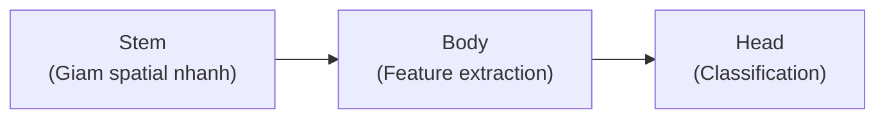
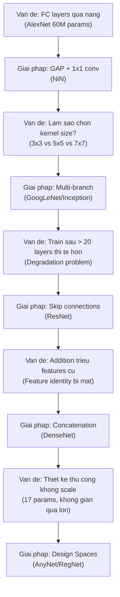

# Buổi 36 — 8.8 Designing Convolution Network Architectures

> **Nguồn:** [d2l.ai — 8.8](https://d2l.ai/chapter_convolutional-modern/cnn-design.html)
> **Buổi trước:** [[Buổi 35 - Tuần 9]] — Densely Connected Networks (DenseNet)
> **Buổi sau:** [[Buổi 37 - Tuần 10]] — Working with Sequences (RNN)

---

## Mục tiêu buổi học

1. Nhìn lại **toàn cảnh** quá trình tiến hóa kiến trúc CNN (LeNet → RegNet)
2. Hiểu **vấn đề cốt lõi**: thiết kế thủ công (hand-crafted) vs thiết kế tự động (NAS)
3. Nắm vững **AnyNet Design Space** — không gian thiết kế tổng quát
4. Hiểu phương pháp **thu hẹp không gian thiết kế** bằng phân phối CDF
5. Triển khai **RegNet** — kết quả cuối cùng từ việc thu hẹp AnyNet
6. Review và so sánh **tất cả kiến trúc Modern CNN** đã học (Ch 8.1–8.8)

---

## Active Recall — Kiến thức cũ

### Câu hỏi truy hồi (không nhìn tài liệu)

1. DenseNet dùng **concatenation** thay vì **addition** — lý do cốt lõi là gì?
2. Growth rate $k = 32$ có nghĩa gì trong DenseNet? Sau 4 conv blocks với input 64 channels thì output bao nhiêu channels?
3. Transition Layer gồm những operations nào và chức năng từng cái?
4. Tại sao DenseNet **ít parameters** hơn ResNet nhưng lại **tốn memory** hơn?
5. Giải thích Stem — Body — Head pattern trong CNN hiện đại.
6. ResNeXt sử dụng Grouped Convolution để làm gì? Cardinality quan trọng hơn depth/width ở điểm nào?
7. Batch Normalization hoạt động khác nhau ở training và inference ra sao?
8. Conv 1×1 được sử dụng ở những đâu trong các kiến trúc đã học? Đóng vai trò gì?

### Tự trả lời ngắn (Claim → Reasoning → Evidence)

1. **Claim:** Concatenation bảo toàn features cũ, addition thì "trộn lẫn" chúng.
   **Reasoning:** Khi cộng $\mathbf{x} + g(\mathbf{x})$, thông tin gốc $\mathbf{x}$ bị "hòa tan" vào kết quả → layers sau không phân biệt được đâu là feature cũ/mới. Concatenation ghép riêng biệt → layers sau tự quyết feature nào hữu ích.
   **Evidence:** Buổi 35 §1.2: DenseNet cho phép mỗi layer truy cập **tất cả** features trước đó mà không mất thông tin.

2. **Claim:** $k = 32$, output = $64 + 4 \times 32 = 192$ channels.
   **Reasoning:** Mỗi conv block tạo $k$ channels mới, concat vào tensor tích lũy.
   **Evidence:** Buổi 35 §2.4: công thức $C_{out} = C_{in} + n \times k$.

3. **Claim:** Transition Layer = BN → ReLU → Conv 1×1 (giảm channels) → AvgPool 2×2 (giảm spatial).
   **Reasoning:** Dense blocks liên tục tăng channels; Transition nén lại để kiểm soát model size.
   **Evidence:** Buổi 35 §4.2: code `transition_block(num_channels)`.

4. **Claim:** Ít params vì mỗi conv chỉ tạo $k=32$ channels (vs 64-512 của ResNet); tốn memory vì phải lưu feature maps từ **tất cả** layers trước cho concat.
   **Reasoning:** Parameters = weights của filters. Memory = activations (feature maps) trong forward pass. Hai thứ này là khác nhau.
   **Evidence:** Buổi 35 §6.4: DenseNet-201 (20M params) < ResNet-50 (25.6M params).

### Concept notes cần ôn lại

- [[Batch Normalization]]
- [[Residual Connection]]
- [[Skip Connection]]
- [[Grouped Convolution]]
- [[Growth Rate]]

---

## 1. Bối cảnh: Vấn đề thiết kế CNN

### 1.1. Hạn chế của thiết kế thủ công

> [!NOTE] ELI5
> Tưởng tượng bạn muốn xây ngôi nhà đẹp nhất. Từ trước đến giờ, mỗi kiến trúc sư đều tự vẽ theo cảm hứng riêng: người thì thích nhà cao tầng (VGG sâu), người thích nhà nhiều phòng (GoogLeNet nhiều nhánh), người thích cầu thang tắt (ResNet skip connections). Mỗi thiết kế đều tốt, nhưng **không ai có quy tắc chung** để biết "nhà bao nhiêu tầng là tối ưu?" hay "phòng bao nhiêu mét vuông là hợp lý?". AnyNet/RegNet giống như **một bộ quy tắc quy hoạch đô thị** — nó cho bạn nguyên tắc chung để xây bất kỳ ngôi nhà nào, thay vì phải thiết kế từng cái một.

**Định nghĩa kỹ thuật:** Tất cả các kiến trúc từ AlexNet đến DenseNet đều được thiết kế dựa trên **trực giác của nhà nghiên cứu** (human intuition). Mỗi kiến trúc giải quyết một vấn đề cụ thể nhưng không đưa ra **nguyên tắc thiết kế tổng quát** có thể áp dụng cho mọi cấu hình mạng. Chương 8.8 giới thiệu **Network Design Spaces** — phương pháp thiết kế dựa trên phân phối thống kê, kết hợp sức mạnh của thiết kế thủ công và tìm kiếm tự động.

Từ AlexNet (2012) đến DenseNet (2017), mỗi kiến trúc mới đều dựa heavily vào **trực giác** của nhà nghiên cứu:

| Kiến trúc | Ý tưởng cốt lõi          | Nguồn gốc ý tưởng                          |
| --------- | ------------------------ | ------------------------------------------ |
| AlexNet   | GPU + ReLU + Dropout     | Trực giác: "train trên GPU sẽ nhanh hơn"   |
| VGG       | Stack 3×3 conv blocks    | Trực giác: "nhiều conv nhỏ > ít conv lớn"  |
| GoogLeNet | Multi-branch (Inception) | Trực giác: "multi-scale features tốt hơn"  |
| ResNet    | Skip connections         | Trực giác: "đường tắt giải quyết gradient" |
| DenseNet  | Dense connections        | Trực giác: "feature reuse tối đa"          |

> [!WARNING] Vấn đề
> Mỗi kiến trúc đều cần **nhiều năm nghiên cứu** để phát triển, nhưng không ai biết liệu tổ hợp (depth, width, groups, bottleneck) nào là **tối ưu**. Với mỗi kiến trúc mới, ta lại phải bắt đầu lại từ đầu.

### 1.2. Hai hướng tiếp cận thay thế

**Hướng 1 — Neural Architecture Search (NAS):**

- Dùng brute-force search, genetic algorithms, reinforcement learning để tìm **kiến trúc tốt nhất**
- Chi phí cực kỳ đắt (hàng nghìn GPU-hours)
- Kết quả: một mạng duy nhất (ví dụ: **EfficientNet**)
- **Hạn chế:** Không học được gì về **tại sao** kiến trúc đó tốt → không generalize sang bài toán khác

**Hướng 2 — Design Spaces (AnyNet → RegNet):**

- Tìm **phân phối tốt** trên không gian kiến trúc thay vì tìm **một kiến trúc tốt nhất**
- Chi phí rẻ hơn NAS nhiều
- Kết quả: **bộ nguyên tắc thiết kế** áp dụng được cho nhiều cấu hình
- Papers: Radosavovic et al. (2019, 2020)

> [!IMPORTANT] Insight then chốt
> Thay vì hỏi "kiến trúc nào tốt nhất?", câu hỏi đúng là: "**quy tắc thiết kế nào** giúp phần lớn kiến trúc đều tốt?". Đây là bước nhảy tư duy từ **tìm kim trong đống cỏ** sang **thiết kế đống cỏ chỉ chứa kim**.

---

## 2. AnyNet Design Space — Không gian thiết kế tổng quát

### 2.1. Template chung cho mọi CNN

> [!NOTE] ELI5
> AnyNet giống như một **khuôn mẫu LEGO** chung cho mọi CNN. Giống như mọi ngôi nhà LEGO đều có: nền móng (Stem) → các tầng (Body với 4 stages) → mái nhà (Head). Bạn chỉ cần quyết định: mỗi tầng **sâu bao nhiêu** (depth), **rộng bao nhiêu** (channels), **chia bao nhiêu nhóm** (groups), và **có cổ chai không** (bottleneck ratio).

**Định nghĩa kỹ thuật:** **AnyNet** là một không gian thiết kế (design space) tổng quát cho CNN, trong đó mọi kiến trúc đều tuân theo cấu trúc **Stem → Body → Head** (giống VGG, GoogLeNet, ResNet, DenseNet). Body gồm 4 stages, mỗi stage sử dụng ResNeXt blocks với 4 hyperparameters có thể tùy chỉnh: depth $d_i$, channels $c_i$, groups $g_i$, bottleneck ratio $k_i$. Tổng cộng có 17 free parameters.

![[assets/attachments/d2l-buoi-36/anynet_design_space.png]]
_AnyNet Design Space: Stem → Body (4 stages) → Head, với 4 tham số thiết kế cho mỗi stage_

### 2.2. Cấu trúc chi tiết

**Stem:** Xử lý ảnh đầu vào

$$\text{Input: } 224 \times 224 \times 3 \xrightarrow{\text{Conv } 3 \times 3, s=2, \text{BN, ReLU}} 112 \times 112 \times c_0$$

- Giảm spatial resolution 50% ngay từ đầu
- Tạo $c_0$ channels ban đầu cho Body

**Body:** 4 stages, mỗi stage:

- Block đầu tiên: stride = 2 (giảm resolution 50%), dùng Conv 1×1 trên residual path
- Các blocks tiếp theo: stride = 1 (giữ nguyên resolution)
- Mỗi block là **ResNeXt block** với grouped convolution

**Head:** Classification

$$\text{Feature maps} \xrightarrow{\text{GAP}} \text{Vector} \xrightarrow{\text{FC}} n \text{ classes}$$

### 2.3. 17 Free Parameters

Mỗi stage $i$ (với $i = 1, 2, 3, 4$) có 4 tham số:

| Tham số          | Ký hiệu | Ý nghĩa                    | Range điển hình |
| ---------------- | ------- | -------------------------- | --------------- |
| Depth            | $d_i$   | Số blocks trong stage $i$  | 1–16            |
| Width            | $c_i$   | Số output channels         | 8–1024          |
| Groups           | $g_i$   | Số groups cho grouped conv | 1–32            |
| Bottleneck ratio | $k_i$   | Tỉ lệ nén trong bottleneck | 1–4             |

Thêm 1 tham số cho stem: $c_0$ → **Tổng: $4 \times 4 + 1 = 17$ free parameters**.

> [!CAUTION] Vấn đề: Không gian quá lớn!
> Nếu mỗi tham số chỉ có 2 lựa chọn, ta có $2^{17} = 131{,}072$ tổ hợp. Trong thực tế, mỗi tham số có hàng chục lựa chọn → không gian lên đến hàng triệu. **Không thể** thử hết tất cả!

### 2.4. Implementation: AnyNet

```python
class AnyNet(d2l.Classifier):
    """Khung tổng quát cho mọi CNN theo mô hình Stem-Body-Head"""

    def stem(self, num_channels):
        """Stem: Conv 3x3 stride 2 + BN + ReLU"""
        return nn.Sequential(
            nn.LazyConv2d(num_channels, kernel_size=3, stride=2, padding=1),
            nn.LazyBatchNorm2d(),
            nn.ReLU())

    def stage(self, depth, num_channels, groups, bot_mul):
        """Một stage trong Body: depth blocks, block đầu stride=2"""
        blk = []
        for i in range(depth):
            if i == 0:
                # Block đầu tiên: GIẢM RESOLUTION (stride=2)
                blk.append(d2l.ResNeXtBlock(
                    num_channels, groups, bot_mul,
                    use_1x1conv=True, strides=2))
            else:
                # Các blocks sau: GIỮ NGUYÊN resolution
                blk.append(d2l.ResNeXtBlock(
                    num_channels, groups, bot_mul))
        return nn.Sequential(*blk)

    def __init__(self, arch, stem_channels, lr=0.1, num_classes=10):
        """
        Args:
            arch: Tuple of (depth, channels, groups, bot_mul) per stage
            stem_channels: Channels đầu ra từ stem
        """
        super(AnyNet, self).__init__()
        self.save_hyperparameters()
        self.net = nn.Sequential(self.stem(stem_channels))
        for i, s in enumerate(arch):
            self.net.add_module(f'stage{i+1}', self.stage(*s))
        self.net.add_module('head', nn.Sequential(
            nn.AdaptiveAvgPool2d((1, 1)),  # GAP
            nn.Flatten(),
            nn.LazyLinear(num_classes)))
        self.net.apply(d2l.init_cnn)
```

> [!NOTE] Quan sát
> AnyNet chỉ là **khuôn mẫu** (template). Mọi CNN hiện đại từ VGG đến DenseNet đều có thể biểu diễn dưới dạng AnyNet với các giá trị tham số khác nhau. Điều mới ở đây là ta **hệ thống hóa** không gian thiết kế thay vì mỗi paper tự đề xuất một cấu hình riêng.

---

## 3. Thu hẹp không gian thiết kế — Từ AnyNet đến RegNet

### 3.1. Ý tưởng cốt lõi: Dùng phân phối thống kê

> [!NOTE] ELI5
> Tưởng tượng bạn muốn tìm công thức nấu ăn ngon. Thay vì thử từng công thức một (NAS), bạn nấu **hàng trăm món** với các tỷ lệ gia vị khác nhau, rồi hỏi mọi người cùng chấm điểm. Sau đó bạn phân tích: "Ồ, dù cho bao nhiêu muối đi nữa thì vị ngon vẫn như nhau → muối **không quan trọng**, cố định luôn!". Tiếp tục loại bỏ từng gia vị không quan trọng, cuối cùng bạn còn lại vài nguyên tắc đơn giản: "thêm đường theo thang tuyến tính, thời gian nấu tăng dần theo bước".

**Định nghĩa kỹ thuật:** Phương pháp của Radosavovic et al. (2020) là **thu hẹp không gian thiết kế** bằng cách: (1) sample ngẫu nhiên nhiều mạng từ không gian hiện tại, (2) train chúng trong vài epochs, (3) vẽ **CDF (Cumulative Distribution Function)** của error, (4) áp thêm ràng buộc (constraint) lên tham số, (5) so sánh CDF mới với CDF cũ — nếu không tệ hơn thì giữ ràng buộc. Quá trình lặp lại cho đến khi không gian đủ nhỏ.

Phương pháp dựa trên **4 giả định**:

1. **Tồn tại nguyên tắc thiết kế chung** — có nhiều "kim" trong đống cỏ, không chỉ một
2. **Không cần train đến convergence** — kết quả sau vài epochs đủ tin cậy để so sánh (multi-fidelity optimization)
3. **Scale nhỏ → Scale lớn** — kết quả từ mạng nhỏ generalize sang mạng lớn
4. **Factorization** — có thể đánh giá ảnh hưởng của từng tham số gần như độc lập

### 3.2. CDF — Công cụ so sánh phân phối

**Cumulative Distribution Function** (Hàm Phân phối Tích lũy):

$$F(e) = \Pr(\text{error} \le e) = \int_0^e p(x) \, dx$$

Trong thực tế, ta dùng **empirical CDF** từ $n$ mạng được sample:

$$\hat{F}(e, \mathcal{Z}) = \frac{1}{n} \sum_{i=1}^{n} \mathbf{1}(e_i \le e)$$

> [!TIP] Cách đọc CDF
>
> - CDF dịch sang **trái** → mạng có error thấp hơn → **tốt hơn**
> - Hai CDF **trùng nhau** → ràng buộc mới **không ảnh hưởng** performance → **an toàn giữ ràng buộc**
> - CDF dịch sang **phải** → ràng buộc mới **làm tệ hơn** → **loại bỏ ràng buộc**

### 3.3. Quá trình thu hẹp từ AnyNetA → AnyNetE

![[assets/attachments/d2l-buoi-36/design_space_refinement.png]]
_Thu hẹp không gian thiết kế qua 4 bước: mỗi bước loại bỏ bớt tham số tự do_

#### Bước 1: AnyNet$_A$ → AnyNet$_B$ — Chia sẻ Bottleneck Ratio

**Ràng buộc:** $k_1 = k_2 = k_3 = k_4 = k$ (dùng chung bottleneck ratio cho tất cả stages)

**Kết quả:** CDF hầu như **không thay đổi** → Bottleneck ratio **không quan trọng** ở mức per-stage → **Loại 3 tham số** (4 → 1).

#### Bước 2: AnyNet$_B$ → AnyNet$_C$ — Chia sẻ Group Width

**Ràng buộc:** $g_1 = g_2 = g_3 = g_4 = g$ (dùng chung group width cho tất cả stages)

**Kết quả:** CDF hầu như **không thay đổi** → Group width **không quan trọng** ở mức per-stage → **Loại thêm 3 tham số** (4 → 1).

> [!IMPORTANT] Tổng kết sau 2 bước
> Đã giảm từ 17 → **11 free parameters** mà **không mất performance**. Insight: bottleneck ratio và group width nên **chia sẻ** giữa các stages.

#### Bước 3: AnyNet$_C$ → AnyNet$_D$ — Channels tăng dần

**Ràng buộc:** $c_1 \le c_2 \le c_3 \le c_4$ (channels tăng theo stage)

**Kết quả:** CDF dịch sang **trái** (tốt hơn!) → Channels tăng dần **cải thiện** performance.

**Lý do:** Stages sâu hơn xử lý features trừu tượng hơn → cần nhiều channels hơn để mã hóa thông tin phong phú hơn. Đây cũng là pattern đã thấy ở VGG (64→128→256→512), ResNet, v.v.

#### Bước 4: AnyNet$_D$ → AnyNet$_E$ — Depth tăng dần

**Ràng buộc:** $d_1 \le d_2 \le d_3 \le d_4$ (depth tăng theo stage)

**Kết quả:** CDF dịch sang **trái** → Depth tăng dần **cải thiện** performance.

**Lý do:** Stages sâu hơn cần nhiều blocks hơn để xử lý features phức tạp hơn. Pattern tương tự DenseNet-121: (6, 12, 24, 16) — stages giữa sâu hơn.

### 3.4. Tổng kết quá trình thu hẹp

| Bước | Không gian | Ràng buộc mới                 | Free params           | Kết quả CDF     |
| ---- | ---------- | ----------------------------- | --------------------- | --------------- |
| 0    | AnyNet$_A$ | —                             | 17                    | Baseline        |
| 1    | AnyNet$_B$ | $k_i = k$ (shared bottleneck) | 14                    | = Baseline      |
| 2    | AnyNet$_C$ | $g_i = g$ (shared groups)     | 11                    | = Baseline      |
| 3    | AnyNet$_D$ | $c_1 \le c_2 \le c_3 \le c_4$ | 11 (constrained)      | **Tốt hơn**     |
| 4    | AnyNet$_E$ | $d_1 \le d_2 \le d_3 \le d_4$ | 11 (more constrained) | **Tốt hơn nữa** |

> [!TIP] Insight cốt lõi
> Bước 1-2 cho thấy: nhiều tham số design **không quan trọng** ở mức per-stage — chia sẻ chúng giữa các stages **không mất gì**. Bước 3-4 cho thấy: **tăng channels và depth theo stage** là nguyên tắc thiết kế **phổ quát** (universal design principle) — không chỉ heuristic mà được xác nhận bằng thống kê.

---

## 4. RegNet — Kết quả cuối cùng

### 4.1. Bốn nguyên tắc thiết kế RegNet

> [!NOTE] ELI5
> RegNet giống như **công thức nấu ăn hoàn chỉnh** sau khi bạn đã thử hàng trăm biến thể. Thay vì phải nhớ 17 gia vị khác nhau, bạn chỉ cần nhớ 4 quy tắc đơn giản: (1) dùng cùng lượng muối cho mọi bước, (2) dùng cùng loại gia vị phụ, (3) gia vị chính tăng dần theo thời gian nấu, (4) nấu lâu dần theo từng bước.

**Định nghĩa kỹ thuật:** **RegNet** (Regulated Network) là kiến trúc CNN thu được từ không gian thiết kế AnyNet$_E$ bằng phương pháp thu hẹp không gian như mô tả ở §3. Nó tuân theo 4 nguyên tắc thiết kế đã được xác nhận thống kê, và có thêm quan sát rằng width tăng **tuyến tính** theo block index: $c_j \approx c_0 + c_a \cdot j$.

Bốn nguyên tắc từ AnyNet$_E$:

1. **Shared bottleneck ratio:** $k_i = k$ cho mọi stage $i$ (thực nghiệm: $k = 1$ tốt nhất → **không dùng bottleneck**)
2. **Shared group width:** $g_i = g$ cho mọi stage $i$
3. **Increasing width (channels):** $c_1 \le c_2 \le c_3 \le c_4$
4. **Increasing depth:** $d_1 \le d_2 \le d_3 \le d_4$

**Phát hiện bổ sung:** Width tăng gần như **tuyến tính** theo block index:

$$c_j \approx c_0 + c_a \cdot j$$

với $j$ là block index trong toàn mạng và $c_a > 0$ là slope. Vì mỗi stage chỉ chọn 1 giá trị width, hàm tuyến tính này trở thành **hàm bậc thang** (piecewise constant).

### 4.2. RegNetX-32 — Ví dụ cụ thể

Một RegNet 32-layer hiệu quả:

| Tham số | Giá trị               | Ý nghĩa               |
| ------- | --------------------- | --------------------- |
| $k$     | 1                     | Không dùng bottleneck |
| $g$     | 16                    | Group width = 16      |
| Stage 1 | $d_1 = 4$, $c_1 = 32$ | 4 blocks, 32 channels |
| Stage 2 | $d_2 = 6$, $c_2 = 80$ | 6 blocks, 80 channels |
| Stem    | $c_0 = 32$            | 32 channels từ stem   |

```python
class RegNetX32(AnyNet):
    """RegNet-X 32-layer: một ví dụ cụ thể từ design space"""
    def __init__(self, lr=0.1, num_classes=10):
        stem_channels, groups, bot_mul = 32, 16, 1  # Shared params
        depths, channels = (4, 6), (32, 80)          # Per-stage params
        super().__init__(
            ((depths[0], channels[0], groups, bot_mul),
             (depths[1], channels[1], groups, bot_mul)),
            stem_channels, lr, num_classes)
```

### 4.3. Data Flow qua RegNetX-32

```
Input: 1 × 96 × 96
  ↓ Stem (Conv 3×3, s=2, BN, ReLU)
32 × 48 × 48
  ↓ Stage 1 (4 ResNeXt blocks, c=32, g=16, k=1)
32 × 24 × 24
  ↓ Stage 2 (6 ResNeXt blocks, c=80, g=16, k=1)
80 × 12 × 12
  ↓ Head (GAP + FC)
10
```

> [!NOTE] Quan sát
> Channels tăng từ 32 → 80 (nguyên tắc 3: tăng width). Depth tăng từ 4 → 6 (nguyên tắc 4: tăng depth). Bottleneck ratio = 1 (nguyên tắc 1: không bottleneck). Group width = 16 cho cả 2 stages (nguyên tắc 2: shared groups).

### 4.4. Training

```python
model = RegNetX32(lr=0.05)
trainer = d2l.Trainer(max_epochs=10, num_gpus=1)
data = d2l.FashionMNIST(batch_size=128, resize=(96, 96))
trainer.fit(model, data)
```

---

## 5. Discussion — CNN trong bối cảnh hiện đại

### 5.1. Từ CNN đến Vision Transformers

> [!NOTE] ELI5
> CNN giống như **kính hiển vi**: cực kỳ tốt cho việc nhìn chi tiết từng vùng nhỏ (locality), nhưng khó nhìn toàn cảnh. Vision Transformers (ViT) giống như **máy ảnh vệ tinh**: nhìn được toàn bộ bức ảnh cùng lúc (global attention), nhưng cần rất nhiều dữ liệu để học tốt. Cuối cùng, Transformers thắng vì dữ liệu lớn (LAION-5B có 5 tỷ ảnh) cho phép chúng học locality **tự động** từ data thay vì cần inductive bias cứng.

![[assets/attachments/d2l-buoi-36/cnn_evolution_timeline.png]]
_Dòng tiến hóa kiến trúc CNN: từ thiết kế thủ công đến Design Spaces, rồi đến Transformers_

**Inductive bias** (thiên kiến quy nạp) của CNN:

- **Locality:** Mỗi neuron chỉ "nhìn" một vùng nhỏ (receptive field)
- **Translation invariance:** Cùng filter áp dụng ở mọi vị trí

**Vision Transformers** có inductive bias **yếu hơn** (ít giả định hơn) → cần **nhiều dữ liệu hơn** để học, nhưng khi có đủ dữ liệu thì **vượt trội** CNN vì không bị giới hạn bởi giả định cứng.

> [!IMPORTANT] Xu hướng hiện tại (2020+)
>
> - **CNN** vẫn tốt cho dataset nhỏ-trung bình, edge devices, real-time applications
> - **Vision Transformers** dẫn đầu trên large-scale benchmarks (ImageNet, LAION)
> - **Hybrid architectures** (CNN + Transformer) đang phổ biến: ConvNeXt, CoAtNet
> - Hardware (NVIDIA Ampere/Hopper) được tối ưu hóa cho Transformer operations

### 5.2. RegNet vs NAS

| Tiêu chí           | NAS (EfficientNet)           | Design Spaces (RegNet)          |
| ------------------ | ---------------------------- | ------------------------------- |
| **Output**         | Một mạng tốt nhất            | Bộ nguyên tắc thiết kế          |
| **Chi phí**        | Cực đắt (nghìn GPU-hours)    | Rẻ hơn nhiều                    |
| **Insight**        | Không — black box            | Có — hiểu được **tại sao**      |
| **Generalization** | Khó áp dụng cho bài toán mới | Dễ mở rộng, sáng tạo thêm       |
| **Scalability**    | Phải search lại ở scale mới  | Nguyên tắc vẫn đúng ở scale lớn |

---

## 6. Tổng ôn: Chapter 8 — Modern CNNs

### 6.1. Bảng so sánh toàn diện

| Kiến trúc     | Năm  | Key Innovation             | Params (tiêu biểu) | Ý tưởng cốt lõi                  |
| ------------- | ---- | -------------------------- | ------------------ | -------------------------------- |
| **AlexNet**   | 2012 | GPU + ReLU + Dropout       | ~60M               | DL revolution; FC layers quá lớn |
| **VGG**       | 2014 | Stacked 3×3 blocks         | ~138M              | "Deeper is better" (hạn chế)     |
| **NiN**       | 2014 | 1×1 conv + GAP             | ~1M                | FC → GAP; 1×1 = mlpconv          |
| **GoogLeNet** | 2014 | Inception (multi-branch)   | ~5M                | Multi-scale + 1×1 bottleneck     |
| **BatchNorm** | 2015 | Normalize activations      | — (kỹ thuật)       | Train nhanh hơn, ổn định hơn     |
| **ResNet**    | 2015 | Skip connections (add)     | 25.6M (50)         | Cho phép mạng 100+ layers        |
| **ResNeXt**   | 2017 | Grouped conv + cardinality | ~25M               | "Cardinality > depth/width"      |
| **DenseNet**  | 2017 | Dense connections (concat) | 8-20M              | Feature reuse tối đa             |
| **RegNet**    | 2020 | Design Spaces              | ~tùy cấu hình      | Nguyên tắc thiết kế phổ quát     |

### 6.2. Các Pattern xuyên suốt

Nhìn lại toàn bộ Chapter 8, một số pattern **lặp đi lặp lại** trong mọi kiến trúc:

**Pattern 1 — Stem / Body / Head:**



Mọi CNN hiện đại đều có 3 phần này. Stem giảm spatial nhanh (Conv 7×7 s=2 hoặc Conv 3×3 s=2). Body chứa phần chính của mạng. Head thường là GAP + FC.

**Pattern 2 — Channel Doubling + Spatial Halving:**

| Stage | Spatial            | Channels |
| ----- | ------------------ | -------- |
| 1     | $H/2 \times W/2$   | $C$      |
| 2     | $H/4 \times W/4$   | $2C$     |
| 3     | $H/8 \times W/8$   | $4C$     |
| 4     | $H/16 \times W/16$ | $8C$     |

VGG, ResNet, DenseNet, RegNet đều tuân theo pattern này (với các biến thể nhỏ).

**Pattern 3 — Bottleneck (1×1 Conv):**

- NiN: 1×1 conv = mlpconv (thêm non-linearity per pixel)
- GoogLeNet: 1×1 conv giảm channels trước 3×3 và 5×5
- ResNet bottleneck: 1×1 → 3×3 → 1×1 (giảm → xử lý → phục hồi)
- DenseNet-BC: 1×1 giảm channels trước 3×3 trong dense block

**Pattern 4 — Information Preservation:**

- ResNet: **Addition** — giữ identity mapping qua skip connection
- DenseNet: **Concatenation** — giữ nguyên toàn bộ features trước
- Cả hai đều giải quyết: làm sao để gradient flow và features **không bị mất** qua mạng sâu

**Pattern 5 — Global Average Pooling thay FC:**

- NiN: đề xuất GAP lần đầu → 0 params ở head
- GoogLeNet, ResNet, DenseNet, RegNet: đều dùng GAP
- Lý do: FC layers quá nặng (AlexNet/VGG ~90% params ở FC), GAP loại bỏ hoàn toàn

### 6.3. Dòng tiến hóa — Từ góc nhìn vấn đề/giải pháp



---

## 7. Active Recall — Chuyên sâu Buổi 36

### 7.1. Câu hỏi truy hồi

1. AnyNet Design Space có bao nhiêu free parameters? Kể tên 4 tham số per-stage.
2. Phương pháp thu hẹp design space dùng công cụ toán học gì để so sánh? Đọc kết quả như thế nào?
3. Từ AnyNet$_A$ → AnyNet$_B$: ràng buộc gì? Loại bỏ bao nhiêu tham số?
4. Tại sao ràng buộc "channels tăng dần" (AnyNet$_D$) lại **cải thiện** performance?
5. RegNet$_X$-32 có cấu hình cụ thể gì? ($k, g, d_1, d_2, c_1, c_2$)
6. Tại sao $k = 1$ (không bottleneck) lại tốt nhất trong RegNet?
7. NAS và Design Space khác nhau ở điểm cốt lõi nào?
8. Nêu 5 pattern chung xuất hiện trong mọi Modern CNN (Ch 8).
9. Vision Transformers vượt CNN nhờ đâu? CNN vẫn có lợi thế gì?
10. Tại sao method này gọi là "design space design" thay vì "architecture design"?

### 7.2. Đáp án chi tiết (Claim → Reasoning → Evidence)

> [!tip]- 1. 17 free parameters: depth $d_i$, channels $c_i$, groups $g_i$, bottleneck ratio $k_i$
> **Claim:** AnyNet có $4 \times 4 + 1 = 17$ tham số: 4 tham số cho mỗi stage × 4 stages + 1 stem channels.
> **Reasoning:** Mỗi stage cần quyết định: sâu bao nhiêu ($d_i$), rộng bao nhiêu ($c_i$), chia bao nhiêu nhóm ($g_i$), nén bao nhiêu ($k_i$).
> **Evidence:** §2.3: bảng 4 tham số per-stage; §2.3 cuối: $4 \times 4 + 1 = 17$.

> [!tip]- 2. CDF (Cumulative Distribution Function) — dịch trái = tốt hơn
> **Claim:** So sánh bằng empirical CDF $\hat{F}(e) = \frac{1}{n}\sum \mathbf{1}(e_i \le e)$.
> **Reasoning:** CDF cho biết tỉ lệ mạng có error ≤ $e$. CDF dịch trái → nhiều mạng có error thấp hơn → design space tốt hơn. CDF trùng nhau → ràng buộc mới không ảnh hưởng.
> **Evidence:** §3.2: định nghĩa CDF + cách đọc.

> [!tip]- 3. Shared bottleneck ratio: $k_i = k$ cho mọi stage → loại 3 params
> **Claim:** AnyNet$_B$ chia sẻ bottleneck ratio giữa 4 stages, giảm từ 4 → 1 tham số bottleneck.
> **Reasoning:** CDF không thay đổi khi áp ràng buộc này → bottleneck ratio không cần khác nhau giữa stages.
> **Evidence:** §3.3 Bước 1: CDF AnyNet$_A$ ≈ CDF AnyNet$_B$.

> [!tip]- 4. Stages sâu hơn cần nhiều channels hơn cho features phức tạp hơn
> **Claim:** Channels tăng dần theo stage cải thiện performance vì stages sâu xử lý features trừu tượng hơn.
> **Reasoning:** Stage 1 phát hiện edges/textures đơn giản → ít channels đủ. Stage 4 biểu diễn objects hoàn chỉnh → cần nhiều channels hơn để mã hóa diversity cao hơn.
> **Evidence:** §3.3 Bước 3: CDF dịch trái; pattern tương tự ở VGG (64→512), ResNet (64→512).

> [!tip]- 5. RegNetX-32: $k=1$, $g=16$, $d_1=4$, $d_2=6$, $c_1=32$, $c_2=80$
> **Claim:** RegNetX-32 là mạng 32 layers với 2 stages.
> **Reasoning:** Channels tăng (32→80), depth tăng (4→6), không bottleneck ($k=1$), group width cố định ($g=16$).
> **Evidence:** §4.2: bảng cấu hình và code `RegNetX32`.

> [!tip]- 6. Bottleneck không cần thiết vì ResNeXt grouped conv đã đủ hiệu quả
> **Claim:** $k=1$ (không bottleneck) tốt nhất trong RegNet.
> **Reasoning:** Bottleneck ($k > 1$) giảm channels bên trong block để tiết kiệm FLOPs. Nhưng khi đã dùng grouped convolution, chi phí đã giảm theo hệ số $1/G$ → thêm bottleneck trở nên dư thừa, thậm chí làm mất thông tin.
> **Evidence:** §4.1: "thực nghiệm: $k=1$ tốt nhất → không dùng bottleneck"; D2L gốc: "this is not really effective and should be skipped".

> [!tip]- 7. NAS tìm **1 mạng tốt nhất** (expensive, black-box); Design Spaces tìm **bộ nguyên tắc** (cheap, interpretable)
> **Claim:** NAS và Design Spaces khác nhau về output và philosophy.
> **Reasoning:** NAS brute-force search → kết quả: 1 instance (EfficientNet). Không biết **tại sao** mạng đó tốt. Design Spaces thu hẹp phân phối → kết quả: bộ rules (RegNet principles). Biết rõ **tại sao**.
> **Evidence:** §5.2: bảng so sánh chi tiết; §1.2 Hướng 1 vs Hướng 2.

> [!tip]- 8. 5 patterns: Stem-Body-Head, Channel↑ Spatial↓, 1×1 Bottleneck, Feature Preservation, GAP
> **Claim:** Mọi Modern CNN đều chia sẻ 5 patterns thiết kế.
> **Reasoning:** (1) Stem-Body-Head structure, (2) channels tăng + spatial giảm qua stages, (3) 1×1 conv làm bottleneck, (4) skip connection hoặc dense connection bảo toàn thông tin, (5) GAP thay FC ở head.
> **Evidence:** §6.2: phân tích chi tiết từng pattern với ví dụ từ AlexNet đến RegNet.

> [!tip]- 9. ViT thắng nhờ **scalability + big data**; CNN vẫn tốt cho **small datasets + edge devices**
> **Claim:** Transformers vượt CNN khi có đủ data lớn (LAION-5B, 5 tỷ ảnh).
> **Reasoning:** CNN có inductive bias mạnh (locality, translation invariance) → tốt khi data ít. Transformer có inductive bias yếu → cần nhiều data nhưng không bị giới hạn bởi giả định cứng → scalable hơn.
> **Evidence:** §5.1: trích dẫn Dosovitskiy et al. (2021), Schuhmann et al. (2022).

> [!tip]- 10. "Design space design" vì target là **không gian** (space) chứ không phải **một mạng** (architecture)
> **Claim:** Radosavovic et al. thiết kế **không gian chứa nhiều mạng tốt** thay vì tìm **một mạng tốt nhất**.
> **Reasoning:** Tối ưu phân phối trên không gian mạng → bất kỳ mạng nào sample từ không gian đã thu hẹp đều có performance tốt. Đây là meta-level design: thiết kế "bản vẽ quy hoạch" thay vì "một ngôi nhà".
> **Evidence:** §3.1: "Thay vì hỏi 'kiến trúc nào tốt nhất?', câu hỏi đúng là 'quy tắc thiết kế nào giúp phần lớn kiến trúc đều tốt?'"

---

## 8. Exercises (từ D2L gốc)

1. **Mở rộng RegNet:** Tăng lên 4 stages. Bạn có thể thiết kế RegNet sâu hơn mà performance tốt hơn không?
2. **De-ResNeXt-ify:** Thay ResNeXt block bằng ResNet block trong RegNet. Performance thay đổi thế nào?
3. **VioNet — Vi phạm nguyên tắc:** Tạo nhiều phiên bản CNN vi phạm design principles của RegNet (ví dụ: channels giảm dần, depth giảm dần). Performance tệ thế nào? Tham số nào ($d_i$, $c_i$, $g_i$, $k_i$) quan trọng nhất?
4. **Áp dụng cho MLP:** Có thể dùng design space approach để tìm kiến trúc MLP tốt không? Kết quả ở scale nhỏ có generalize sang scale lớn không?

---

## 9. Bảng thuật ngữ

| Thuật ngữ                       | Tiếng Việt                   | Định nghĩa ngắn                                                                   |
| ------------------------------- | ---------------------------- | --------------------------------------------------------------------------------- |
| **Design Space**                | Không gian thiết kế          | Tập hợp tất cả kiến trúc mạng có thể tạo ra từ một template với các tham số tự do |
| **AnyNet**                      | —                            | Template tổng quát cho CNN (Stem-Body-Head), 17 free params                       |
| **RegNet**                      | —                            | Kiến trúc CNN tối ưu thu được từ thu hẹp AnyNet design space                      |
| **CDF**                         | Hàm phân phối tích lũy       | $F(e) = \Pr(\text{error} \le e)$; dùng để so sánh chất lượng design spaces        |
| **NAS**                         | Tìm kiếm kiến trúc thần kinh | Phương pháp tự động tìm kiến trúc tối ưu bằng search algorithms                   |
| **Design Principle**            | Nguyên tắc thiết kế          | Quy tắc có thể áp dụng cho toàn bộ họ mạng (e.g., channels tăng dần)              |
| **Bottleneck Ratio** ($k$)      | Tỉ lệ cổ chai                | Tỉ lệ nén channels bên trong block; $k=1$ = không nén                             |
| **Group Width** ($g$)           | Độ rộng nhóm                 | Số channels mỗi group trong grouped convolution                                   |
| **Inductive Bias**              | Thiên kiến quy nạp           | Giả định cứng built-in vào kiến trúc (e.g., locality, translation invariance)     |
| **Multi-fidelity Optimization** | Tối ưu đa độ trung thực      | Đánh giá bằng proxy rẻ (e.g., train vài epochs) thay vì train đến convergence     |
| **Empirical CDF**               | CDF thực nghiệm              | $\hat{F}(e) = \frac{1}{n}\sum \mathbf{1}(e_i \le e)$; ước lượng CDF từ sample     |

---

## 10. Mapping với D2L gốc

| Section trong D2L                  | Nội dung tương ứng trong buổi này              |
| ---------------------------------- | ---------------------------------------------- |
| 8.8 Intro                          | §1 — Bối cảnh: thiết kế thủ công vs tự động    |
| 8.8.1 AnyNet Design