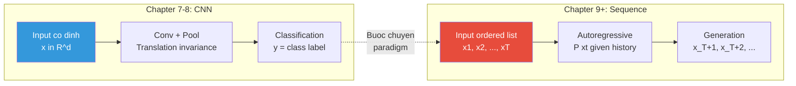

# Buổi 37 — 9.1 Working with Sequences

> **Nguồn:** [d2l.ai — 9.1](https://d2l.ai/chapter_recurrent-neural-networks/sequence.html)
> **Buổi trước:** [[Buổi 36 - Tuần 10]] — Designing CNN Architectures (AnyNet/RegNet)
> **Buổi sau:** [[Buổi 38 - Tuần 10]] — Converting Raw Text into Sequence Data + Language Models

---

## Mục tiêu buổi học

1. Hiểu **bước chuyển tư duy** từ dữ liệu cố định (vector $\mathbf{x} \in \mathbb{R}^d$) sang **dữ liệu tuần tự** (chuỗi $\mathbf{x}_1, \ldots, \mathbf{x}_T$)
2. Phân biệt các **dạng bài toán Sequence**: Seq→Fixed, Fixed→Seq, Seq→Seq (aligned & unaligned)
3. Nắm vững **Autoregressive Models** — dự đoán tương lai từ quá khứ
4. Hiểu **Chain Rule decomposition** — phân rã xác suất đồng thời thành tích xác suất có điều kiện
5. Nắm **Markov Models** — giả định chỉ cần lịch sử gần
6. Thực nghiệm: 1-step vs k-step prediction — sai số tích lũy theo hàm mũ
7. Chuẩn bị nền tảng cho RNN ở các buổi sau

---

## Active Recall — Kiến thức cũ

### Câu hỏi truy hồi (không nhìn tài liệu)

1. AnyNet Design Space có bao nhiêu free parameters? Giải thích cách tính.
2. Phương pháp thu hẹp design space từ AnyNet_A → AnyNet_E dùng công cụ thống kê nào?
3. RegNet đưa ra 4 nguyên tắc thiết kế gì? (shared kernel, shared groups, increasing ...)
4. Tại sao Design Spaces ưu việt hơn NAS? Điểm khác biệt cốt lõi là gì?
5. Stem → Body → Head pattern xuất hiện ở những kiến trúc CNN nào đã học?
6. Global Average Pooling (GAP) thay thế cái gì, và lợi ích chính là gì?
7. ResNeXt dùng grouped convolution để giảm params bao nhiêu lần so với standard conv?
8. Trong CNN, channels tăng và spatial giảm qua từng stage — tại sao pattern này cần thiết?

### Tự trả lời ngắn (Claim → Reasoning → Evidence)

1. **Claim:** AnyNet có $4 \times 4 + 1 = 17$ free parameters.
   **Reasoning:** 4 stages × 4 tham số mỗi stage ($d_i, c_i, g_i, k_i$) + 1 cho stem channels ($c_0$).
   **Evidence:** Buổi 36 §2.3: bảng 4 tham số per stage.

2. **Claim:** Dùng **CDF (Cumulative Distribution Function)** của error trên tập model samples.
   **Reasoning:** Sample ~500 models ngẫu nhiên, train nhẹ, vẽ CDF của test error. Design space tốt → CDF dịch sang trái (error nhỏ hơn).
   **Evidence:** Buổi 36 §3.1: Radosavovic et al. dùng CDF comparison ở mỗi bước thu hẹp.

3. **Claim:** 4 nguyên tắc: (1) shared kernel $k = 3$, (2) shared groups $g$, (3) increasing channels $c_1 \leq c_2 \leq c_3 \leq c_4$, (4) increasing depth $d_1 \leq d_2 \leq d_3 \leq d_4$.
   **Reasoning:** Mỗi constraint loại bỏ các cấu hình kém → thu hẹp từ ~$10^{18}$ xuống vài chục cấu hình.
   **Evidence:** Buổi 36 §4: bảng 4 nguyên tắc RegNet.

4. **Claim:** Design Spaces tìm **bộ nguyên tắc chung** (quy luật), NAS tìm **một kiến trúc cụ thể**.
   **Reasoning:** NAS cho ra 1 mạng tốt nhưng không giải thích tại sao; Design Spaces cho ra nguyên tắc áp dụng được cho nhiều cấu hình mới.
   **Evidence:** Buổi 36 §1.2: "tìm phân phối tốt" vs "tìm một kiến trúc tốt nhất".

### Concept notes cần ôn lại

- [[Batch Normalization]]
- [[Residual Connection]]
- [[Grouped Convolution]]
- [[Growth Rate (DenseNet)]]

---

## 1. Bước chuyển tư duy: Từ Vector đến Sequence

### 1.1 Vấn đề với dữ liệu cố định

> [!NOTE] ELI5
> Trước đây, mỗi "bài thi" mà model nhận chỉ có **đúng 1 trang**. Ví dụ: nhìn 1 tấm ảnh → phân loại. Nhưng bây giờ, "bài thi" là **cả quyển sách** — nhiều trang, **thứ tự quan trọng**. Câu ở trang 5 có ý nghĩa phụ thuộc vào trang 1–4. Nếu xáo trộn thứ tự trang → vô nghĩa. Đây chính là **sequence data**.

**Định nghĩa kỹ thuật:** Cho đến nay, ta đã làm việc với input là **single feature vector** $\mathbf{x} \in \mathbb{R}^d$ — mỗi mẫu là một điểm cố định trong không gian. Sequence data chuyển sang **danh sách có thứ tự** các feature vectors: $\mathbf{x}_1, \mathbf{x}_2, \ldots, \mathbf{x}_T$, trong đó mỗi $\mathbf{x}_t \in \mathbb{R}^d$ được đánh dấu bởi **time step** $t$. Điểm then chốt: **các phần tử trong chuỗi KHÔNG độc lập** — $\mathbf{x}_t$ phụ thuộc vào $\mathbf{x}_1, \ldots, \mathbf{x}_{t-1}$.

| Đặc điểm | Dữ liệu cố định (ảnh, bảng)                             | Dữ liệu tuần tự (chuỗi)                                    |
| -------- | ------------------------------------------------------- | ---------------------------------------------------------- |
| Input    | $\mathbf{x} \in \mathbb{R}^d$ — vector cố định          | $\mathbf{x}_1, \ldots, \mathbf{x}_T$ — danh sách có thứ tự |
| Giả định | Các mẫu **iid** (độc lập, cùng phân phối)               | Các time step **phụ thuộc nhau**                           |
| Thứ tự   | Không quan trọng (xáo trộn pixels → vẫn train được MLP) | **Quan trọng** (xáo trộn từ → câu vô nghĩa)                |
| Độ dài   | Cố định ($d$ chiều)                                     | **Thay đổi** ($T$ khác nhau cho mỗi mẫu)                   |
| Ví dụ    | Ảnh 224×224, bảng dữ liệu                               | Câu văn, giá cổ phiếu, chuỗi DNA                           |

### 1.2 Ví dụ thực tế về Sequence Data

| Lĩnh vực  | Sequence          | $\mathbf{x}_t$ là gì?            | $T$ = ?              |
| --------- | ----------------- | -------------------------------- | -------------------- |
| NLP       | Câu văn           | Từ (word/token)                  | Độ dài câu (~10-100) |
| Y tế      | Lịch sử bệnh nhân | Sự kiện y tế (thuốc, xét nghiệm) | Số ngày nằm viện     |
| Tài chính | Giá cổ phiếu      | Giá đóng cửa mỗi ngày            | Hàng nghìn           |
| Khí hậu   | Dữ liệu cảm biến  | Nhiệt độ, độ ẩm                  | Hàng triệu           |
| Sinh học  | Chuỗi DNA         | A, T, G, C                       | Hàng tỷ              |

> [!IMPORTANT] Tại sao phải model sequence?
> Nếu các phần tử trong chuỗi thực sự **độc lập**, ta không cần model sequence — chỉ cần xử lý từng phần tử riêng lẻ. Nhưng thực tế, **ngữ cảnh (context) là tất cả**: thuốc bệnh nhân nhận ngày thứ 10 phụ thuộc mạnh vào 9 ngày trước; từ tiếp theo trong câu phụ thuộc vào các từ đã viết. Chính sự phụ thuộc này tạo ra cơ hội dự đoán (auto-fill trên Google, gợi ý email).

---

## 2. Các dạng bài toán Sequence

> [!NOTE] ELI5
> Giống như bạn có thể: (a) đọc cả quyển sách rồi viết 1 bài review ngắn (Seq→Fixed), (b) nhìn 1 bức ảnh rồi viết cả đoạn mô tả (Fixed→Seq), (c) đọc sách tiếng Anh rồi viết lại bằng tiếng Việt (Seq→Seq unaligned), hoặc (d) đọc từng từ rồi gắn nhãn loại từ (Seq→Seq aligned). Mỗi dạng cần kiến trúc model khác nhau.

![[assets/attachments/d2l-buoi-37/sequence_problem_types.png]]
_Bốn dạng bài toán Sequence: (a) phân loại cảm xúc, (b) captioning ảnh, (c) gắn nhãn từ loại, (d) dịch máy_

| Dạng                    | Input                                      | Output                                    | Ví dụ                      | Model phổ biến               |
| ----------------------- | ------------------------------------------ | ----------------------------------------- | -------------------------- | ---------------------------- |
| **Seq → Fixed**         | Chuỗi $\mathbf{x}_1, \ldots, \mathbf{x}_T$ | Nhãn $y$                                  | Sentiment, phân loại email | RNN + Pooling, BERT          |
| **Fixed → Seq**         | Vector $\mathbf{x}$                        | Chuỗi $y_1, \ldots, y_{T'}$               | Image captioning           | CNN + RNN Decoder            |
| **Aligned Seq → Seq**   | Chuỗi (từng step)                          | Chuỗi (từng step, aligned)                | POS tagging, NER           | BiLSTM-CRF                   |
| **Unaligned Seq → Seq** | Chuỗi $\mathbf{x}_1, \ldots, \mathbf{x}_T$ | Chuỗi $y_1, \ldots, y_{T'}$ ($T' \neq T$) | Dịch máy, TTS              | Encoder-Decoder, Transformer |
| **Sequence Modeling**   | Chuỗi (unsupervised)                       | Phân phối xác suất                        | Language modeling          | RNN, GPT                     |

> [!TIP] Sequence Modeling — Bài toán cơ bản nhất
> Trước khi xử lý bất kỳ dạng Seq nào, ta cần giải quyết bài toán cơ bản: **ước lượng xác suất** $P(\mathbf{x}_1, \ldots, \mathbf{x}_T)$ — "chuỗi này có khả năng xảy ra cao không?" Đây chính là **Language Modeling** mà ta sẽ tập trung trong phần tiếp theo.

---

## 3. Autoregressive Models — Dự đoán tương lai từ quá khứ

### 3.1 Ý tưởng cốt lõi

> [!NOTE] ELI5
> Autoregressive = "tự hồi quy". Tưởng tượng bạn đang viết nhật ký. Mỗi câu bạn viết dựa trên các câu đã viết trước đó. "Auto" vì bạn dùng chính **output cũ** làm input cho output mới. Giống Google Auto-complete: gõ "Hôm nay trời" → dự đoán "đẹp", rồi "Hôm nay trời đẹp" → dự đoán "quá"... Mỗi bước dựa vào tất cả bước trước.

**Định nghĩa kỹ thuật:** **Autoregressive model** là model ước lượng xác suất có điều kiện $P(x_t \mid x_{t-1}, \ldots, x_1)$ — xác suất của phần tử tiếp theo **dựa trên toàn bộ lịch sử** trước đó. Đây là bài toán hồi quy, nhưng input chính là **các giá trị cũ của chính signal đó** (auto = tự, regressive = hồi quy).

**Vấn đề lớn:** Số lượng input $x_{t-1}, \ldots, x_1$ **thay đổi** theo $t$. Tại $t=5$: 4 inputs. Tại $t=1000$: 999 inputs. Deep learning yêu cầu **input cố định kích thước** → cần chiến lược xử lý.

### 3.2 Hai chiến lược xử lý

![[assets/attachments/d2l-buoi-37/autoregressive_models.png]]
_So sánh hai chiến lược: (a) Fixed window dùng đúng $\tau$ observations gần nhất, (b) Latent autoregressive dùng hidden state tóm tắt toàn bộ lịch sử_

#### Chiến lược 1: Fixed Window (Cửa sổ cố định $\tau$)

Chỉ dùng $\tau$ observations gần nhất: $x_{t-\tau}, \ldots, x_{t-1}$.

$$\hat{x}_t = f(x_{t-\tau}, \ldots, x_{t-1})$$

**Ưu điếm:**

- Số features **luôn cố định** = $\tau$ → dùng được bất kỳ model cố định nào (Linear Regression, MLP, CNN)
- Đơn giản, dễ implement

**Nhược điểm:**

- Mất thông tin xa hơn $\tau$ steps → Nếu pattern cần context dài hơn $\tau$ → model thất bại
- Phải **chọn** $\tau$ bao nhiêu — quá nhỏ → thiếu context, quá lớn → tốn tài nguyên

**Khi nào dùng:** Khi dữ liệu thỏa mãn (hoặc xấp xỉ) **Markov condition** — tương lai chỉ phụ thuộc quá khứ gần.

#### Chiến lược 2: Latent Autoregressive (Trạng thái ẩn)

Duy trì **hidden state** $h_t$ tóm tắt toàn bộ lịch sử:

$$h_t = g(h_{t-1}, x_{t-1}), \quad \hat{x}_t = f(h_t)$$

**Ưu điểm:**

- Có thể **nhớ** thông tin từ rất xa trong quá khứ (theo lý thuyết)
- Không cần chọn $\tau$

**Nhược điểm:**

- $h_t$ **không bao giờ được quan sát trực tiếp** → model phải tự học cách biểu diễn
- Phức tạp hơn rất nhiều để train

**Khi nào dùng:** Khi cần context dài, pattern phức tạp → Đây chính là **RNN** mà ta sẽ học từ Buổi 38!

| Tiêu chí           | Fixed Window              | Latent Autoregressive         |
| ------------------ | ------------------------- | ----------------------------- |
| Input size         | Cố định $\tau$            | Cố định (chỉ $h_t$ và $x_t$)  |
| Bộ nhớ lịch sử     | Tối đa $\tau$ steps       | Lý thuyết: vô hạn             |
| Đặc điểm           | Đơn giản, dùng MLP/Linear | Phức tạp hơn, cần RNN/LSTM    |
| Hidden state       | Không                     | $h_t$ — **trạng thái ẩn**     |
| Hạn chế chính      | Mất context xa            | Khó train, vanishing gradient |
| Kiến trúc đại diện | N-gram, MLP               | **RNN**, LSTM, GRU            |

---

## 4. Sequence Models — Phân rã xác suất đồng thời

### 4.1 Bài toán

> [!NOTE] ELI5
> Tưởng tượng bạn muốn biết: "Câu 'Hôm nay trời đẹp' có **tự nhiên** không?" Bạn cần tính xác suất của **cả câu** — $P(\text{"Hôm"}, \text{"nay"}, \text{"trời"}, \text{"đẹp"})$. Nhưng tính xác suất đồng thời của 4 biến rất khó! Trick: dùng **chain rule** tách thành từng bước nhỏ mà mỗi bước chỉ cần dự đoán **1 từ tiếp theo**.

**Định nghĩa kỹ thuật:** Cho chuỗi $x_1, \ldots, x_T$, **sequence model** ước lượng xác suất đồng thời $P(x_1, \ldots, x_T)$ — hàm khối lượng xác suất (probability mass function) cho biết **khả năng** chuỗi đó xuất hiện. Với dữ liệu rời rạc (từ ngữ), đây gọi là **Language Model**.

### 4.2 Chain Rule Decomposition — Phân rã bằng quy tắc chuỗi

Áp dụng **chain rule** của xác suất, phân rã xác suất đồng thời theo hướng trái-sang-phải:

$$P(x_1, \ldots, x_T) = P(x_1) \cdot \prod_{t=2}^{T} P(x_t \mid x_{t-1}, \ldots, x_1)$$

![[assets/attachments/d2l-buoi-37/chain_rule_decomposition.png]]
_Chain Rule phân rã xác suất chuỗi thành tích các xác suất có điều kiện — mỗi từ dựa vào toàn bộ ngữ cảnh trước_

**Giải thích từng thành phần:**

| Thành phần             | Ý nghĩa                               | Ví dụ (câu "I love cats")                                              |
| ---------------------- | ------------------------------------- | ---------------------------------------------------------------------- |
| $P(x_1)$               | Xác suất từ đầu tiên                  | $P(\text{"I"})$ — có bao nhiêu câu bắt đầu bằng "I"?                   |
| $P(x_2 \mid x_1)$      | Xác suất từ thứ 2 **biết** từ thứ 1   | $P(\text{"love"} \mid \text{"I"})$ — sau "I" thì "love" khả thi không? |
| $P(x_3 \mid x_1, x_2)$ | Xác suất từ thứ 3 **biết** 2 từ trước | $P(\text{"cats"} \mid \text{"I"}, \text{"love"})$ — rất hợp lý!        |

**Tính ví dụ:**

$$P(\text{"I love cats"}) = P(\text{"I"}) \times P(\text{"love"} \mid \text{"I"}) \times P(\text{"cats"} \mid \text{"I"}, \text{"love"})$$

> [!IMPORTANT] Insight: Sequence Modeling = Autoregressive Modeling
> Chain rule biến bài toán "tính xác suất cả chuỗi" thành chuỗi bài toán "dự đoán phần tử tiếp theo" — chính là autoregressive! Đây là nền tảng của **GPT** (Generative Pre-trained Transformer) — train model dự đoán token tiếp theo, và từ đó sinh ra cả đoạn văn.

### 4.3 Tại sao factorize trái → phải?

Về mặt toán học, ta có thể factorize theo **bất kỳ thứ tự nào** (phải → trái cũng hợp lệ):

$$P(x_1, \ldots, x_T) = P(x_T) \cdot \prod_{t=T-1}^{1} P(x_t \mid x_{t+1}, \ldots, x_T)$$

Nhưng **trái → phải** được ưu tiên vì 3 lý do:

| Lý do                    | Giải thích                                                                                                                                                             |
| ------------------------ | ---------------------------------------------------------------------------------------------------------------------------------------------------------------------- |
| **Tự nhiên**             | Con người đọc/viết từ trái → phải. Trực giác mạnh hơn khi dự đoán "từ tiếp theo"                                                                                       |
| **Mở rộng dễ**           | Đã có $P(x_1, \ldots, x_t)$, muốn thêm $x_{t+1}$ → chỉ cần nhân thêm $P(x_{t+1} \mid \ldots)$                                                                          |
| **Nhân quả (Causality)** | Quá khứ ảnh hưởng tương lai, nhưng tương lai **không** ảnh hưởng ngược. Dự đoán $P(x_{t+1} \mid x_t)$ thường dễ hơn $P(x_t \mid x_{t+1})$ vì chiều thuận theo nhân quả |

> [!TIP] Ứng dụng: GPT vs BERT
>
> - **GPT** (left-to-right): dự đoán token tiếp theo = autoregressive → tốt cho **sinh văn bản**
> - **BERT** (masked): dự đoán token bị che, dùng cả context trái lẫn phải → tốt cho **hiểu ngữ cảnh**
>   Cả hai đều dựa trên chain rule, nhưng factorize theo hướng khác nhau.

---

## 5. Markov Models — Giản lược hóa lịch sử

### 5.1 Markov Condition

> [!NOTE] ELI5
> Markov condition nói rằng: "bạn chỉ cần nhớ **vài bước gần nhất** để dự đoán bước tiếp theo, không cần nhớ toàn bộ quá khứ." Giống như khi lái xe: để biết rẽ trái hay phải ở ngã tư tiếp theo, bạn chỉ cần biết mình đang ở đâu **bây giờ** (và có thể vài km trước), không cần nhớ hành trình từ nhà đến đây.

**Định nghĩa kỹ thuật:** Một chuỗi thỏa mãn **Markov condition bậc $\tau$** nếu tương lai **độc lập có điều kiện** với quá khứ xa hơn $\tau$ steps:

$$P(x_t \mid x_{t-1}, \ldots, x_1) = P(x_t \mid x_{t-1}, \ldots, x_{t-\tau})$$

Nghĩa là: biết $\tau$ bước gần nhất thì thêm lịch sử trước đó **không cung cấp thông tin gì thêm**.

![[assets/attachments/d2l-buoi-37/markov_models.png]]
_Markov Models: bậc 1 chỉ cần 1 step trước, bậc 3 cần 3 steps, full model cần toàn bộ lịch sử_

### 5.2 Các trường hợp đặc biệt

**Markov bậc 1 ($\tau = 1$):** Tương lai chỉ phụ thuộc bước ngay trước:

$$P(x_1, \ldots, x_T) = P(x_1) \cdot \prod_{t=2}^{T} P(x_t \mid x_{t-1})$$

- Đây chính là [[Markov Chain]] — nền tảng của PageRank, MCMC, Hidden Markov Models
- Dùng bảng đếm tần suất: $P(x_t \mid x_{t-1}) = \frac{\text{count}(x_{t-1}, x_t)}{\text{count}(x_{t-1})}$

**Markov bậc $k$ — tương đương N-gram:**

$$P(x_t \mid x_{t-1}, \ldots, x_{t-k}) \quad \Leftrightarrow \quad \text{(k+1)-gram Language Model}$$

| Markov bậc      | N-gram tương đương | Context    | Ví dụ               |
| --------------- | ------------------ | ---------- | ------------------- |
| $\tau = 1$      | Bigram             | 1 từ trước | "I" → "love"        |
| $\tau = 2$      | Trigram            | 2 từ trước | "I love" → "cats"   |
| $\tau = 3$      | 4-gram             | 3 từ trước | "I love my" → "cat" |
| $\tau = \infty$ | Full model         | Toàn bộ    | RNN, Transformer    |

> [!WARNING] Markov assumption thường **sai** trong thực tế!
> Ngôn ngữ tự nhiên có **long-range dependency**: "The **cat** that sat on the mat **is** cute" — từ "is" phụ thuộc vào "cat" (cách 6 từ), không phải "mat". Markov bậc 2–3 không bắt được dependency này. Đây chính là lý do cần **RNN** và **Transformer** — các model có khả năng xử lý context dài.

### 5.3 Trade-off: $\tau$ nhỏ vs $\tau$ lớn

| $\tau$ nhỏ (1–3)                     | $\tau$ lớn (100+)                        |
| ------------------------------------ | ---------------------------------------- |
| Ít tham số, train nhanh              | Nhiều tham số, cần data lớn              |
| Mất context xa                       | Bắt được long-range dependencies         |
| Curse of dimensionality thấp         | Curse of dimensionality cao              |
| Dùng cho: N-gram, simple time series | Dùng cho: NLP, speech, complex sequences |

> [!NOTE] Thực tế thú vị
> Ngay cả massive RNN-based và Transformer-based language models ngày nay **hiếm khi** xử lý hơn vài nghìn tokens context. GPT-4 Turbo có context window 128K tokens — nhưng đây vẫn là "cửa sổ" hữu hạn, không phải vô hạn.

---

## 6. Thực nghiệm: Autoregressive trên dữ liệu tổng hợp

### 6.1 Tạo dữ liệu

Sách D2L sử dụng hàm **sin** với noise:

$$x_t = \sin(0.01 \cdot t) + \epsilon_t, \quad \epsilon_t \sim \mathcal{N}(0, 0.04)$$

- $T = 1000$ time steps
- 600 train, 400 test
- $\tau = 4$ (fixed window — Markov bậc 4)

```python
import torch
from torch import nn

T = 1000
time = torch.arange(1, T + 1, dtype=torch.float32)
x = torch.sin(0.01 * time) + torch.randn(T) * 0.2
```

### 6.2 Tạo training data với Fixed Window

Với $\tau = 4$, mỗi mẫu train có:

- **Features:** $[x_{t-4}, x_{t-3}, x_{t-2}, x_{t-1}]$ — 4 giá trị quá khứ
- **Label:** $x_t$ — giá trị cần dự đoán

```python
tau = 4
features = torch.stack([x[i : T-tau+i] for i in range(tau)], dim=1)
# features.shape = (996, 4) — mỗi row là 1 cửa sổ 4 steps
labels = x[tau:].reshape(-1, 1)
# labels.shape = (996, 1) — giá trị cần predict

num_train = 600
```

> [!IMPORTANT] Data leakage risk!
> Luôn tôn trọng **thứ tự thời gian**: train trên data quá khứ, test trên data tương lai. **Không bao giờ** xáo trộn (shuffle) để train trên data tương lai. Đây là nguyên tắc quan trọng nhất khi làm việc với time series data.

### 6.3 Model: Linear Regression đơn giản

Model cực đơn giản: $\hat{x}_t = \mathbf{w}^T [x_{t-4}, x_{t-3}, x_{t-2}, x_{t-1}] + b$

```python
model = nn.Linear(tau, 1)
optimizer = torch.optim.Adam(model.parameters(), lr=0.01)
loss_fn = nn.MSELoss()

# Training loop (simplified)
for epoch in range(5):
    pred = model(features[:num_train])
    loss = loss_fn(pred, labels[:num_train])
    optimizer.zero_grad()
    loss.backward()
    optimizer.step()
```

Mặc dù model rất đơn giản (chỉ 5 params: 4 weights + 1 bias), nó hoạt động **tốt đáng ngạc nhiên** cho 1-step prediction vì hàm sin khá mượt.

---

## 7. Prediction: 1-step vs Multi-step — Sai số tích lũy

### 7.1 1-step prediction (tốt!)

Dùng **đúng giá trị thực** làm input → dự đoán bước tiếp theo:

$$\hat{x}_t = f(x_{t-4}, x_{t-3}, x_{t-2}, x_{t-1}) \quad \text{— input là ground truth}$$

Kết quả: rất chính xác, gần như khớp perfect với hàm sin gốc.

### 7.2 Multi-step prediction (tệ!)

Khi dự đoán xa hơn (ví dụ: từ $t=604$ trở đi), ta **không có** giá trị thực — phải dùng **output cũ** làm input:

$$
\begin{aligned}
\hat{x}_{605} &= f(x_{601}, x_{602}, x_{603}, x_{604}) \\
\hat{x}_{606} &= f(x_{602}, x_{603}, x_{604}, \hat{x}_{605}) \\
\hat{x}_{607} &= f(x_{603}, x_{604}, \hat{x}_{605}, \hat{x}_{606}) \\
\hat{x}_{608} &= f(x_{604}, \hat{x}_{605}, \hat{x}_{606}, \hat{x}_{607}) \\
\hat{x}_{609} &= f(\hat{x}_{605}, \hat{x}_{606}, \hat{x}_{607}, \hat{x}_{608}) \quad \text{— 100\% dùng dự đoán!}
\end{aligned}
$$

![[assets/attachments/d2l-buoi-37/k_step_prediction.png]]
_Trái: 1-step predictions (xanh, tốt) vs multi-step (đỏ, hội tụ về 0). Phải: sai số tăng theo hàm mũ — k=64 thì hoàn toàn vô nghĩa._

### 7.3 Phân tích sai số tích lũy (Error Accumulation)

> [!NOTE] ELI5
> Giống như trò **truyền tin**. Người đầu nói "con mèo đen" → người 2 nghe thành "con mèo đêm" → người 3 nghe thành "con mèo đêm nay" → sau 10 người, camera bàn ra "cá mập trắng". Mỗi bước thêm **một chút sai số nhỏ**, nhưng sai số **tích lũy theo hàm mũ**.

**Phân tích toán học:**

Giả sử mỗi bước dự đoán có sai số $\bar{\epsilon}$:

- Bước 1: $\epsilon_1 = \bar{\epsilon}$
- Bước 2: input đã bị nhiễu $\epsilon_1$ → sai số $\epsilon_2 \sim \bar{\epsilon} + c \cdot \epsilon_1$
- Bước $k$: $\epsilon_k \sim \bar{\epsilon} \cdot (1 + c)^k$ — **tăng theo hàm mũ!**

Sau vài chục bước, dự đoán **hoàn toàn vô nghĩa** — hội tụ về giá trị trung bình (thường là 0).

**So sánh theo số bước $k$:**

| $k$ (bước) | Chất lượng | Analog thực tế             |
| ---------- | ---------- | -------------------------- |
| $k = 1$    | Rất tốt    | Dự báo thời tiết 1 giờ tới |
| $k = 4$    | Khá tốt    | Dự báo thời tiết 1 ngày    |
| $k = 16$   | Kém        | Dự báo thời tiết 1 tuần    |
| $k = 64$   | Vô nghĩa   | Dự báo thời tiết 2 tháng   |

> [!IMPORTANT] Bài học trung tâm: **Interpolation dễ, Extrapolation khó**
>
> - **Interpolation** (nội suy): dự đoán trong vùng data đã thấy → dễ, chính xác
> - **Extrapolation** (ngoại suy): dự đoán ngoài vùng data → khó, sai số tích lũy
>
> Multi-step prediction chính là extrapolation trong miền thời gian. Đây là lý do tại sao:
>
> - Dự báo thời tiết chỉ chính xác vài ngày
> - Stock prediction dài hạn gần như bất khả thi
> - Language models đôi khi "hallucinate" khi generate dài

### 7.4 Tại sao điều này quan trọng cho RNN?

Vấn đề sai số tích lũy là **thách thức cốt lõi** của mọi sequence model:

1. **Training:** Teacher forcing — dùng ground truth làm input → 1-step tốt nhưng multi-step kém
2. **Inference:** Phải dùng output cũ → sai số tích lũy
3. **Giải pháp:** Scheduled sampling, beam search, attention mechanism (sẽ học ở các buổi sau)

---

## 8. Stationarity — Giả định ổn định

### 8.1 Khái niệm

> [!NOTE] ELI5
> Stationarity nói: "quy luật trò chơi **không đổi** theo thời gian." Ví dụ: nếu cách giá cổ phiếu thay đổi từ ngày này sang ngày khác **luôn tuân theo cùng quy tắc** (dù giá thay đổi), thì chuỗi đó stationary. Giống như luật giao thông: xe cộ khác nhau mỗi ngày (giá trị thay đổi) nhưng đèn đỏ = dừng **luôn đúng** (quy luật không đổi).

**Định nghĩa kỹ thuật:** Một quá trình ngẫu nhiên là **stationary** nếu cơ chế sinh dữ liệu (dynamics) **không thay đổi theo thời gian**. Cụ thể: $P(x_t \mid x_{t-1}, \ldots)$ có cùng dạng tại mọi thời điểm $t$.

**Thực tế:** Ta thường **giả định** stationarity dù biết nó chỉ xấp xỉ đúng:

- Ngôn ngữ thay đổi qua thế kỷ (từ mới, ngữ pháp mới)
- Hành vi khách hàng thay đổi theo mùa
- Nhưng trong khoảng thời gian ngắn → xấp xỉ stationary là hợp lý

---

## 9. Tổng kết & Bản đồ kiến thức

### 9.1 Từ CNN đến Sequence: Bước chuyển paradigm



### 9.2 Bảng tóm tắt concepts buổi hôm nay

| Concept                   | Định nghĩa ngắn                                            | Tại sao quan trọng                             |
| ------------------------- | ---------------------------------------------------------- | ---------------------------------------------- |
| **Sequence data**         | $\mathbf{x}_1, \ldots, \mathbf{x}_T$ — danh sách có thứ tự | 80% dữ liệu thực tế là sequential              |
| **Autoregressive model**  | $P(x_t \mid x_{t-1}, \ldots, x_1)$                         | Nền tảng của GPT và mọi LLM                    |
| **Chain rule**            | $P(\text{joint}) = \prod P(\text{conditional})$            | Quy sequence modeling về next-token prediction |
| **Markov condition**      | Chỉ cần $\tau$ bước gần nhất                               | Giản lược hóa, N-gram, HMM                     |
| **Fixed window ($\tau$)** | Dùng đúng $\tau$ observations gần nhất                     | Đơn giản, nhưng mất context xa                 |
| **Latent state ($h_t$)**  | Hidden state tóm tắt lịch sử                               | Nền tảng của RNN (buổi sau)                    |
| **Error accumulation**    | Sai số multi-step tăng theo hàm mũ                         | Giới hạn cốt lõi của mọi sequence model        |
| **Stationarity**          | Dynamics không đổi theo thời gian                          | Giả định cần thiết để train có ý nghĩa         |

### 9.3 Chuẩn bị cho buổi sau

Buổi 38 sẽ cover:

- **9.2 Converting Raw Text into Sequence Data:** tokenization, vocabulary, corpus
- **9.3 Language Models:** perplexity, N-gram counting

Kiến thức buổi hôm nay là **nền tảng bắt buộc** — mọi thứ từ RNN, LSTM, GRU, đến Transformer đều dựa trên autoregressive framework + chain rule decomposition.

---

## 10. Active Recall chuyên sâu — Buổi 37

### Câu hỏi (thử trả lời trước khi xem đáp án)

1. Sequence data khác gì dữ liệu cố định? Nêu 3 điểm khác biệt.
2. Autoregressive model giải quyết bài toán gì? Viết công thức.
3. Chain rule decomposition biến bài toán "xác suất chuỗi" thành gì?
4. Markov bậc 2 tương đương N-gram nào?
5. Fixed window ($\tau=4$) và Latent autoregressive khác nhau ở đâu?
6. Tại sao multi-step prediction kém hơn nhiều so với 1-step?
7. Viết công thức multi-step prediction cho $\hat{x}_{t+3}$ với $\tau=2$.
8. Stationarity assumption là gì và khi nào nó bị vi phạm?
9. Tại sao factorize trái→phải tốt hơn phải→trái?
10. Latent autoregressive model chính là tiền thân của kiến trúc nào?

### Đáp án

1. **Claim:** 3 khác biệt: (i) thứ tự quan trọng, (ii) phần tử không iid, (iii) độ dài thay đổi.
   **Reasoning:** Ảnh xáo trộn pixel → MLP vẫn hoạt động. Câu xáo trộn từ → vô nghĩa. Mỗi câu dài khác nhau.
   **Evidence:** §1.1 bảng so sánh.

2. **Claim:** Ước lượng $P(x_t \mid x_{t-1}, \ldots, x_1)$ — xác suất phần tử tiếp theo dựa trên lịch sử.
   **Reasoning:** "Auto" vì dùng chính signal cũ để hồi quy signal mới.
   **Evidence:** §3.1.

3. **Claim:** Thành chuỗi bài toán "dự đoán token tiếp theo": $P(x_1, \ldots, x_T) = P(x_1) \prod_{t=2}^{T} P(x_t \mid x_{t-1}, \ldots, x_1)$.
   **Reasoning:** Mỗi thừa số là 1 bài autoregressive prediction.
   **Evidence:** §4.2.

4. **Claim:** Trigram (3-gram).
   **Reasoning:** Markov bậc 2: $P(x_t \mid x_{t-1}, x_{t-2})$ — dùng 2 từ trước. 3-gram = xem 3 từ liên tiếp, predict từ thứ 3 dựa trên 2 từ đầu.
   **Evidence:** §5.2 bảng N-gram mapping.

5. **Claim:** Fixed window dùng đúng $\tau$ values gần nhất (có thể mất context xa); latent autoregressive nén toàn bộ lịch sử vào hidden state $h_t$ (lý thuyết: nhớ vô hạn).
   **Reasoning:** $f(x_{t-\tau}, \ldots, x_{t-1})$ vs $f(h_t)$ với $h_t = g(h_{t-1}, x_{t-1})$.
   **Evidence:** §3.2 bảng so sánh.

6. **Claim:** Sai số tích lũy theo hàm mũ: $\epsilon_k \sim \bar{\epsilon} \cdot (1+c)^k$.
   **Reasoning:** Mỗi bước nhận input đã bị nhiễu → thêm noise → bước sau lại nhận noise lớn hơn → feedback loop dương.
   **Evidence:** §7.3: phân tích error accumulation.

7. **Claim:** $\hat{x}_{t+1} = f(x_{t-1}, x_t)$, $\hat{x}_{t+2} = f(x_t, \hat{x}_{t+1})$, $\hat{x}_{t+3} = f(\hat{x}_{t+1}, \hat{x}_{t+2})$.
   **Reasoning:** Mỗi bước dùng 2 giá trị gần nhất; từ bước 3 trở đi hoàn toàn dùng giá trị predicted.
   **Evidence:** §7.2 chuỗi công thức multi-step.

8. **Claim:** Dynamics sinh dữ liệu không đổi theo thời gian. Vi phạm khi: ngôn ngữ tiến hóa, thị trường tài chính có structural break, mùa vụ.
   **Reasoning:** Model train trên data 2020 có thể không áp dụng được cho 2025 nếu distribution shift xảy ra.
   **Evidence:** §8.1.

9. **Claim:** 3 lý do: tự nhiên (đọc trái→phải), mở rộng dễ (nhân thêm 1 thừa số), nhân quả (quá khứ → tương lai, không ngược lại).
   **Reasoning:** Dự đoán $P(x_{t+1} \mid x_t)$ dễ hơn $P(x_t \mid x_{t+1})$ vì chiều thuận nhân quả.
   **Evidence:** §4.3 bảng 3 lý do.

10. **Claim:** RNN (Recurrent Neural Network) — chính xác là latent autoregressive với $h_t = g(h_{t-1}, x_{t-1})$.
    **Reasoning:** RNN duy trì hidden state được cập nhật tại mỗi time step, encode toàn bộ lịch sử vào vector $h_t$.
    **Evidence:** §3.2 và preview cho buổi 38+.

### Concept notes cần ôn lại

- [[Markov Chain]]
- [[N-gram Language Model]]
- [[Perplexity]]

---

## 11. Bảng thuật ngữ

| Thuật ngữ                     | Tiếng Việt               | Định nghĩa ngắn                                          |
| ----------------------------- | ------------------------ | -------------------------------------------------------- |
| **Sequence**                  | Chuỗi                    | Danh sách có thứ tự $\mathbf{x}_1, \ldots, \mathbf{x}_T$ |
| **Time step**                 | Bước thời gian           | Chỉ số $t$ trong chuỗi                                   |
| **Autoregressive**            | Tự hồi quy               | Dùng output cũ làm input mới                             |
| **Chain rule**                | Quy tắc chuỗi (xác suất) | $P(A,B) = P(A) \cdot P(B \mid A)$                        |
| **Markov condition**          | Điều kiện Markov         | Tương lai chỉ phụ thuộc $\tau$ bước gần                  |
| **Latent variable**           | Biến ẩn                  | $h_t$ — không quan sát được trực tiếp                    |
| **Stationarity**              | Tính dừng                | Dynamics không đổi theo thời gian                        |
| **$k$-step-ahead prediction** | Dự đoán $k$ bước trước   | $\hat{x}_{t+k}$ dựa trên $x_1, \ldots, x_t$              |
| **Error accumulation**        | Tích lũy sai số          | Sai số tăng theo hàm mũ khi predict xa                   |
| **Interpolation**             | Nội suy                  | Dự đoán trong vùng data đã thấy                          |
| **Extrapolation**             | Ngoại suy                | Dự đoán ngoài vùng data — khó hơn nhiều                  |

---

## 12. Mapping với D2L gốc

| Section trong D2L         | Nội dung                        | Section tương ứng trong note |
| ------------------------- | ------------------------------- | ---------------------------- |
| 9.1 intro                 | From fixed to sequence inputs   | §1, §2                       |
| 9.1 Autoregressive Models | AR models, fixed window, latent | §3                           |
| 9.1 Sequence Models       | Chain rule, Markov              | §4, §5                       |
| 9.1 Training              | Synthetic sin data, dataloader  | §6                           |
| 9.1 Prediction            | 1-step vs k-step                | §7                           |
| 9.1 Summary               | Key takeaways                   | §9                           |

---

## Liên kết

### Concepts

- [[Markov Chain