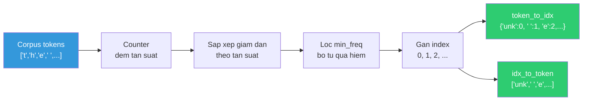
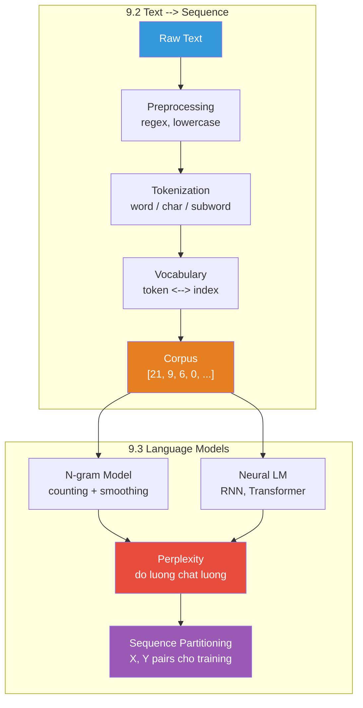

# Buổi 38 — 9.2 Converting Raw Text into Sequence Data & 9.3 Language Models

> **Nguồn:** [d2l.ai — 9.2](https://d2l.ai/chapter_recurrent-neural-networks/text-sequence.html), [d2l.ai — 9.3](https://d2l.ai/chapter_recurrent-neural-networks/language-model.html)
> **Buổi trước:** [[Buổi 37 - Tuần 10]] — Working with Sequences
> **Buổi sau:** [[Buổi 39 - Tuần 11]] — Recurrent Neural Networks (RNN)

---

## Mục tiêu buổi học

1. Nắm vững **pipeline tiền xử lý** văn bản thô: Reading → Preprocessing → Tokenization → Vocabulary → Indices
2. Hiểu sâu **3 cấp độ Tokenization**: word-level, character-level, subword (BPE)
3. Triển khai lớp **Vocab** — ánh xạ hai chiều giữa token và chỉ số (index)
4. Khám phá **Zipf's Law** — quy luật phân phối tần suất từ trong ngôn ngữ tự nhiên
5. Hiểu bản chất **Language Model** — ước lượng $P(x_1, x_2, \ldots, x_T)$
6. Nắm vững mô hình **N-gram** và các hạn chế (sparsity, Laplace smoothing)
7. Giải thích **Perplexity** — thước đo chất lượng language model
8. Hiểu cách **phân chia chuỗi** (sequence partitioning) thành input-target pairs cho training

---

## Active Recall — Kiến thức cũ

### Câu hỏi truy hồi (không nhìn tài liệu)

1. Sequence data khác dữ liệu cố định ở những điểm nào? (nêu ít nhất 3 điểm)
2. Autoregressive model ước lượng đại lượng nào? Viết công thức.
3. Chain rule decomposition biến xác suất đồng thời thành gì?
4. Markov bậc 2 tương đương N-gram nào? Tại sao?
5. Fixed window ($\tau$) vs Latent autoregressive — khác nhau cốt lõi ở đâu?
6. Multi-step prediction kém hơn 1-step vì lý do gì? Viết công thức sai số tích lũy.
7. Stationarity assumption là gì? Khi nào bị vi phạm?

### Tự trả lời ngắn (Claim → Reasoning → Evidence)

1. **Claim:** 3 khác biệt: (i) thứ tự quan trọng, (ii) phần tử phụ thuộc nhau (không iid), (iii) độ dài thay đổi.
   **Reasoning:** Xáo trộn từ trong câu → vô nghĩa, khác với ảnh có thể permute pixels.
   **Evidence:** Buổi 37 §1.1 bảng so sánh.

2. **Claim:** Ước lượng $P(x_t \mid x_{t-1}, \ldots, x_1)$.
   **Reasoning:** "Auto" = dùng chính output cũ; "regressive" = hồi quy giá trị mới.
   **Evidence:** Buổi 37 §3.1.

3. **Claim:** Thành tích các xác suất có điều kiện: $P(x_1, \ldots, x_T) = P(x_1) \prod_{t=2}^{T} P(x_t \mid x_{t-1}, \ldots, x_1)$.
   **Reasoning:** Mỗi thừa số là 1 bài next-token prediction.
   **Evidence:** Buổi 37 §4.2.

4. **Claim:** Trigram (3-gram). Markov bậc 2: $P(x_t \mid x_{t-1}, x_{t-2})$ dùng 2 từ trước, cộng với từ hiện tại = 3 items = trigram.
   **Evidence:** Buổi 37 §5.2 bảng N-gram mapping.

5. **Claim:** Fixed window cố định $\tau$ values gần nhất (mất context xa); Latent AR nén toàn bộ lịch sử vào $h_t$.
   **Evidence:** Buổi 37 §3.2.

6. **Claim:** Sai số tích lũy theo hàm mũ: $\epsilon_k \sim \bar{\epsilon} \cdot (1+c)^k$.
   **Reasoning:** Mỗi bước nhận input đã bị nhiễu → feedback loop dương.
   **Evidence:** Buổi 37 §7.3.

7. **Claim:** Dynamics sinh dữ liệu không đổi theo thời gian. Vi phạm khi ngôn ngữ tiến hóa, thị trường có structural break.
   **Evidence:** Buổi 37 §8.1.

### Concept notes cần ôn lại

- [[Markov Chain]]
- [[N-gram Language Model]]
- [[Perplexity]]

---

# PHẦN I — 9.2 CONVERTING RAW TEXT INTO SEQUENCE DATA

---

## 1. Tổng quan Pipeline: Từ văn bản thô đến chuỗi số

### 1.1 Bài toán

> [!NOTE] ELI5
> Máy tính không hiểu chữ — nó chỉ hiểu số. Vậy muốn dạy máy đọc sách, ta phải **dịch** từng chữ cái (hoặc từng từ) thành số. Giống như bạn gán mã số cho từng học sinh trong lớp: "An" = 1, "Bình" = 2, ... Khi thầy giáo gọi "số 5", mọi người biết đó là "Dũng". Pipeline tiền xử lý văn bản chính là quá trình **gán mã số** cho từng đơn vị ngôn ngữ.

**Định nghĩa kỹ thuật:** Trong Deep Learning cho NLP, ta cần chuyển đổi **chuỗi ký tự** (strings) thành **chuỗi số nguyên** (integer sequences) mà model có thể xử lý. Quá trình này gồm 4 bước tuần tự: (1) đọc văn bản thô vào bộ nhớ, (2) tiền xử lý (chuẩn hóa, loại bỏ noise), (3) tokenization (tách thành đơn vị nhỏ), (4) xây dựng vocabulary và chuyển thành indices.

**Tại sao cần pipeline này?** Neural networks nhận input dạng tensor số (float/int). Văn bản là dữ liệu phi cấu trúc — cần một quy trình chuẩn hóa để mapping từ không gian ký tự sang không gian số mà vẫn **bảo toàn thông tin ngữ nghĩa**.

![[assets/attachments/d2l-buoi-38/text_processing_pipeline.png]]
_Pipeline 4 bước: từ văn bản thô "The Time Machine, by H. G. Wells" → chuỗi indices [21, 9, 6, 0, ...]_

### 1.2 Tóm tắt 4 bước

| Bước | Tên | Input | Output | Ví dụ |
| ---- | --- | ----- | ------ | ----- |
| 1 | **Reading** | File text | String thô | `"The Time Machine, by H. G. Wells [1898]"` |
| 2 | **Preprocessing** | String thô | String sạch | `"the time machine by h g wells"` |
| 3 | **Tokenization** | String sạch | List of tokens | `['t','h','e',' ','t','i','m','e',...]` |
| 4 | **Vocab + Indexing** | List of tokens | List of integers | `[21, 9, 6, 0, 21, 10, 14, 6, ...]` |

---

## 2. Bước 1 & 2: Đọc và tiền xử lý văn bản

### 2.1 Reading the Dataset

> [!NOTE] ELI5
> Bước đầu tiên đơn giản nhất: mở file sách ra và đọc toàn bộ nội dung vào biến. Giống như bạn photocopy nguyên cuốn sách thành 1 tờ giấy khổng lồ — chưa cắt, chưa sửa gì hết.

D2L sử dụng cuốn **"The Time Machine"** của H.G. Wells (~30,000 từ) làm dataset mẫu:

```python
import collections
import random
import re
import torch

# Giả sử đã download file timemachine.txt
with open('../data/timemachine.txt') as f:
    raw_text = f.read()

print(raw_text[:60])
# 'The Time Machine, by H. G. Wells [1898]\n\n\n\n\nI\n\n\nThe Time Tra'
```

**Quan sát:** Văn bản thô chứa đầy **noise**: ký tự đặc biệt (`[1898]`), dấu câu (`,`), chữ hoa/thường lẫn lộn, nhiều dòng trống (`\n\n\n`).

### 2.2 Preprocessing — Chuẩn hóa văn bản

> [!NOTE] ELI5
> Giống như khi bạn chép bài — bỏ qua dấu chấm phẩy, viết hết chữ thường, bỏ số trang. Mục đích: làm cho văn bản **đồng nhất**, giảm bớt "rác" mà model không cần quan tâm.

**Kỹ thuật:** Dùng Regular Expression (regex) để loại bỏ mọi ký tự không phải chữ cái, thay bằng khoảng trắng, và chuyển hết sang chữ thường:

```python
def preprocess(text):
    """Loại bỏ tất cả ký tự không phải chữ cái, chuyển về lowercase."""
    return re.sub('[^A-Za-z]+', ' ', text).lower()

text = preprocess(raw_text)
print(text[:60])
# 'the time machine by h g wells i the time traveller for so it'
```

**Phân tích regex `[^A-Za-z]+`:**

| Thành phần | Ý nghĩa |
| ---------- | ------- |
| `[^...]` | Phủ định — match bất kỳ ký tự nào **không** nằm trong dấu ngoặc |
| `A-Za-z` | Tất cả chữ cái Latin (hoa + thường) |
| `+` | Match **1 hoặc nhiều** ký tự liên tiếp |

Kết quả: `"The Time Machine, by H. G. Wells [1898]"` → `"the time machine by h g wells "`.

> [!WARNING] Đây là preprocessing cực đơn giản!
> Trong thực tế, preprocessing phức tạp hơn rất nhiều:
> - Giữ lại dấu câu (quan trọng cho sentiment analysis)
> - Xử lý Unicode, emoji
> - Lemmatization (running → run)
> - Xử lý viết tắt (don't → do not)
> 
> D2L chọn cách đơn giản nhất để tập trung vào **kiến trúc model**, không phải engineering.

---

## 3. Bước 3: Tokenization — Tách văn bản thành đơn vị nhỏ

### 3.1 Token là gì?

> [!NOTE] ELI5
> Token là **viên gạch nhỏ nhất** để xây câu. Giống như LEGO: bạn có thể chọn viên gạch to (= 1 từ "machine"), viên gạch trung bình (= 1 mảnh từ "mach" + "ine"), hoặc viên gạch chấm (= 1 ký tự "m", "a", "c", ...). Viên gạch càng nhỏ → bạn có **ít loại gạch hơn** nhưng câu dài hơn. Viên gạch càng to → **nhiều loại gạch** nhưng câu ngắn hơn.

**Định nghĩa kỹ thuật:** **Token** là đơn vị nguyên tử (không thể chia nhỏ hơn) của văn bản mà model xử lý. Mỗi time step trong sequence tương ứng với 1 token. Lựa chọn token là **design decision** ảnh hưởng trực tiếp đến vocabulary size và sequence length.

**Tại sao quan trọng?** Cách tokenize quyết định:
- **Vocabulary size** (bao nhiêu token khác nhau → ảnh hưởng embedding layer)
- **Sequence length** (chuỗi dài bao nhiêu → ảnh hưởng computational cost)
- **Khả năng xử lý từ mới** (unseen words → OOV problem)

### 3.2 Ba cấp độ Tokenization

![[assets/attachments/d2l-buoi-38/tokenization_comparison.png]]
_So sánh trực quan 3 phương pháp tokenization trên cùng một input_

#### 3.2.1 Word-level Tokenization

Chia văn bản theo **khoảng trắng** — mỗi token = 1 từ:

```python
def tokenize_words(text):
    return text.split()

words = tokenize_words(text)
print(words[:10])
# ['the', 'time', 'machine', 'by', 'h', 'g', 'wells', 'i', 'the', 'time']
```

| Ưu điểm | Nhược điểm |
| ------- | ---------- |
| Trực giác tự nhiên | Vocabulary **rất lớn** (tiếng Anh ~170K từ) |
| Mỗi token mang nghĩa rõ ràng | Không xử lý được **từ mới** (OOV) |
| Sequence ngắn | "running", "runs", "ran" → 3 tokens khác nhau (dư thừa) |

**Vocabulary cho The Time Machine:** ~4,580 từ duy nhất.

#### 3.2.2 Character-level Tokenization

Mỗi token = 1 **ký tự** đơn lẻ:

```python
def tokenize_chars(text):
    return list(text)

chars = tokenize_chars(text)
print(','.join(chars[:30]))
# 't,h,e, ,t,i,m,e, ,m,a,c,h,i,n,e, ,b,y, ,h, ,g, ,w,e,l,l,s, '
```

| Ưu điểm | Nhược điểm |
| ------- | ---------- |
| Vocabulary **cực nhỏ** (~28: a-z + space + `<unk>`) | Sequence **cực dài** (câu 10 từ = ~60 chars) |
| **Không bao giờ** gặp OOV | Mỗi token ít mang nghĩa (chữ 'e' → là gì?) |
| Đơn giản, robust | Model phải tự **học** cách ghép chars thành words → khó hơn |

> [!TIP] D2L chọn Character-level
> Trong sách D2L, các ví dụ tiếp theo (RNN, LSTM) sẽ dùng **character-level tokenization**. Lý do: vocabulary nhỏ (28) nên embedding layer nhỏ, dễ demo trên máy bình thường. Tuy nhiên, trong thực tế production, **subword tokenization** (BPE) là chuẩn.

#### 3.2.3 Subword Tokenization (tham khảo)

Chia từ thành **mảnh từ** (subwords) — balance giữa word và char:

| Phương pháp | Sử dụng bởi | Ý tưởng |
| ----------- | ----------- | ------- |
| **BPE** (Byte-Pair Encoding) | GPT-2, GPT-3, GPT-4 | Merge cặp ký tự phổ biến nhất lặp đi lặp lại |
| **WordPiece** | BERT, DistilBERT | Tương tự BPE, dùng likelihood thay vì frequency |
| **SentencePiece** | T5, mBART | Xử lý raw text (kể cả khoảng trắng) |

Ví dụ BPE: `"unhappiness"` → `["un", "happiness"]` hoặc `["un", "happ", "iness"]`.

> [!IMPORTANT] Tại sao subword thắng?
> - Word-level: vocab quá lớn, không handle OOV
> - Char-level: sequence quá dài, model phải tự ghép
> - **Subword: cân bằng** — vocab ~30K-50K, xử lý từ mới bằng cách tách thành sub-parts đã biết
> 
> Đây là lý do tất cả LLM hiện đại (GPT-4, Claude, Gemini) đều dùng subword tokenization.

### 3.3 So sánh tổng hợp

| Tiêu chí | Word-level | Character-level | Subword (BPE) |
| -------- | ---------- | --------------- | ------------- |
| **Vocabulary size** | ~4,580 (corpus nhỏ) → 170K+ (tiếng Anh) | 28 (a-z + space + unk) | 30K-50K |
| **Sequence length** | Ngắn (~30K tokens / cuốn sách) | Dài (~170K tokens / cuốn sách) | Trung bình |
| **OOV problem** | Nghiêm trọng | Không bao giờ | Rất hiếm |
| **Semantic meaning per token** | Cao ("machine" = máy) | Thấp ("m" = ?) | Trung bình ("mach" ≈ máy) |
| **Use case** | NLP cổ điển | Demo, ngôn ngữ tổng hợp | **SOTA: GPT, BERT, T5** |

---

## 4. Bước 4: Vocabulary — Từ điển ánh xạ Token ↔ Index

### 4.1 Tại sao cần Vocabulary?

> [!NOTE] ELI5
> Vocabulary giống như **danh bạ điện thoại**: mỗi người (token) có 1 số điện thoại duy nhất (index). Khi bạn muốn gọi "An", bạn tra danh bạ → số 15 → bấm 15. Khi nhận cuộc gọi từ số 15 → tra ngược → "An". Vocabulary cho phép **tra cứu hai chiều**: token → index (để model xử lý) và index → token (để đọc kết quả).

**Định nghĩa kỹ thuật:** **Vocabulary** (Vocab) là một cấu trúc dữ liệu thực hiện **bijective mapping** giữa tập hợp các token duy nhất và tập hợp các số nguyên không âm. Nó gồm 2 bảng tra cứu:
- `token_to_idx`: dict mapping token string → integer index
- `idx_to_token`: list mapping integer index → token string

**Tại sao cần nó?** Neural networks nhận input dạng tensor số. Vocab là cầu nối giữa "thế giới chữ" và "thế giới số" — cho phép encode text trước khi đưa vào model, và decode output ra text sau khi model xử lý.

### 4.2 Cơ chế hoạt động chi tiết



### 4.3 Implementation: Lớp Vocab

```python
class Vocab:
    """Vocabulary for text."""
    def __init__(self, tokens=[], min_freq=0, reserved_tokens=[]):
        # Nếu tokens là list 2D (list of lines), flatten thành 1D
        if tokens and isinstance(tokens[0], list):
            tokens = [token for line in tokens for token in line]
        
        # Đếm tần suất từng token
        counter = collections.Counter(tokens)
        # Sắp xếp giảm dần theo frequency
        self.token_freqs = sorted(counter.items(), 
                                   key=lambda x: x[1], reverse=True)
        
        # Xây dựng idx_to_token list
        # Bắt đầu bằng <unk> + reserved tokens + tokens thỏa min_freq
        self.idx_to_token = list(sorted(set(
            ['<unk>'] + reserved_tokens + 
            [token for token, freq in self.token_freqs 
             if freq >= min_freq]
        )))
        # Xây dựng token_to_idx dict (reverse mapping)
        self.token_to_idx = {token: idx 
                              for idx, token in enumerate(self.idx_to_token)}
    
    def __len__(self):
        return len(self.idx_to_token)
    
    def __getitem__(self, tokens):
        """Token(s) → Index(es). Từ không biết → index của <unk>."""
        if not isinstance(tokens, (list, tuple)):
            return self.token_to_idx.get(tokens, self.unk)
        return [self.__getitem__(token) for token in tokens]
    
    def to_tokens(self, indices):
        """Index(es) → Token(s)."""
        if hasattr(indices, '__len__') and len(indices) > 1:
            return [self.idx_to_token[int(index)] for index in indices]
        return self.idx_to_token[indices]
    
    @property
    def unk(self):
        """Index cho token không xác định."""
        return self.token_to_idx['<unk>']
```

**Phân tích từng thành phần quan trọng:**

| Thành phần | Vai trò | Chi tiết |
| ---------- | ------- | -------- |
| `collections.Counter` | Đếm tần suất | `Counter(['a','b','a'])` → `{'a': 2, 'b': 1}` |
| `token_freqs` | Danh sách sắp xếp | `[('e', 17231), (' ', 16939), ('t', 11522), ...]` |
| `<unk>` token | Xử lý từ mới (OOV) | Mọi token không có trong vocab → map về `<unk>` |
| `min_freq` | Lọc token hiếm | `min_freq=5` → bỏ tokens xuất hiện < 5 lần |
| `reserved_tokens` | Token đặc biệt | `['<pad>', '<bos>', '<eos>']` cho padding, begin/end of sentence |

### 4.4 Sử dụng Vocab

```python
# Tokenize toàn bộ text thành characters
tokens = list(text)  # character-level

# Xây dựng vocabulary
vocab = Vocab(tokens)

# Encode: tokens → indices
indices = vocab[tokens[:10]]
print('indices:', indices)
# indices: [21, 9, 6, 0, 21, 10, 14, 6, 0, 14]

# Decode: indices → tokens
recovered = vocab.to_tokens(indices) 
print('tokens:', recovered)
# tokens: ['t', 'h', 'e', ' ', 't', 'i', 'm', 'e', ' ', 'm']
```

> [!IMPORTANT] Tính chất quan trọng: Lossless Encoding
> Quá trình encode/decode là **không mất thông tin** (lossless). `decode(encode(text)) == text` luôn đúng. Đây là yêu cầu bắt buộc — ta phải luôn có thể khôi phục lại text gốc từ chuỗi indices.

### 4.5 Putting It All Together — Hàm `build`

Kết hợp tất cả các bước thành 1 pipeline hoàn chỉnh:

```python
def build(raw_text, vocab=None):
    """Pipeline hoàn chỉnh: raw text → (corpus, vocab)
    
    Returns:
        corpus: List[int] — toàn bộ text đã encode thành indices
        vocab: Vocab — vocabulary object
    """
    # Bước 1-2: Preprocessing
    text = re.sub('[^A-Za-z]+', ' ', raw_text).lower()
    # Bước 3: Tokenization (character-level)
    tokens = list(text) 
    # Bước 4: Build vocab (nếu chưa có)
    if vocab is None:
        vocab = Vocab(tokens)
    # Encode toàn bộ corpus
    corpus = [vocab[token] for token in tokens]
    return corpus, vocab

corpus, vocab = build(raw_text)
print(f"Corpus length: {len(corpus)}")   # 173428
print(f"Vocab size: {len(vocab)}")       # 28
```

**Kết quả quan trọng:**

| Metric | Giá trị | Ý nghĩa |
| ------ | ------- | ------- |
| `len(corpus)` | 173,428 | Số tokens trong toàn bộ cuốn sách |
| `len(vocab)` | 28 | Số ký tự duy nhất (26 chữ + space + `<unk>`) |

> [!TIP] Tại sao 28 mà không phải 27?
> 26 chữ cái (a-z) + 1 khoảng trắng (' ') + 1 token đặc biệt (`<unk>`) = 28. Token `<unk>` **luôn** được thêm vào vocab để xử lý bất kỳ ký tự nào không thuộc tập đã biết (ví dụ: số, emoji nếu chưa bị loại bởi preprocessing).

---

## 5. Thống kê ngôn ngữ khám phá: Zipf's Law

### 5.1 Tần suất từ — Top 10

> [!NOTE] ELI5
> Nếu bạn đếm xem từ nào xuất hiện nhiều nhất trong 1 cuốn sách, bạn sẽ thấy **rất ít từ** chiếm **rất nhiều** lần xuất hiện ("the", "a", "is"), trong khi **rất nhiều từ** chỉ xuất hiện **1-2 lần** ("traveller", "machine"). Giống như thu nhập: rất ít người siêu giàu, rất nhiều người thu nhập trung bình. Quy luật này gọi là **Zipf's Law** và nó đúng cho mọi ngôn ngữ tự nhiên!

Xây dựng word-level vocab để phân tích thống kê:

```python
words = text.split()  # Word-level tokenization
word_vocab = Vocab(words)
print(word_vocab.token_freqs[:10])
```

| Hạng | Từ | Tần suất | Loại |
| ---- | -- | -------- | ---- |
| 1 | the | 2,261 | Article (mạo từ) |
| 2 | i | 1,267 | Pronoun (đại từ) |
| 3 | and | 1,245 | Conjunction (liên từ) |
| 4 | of | 1,155 | Preposition (giới từ) |
| 5 | a | 816 | Article |
| 6 | to | 695 | Preposition |
| 7 | was | 552 | Verb (động từ) |
| 8 | in | 541 | Preposition |
| 9 | that | 443 | Conjunction/Pronoun |
| 10 | my | 440 | Pronoun |

**Nhận xét**: Top 10 toàn là **stop words** — từ chức năng ngữ pháp, không mang nội dung đặc trưng cho cuốn sách. Từ thứ 10 chỉ bằng $\frac{440}{2261} \approx 19\%$ tần suất của từ thứ 1.

### 5.2 Zipf's Law — Quy luật phân phối lũy thừa

![[assets/attachments/d2l-buoi-38/zipf_law.png]]
_Trái: Log-log plot cho thấy đường thẳng (= power law). Phải: Top 10 từ phổ biến nhất._

**Zipf's Law** phát biểu rằng tần suất $n_i$ của từ có hạng $i$ tuân theo:

$$n_i \propto \frac{1}{i^{\alpha}}$$

Tương đương (lấy log hai vế):

$$\log n_i = -\alpha \log i + c$$

trong đó $\alpha \approx 1$ là hệ số mũ (exponent), $c$ là hằng số.

**Giải thích trực quan:**

| $\alpha$ | Ý nghĩa |
| -------- | ------- |
| Trên log-log plot, tần suất vs rank tạo **đường thẳng** với slope $= -\alpha$ | Phân phối power law |
| Từ hạng 1 (phổ biến nhất) có tần suất cao vượt trội | Head distribution |
| Phần lớn từ vựng nằm ở "đuôi dài" (long tail) — xuất hiện rất hiếm | Tail distribution |

### 5.3 Bigram và Trigram cũng tuân theo Zipf's Law

```python
# Bigram: 2 từ liên tiếp
bigram_tokens = ['--'.join(pair) 
                  for pair in zip(words[:-1], words[1:])]
bigram_vocab = Vocab(bigram_tokens)
print(bigram_vocab.token_freqs[:5])
# [('of--the', 309), ('in--the', 169), ('i--had', 130), 
#  ('i--was', 112), ('and--the', 109)]

# Trigram: 3 từ liên tiếp
trigram_tokens = ['--'.join(triple) 
                   for triple in zip(words[:-2], words[1:-1], words[2:])]
trigram_vocab = Vocab(trigram_tokens)
print(trigram_vocab.token_freqs[:5])
# [('the--time--traveller', 59), ('the--time--machine', 30),
#  ('the--medical--man', 24), ('it--seemed--to', 16), ('it--was--a', 15)]
```

**3 Quan sát quan trọng:**

1. **Bigram và trigram cũng tuân theo Zipf's Law**, nhưng với exponent $\alpha$ nhỏ hơn (đường thẳng thoải hơn trên log-log plot)
2. **Số lượng n-gram duy nhất không quá lớn** → có cấu trúc (structure) trong ngôn ngữ → có thể khai thác
3. **Nhiều n-gram xuất hiện cực hiếm** → counting-based methods (N-gram) gặp vấn đề **data sparsity** → cần Deep Learning

> [!IMPORTANT] Insight từ Zipf's Law cho Deep Learning
> - **Stop words**: tần suất cao nhưng ít mang nghĩa → trong bag-of-words cổ điển, thường bị loại bỏ. Nhưng RNN và Transformer **giữ lại** vì chúng mang thông tin ngữ pháp.
> - **Rare words**: chiếm phần lớn vocabulary nhưng xuất hiện rất ít → khó estimate probability chính xác bằng counting → đây là motivation chính cho **neural language models**.
> - **Long tail**: Bigram/trigram hiếm xuất hiện → N-gram model cần **smoothing** (sẽ học ở phần 9.3).

---

# PHẦN II — 9.3 LANGUAGE MODELS

---

## 6. Mô hình Ngôn ngữ (Language Model) — Định nghĩa

### 6.1 Bài toán cốt lõi

> [!NOTE] ELI5
> Language Model giống một **thầy bói** chuyên đoán câu. Bạn nói "Hôm nay trời..." và thầy bói đoán "...đẹp" vì đó là câu tự nhiên nhất. Thầy bói giỏi sẽ đoán đúng; thầy bói dở sẽ đoán "...cá mập" (vô nghĩa). **Language Model** chính là phiên bản toán học của thầy bói — nó gán **xác suất** cho mỗi câu, câu tự nhiên → xác suất cao, câu vô nghĩa → xác suất thấp.

**Định nghĩa kỹ thuật:** **Language Model (LM)** là một mô hình xác suất ước lượng **xác suất đồng thời** (joint probability) của một chuỗi tokens $x_1, x_2, \ldots, x_T$:

$$P(x_1, x_2, \ldots, x_T)$$

Giá trị này cho biết **khả năng** chuỗi đó xuất hiện trong ngôn ngữ tự nhiên. Mục tiêu: gán xác suất cao cho câu tự nhiên, xác suất thấp cho câu vô nghĩa.

**Input:** Chuỗi tokens (words hoặc characters)
**Output:** Một số $\in (0, 1]$ — xác suất của toàn bộ chuỗi

**Tại sao LM quan trọng?** LM là nền tảng của hầu hết mọi ứng dụng NLP hiện đại:

| Ứng dụng | Cách dùng LM |
| -------- | ------------ |
| **Speech Recognition** | "to recognize speech" vs "to wreck a nice beach" — chọn câu có $P$ cao hơn |
| **Machine Translation** | Chọn bản dịch tự nhiên nhất trong nhiều ứng viên |
| **Auto-complete** | Gợi ý từ tiếp theo: $\arg\max_{x_{t+1}} P(x_{t+1} \mid x_1, \ldots, x_t)$ |
| **Text Generation** | GPT sinh văn bản bằng cách sample token theo $P(x_{t+1} \mid \text{context})$ |
| **Spell Checking** | "I want to eat grandma" vs "I want to eat, grandma" → so sánh $P$ |

### 6.2 Chain Rule — Phân rã xác suất đồng thời

Từ [[Buổi 37 - Tuần 10]], ta đã biết chain rule cho phép phân rã:

$$P(x_1, x_2, \ldots, x_T) = P(x_1) \cdot \prod_{t=2}^{T} P(x_t \mid x_{t-1}, \ldots, x_1)$$

**Ví dụ cụ thể:** Với chuỗi "deep learning is fun":

$$P(\text{deep, learning, is, fun}) = P(\text{deep}) \times P(\text{learning} \mid \text{deep}) \times P(\text{is} \mid \text{deep, learning}) \times P(\text{fun} \mid \text{deep, learning, is})$$

Vấn đề: Cần ước lượng mỗi $P(x_t \mid x_{t-1}, \ldots, x_1)$ — nhưng context $x_{t-1}, \ldots, x_1$ **tăng dần** theo $t$. N-gram giải quyết bằng cách **truncate** context.

---

## 7. Mô hình N-gram — Ước lượng bằng Markov Assumption

### 7.1 Ý tưởng

> [!NOTE] ELI5
> Thay vì nhớ **toàn bộ lịch sử** từ đầu câu, N-gram model chỉ nhớ **vài từ gần nhất**. Bigram nhớ 1 từ trước ("tôi" → đoán "ăn"), Trigram nhớ 2 từ trước ("tôi muốn" → đoán "ăn"). Càng nhớ nhiều → đoán chính xác hơn, nhưng cũng cần **nhiều data hơn** gấp bội để estimate.

**Định nghĩa kỹ thuật:** **N-gram model** áp dụng [[Markov Chain|Markov assumption]] bậc $N-1$ — giả sử $P(x_t \mid x_{t-1}, \ldots, x_1)$ chỉ phụ thuộc $(N-1)$ tokens gần nhất:

$$P(x_t \mid x_{t-1}, \ldots, x_1) \approx P(x_t \mid x_{t-N+1}, \ldots, x_{t-1})$$

**Các trường hợp đặc biệt:**

$$\begin{aligned}
\text{Unigram:} \quad P(x_1, x_2, x_3, x_4) &= P(x_1) \cdot P(x_2) \cdot P(x_3) \cdot P(x_4) \\
\text{Bigram:} \quad P(x_1, x_2, x_3, x_4) &= P(x_1) \cdot P(x_2 \mid x_1) \cdot P(x_3 \mid x_2) \cdot P(x_4 \mid x_3) \\
\text{Trigram:} \quad P(x_1, x_2, x_3, x_4) &= P(x_1) \cdot P(x_2 \mid x_1) \cdot P(x_3 \mid x_1, x_2) \cdot P(x_4 \mid x_2, x_3)
\end{aligned}$$

### 7.2 Ước lượng tham số bằng Maximum Likelihood (đếm tần suất)

Ước lượng xác suất N-gram bằng cách **đếm** từ corpus:

$$\hat{P}(x_t \mid x_{t-1}) = \frac{n(x_{t-1}, x_t)}{n(x_{t-1})}$$

trong đó $n(\cdot)$ là số lần xuất hiện trong corpus.

**Ví dụ cụ thể:** Trong "The Time Machine":

| N-gram | Tính toán | Kết quả |
| ------ | --------- | ------- |
| $P(\text{"time"})$ | $\frac{n(\text{"time"})}{n(\text{tổng})}$ | $\frac{102}{32396} \approx 0.003$ |
| $P(\text{"machine"} \mid \text{"time"})$ | $\frac{n(\text{"time machine"})}{n(\text{"time"})}$ | $\frac{30}{102} \approx 0.29$ |
| $P(\text{"traveller"} \mid \text{"time"})$ | $\frac{n(\text{"time traveller"})}{n(\text{"time"})}$ | $\frac{59}{102} \approx 0.58$ |

> [!IMPORTANT] Insight: Tại sao N-gram đơn giản nhưng từng rất mạnh?
> N-gram chỉ cần **đếm** — không cần gradient descent, không cần GPU. Với corpus đủ lớn, N-gram bắt được nhiều pattern cục bộ. Đây là reason Google Translate trước 2016 dùng N-gram-based Statistical MT.

### 7.3 Vấn đề: Data Sparsity

Từ phân tích Zipf's Law ở §5, ta biết rằng **nhiều N-gram xuất hiện cực hiếm hoặc không xuất hiện**:

| N | Số N-gram duy nhất (lý thuyết với $V=4580$) | Vấn đề |
| - | ------------------------------------------- | ------ |
| 1 (Unigram) | $V = 4,580$ | OK — hầu hết words đều được observe |
| 2 (Bigram) | $V^2 \approx 2.1 \times 10^7$ | Nhiều cặp chưa từng thấy → $P = 0$ |
| 3 (Trigram) | $V^3 \approx 9.6 \times 10^{10}$ | Hầu hết bộ ba chưa từng thấy! |
| 4 (4-gram) | $V^4 \approx 4.4 \times 10^{14}$ | Gần như **mọi** 4-gram đều mới |

**Hậu quả**: Nếu $n(x_{t-2}, x_{t-1}, x_t) = 0$ → $\hat{P}(x_t \mid x_{t-2}, x_{t-1}) = 0$ → Toàn bộ câu có $P = 0$ → **vô lý!** Chỉ vì chưa thấy một 3-gram không có nghĩa nó không thể xảy ra.

### 7.4 Giải pháp: Laplace Smoothing

> [!NOTE] ELI5
> Laplace smoothing giống như cho **mỗi ô trong bảng đếm thêm 1 điểm miễn phí**. Trước smoothing: N-gram chưa thấy = 0 lần → xác suất 0. Sau smoothing: 0 + 1 = 1 lần → xác suất nhỏ nhưng khác 0. Không ai bị "zero" nữa!

**Công thức:**

$$\hat{P}(x) = \frac{n(x) + \epsilon_1}{n + \epsilon_1 \cdot m}$$

$$\hat{P}(x' \mid x) = \frac{n(x, x') + \epsilon_2 \cdot m}{n(x) + \epsilon_2}$$

$$\hat{P}(x'' \mid x, x') = \frac{n(x, x', x'') + \epsilon_3 \cdot m^2}{n(x, x') + \epsilon_3 \cdot m^2}$$

trong đó:
- $n$ = tổng số words trong corpus
- $m$ = số words duy nhất (vocabulary size)
- $\epsilon_1, \epsilon_2, \epsilon_3$ = hyperparameters (lượng "tín dụng miễn phí")

| $\epsilon$ | Hiệu ứng |
| ---------- | --------- |
| $\epsilon = 0$ | Không smoothing → P = 0 cho unseen n-grams |
| $\epsilon$ nhỏ | Smoothing nhẹ → ưu tiên data observed |
| $\epsilon \to \infty$ | Mọi n-gram có xác suất gần bằng nhau → uniform → $\hat{P}(x) \approx \frac{1}{m}$ |

### 7.5 Tại sao N-gram không đủ cho NLP hiện đại?

| Hạn chế | Giải thích | Giải pháp |
| ------- | ---------- | --------- |
| **Data sparsity** | Hầu hết N-gram hiếm xuất hiện → estimate không chính xác | Neural LM học continuous representations |
| **Context giới hạn** | N-gram chỉ dùng $N-1$ tokens gần → bỏ qua long-range dependencies | RNN/Transformer xử lý context dài |
| **Lưu trữ lớn** | Phải lưu bảng đếm cho **tất cả** N-gram → bộ nhớ khổng lồ | Neural LM: parameters compact hơn |
| **Không hiểu ngữ nghĩa** | "cat" và "feline" là hai entries khác nhau hoàn toàn | Word embeddings: words tương tự → vectors gần nhau |

> [!TIP] Bước chuyển lịch sử
> N-gram thống trị NLP từ 1980s-2010s. Sự xuất hiện của Neural LMs (đặc biệt RNN-based LMs từ 2010, Transformer-based LMs từ 2017) đã hoàn toàn thay thế N-gram trong hầu hết các ứng dụng SOTA. Tuy nhiên, hiểu N-gram vẫn **cần thiết** vì nó là nền tảng lý thuyết (Markov assumption, counting) mà neural LMs mở rộng.

---

## 8. Perplexity — Thước đo chất lượng Language Model

### 8.1 Bài toán đo lường

> [!NOTE] ELI5
> Đo language model hay dở thế nào? Dùng **Perplexity** — "mức độ bối rối". Model tốt → ít bối rối (biết từ tiếp theo là gì) → perplexity thấp. Model dở → rất bối rối (phải đoán trong rất nhiều từ) → perplexity cao. Cụ thể: Perplexity = 5 nghĩa là trung bình model "băn khoăn giữa 5 lựa chọn" ở mỗi bước. Perplexity = 1 → hoàn hảo, chỉ có 1 lựa chọn (biết chắc).

**Định nghĩa kỹ thuật:** **Perplexity (PP)** là phép đo chất lượng của language model, được định nghĩa là **exp của cross-entropy loss trung bình** trên chuỗi test:

**Bước 1 — Cross-entropy trung bình:**

$$\frac{1}{n} \sum_{t=1}^{n} -\log P(x_t \mid x_{t-1}, \ldots, x_1)$$

trong đó $P$ là xác suất mà model gán cho token thực tế $x_t$.

**Bước 2 — Perplexity:**

$$\text{PP} = \exp\left(\frac{1}{n} \sum_{t=1}^{n} -\log P(x_t \mid x_{t-1}, \ldots, x_1)\right)$$

**Diễn giải:** Perplexity = **nghịch đảo của trung bình hình học** (geometric mean) số lựa chọn thực tại mỗi bước. Model tốt → $P(x_t)$ cao → $-\log P(x_t)$ thấp → PP thấp.

### 8.2 Ba trường hợp đặc biệt

![[assets/attachments/d2l-buoi-38/language_model_concepts.png]]
_Chain rule decomposition và 3 trường hợp Perplexity: hoàn hảo, uniform, và worst-case_

| Trường hợp | $P(x_t \mid \text{context})$ | Perplexity | Ý nghĩa |
| ---------- | --------------------------- | ---------- | ------- |
| **Best case** | $= 1$ (luôn đoán đúng) | PP $= 1$ | Model hoàn hảo — biết chắc từ tiếp theo |
| **Worst case** | $= 0$ (gán xác suất 0 cho từ thật) | PP $= \infty$ | Model thất bại hoàn toàn |
| **Baseline (uniform)** | $= \frac{1}{\|V\|}$ (đoán random) | PP $= \|V\|$ | Model không học được gì — bất kỳ model hữu ích nào phải **thấp hơn** giá trị này |

**Ví dụ cụ thể:** Với character-level vocab $|V| = 28$:
- Baseline perplexity = 28 (đoán random trong 28 ký tự)
- Model tốt: PP ≈ 1-5 (biết khá chắc ký tự tiếp theo)
- Bất kỳ model nào có PP > 28 → **tệ hơn random** → chắc chắn có bug!

### 8.3 Tại sao dùng Perplexity thay vì Likelihood?

| Metric | Vấn đề | Perplexity giải quyết |
| ------ | ------ | --------------------- |
| **Likelihood** $P(x_1, \ldots, x_T)$ | Chuỗi dài → $P$ cực nhỏ → khó so sánh | PP normalized theo sequence length $n$ |
| **Cross-entropy** $\frac{1}{n}\sum -\log P$ | Đơn vị "bits" khó interpret | PP đơn vị "số lựa chọn" — trực giác hơn |

> [!IMPORTANT] Liên hệ PP với Information Theory
> $$\text{PP} = 2^{H}$$
> trong đó $H$ là cross-entropy (bits per token). PP = 8 tương đương model cần trung bình 3 bits ($2^3 = 8$) để encode mỗi token. Đây là lower bound của nén dữ liệu: model tốt → nén tốt → ít bits per token.

### 8.4 Perplexity thực tế qua các thời đại

| Model | Year | Perplexity (PTB) | Ghi chú |
| ----- | ---- | ---------------- | ------- |
| Trigram | 1990s | ~150 | Counting-based |
| Neural LM (Bengio) | 2003 | ~120 | Đầu tiên dùng embeddings |
| LSTM LM | 2016 | ~58 | Long-range dependencies |
| Transformer LM | 2018 | ~18 | Self-attention |
| GPT-2 | 2019 | ~15 | Large-scale pretraining |

---

## 9. Phân chia chuỗi (Sequence Partitioning) — Chuẩn bị data cho Training

### 9.1 Bài toán

> [!NOTE] ELI5
> Khi dọn bàn ăn, bạn cắt pizza dài thành **nhiều miếng bằng nhau**. Mỗi miếng gồm phần "input" (nhìn) và phần "target" (cần đoán). Với Language Model cũng vậy: ta cắt toàn bộ corpus dài thành **nhiều đoạn ngắn** cùng kích thước `num_steps`, rồi target chính là input **dịch sang phải 1 bước**.

**Định nghĩa kỹ thuật:** Cho corpus $T$ tokens, ta cần tạo training pairs $(X, Y)$ trong đó:
- $X$: input sequence có `num_steps` tokens
- $Y$: target sequence = $X$ **shifted by 1** (dịch sang phải 1 position)

**Mục tiêu:** Model nhận $X = [x_t, \ldots, x_{t+n-1}]$ và phải dự đoán $Y = [x_{t+1}, \ldots, x_{t+n}]$ — **next-token prediction** tại mỗi time step.

### 9.2 Cơ chế phân chia

![[assets/attachments/d2l-buoi-38/sequence_partitioning.png]]
_Phân chia corpus thành input-target pairs: target = input dịch sang phải 1 bước_

**Thuật toán:**

1. **Chọn `num_steps` $= n$** (chiều dài mỗi subsequence)
2. **Random discard** $d \in [0, n)$ tokens đầu tiên (để randomize alignment mỗi epoch)
3. **Partition** phần còn lại thành $m = \lfloor (T-d)/n \rfloor$ subsequences
4. Mỗi **input** $\mathbf{x}_t = [x_t, \ldots, x_{t+n-1}]$, **target** $\mathbf{x}_{t+1} = [x_{t+1}, \ldots, x_{t+n}]$

### 9.3 Implementation

```python
class TimeMachineDataset:
    def __init__(self, batch_size, num_steps, num_train=10000, num_val=5000):
        self.batch_size = batch_size
        self.num_steps = num_steps
        self.num_train = num_train
        self.num_val = num_val
        
        # Build corpus và vocab
        corpus, self.vocab = build(raw_text)
        
        # Tạo tất cả subsequences có chiều dài num_steps+1
        # (+1 vì target = input shifted by 1)
        array = torch.tensor([
            corpus[i : i + num_steps + 1] 
            for i in range(len(corpus) - num_steps)
        ])
        
        # Split thành X (input) và Y (target)
        self.X = array[:, :-1]   # Tất cả trừ token cuối
        self.Y = array[:, 1:]    # Tất cả trừ token đầu
```

**Ví dụ cụ thể** với `num_steps=10`:

```python
data = TimeMachineDataset(batch_size=2, num_steps=10)

# Lấy 1 minibatch
X_batch = data.X[:2]
Y_batch = data.Y[:2]

print('X:', X_batch)
# X: tensor([[21,  9,  6,  0, 21, 10, 14,  6,  0, 14],
#            [ 9,  6,  0, 21, 10, 14,  6,  0, 14,  2]])
print('Y:', Y_batch)  
# Y: tensor([[ 9,  6,  0, 21, 10, 14,  6,  0, 14,  2],
#            [ 6,  0, 21, 10, 14,  6,  0, 14,  2,  4]])
```

> [!IMPORTANT] Quan sát chìa khóa: $Y = X$ shifted by 1!
> Mỗi cột $Y[:, i] = X[:, i+1]$. Đây là cách training language model: tại mỗi time step, model nhận token hiện tại (từ $X$) và phải dự đoán token tiếp theo (từ $Y$). Loss = cross-entropy giữa predicted distribution và actual next token.

### 9.4 DataLoader

```python
def get_dataloader(self, train):
    """Trả về DataLoader cho training hoặc validation."""
    if train:
        idx = slice(0, self.num_train)
    else:
        idx = slice(self.num_train, self.num_train + self.num_val)
    
    X_subset = self.X[idx]
    Y_subset = self.Y[idx]
    
    dataset = torch.utils.data.TensorDataset(X_subset, Y_subset)
    return torch.utils.data.DataLoader(
        dataset, batch_size=self.batch_size, shuffle=train
    )
```

---

## 10. Tổng kết & Bản đồ kiến thức

### 10.1 Tóm tắt hai chapters



### 10.2 Bảng tóm tắt concepts

| Concept | Định nghĩa ngắn | Tại sao quan trọng |
| ------- | --------------- | ------------------- |
| **Tokenization** | Tách text thành đơn vị nhỏ | Bước đầu tiên của mọi NLP pipeline |
| **Vocabulary** | Ánh xạ hai chiều token ↔ index | Cầu nối giữa ký tự và số |
| **`<unk>` token** | Token cho từ không biết | Xử lý OOV problem |
| **Corpus** | Toàn bộ text đã encode thành indices | Input cho model |
| **Zipf's Law** | $n_i \propto i^{-\alpha}$ | Giải thích tại sao N-gram gặp sparsity |
| **Language Model** | Ước lượng $P(x_1, \ldots, x_T)$ | Nền tảng GPT, BERT, mọi LLM |
| **N-gram** | LM dựa trên Markov bậc $N-1$ | Baseline, hiểu trước neural LM |
| **Laplace Smoothing** | Thêm $\epsilon$ vào counts | Tránh $P = 0$ cho unseen N-gram |
| **Perplexity** | $\exp(-\frac{1}{n}\sum \log P)$ | Thước đo chuẩn cho LM quality |
| **Sequence Partitioning** | Cắt corpus → (input, target) pairs | Chuẩn bị data cho training |

### 10.3 Chuẩn bị cho buổi sau

**Buổi 39** sẽ cover **9.4 Recurrent Neural Networks (RNN)**:
- Kiến trúc RNN: $h_t = f(h_{t-1}, x_t)$
- Tại sao RNN vượt trội N-gram (context dài, shared parameters)
- One-hot encoding → Embedding layer
- RNN as neural language model

**Kiến thức buổi hôm nay là nền tảng bắt buộc:**
- Vocab class → sẽ dùng trực tiếp trong RNN
- Corpus (list of indices) → input cho RNN training
- Perplexity → metric đánh giá RNN
- Sequence Partitioning → DataLoader cho RNN

---

## 11. Active Recall chuyên sâu — Buổi 38

### Câu hỏi (thử trả lời trước khi xem đáp án)

1. Pipeline tiền xử lý text gồm mấy bước? Kể tên đúng thứ tự.
2. Character-level tokenization cho vocabulary size bao nhiêu trên "The Time Machine"? Tại sao?
3. `<unk>` token giải quyết vấn đề gì? Khi nào nó được sử dụng?
4. Zipf's Law phát biểu gì? Viết công thức.
5. Tại sao bigram/trigram ngày càng sparse? Nêu số liệu cụ thể.
6. Language Model ước lượng đại lượng nào? Viết công thức chain rule.
7. Trigram model xấp xỉ $P(x_t \mid x_{t-1}, \ldots, x_1)$ như thế nào?
8. Laplace smoothing thêm gì vào counts? Khi $\epsilon \to \infty$ thì xác suất tiến về đâu?
9. Perplexity = 1 có ý nghĩa gì? PP = $|V|$ có ý nghĩa gì?
10. Target sequence $Y$ liên quan đến input $X$ như thế nào trong sequence partitioning?

### Đáp án

1. **Claim:** 4 bước: (1) Reading, (2) Preprocessing, (3) Tokenization, (4) Vocab + Indexing.
   **Reasoning:** Mỗi bước giải quyết 1 vấn đề: load → clean → split → encode.
   **Evidence:** §1.2 bảng 4 bước.

2. **Claim:** 28 (26 chữ cái + 1 space + 1 `<unk>`).
   **Reasoning:** Preprocessing loại bỏ mọi ký tự không phải chữ cái → chỉ còn a-z và space. Vocab luôn thêm `<unk>`.
   **Evidence:** §4.5: `len(vocab) = 28`.

3. **Claim:** Giải quyết **Out-of-Vocabulary (OOV)** problem. Sử dụng khi gặp token không nằm trong vocab (token chưa từng thấy trong training data).
   **Reasoning:** Nếu không có `<unk>`, model crash khi gặp từ mới. Với `<unk>`, mọi token lạ đều map về 1 index chung.
   **Evidence:** §4.3: `self.token_to_idx.get(tokens, self.unk)`.

4. **Claim:** Tần suất từ thứ $i$ tỷ lệ nghịch với lũy thừa của hạng: $n_i \propto i^{-\alpha}$ ($\alpha \approx 1$).
   **Reasoning:** Trên log-log plot: $\log n_i = -\alpha \log i + c$ → đường thẳng.
   **Evidence:** §5.2 biểu đồ Zipf.

5. **Claim:** Với vocab $V = 4580$: bigram có $V^2 \approx 2.1 \times 10^7$ tổ hợp, trigram có $V^3 \approx 9.6 \times 10^{10}$. Corpus chỉ ~32K words → hầu hết trigram **chưa bao giờ** xuất hiện.
   **Reasoning:** Số tổ hợp tăng theo hàm mũ của $N$, nhưng data cố định → ngày càng sparse.
   **Evidence:** §7.3 bảng sparsity.

6. **Claim:** $P(x_1, x_2, \ldots, x_T)$. Chain rule: $P(x_1) \prod_{t=2}^{T} P(x_t \mid x_{t-1}, \ldots, x_1)$.
   **Reasoning:** Phân rã thành chuỗi next-token predictions.
   **Evidence:** §6.2.

7. **Claim:** $P(x_t \mid x_{t-1}, \ldots, x_1) \approx P(x_t \mid x_{t-2}, x_{t-1})$ — chỉ dùng 2 tokens gần nhất.
   **Reasoning:** Markov assumption bậc 2 → truncate context thành 2 steps.
   **Evidence:** §7.1 công thức trigram.

8. **Claim:** Thêm $\epsilon$ vào tử số (counts). Khi $\epsilon \to \infty$: $\hat{P}(x) \to \frac{1}{m}$ (uniform).
   **Reasoning:** $\frac{n(x) + \epsilon}{n + \epsilon \cdot m}$ → khi $\epsilon \gg n(x)$: numerator ≈ denominator/$m$.
   **Evidence:** §7.4.

9. **Claim:** PP = 1: model **hoàn hảo** — luôn đoán đúng token tiếp theo. PP = $|V|$: model đoán **random** — tệ nhất mà model "có ích" có thể chấp nhận.
   **Reasoning:** PP = 1 ↔ $P(x_t) = 1$ ∀ $t$. PP = $|V|$ ↔ $P(x_t) = 1/|V|$ ∀ $t$ (uniform).
   **Evidence:** §8.2 bảng 3 trường hợp.

10. **Claim:** $Y = X$ shifted right by 1 token. $Y[:, i] = X[:, i+1]$.
    **Reasoning:** Language modeling = next-token prediction. Input là token hiện tại, target là token tiếp theo.
    **Evidence:** §9.3 ví dụ code.

### Concept notes cần ôn lại

- [[Tokenization]]
- [[N-gram Language Model]]
- [[Perplexity]]
- [[Markov Chain]]
- [[Zipf's Law]]

---

## 12. Bảng thuật ngữ

| Thuật ngữ | Tiếng Việt | Định nghĩa ngắn |
| --------- | ---------- | --------------- |
| **Token** | Đơn vị ngôn ngữ | Đơn vị nhỏ nhất mà model xử lý (word/char/subword) |
| **Tokenization** | Mã hóa token | Quá trình tách text thành tokens |
| **Vocabulary** | Từ vựng (bảng ánh xạ) | Mapping hai chiều token ↔ index |
| **Corpus** | Kho ngữ liệu | Toàn bộ text đã encode thành indices |
| **`<unk>` token** | Token không xác định | Đại diện cho mọi token OOV |
| **OOV** | Out-of-Vocabulary | Token không có trong vocabulary |
| **Zipf's Law** | Luật Zipf | $n_i \propto i^{-\alpha}$ — phân phối lũy thừa |
| **Stop words** | Từ dừng | Từ chức năng phổ biến (the, a, is, ...) |
| **Language Model** | Mô hình ngôn ngữ | Ước lượng $P(x_1, \ldots, x_T)$ |
| **N-gram** | N-gram | Chuỗi $N$ tokens liên tiếp |
| **Laplace Smoothing** | Làm mượt Laplace | Thêm $\epsilon$ vào counts để tránh $P = 0$ |
| **Perplexity (PP)** | Độ bối rối | $\exp(-\frac{1}{n}\sum \log P)$ — thước đo LM quality |
| **Cross-entropy** | Entropy chéo | $-\frac{1}{n}\sum \log P$ — loss function cho LM |
| **BPE** | Byte-Pair Encoding | Subword tokenization dùng bởi GPT |
| **Sequence Partitioning** | Phân chia chuỗi | Cắt corpus thành (input, target) pairs |

---

## 13. Mapping với D2L gốc

| Section trong D2L | Nội dung | Section tương ứng trong note |
| ----------------- | -------- | ---------------------------- |
| 9.2 intro | Pipeline overview | §1 |
| 9.2.1 Reading the Dataset | Load text file | §2.1 |
| 9.2.2 Tokenization | Token types | §3 |
| 9.2.3 Vocabulary | Vocab class | §4 |
| 9.2.4 Putting It All Together | Build function | §4.5 |
| 9.2.5 Exploratory Language Statistics | Zipf's Law, N-gram stats | §5 |
| 9.3 intro | LM definition, applications | §6 |
| 9.3.1 Learning Language Models | N-gram, smoothing | §7 |
| 9.3.2 Perplexity | PP definition, interpretation | §8 |
| 9.3.3 Partitioning Sequences | DataLoader, X-Y pairs | §9 |
| 9.3.4 Summary | Key takeaways | §10 |

---

## Liên kết

### Concepts

- [[Tokenization]]
- [[N-gram Language Model]]
- [[Perplexity]]
- [[Markov Chain]]
- [[Large Language Models]]
- [[Stop Words]]

### Buổi trước/sau

- [[Buổi 37 - Tuần 10]] — Working with Sequences
- [[Buổi 39 - Tuần 11]] — Recurrent Neural Networks (RNN)
