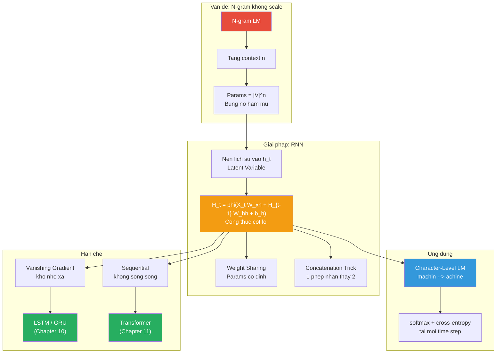

# Buổi 39 — 9.4 Recurrent Neural Networks

> **Nguồn:** [d2l.ai — 9.4](https://d2l.ai/chapter_recurrent-neural-networks/rnn.html)
> **Buổi trước:** [[Buổi 38 - Tuần 10]] — Converting Raw Text into Sequence Data & Language Models
> **Buổi sau:** [[Buổi 40 - Tuần 11]] — 9.5 RNN Implementation from Scratch

---

## Mục tiêu buổi học

1. Hiểu **tại sao N-gram không đủ** — bùng nổ tham số khi mở rộng context
2. Nắm ý tưởng cốt lõi: dùng **latent variable** $h_t$ thay vì lưu toàn bộ lịch sử
3. Phân biệt rõ **hidden layer** (MLP) vs **hidden state** (RNN)
4. Dẫn xuất **công thức RNN** từ MLP: thêm đúng 1 thành phần $H_{t-1} W_{hh}$
5. Hiểu **concatenation trick** — tại sao ghép nối tương đương nhân riêng rồi cộng
6. Nắm ứng dụng: **Character-level language model** với RNN
7. Hiểu tại sao **RNN parameters không tăng** khi chuỗi dài hơn (weight sharing)

---

## Active Recall — Kiến thức cũ

### Câu hỏi truy hồi (không nhìn tài liệu)

1. Pipeline tiền xử lý text đầy đủ gồm mấy bước? Kể tên đúng thứ tự.
2. Vocab class cần 2 cấu trúc dữ liệu nào? Token đặc biệt là gì?
3. Zipf's Law : tần suất từ thứ $i$ tỷ lệ với gì? Viết công thức log-log.
4. Trigram model xấp xỉ $P(x_t \mid x_1, \ldots, x_{t-1})$ bằng gì?
5. Tại sao N-gram gặp data sparsity? Cho ví dụ số cụ thể.
6. Laplace smoothing thêm gì? Khi $\epsilon \to \infty$ thì phân phối tiến về đâu?
7. Perplexity = 1 có ý nghĩa gì? PP = $|V|$ có ý nghĩa gì?
8. Sequence partitioning: Target $Y$ liên hệ với Input $X$ như thế nào?

### Tự trả lời ngắn (Claim → Reasoning → Evidence)

1. **Claim:** 4 bước: Reading → Preprocessing → Tokenization → Vocab+Indexing.
   **Reasoning:** Mỗi bước giải quyết 1 vấn đề riêng: load text → làm sạch → tách đơn vị → encode thành số.
   **Evidence:** Buổi 38 §1.2 bảng pipeline.

2. **Claim:** `token_to_idx` (dict) và `idx_to_token` (list). Token đặc biệt: `<unk>` (index = 0).
   **Reasoning:** Cần ánh xạ hai chiều: encode khi training, decode khi inference.
   **Evidence:** Buổi 38 §4.3 implementation.

3. **Claim:** $n_i \propto i^{-\alpha}$ ($\alpha \approx 1$). Log-log: $\log n_i = -\alpha \log i + c$ → đường thẳng.
   **Reasoning:** Số ít từ xuất hiện cực nhiều, số nhiều từ xuất hiện cực ít → power law.
   **Evidence:** Buổi 38 §5.1 đồ thị Zipf.

4. **Claim:** $P(x_t \mid x_1, \ldots, x_{t-1}) \approx P(x_t \mid x_{t-2}, x_{t-1})$ — chỉ dùng 2 tokens gần nhất.
   **Reasoning:** Markov assumption bậc 2 = trigram = truncate context thành 2 steps.
   **Evidence:** Buổi 38 §7.1.

5. **Claim:** Với $|V| = 4580$: bigram = $V^2 \approx 2.1 \times 10^7$ tổ hợp, trigram = $V^3 \approx 9.6 \times 10^{10}$. Corpus chỉ ~32K words → hầu hết trigram **chưa bao giờ** xuất hiện → count = 0.
   **Evidence:** Buổi 38 §7.3.

6. **Claim:** Thêm $\epsilon$ vào tử số mọi counts. Khi $\epsilon \to \infty$: $\hat{P}(x) \to \frac{1}{m}$ (uniform distribution).
   **Reasoning:** $\epsilon$ áp đảo counts → mọi token có xác suất gần bằng nhau.
   **Evidence:** Buổi 38 §8.2.

7. **Claim:** PP = 1: dự đoán hoàn hảo (luôn gán $P = 1$ cho đúng token). PP = $|V|$: random uniform (model không biết gì, đoán ngẫu nhiên).
   **Evidence:** Buổi 38 §9.3.

8. **Claim:** $Y = X$ dịch sang phải 1 vị trí ($Y_t = X_{t+1}$). Target luôn là "token tiếp theo".
   **Reasoning:** Language model = next-token prediction.
   **Evidence:** Buổi 38 §9.5.

### Concept notes cần ôn lại

- [[Autoregressive Model]]
- [[N-gram Language Model]]
- [[Perplexity]]
- [[Zipf's Law]]

---

# PHẦN I — ĐỘNG LỰC: TẠI SAO CẦN RNN?

---

## 1. Hạn chế của N-gram Models

### 1.1 Bài toán

Ở Buổi 38, ta đã biết **N-gram language model** ước lượng:

$$P(x_t \mid x_{t-1}, \ldots, x_1) \approx P(x_t \mid x_{t-n+1}, \ldots, x_{t-1})$$

Markov assumption bậc $n-1$: chỉ nhìn $n-1$ tokens gần nhất.

### 1.2 Vấn đề: Bùng nổ theo hàm mũ

Nếu muốn **mở rộng context** (tăng $n$), số tham số tăng **theo hàm mũ**:

| N-gram        | Parameters cần lưu | Với $\|V\| = 10000$ |
| ------------- | ------------------ | ------------------- |
| Unigram (n=1) | $\|V\|^1$          | $10^4$              |
| Bigram (n=2)  | $\|V\|^2$          | $10^8$              |
| Trigram (n=3) | $\|V\|^3$          | $10^{12}$           |
| 4-gram (n=4)  | $\|V\|^4$          | $10^{16}$           |
| 5-gram (n=5)  | $\|V\|^5$          | $10^{20}$           |

![[assets/attachments/d2l-buoi-39/ngram_vs_rnn_params.png]]
_Hình 1: Trái — N-gram parameters tăng theo hàm mũ. Phải — RNN parameters cố định bất kể chuỗi dài bao nhiêu._

> [!WARNING] Insight cốt lõi
> Tăng $n$ từ 3 lên 5 → parameters tăng $\|V\|^2 \approx 10^8$ lần. Đây là lý do **N-gram không scale** được cho context dài. Ta cần một cách **nén lịch sử** mà không cần lưu trữ theo hàm mũ.

### 1.3 Giải pháp: Latent Variable Model

Thay vì cố gắng lưu toàn bộ lịch sử $(x_{t-1}, \ldots, x_1)$, ta **nén** chúng vào một vector ẩn $h_{t-1}$:

$$P(x_t \mid x_{t-1}, \ldots, x_1) \approx P(x_t \mid h_{t-1}) \tag{9.4.1}$$

Trong đó $h_{t-1}$ là **hidden state** — lưu trữ "tóm tắt" toàn bộ chuỗi đến thời điểm $t-1$.

Hidden state được cập nhật đệ quy:

$$h_t = f(x_t, h_{t-1}) \tag{9.4.2}$$

> [!NOTE] ELI5
> Hãy tưởng tượng bạn đọc một cuốn sách dày. Bạn **không thể nhớ từng chữ** đã đọc (= N-gram cần lưu mọi tổ hợp). Thay vào đó, trong đầu bạn có một **bản tóm tắt** cập nhật liên tục: mỗi khi đọc trang mới, bạn kết hợp trang mới đó với bản tóm tắt cũ → tạo ra bản tóm tắt mới. Bản tóm tắt đó chính là **hidden state** $h_t$.

### 1.4 Hidden Layer vs Hidden State — Phân biệt hai khái niệm dễ nhầm

|                | **Hidden Layer** (MLP)              | **Hidden State** (RNN)                                   |
| -------------- | ----------------------------------- | -------------------------------------------------------- |
| **Là gì**      | Lớp trung gian giữa input và output | Vector lưu trữ thông tin lịch sử chuỗi                   |
| **Ở đâu**      | "Ẩn" trên path input → output       | Input cho computation tại mỗi time step                  |
| **Phụ thuộc**  | Chỉ input hiện tại $X$              | Input hiện tại $X_t$ **VÀ** hidden state trước $H_{t-1}$ |
| **Tính chất**  | Tính 1 lần xong bỏ                  | **Truyền qua** các time steps                            |
| **Kích thước** | Cố định                             | Cố định (nhưng nội dung thay đổi theo $t$)               |

> [!IMPORTANT] Confusion Alert
> "Hidden layer" trong MLP và "hidden state" trong RNN đều dùng từ "hidden" nhưng **hoàn toàn khác nhau**. Hidden layer là **cấu trúc mạng** (structural). Hidden state là **trạng thái bộ nhớ** (memory) — nó mang thông tin từ quá khứ.

---

# PHẦN II — TỪ MLP ĐẾN RNN

---

## 2. Neural Network Không Có Hidden State (MLP Review)

> [!NOTE] ELI5
> MLP giống một cái máy ép trái cây: bỏ trái cây vào (input), máy nghiền qua lưới lọc (hidden layer), ra nước ép (output). Mỗi lần ép là **độc lập** — máy không "nhớ" lần ép trước bỏ trái gì.

### 2.1 Công thức MLP (1 hidden layer)

Cho minibatch $X \in \mathbb{R}^{n \times d}$ (batch size $n$, $d$ features):

$$H = \phi(X W_{xh} + b_h) \tag{9.4.3}$$

$$O = H W_{hq} + b_q \tag{9.4.4}$$

Trong đó:

- $W_{xh} \in \mathbb{R}^{d \times h}$: trọng số input → hidden ($d$ inputs, $h$ hidden units)
- $b_h \in \mathbb{R}^{1 \times h}$: bias hidden layer (broadcast)
- $\phi$: hàm kích hoạt (tanh, ReLU, ...)
- $W_{hq} \in \mathbb{R}^{h \times q}$: trọng số hidden → output ($q$ outputs)
- $b_q \in \mathbb{R}^{1 \times q}$: bias output layer

### 2.2 Hạn chế cho sequence

MLP xử lý mỗi input $X$ **độc lập**. Nếu ta đưa $X_1, X_2, \ldots, X_T$ vào MLP:

- **Không có kết nối** giữa $H$ tại các time step khác nhau
- Model **không biết** $X_1$ đã xảy ra khi xử lý $X_2$
- → Mất toàn bộ thông tin thứ tự (temporal information)

---

## 3. Recurrent Neural Network — Có Hidden State

> [!NOTE] ELI5
> Giờ hãy tưởng tượng cái máy ép trái cây có **bộ nhớ**. Mỗi lần ép xong, nó giữ lại "vị" từ lần trước. Lần tiếp theo, nó **pha trộn** trái cây mới với dư vị cũ → nước ép lần 3 chứa hương vị của cả lần 1, 2, 3. Đó chính là RNN: output tại mỗi bước phụ thuộc cả input hiện tại lẫn "bộ nhớ" từ tất cả các bước trước.

### 3.1 Định nghĩa kỹ thuật

**Recurrent Neural Network (RNN)** là mạng nơ-ron sử dụng **recurrent computation** (tính toán đệ quy) cho hidden states, trong đó hidden state tại mỗi time step phụ thuộc vào cả input hiện tại lẫn hidden state ở time step trước.

- **Input:** Chuỗi $X_1, X_2, \ldots, X_T$, mỗi $X_t \in \mathbb{R}^{n \times d}$
- **Output:** Chuỗi $O_1, O_2, \ldots, O_T$, mỗi $O_t \in \mathbb{R}^{n \times q}$
- **Giải quyết:** Bài toán sequence modeling — mỗi output xem xét **toàn bộ lịch sử** đến thời điểm $t$, thông qua hidden state $H_t$

### 3.2 Công thức cốt lõi

So sánh MLP (9.4.3) và RNN:

$$\underbrace{H = \phi(X W_{xh} + b_h)}_{\text{MLP: chỉ nhìn input hiện tại}} \quad \longrightarrow \quad \underbrace{H_t = \phi(X_t W_{xh} + H_{t-1} W_{hh} + b_h)}_{\text{RNN: nhìn input hiện tại VÀ quá khứ}} \tag{9.4.5}$$

**Chỉ thêm DUY NHẤT một thành phần: $H_{t-1} W_{hh}$**

| Ký hiệu   | Shape    | Ý nghĩa                                                  |
| --------- | -------- | -------------------------------------------------------- |
| $X_t$     | $(n, d)$ | Input tại time step $t$                                  |
| $H_{t-1}$ | $(n, h)$ | Hidden state từ time step trước                          |
| $H_t$     | $(n, h)$ | Hidden state mới (output của recurrent layer)            |
| $W_{xh}$  | $(d, h)$ | Trọng số: input → hidden                                 |
| $W_{hh}$  | $(h, h)$ | Trọng số: hidden trước → hidden mới **(MỚI so với MLP)** |
| $b_h$     | $(1, h)$ | Bias                                                     |
| $\phi$    | —        | Hàm kích hoạt (thường dùng **tanh**)                     |

Output tại mỗi time step:

$$O_t = H_t W_{hq} + b_q \tag{9.4.6}$$

Với $W_{hq} \in \mathbb{R}^{h \times q}$, $b_q \in \mathbb{R}^{1 \times q}$.

![[assets/attachments/d2l-buoi-39/mlp_vs_rnn.png]]
_Hình 2: So sánh MLP (trái) và RNN (phải). Khác biệt duy nhất: mũi tên đỏ — recurrent connection truyền $H_{t-1}$ sang $H_t$ qua $W_{hh}$._

### 3.3 Phân tích sâu: Tại sao thêm $H_{t-1} W_{hh}$ lại đủ mạnh?

**Bản chất đệ quy (Recurrence):**

$H_t$ phụ thuộc $H_{t-1}$, mà $H_{t-1}$ phụ thuộc $H_{t-2}$, ... Triển khai đệ quy:

$$H_t = \phi\big(X_t W_{xh} + \phi(X_{t-1} W_{xh} + \phi(\ldots) \cdot W_{hh} + b_h) \cdot W_{hh} + b_h\big)$$

→ Về mặt **lý thuyết**, $H_t$ chứa thông tin của **toàn bộ** $X_1, X_2, \ldots, X_t$.

> [!WARNING] Lý thuyết vs Thực tế
> Trên lý thuyết, $h_t$ có thể lưu **toàn bộ** lịch sử. Nhưng thực tế, do $h$ có kích thước cố định (ví dụ 256 hay 512 dims), thông tin cũ bị "nén" và dần mất đi → **vanishing gradient problem**. Đây là motivation cho LSTM và GRU (sẽ học ở Chapter 10).

### 3.4 Tại sao dùng tanh thay vì ReLU?

Trong MLP, ta thường dùng ReLU. Nhưng RNN ưa thích **tanh**:

| Tiêu chí              | ReLU                                     | tanh                                      |
| --------------------- | ---------------------------------------- | ----------------------------------------- |
| **Range**             | $[0, +\infty)$                           | $(-1, +1)$                                |
| **Tính bounded**      | Không bounded                            | **Bounded**                               |
| **Vấn đề recurrence** | $H_t$ có thể **explode** qua nhiều steps | Giữ giá trị trong $(-1, 1)$ → ổn định hơn |
| **Zero-centered**     | Không                                    | **Có** → gradient ổn định hơn             |

Vì hidden state được **nhân đi nhân lại** qua $W_{hh}$ rất nhiều lần (mỗi time step), giá trị cần **bounded** để tránh bùng nổ.

---

## 4. Triển khai theo thời gian (Unrolling)

### 4.1 Ý tưởng

RNN "cuộn" (looped) có thể được "mở ra" (unrolled) thành một chuỗi các lớp:

![[assets/attachments/d2l-buoi-39/rnn_unrolled.png]]
_Hình 3: RNN mở ra theo thời gian. Mỗi cột là 1 time step. Mũi tên đỏ: truyền hidden state. Tất cả time steps CHIA SẺ cùng bộ tham số ($W_{xh}, W_{hh}, W_{hq}$)._

### 4.2 Weight Sharing — Đặc tính then chốt

> [!IMPORTANT] Key Insight
> Dù chuỗi dài $T = 10$ hay $T = 10000$, RNN **luôn dùng cùng** bộ tham số:
>
> - $W_{xh} \in \mathbb{R}^{d \times h}$
> - $W_{hh} \in \mathbb{R}^{h \times h}$
> - $b_h \in \mathbb{R}^{1 \times h}$
> - $W_{hq} \in \mathbb{R}^{h \times q}$
> - $b_q \in \mathbb{R}^{1 \times q}$
>
> → Tổng parameters = **cố định**, **không phụ thuộc** vào $T$.

Đây là ưu việt lớn nhất so với N-gram: thay vì $O(|V|^n)$ tham số, RNN chỉ cần $O(d \cdot h + h^2 + h \cdot q)$.

**Ví dụ cụ thể:** Với $d = 256$, $h = 512$, $q = 100$:

- $W_{xh}$: $256 \times 512 = 131{,}072$
- $W_{hh}$: $512 \times 512 = 262{,}144$
- $W_{hq}$: $512 \times 100 = 51{,}200$
- **Tổng ≈ 444K params** — bất kể chuỗi dài bao nhiêu

### 4.3 So sánh paradigm

|                  | N-gram                    | MLP on sequence              | **RNN**                          |
| ---------------- | ------------------------- | ---------------------------- | -------------------------------- |
| **Context**      | $n-1$ tokens gần nhất     | $\tau$ tokens (fixed window) | Toàn bộ lịch sử (lý thuyết)      |
| **Parameters**   | $O(\|V\|^n)$              | $O(\tau \cdot d \cdot h)$    | $O(d \cdot h + h^2)$             |
| **Tăng context** | Params tăng theo lũy thừa | Params tăng tuyến tính       | **Params KHÔNG tăng**            |
| **Nhớ xa**       | Không                     | Không (quá $\tau$)           | Có (nhưng bị vanishing gradient) |

---

## 5. Concatenation Trick — Tối ưu tính toán

### 5.1 Quan sát toán học

Hãy nhìn kỹ phần tính hidden state (bỏ bias cho gọn):

$$H_t = \phi(\underbrace{X_t W_{xh}}_{(n,d) \times (d,h) = (n,h)} + \underbrace{H_{t-1} W_{hh}}_{(n,h) \times (h,h) = (n,h)})$$

Hai phép nhân ma trận riêng biệt rồi cộng lại → **có thể biến thành 1 phép nhân duy nhất**.

### 5.2 Ghép nối (Concatenation)

**Ghép input theo cột (axis=1):**
$$[X_t, H_{t-1}] \in \mathbb{R}^{n \times (d+h)}$$

**Ghép trọng số theo hàng (axis=0):**
$$\begin{bmatrix} W_{xh} \\ W_{hh} \end{bmatrix} \in \mathbb{R}^{(d+h) \times h}$$

**Kết quả:**
$$[X_t, H_{t-1}] \cdot \begin{bmatrix} W_{xh} \\ W_{hh} \end{bmatrix} = X_t W_{xh} + H_{t-1} W_{hh}$$

![[assets/attachments/d2l-buoi-39/concat_trick.png]]
_Hình 4: Concatenation trick — biến 2 phép nhân + 1 phép cộng thành 1 phép nhân duy nhất. Nhanh hơn trên GPU._

### 5.3 Chứng minh tương đương

Viết block matrix multiplication:

$$\begin{bmatrix} X_t & H_{t-1} \end{bmatrix}_{n \times (d+h)} \cdot \begin{bmatrix} W_{xh} \\ W_{hh} \end{bmatrix}_{(d+h) \times h} = X_t W_{xh} + H_{t-1} W_{hh}$$

Theo quy tắc nhân ma trận khối:

- Hàng $[X_t, H_{t-1}]$ nhân cột $[W_{xh}; W_{hh}]$
- = $X_t \cdot W_{xh} + H_{t-1} \cdot W_{hh}$ ✓

### 5.4 Code minh chứng

```python
import torch

# Khởi tạo
X = torch.randn(3, 1)    # (n=3, d=1)
W_xh = torch.randn(1, 4) # (d=1, h=4)
H = torch.randn(3, 4)    # (n=3, h=4)
W_hh = torch.randn(4, 4) # (h=4, h=4)

# Cách 1: Nhân riêng rồi cộng
result1 = torch.matmul(X, W_xh) + torch.matmul(H, W_hh)

# Cách 2: Concatenation
result2 = torch.matmul(
    torch.cat((X, H), dim=1),      # (3, 1+4) = (3, 5)
    torch.cat((W_xh, W_hh), dim=0) # (1+4, 4) = (5, 4)
)

# Kiểm tra
print(torch.allclose(result1, result2))  # True
print(f"Cách 1 shape: {result1.shape}")  # (3, 4)
print(f"Cách 2 shape: {result2.shape}")  # (3, 4)
```

> [!NOTE] Tại sao Concatenation nhanh hơn?
> Trên GPU, 1 phép nhân ma trận lớn **luôn nhanh hơn** 2 phép nhân nhỏ + 1 phép cộng. Lý do: GPU song song hóa hiệu quả hơn với 1 kernel launch lớn thay vì 3 kernel launches nhỏ. Đây là optimization tiêu chuẩn trong mọi framework (PyTorch, TensorFlow).

---

# PHẦN III — ỨNG DỤNG: CHARACTER-LEVEL LANGUAGE MODEL

---

## 6. RNN Làm Language Model

### 6.1 Bài toán

Nhắc lại từ Buổi 38: **Language model** ước lượng $P(x_1, x_2, \ldots, x_T)$, phân rã bằng chain rule thành:

$$P(x_1, \ldots, x_T) = P(x_1) \prod_{t=2}^{T} P(x_t \mid x_{t-1}, \ldots, x_1)$$

Mỗi thừa số $P(x_t \mid x_{t-1}, \ldots, x_1)$ là một bài **next-token prediction**. RNN giải quyết bằng:

$$P(x_t \mid x_{t-1}, \ldots, x_1) \approx P(x_t \mid H_{t-1}) = \text{softmax}(H_t W_{hq} + b_q)$$

### 6.2 Ví dụ: "machine"

Tokenize ở character level: `m`, `a`, `c`, `h`, `i`, `n`, `e`.

| Time step | Input | Target | Nghĩa                           |
| --------- | ----- | ------ | ------------------------------- |
| $t = 1$   | `m`   | `a`    | Biết "m", đoán ký tự tiếp = "a" |
| $t = 2$   | `a`   | `c`    | Biết "ma", đoán = "c"           |
| $t = 3$   | `c`   | `h`    | Biết "mac", đoán = "h"          |
| $t = 4$   | `h`   | `i`    | Biết "mach", đoán = "i"         |
| $t = 5$   | `i`   | `n`    | Biết "machi", đoán = "n"        |
| $t = 6$   | `n`   | `e`    | Biết "machin", đoán = "e"       |

→ Input sequence = `"machin"`, Target sequence = `"achine"` (dịch sang phải 1 vị trí).

![[assets/attachments/d2l-buoi-39/rnn_char_lm.png]]
_Hình 5: Character-level language model. Tại $t = 3$, $O_3$ được quyết định bởi chuỗi "m", "a", "c" vì $H_3$ chứa thông tin tích lũy từ tất cả input trước. Loss = cross-entropy trung bình qua tất cả time steps._

### 6.3 Training Process

1. **Forward pass:** Tại mỗi time step $t$:
   - Input: $X_t$ (one-hot vector hoặc embedding của ký tự thứ $t$)
   - Tính: $H_t = \phi(X_t W_{xh} + H_{t-1} W_{hh} + b_h)$
   - Output: $O_t = H_t W_{hq} + b_q$
   - Probability: $\hat{Y}_t = \text{softmax}(O_t)$

2. **Loss tại time step $t$:**
   $$\ell_t = -\log P(y_t \mid H_t) = -\log \hat{Y}_t[y_t]$$

3. **Tổng loss:**
   $$L = \frac{1}{T} \sum_{t=1}^{T} \ell_t = -\frac{1}{T} \sum_{t=1}^{T} \log P(y_t \mid H_t)$$

4. **Backward pass:** Backpropagation Through Time (BPTT) — sẽ học chi tiết ở 9.7.

### 6.4 Tại sao character-level?

| Level             | Vocab size              | Ưu điểm                              | Nhược điểm                              |
| ----------------- | ----------------------- | ------------------------------------ | --------------------------------------- |
| **Character**     | ~28 (a-z + space + unk) | Vocab nhỏ, không OOV, output $q$ nhỏ | Chuỗi rất dài, khó capture word meaning |
| **Word**          | 10K - 100K+             | Capture semantics tốt hơn            | Vocab lớn, có OOV                       |
| **Subword** (BPE) | 30K - 50K               | Cân bằng hai thái cực                | Cần training BPE trước                  |

Trong D2L, dùng character-level vì **đơn giản** (vocab nhỏ, dễ implement from scratch). Thực tế production, subword (BPE) là tiêu chuẩn.

---

# PHẦN IV — TỔNG HỢP THAM SỐ RNN

---

## 7. Đếm Parameters

### 7.1 Bảng tham số đầy đủ

| Parameter | Shape    | Số lượng                              | Vai trò                              |
| --------- | -------- | ------------------------------------- | ------------------------------------ |
| $W_{xh}$  | $(d, h)$ | $d \cdot h$                           | Biến đổi input → hidden space        |
| $W_{hh}$  | $(h, h)$ | $h^2$                                 | Truyền thông tin giữa các time steps |
| $b_h$     | $(1, h)$ | $h$                                   | Bias cho hidden layer                |
| $W_{hq}$  | $(h, q)$ | $h \cdot q$                           | Biến đổi hidden → output space       |
| $b_q$     | $(1, q)$ | $q$                                   | Bias cho output layer                |
| **Tổng**  |          | $d \cdot h + h^2 + h + h \cdot q + q$ |                                      |

### 7.2 Ví dụ thực tế

Cho character-level LM trên "The Time Machine" (Buổi 38):

- $d = 28$ (one-hot vector, vocab size = 28)
- $h = 256$ (hidden units)
- $q = 28$ (dự đoán ký tự tiếp theo, cùng vocab)

$$\text{Total} = 28 \times 256 + 256^2 + 256 + 256 \times 28 + 28 = 7{,}168 + 65{,}536 + 256 + 7{,}168 + 28 = \boxed{80{,}156}$$

→ Chỉ **~80K parameters** để model **bất kỳ chuỗi nào** dài tùy ý. So sánh: 5-gram với $|V| = 28$ cần $28^5 = 17{,}210{,}368$ entries.

> [!NOTE] $W_{hh}$ chiếm tỷ trọng lớn nhất
> $h^2 = 65{,}536$ chiếm **81.8%** tổng params. Đây là "bộ nhớ" chính của RNN — nó quyết định cách thông tin quá khứ được biến đổi và truyền đi. Với hidden size lớn hơn (ví dụ $h = 512$), $W_{hh}$ sẽ chiếm tới **hơn 90%**.

---

# PHẦN V — CODE IMPLEMENTATION

---

## 8. Implementation Step-by-Step

### 8.1 RNN Cell từ đầu

```python
import torch
import torch.nn as nn

class RNNCell:
    """RNN cell đơn giản — xử lý 1 time step."""

    def __init__(self, input_size, hidden_size, output_size):
        # Khởi tạo trọng số (Xavier initialization)
        scale = 0.01
        self.W_xh = torch.randn(input_size, hidden_size) * scale
        self.W_hh = torch.randn(hidden_size, hidden_size) * scale
        self.b_h = torch.zeros(1, hidden_size)
        self.W_hq = torch.randn(hidden_size, output_size) * scale
        self.b_q = torch.zeros(1, output_size)

    def forward(self, X_t, H_prev):
        """
        X_t: (batch_size, input_size) — input tại time step t
        H_prev: (batch_size, hidden_size) — hidden state từ t-1
        Returns: (H_t, O_t)
        """
        # === Công thức (9.4.5) ===
        H_t = torch.tanh(X_t @ self.W_xh + H_prev @ self.W_hh + self.b_h)

        # === Công thức (9.4.6) ===
        O_t = H_t @ self.W_hq + self.b_q

        return H_t, O_t

# Demo
batch_size, d, h, q = 4, 28, 256, 28
cell = RNNCell(d, h, q)

# Khởi tạo hidden state = 0
H = torch.zeros(batch_size, h)

# 1 time step
X_t = torch.randn(batch_size, d)  # Input (ví dụ: one-hot)
H, O = cell.forward(X_t, H)
print(f"H shape: {H.shape}")  # (4, 256)
print(f"O shape: {O.shape}")  # (4, 28)
```

### 8.2 Unrolling qua nhiều time steps

```python
def rnn_forward(cell, inputs, H_0):
    """
    inputs: list of T tensors, mỗi tensor shape (batch_size, input_size)
    H_0: (batch_size, hidden_size) — initial hidden state
    Returns: outputs (list of T tensors), final hidden state
    """
    H = H_0
    outputs = []

    for t, X_t in enumerate(inputs):
        H, O_t = cell.forward(X_t, H)
        outputs.append(O_t)

    return outputs, H

# Demo: chuỗi "machine" (T=6 time steps, bỏ ký tự cuối "e" là target)
T = 6
inputs = [torch.randn(batch_size, d) for _ in range(T)]
H_0 = torch.zeros(batch_size, h)

outputs, H_final = rnn_forward(cell, inputs, H_0)
print(f"Số outputs: {len(outputs)}")        # 6
print(f"Mỗi output shape: {outputs[0].shape}")  # (4, 28)
print(f"H_final shape: {H_final.shape}")    # (4, 256)
```

### 8.3 Concatenation Trick Version

```python
class RNNCellConcat:
    """RNN cell với concatenation trick — nhanh hơn trên GPU."""

    def __init__(self, input_size, hidden_size, output_size):
        scale = 0.01
        # Ghép W_xh và W_hh thành 1 ma trận
        self.W_concat = torch.randn(input_size + hidden_size, hidden_size) * scale
        self.b_h = torch.zeros(1, hidden_size)
        self.W_hq = torch.randn(hidden_size, output_size) * scale
        self.b_q = torch.zeros(1, output_size)

    def forward(self, X_t, H_prev):
        # Ghép input và hidden state
        combined = torch.cat((X_t, H_prev), dim=1)  # (n, d+h)

        # 1 phép nhân thay vì 2
        H_t = torch.tanh(combined @ self.W_concat + self.b_h)
        O_t = H_t @ self.W_hq + self.b_q

        return H_t, O_t
```

---

# PHẦN VI — DISCUSSION: STRENGTHS & WEAKNESSES

---

## 9. Ưu điểm của RNN

| #   | Ưu điểm                                         | Giải thích                                                                   |
| --- | ----------------------------------------------- | ---------------------------------------------------------------------------- |
| 1   | **Xử lý chuỗi bất kỳ độ dài**                   | Nhờ recurrence, $T$ có thể thay đổi (không cố định như CNN)                  |
| 2   | **Parameter efficiency**                        | Params cố định bất kể $T$, nhờ weight sharing                                |
| 3   | **Capture long-range dependencies** (lý thuyết) | $H_t$ tích lũy toàn bộ lịch sử                                               |
| 4   | **Mô hình tự nhiên** cho sequence               | Phản ánh đúng cách con người xử lý: đọc từ trái qua phải, cập nhật hiểu biết |

## 10. Hạn chế và vấn đề mở

| #   | Hạn chế                          | Chi tiết                                                                                    |
| --- | -------------------------------- | ------------------------------------------------------------------------------------------- |
| 1   | **Vanishing/Exploding Gradient** | Backprop qua nhiều time steps → gradient bị nhân liên tiếp → triệt tiêu hoặc bùng nổ        |
| 2   | **Sequential computation**       | Phải tính $H_1$ trước khi tính $H_2$ → **không song song hóa** được (khác CNN, Transformer) |
| 3   | **Effective memory có hạn**      | Dù lý thuyết nhớ toàn bộ, thực tế chỉ nhớ tốt ~50-200 steps                                 |
| 4   | **Training chậm**                | Do sequential nature + gradient issues                                                      |

> [!NOTE] Hướng giải quyết (sẽ học sau)
>
> - **LSTM, GRU** (Chapter 10): Gate mechanisms để giải quyết vanishing gradient
> - **Transformer** (Chapter 11): Self-attention thay thế recurrence → song song hóa hoàn toàn
> - **Gradient clipping** (9.5): Giới hạn gradient norm để tránh exploding

---

# PHẦN VII — EXERCISES (D2L 9.4.5)

---

## 11. Bài tập & Lời giải

### Q1: Nếu dùng RNN dự đoán ký tự tiếp theo, output cần dimension bao nhiêu?

**Answer:** $q = |V|$ (vocab size). Vì output là phân phối xác suất trên toàn bộ vocabulary. Với character-level trên "The Time Machine": $q = 28$.

**Reasoning:** $O_t \in \mathbb{R}^{n \times q}$ → `softmax` → xác suất $q$ classes. Mỗi class = 1 ký tự trong vocab.

### Q2: Tại sao RNN có thể biểu diễn $P(x_t \mid x_1, \ldots, x_{t-1})$?

**Answer:** Nhờ hidden state $H_t$ tích lũy đệ quy: $H_t = f(X_t, H_{t-1})$, mà $H_{t-1} = f(X_{t-1}, H_{t-2})$, ... → $H_t$ là hàm của **toàn bộ** $(X_1, \ldots, X_t)$.

Output: $O_t = H_t W_{hq} + b_q$ → `softmax(O_t)` cho xác suất $P(x_{t+1} \mid x_1, \ldots, x_t)$.

### Q3: Gradient qua chuỗi dài sẽ như thế nào?

**Answer:** Gradient phải truyền ngược qua chuỗi các phép nhân $W_{hh}$:

$$\frac{\partial H_t}{\partial H_1} = \prod_{k=2}^{t} \frac{\partial H_k}{\partial H_{k-1}} \approx \prod_{k=2}^{t} W_{hh}^T \cdot \text{diag}(\phi')$$

- Nếu eigenvalues của $W_{hh}$ < 1 → **vanishing gradient** (gradient → 0)
- Nếu eigenvalues > 1 → **exploding gradient** (gradient → ∞)

### Q4: Vấn đề của character-level LM?

**Answer:**

1. **Chuỗi rất dài** (mỗi word = nhiều characters) → cần nhiều time steps → gradient issues nặng hơn
2. **Không capture word semantics trực tiếp** — model phải tự học word boundaries
3. **Không hiểu ngữ nghĩa cấp từ/câu** — chỉ biết ký tự nào hay đi cùng nhau

---

## 12. Bản đồ kiến thức buổi 39



### 12.1 Bảng tóm tắt concepts

| Concept                 | Định nghĩa ngắn                            | Tại sao quan trọng                                |
| ----------------------- | ------------------------------------------ | ------------------------------------------------- |
| **Hidden State** $H_t$  | Vector nén lịch sử chuỗi đến time $t$      | Thay thế lưu trữ $O(\|V\|^n)$ bằng vector cố định |
| **Recurrence**          | $H_t = f(X_t, H_{t-1})$ — tính toán đệ quy | Cho phép context dài mà không tăng params         |
| **Weight Sharing**      | Cùng $W_{xh}, W_{hh}$ cho mọi time step    | Params không phụ thuộc độ dài chuỗi $T$           |
| **Concatenation Trick** | Ghép $[X_t, H_{t-1}]$ + $[W_{xh}; W_{hh}]$ | Tối ưu tốc độ trên GPU                            |
| **Character-level LM**  | Dự đoán ký tự tiếp theo bằng RNN           | Ứng dụng trực tiếp, đơn giản                      |
| **$W_{hh}$**            | Ma trận $(h, h)$ — "bộ nhớ" chính          | Quyết định cách thông tin quá khứ được truyền     |
| **Vanishing Gradient**  | Gradient → 0 qua nhiều time steps          | Hạn chế chính, dẫn đến LSTM/GRU                   |

### 12.2 Chuẩn bị cho buổi sau

**Buổi 40** sẽ cover **9.5 RNN Implementation from Scratch**:

- One-hot encoding cho input characters
- Khởi tạo trọng số RNN
- Forward computation qua toàn bộ chuỗi
- Gradient clipping (giải quyết exploding gradient)
- Training loop + text generation (sampling)

**Kiến thức buổi hôm nay là nền tảng bắt buộc:**

- Công thức (9.4.5), (9.4.6) → sẽ implement line-by-line
- Concatenation trick → optimization trong implementation
- Character-level LM → pipeline training cụ thể
- Vocab + Corpus (Buổi 38) → data pipeline

---

## 13. Active Recall chuyên sâu — Buổi 39

### Câu hỏi (thử trả lời trước khi xem đáp án)

1. N-gram cần bao nhiêu tham số cho 5-gram với $|V| = 10000$? Tại sao không khả thi?
2. Hidden state $h_t$ được cập nhật bằng công thức nào? Viết đầy đủ với dimensions.
3. Sự khác biệt **duy nhất** giữa MLP hidden layer và RNN hidden state là gì?
4. Tại sao RNN dùng **tanh** thay vì **ReLU** làm activation function?
5. Weight sharing nghĩa là gì? Tại sao nó giúp RNN xử lý chuỗi dài?
6. Concatenation trick biến mấy phép toán thành mấy? Chứng minh tương đương.
7. Với $d = 28, h = 256, q = 28$: tính tổng tham số RNN. $W_{hh}$ chiếm bao nhiêu %?
8. Tại sao $O_3$ trong ví dụ "machine" phụ thuộc vào "m", "a", "c"?
9. Vanishing gradient trong RNN xảy ra do đâu? Viết công thức gradient chain.
10. Nêu 2 giải pháp cho vanishing gradient (sẽ học sau).

### Đáp án

1. **Claim:** $|V|^5 = 10000^5 = 10^{20}$ entries. Không khả thi vì (i) bộ nhớ khổng lồ, (ii) hầu hết entries = 0 (data sparsity), (iii) không đủ data để ước lượng.
   **Evidence:** §1.2 bảng N-gram.

2. **Claim:** $H_t = \tanh(X_t W_{xh} + H_{t-1} W_{hh} + b_h)$. Dimensions: $X_t (n,d)$, $W_{xh} (d,h)$, $H_{t-1} (n,h)$, $W_{hh} (h,h)$, $b_h (1,h)$ → $H_t (n,h)$.
   **Evidence:** §3.2 công thức (9.4.5).

3. **Claim:** Thành phần $H_{t-1} W_{hh}$. MLP: $H = \phi(X W_{xh} + b_h)$. RNN: $H_t = \phi(X_t W_{xh} + \mathbf{H_{t-1} W_{hh}} + b_h)$.
   **Reasoning:** Đúng 1 ma trận nhân thêm — kết nối hidden state qua thời gian.
   **Evidence:** §3.2 so sánh (9.4.3) và (9.4.5).

4. **Claim:** Vì tanh bounded trong $(-1, 1)$, trong khi ReLU unbounded $[0, +\infty)$. Hidden state nhân đi nhân lại qua $W_{hh}$ → ReLU dễ explode, tanh ổn định hơn. Thêm: tanh zero-centered → gradient ổn định.
   **Evidence:** §3.4 bảng so sánh.

5. **Claim:** Cùng $W_{xh}, W_{hh}, W_{hq}$ cho **mọi** time step. Dù $T = 10$ hay $T = 10000$ → params giống nhau. So với N-gram: params tăng $O(|V|^n)$ khi tăng context.
   **Evidence:** §4.2 annotation trong hình.

6. **Claim:** Biến 3 operations (2 matmul + 1 add) thành 1 matmul. Chứng minh: $[X_t, H_{t-1}]_{n \times (d+h)} \cdot [W_{xh}; W_{hh}]_{(d+h) \times h} = X_t W_{xh} + H_{t-1} W_{hh}$ (block matrix multiplication).
   **Evidence:** §5.3, 5.4 code demo.

7. **Claim:** $28 \times 256 + 256^2 + 256 + 256 \times 28 + 28 = 80{,}156$. $W_{hh} = 256^2 = 65{,}536 = 81.8\%$.
   **Reasoning:** $W_{hh}$ là ma trận $(h, h)$ → khi $h \gg d, q$ thì chiếm tỷ trọng áp đảo.
   **Evidence:** §7.2 tính toán.

8. **Claim:** Vì $H_3 = \tanh(X_3 W_{xh} + H_2 W_{hh} + b_h)$, mà $H_2$ chứa thông tin $X_1$ ("m") và $X_2$ ("a"), nên $H_3$ chứa thông tin "m", "a", "c". Rồi $O_3 = H_3 W_{hq} + b_q$.
   **Reasoning:** Recurrence: mỗi $H_t$ "xếp chồng" thông tin tất cả steps trước.
   **Evidence:** §6.2 bảng ví dụ + Hình 5.

9. **Claim:** Gradient truyền ngược qua chuỗi nhân: $\frac{\partial H_t}{\partial H_1} = \prod_{k} W_{hh}^T \cdot \text{diag}(\phi')$. Nếu eigenvalues $< 1$ → tích → 0 (vanishing). Nếu $> 1$ → tích → $\infty$ (exploding).
   **Evidence:** §11 Q3.

10. **Claim:** (i) **LSTM/GRU** — dùng gates (forget, input, output) để kiểm soát gradient flow. (ii) **Transformer** — self-attention cho phép gradient "nhảy" trực tiếp đến bất kỳ position nào.
    **Evidence:** §10 bảng hạn chế.

### Concept notes cần ôn lại

- [[Recurrent Neural Network]]
- [[Autoregressive Model]]
- [[Perplexity]]
- [[Vanishing Gradient Problem]]

---

## 14. Liên kết

### Concepts

- [[Recurrent Neural Network]]
- [[Autoregressive Model]]
- [[N-gram Language Model]]
- [[Perplexity]]
- [[Cross-Entropy Loss]]
- [[Softmax Function]]
- [[Vanishing Gradient Problem]]

### Buổi liên quan

- [[Buổi 37 - Tuần 10]] — Working with Sequences (Autoregressive, Markov)
- [[Buổi 38 - Tuần 10]] — Text → Sequence Data & Language Models
- [[Buổi 40 - Tuần 11]] — RNN Implementation from Scratch

### D2L mapping

| Mục này                 | D2L gốc                                            |
| ----------------------- | -------------------------------------------------- |
| §1 Hạn chế N-gram       | 9.4 intro                                          |
| §2 MLP Review           | 9.4.1 Neural Networks without Hidden States        |
| §3 RNN với Hidden State | 9.4.2 Recurrent Neural Networks with Hidden States |
| §5 Concatenation Trick  | 9.4.2 (code demo)                                  |
| §6 Character-level LM   | 9.4.3 RNN-Based Character-Level Language Models    |
| §11 Exercises           | 9.4.5 Exercises                                    |
