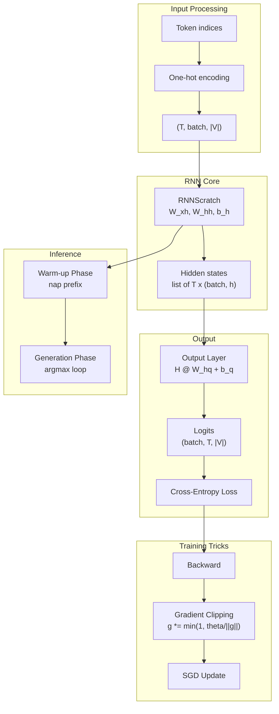

# Buổi 40 — 9.5 RNN Implementation from Scratch

> **Nguồn:** [d2l.ai — 9.5](https://d2l.ai/chapter_recurrent-neural-networks/rnn-scratch.html)
> **Buổi trước:** [[Buổi 39 - Tuần 11]] — 9.4 Recurrent Neural Networks (lý thuyết)
> **Buổi sau:** [[Buổi 41 - Tuần 11]] — 9.6 Concise Implementation of RNNs

---

## Mục tiêu buổi học

1. **Implement RNN model** từ đầu — biến công thức Buổi 39 thành code chạy được
2. Hiểu **One-Hot Encoding** trong ngữ cảnh character-level LM: tại sao cần, shape ra sao
3. Xây dựng **RNN Language Model** hoàn chỉnh: encoding → RNN → output layer → loss
4. Nắm **Gradient Clipping** — kỹ thuật bắt buộc khi train RNN để tránh exploding gradient
5. Hiểu **Training Loop** đặc thù của RNN (khác MLP/CNN)
6. Implement **Decoding** (text generation): warm-up phase + generation phase
7. Đánh giá model bằng **Perplexity** và hiểu ý nghĩa thực tế

---

## Active Recall — Kiến thức cũ

### Câu hỏi truy hồi (không nhìn tài liệu)

1. Viết công thức cốt lõi RNN (hidden state + output). Giải thích ý nghĩa từng ma trận.
2. $W_{xh}$ có shape gì? $W_{hh}$ có shape gì? Giải thích quy ước đặt tên "xh", "hh", "hq".
3. Tại sao RNN không tăng tham số khi chuỗi dài hơn? Cơ chế nào đảm bảo điều này?
4. Concatenation trick: thay vì $X_t W_{xh} + H_{t-1} W_{hh}$, ta viết thành gì? Tại sao tương đương?
5. Character-level LM: input "machin" → target là gì? Mỗi time step dự đoán cái gì?
6. Perplexity bằng 10 có ý nghĩa gì? PPL = 1 nghĩa là sao?
7. Tại sao dùng `tanh` thay vì `ReLU` trong RNN?
8. Gradient vanishing và exploding xảy ra khi nào? Liên quan đến eigenvalue của ma trận nào?

### Tự trả lời

1. **Claim:** $H_t = \tanh(X_t W_{xh} + H_{t-1} W_{hh} + b_h)$, $O_t = H_t W_{hq} + b_q$ → **Reasoning:** $W_{xh}$ biến input thành hidden, $W_{hh}$ mang thông tin từ bước trước, $W_{hq}$ biến hidden thành output → **Evidence:** Code `RNNCell` Buổi 39.
2. $W_{xh} \in \mathbb{R}^{d \times h}$, $W_{hh} \in \mathbb{R}^{h \times h}$. "xh" = input(x) → hidden(h), "hh" = hidden → hidden, "hq" = hidden → output(q).
3. **Weight sharing:** Cùng 1 bộ $(W_{xh}, W_{hh}, b_h, W_{hq}, b_q)$ dùng lại ở mọi time step $t$.
4. $[X_t, H_{t-1}] \cdot [W_{xh}; W_{hh}]$ — 1 phép nhân thay vì 2 → tương đương vì block matrix multiplication.
5. Target = "achine" (dịch 1 ký tự). Mỗi step: $P(x_{t+1} \mid x_1, \ldots, x_t)$.
6. PPL=10: trung bình model phải chọn giữa 10 lựa chọn. PPL=1: model chắc chắn 100%.
7. tanh bounded $[-1, 1]$ → hidden state ổn định; ReLU unbounded → dễ explode qua recurrence.
8. Backprop qua $T$ steps nhân liên tiếp $W_{hh}^T$. Eigenvalue > 1 → exploding, < 1 → vanishing.

### Concept notes cần ôn lại

- [[Recurrent Neural Network]]
- [[Perplexity]]
- [[One-Hot Encoding]]
- [[Cross-Entropy Loss]]
- [[Softmax Function]]

---

# PHẦN I — RNN MODEL (9.5.1)

---

## 1. Từ công thức đến code: RNNScratch

> [!NOTE] ELI5
> Buổi trước chúng ta học "công thức nấu ăn" (lý thuyết RNN). Hôm nay ta thực sự vào bếp — viết code Python biến công thức đó thành model chạy được, cho ăn dữ liệu, và sinh ra văn bản.

### 1.1 Nhắc lại công thức cốt lõi

Từ [[Buổi 39 - Tuần 11]], phương trình RNN:

$$H_t = \tanh(X_t W_{xh} + H_{t-1} W_{hh} + b_h) \tag{9.4.5}$$

Trong D2L 9.5, `RNNScratch` chỉ implement **phần RNN core** (tính hidden state). Phần output layer ($W_{hq}, b_q$) được tách ra thành class riêng (`RNNLMScratch`) — đây là thiết kế modularity tốt:

| Component      | Class          | Params                   |
| -------------- | -------------- | ------------------------ |
| RNN core       | `RNNScratch`   | $W_{xh}, W_{hh}, b_h$    |
| Language Model | `RNNLMScratch` | $W_{hq}, b_q$ + RNN core |

### 1.2 Implementation

```python
import torch
import torch.nn as nn
from torch.nn import functional as F

class RNNScratch(nn.Module):
    """RNN model implemented from scratch."""
    def __init__(self, num_inputs, num_hiddens, sigma=0.01):
        super().__init__()
        # Params: W_xh, W_hh, b_h
        self.W_xh = nn.Parameter(
            torch.randn(num_inputs, num_hiddens) * sigma)
        self.W_hh = nn.Parameter(
            torch.randn(num_hiddens, num_hiddens) * sigma)
        self.b_h = nn.Parameter(torch.zeros(num_hiddens))

        self.num_inputs = num_inputs
        self.num_hiddens = num_hiddens
        self.sigma = sigma

    def forward(self, inputs, state=None):
        """
        inputs: shape (num_steps, batch_size, num_inputs)
                — đã one-hot encode + transpose
        state:  shape (batch_size, num_hiddens) hoặc None
        """
        if state is None:
            state = torch.zeros((inputs.shape[1], self.num_hiddens),
                                device=inputs.device)

        outputs = []
        for X in inputs:  # Loop qua từng time step
            # X shape: (batch_size, num_inputs)
            state = torch.tanh(
                X @ self.W_xh + state @ self.W_hh + self.b_h
            )
            outputs.append(state)

        return outputs, state  # outputs = list of T hidden states
```

> [!WARNING] Điểm quan trọng: Input shape
> Input đã được **transpose** từ `(batch, T)` → one-hot → `(T, batch, |V|)`.
> Vòng `for X in inputs` loop qua **dimension 0 = time steps**, chứ KHÔNG phải batch.
> Đây là convention trong D2L để code RNN forward clean hơn.

### 1.3 Phân tích shape qua từng bước

```
num_inputs = 28 (vocab size)
num_hiddens = 32
batch_size = 2
num_steps = 100

inputs:  (100, 2, 28)   — 100 time steps, batch 2, vocab 28
state:   (2, 32)         — mỗi sample 1 hidden vector

Mỗi iteration:
  X:             (2, 28)
  X @ W_xh:      (2, 28) @ (28, 32) = (2, 32)
  state @ W_hh:  (2, 32) @ (32, 32) = (2, 32)
  b_h:           (32,) → broadcast → (2, 32)
  tanh(...):     (2, 32)  — new state!

outputs: list of 100 tensors, mỗi tensor (2, 32)
state:   (2, 32) — hidden state cuối cùng
```

> [!NOTE] So sánh với Buổi 39
> Buổi 39 ta viết `RNNCell` (plain Python, không `nn.Module`). Buổi 40 dùng `nn.Parameter` → PyTorch tự theo dõi gradient, sẵn sàng cho `.backward()`.

---

# PHẦN II — RNN-BASED LANGUAGE MODEL (9.5.2)

---

## 2. Từ RNN core đến Language Model hoàn chỉnh

> [!NOTE] ELI5
> RNN core chỉ biết "đọc và nhớ" (tính hidden state). Để biến nó thành model dự đoán ký tự, ta cần thêm 2 thứ: (1) cách "dịch" ký tự thành số — **One-Hot Encoding**, và (2) cách "chấm điểm" các ký tự tiếp theo — **Output Layer**.

### 2.1 Kiến trúc tổng thể

![[assets/attachments/d2l-buoi-40/rnn_lm_pipeline.png]]
_Hình 1: Pipeline hoàn chỉnh của RNN Language Model. Input token → One-hot → RNN → Output layer → Softmax → Cross-entropy loss với target._

Pipeline gồm 4 bước:

1. **Encoding:** Token index → one-hot vector (biểu diễn categorical)
2. **RNN Forward:** One-hot → hidden states qua từng time step
3. **Output Layer:** Hidden state → logits qua linear layer ($H_t W_{hq} + b_q$)
4. **Loss:** Logits → softmax → cross-entropy với target

---

## 3. One-Hot Encoding (9.5.2.1)

> [!NOTE] ELI5
> Mỗi chữ cái trong bảng chữ cái giống như một nút bấm trên bàn phím. Khi bạn nhấn nút 'a', chỉ nút 'a' sáng lên (= 1), tất cả nút khác tắt (= 0). One-hot encoding hoạt động y hệt — mỗi chữ được đại diện bằng một dãy chỉ có 1 vị trí "sáng".

### 3.1 Tại sao cần One-Hot?

Mỗi token được biểu diễn bằng **index** (số nguyên): `'a'=0, 'b'=1, ..., 'z'=25, ' '=26, ...`. Nhưng **không thể đưa index thẳng vào RNN** vì:

| Vấn đề            | Giải thích                                                                      |
| ----------------- | ------------------------------------------------------------------------------- |
| **Ordinal bias**  | Index 25 ('z') > index 0 ('a') → model hiểu nhầm 'z' "lớn hơn" 'a'              |
| **Distance bias** | \|25 - 0\| = 25 nhưng 'z' và 'a' không liên quan hơn 'a' và 'b' (\|1 - 0\| = 1) |
| **Scalar input**  | 1 số duy nhất không đủ chiều để biểu diễn 28 ký tự khác nhau                    |

**One-hot encoding** giải quyết bằng cách: biến mỗi token thành vector $\mathbb{R}^{|V|}$ với đúng 1 phần tử = 1, còn lại = 0.

### 3.2 Minh họa trực quan

![[assets/attachments/d2l-buoi-40/onehot_encoding.png]]
_Hình 2: (Trái) Ma trận one-hot cho "machine" — mỗi cột là 1 time step, ô đỏ = 1. (Phải) Shape transformation: (batch, T) → (T, batch, |V|)._

> [!TIP] Cách đọc hình 2 (Panel trái)
>
> - Mỗi **cột** = 1 ký tự (1 time step)
> - Mỗi **hàng** = 1 entry trong vocabulary
> - Ô đỏ (= 1) cho biết ký tự nào đang "active"
> - Ví dụ: cột 'm' có ô đỏ ở hàng `'m' (5)` → index = 5

### 3.3 Code Implementation

```python
# PyTorch one-hot encoding
F.one_hot(torch.tensor([0, 2]), 5)
# tensor([[1, 0, 0, 0, 0],   ← index 0
#         [0, 0, 1, 0, 0]])  ← index 2
```

Trong RNN Language Model, cần **transpose** trước khi one-hot:

```python
def one_hot(self, X):
    """
    X: (batch_size, num_steps) — token indices
    Returns: (num_steps, batch_size, vocab_size) — one-hot tensors
    """
    return F.one_hot(X.T, self.vocab_size).type(torch.float32)
    #                ^^^ transpose: (batch, T) → (T, batch)
    #                    rồi one_hot: (T, batch) → (T, batch, |V|)
```

> [!WARNING] Tại sao transpose?
> RNN forward loop qua **time steps** (dimension 0). Nếu để shape `(batch, T, |V|)`, phải dùng `inputs[:, t, :]` — không natural. Transpose thành `(T, batch, |V|)` → `for X in inputs` tự lấy `X` shape `(batch, |V|)` tại mỗi step.

### 3.4 One-Hot vs Learned Embeddings

| Tiêu chí          | One-Hot                               | Learned Embedding                        |
| ----------------- | ------------------------------------- | ---------------------------------------- | ------------------ | ---------------------------- | --- | --- |
| **Dimension**     | $                                     | V                                        | $ (có thể rất lớn) | $d$ (tùy chọn, thường $d \ll | V   | $)  |
| **Sparse?**       | Cực kỳ sparse (1 phần tử ≠ 0)         | Dense                                    |
| **Semantic info** | Không có (tất cả ký tự cách đều nhau) | Có (ký tự tương tự → embedding gần nhau) |
| **Trainable?**    | Không                                 | Có (thêm params)                         |
| **Tương đương**   | $W_{xh}$ phải tự học "embedding"      | Embedding layer + $W_{xh}$ nhỏ hơn       |

> [!NOTE] Insight quan trọng
> One-hot × $W_{xh}$ thực chất là **chọn 1 hàng** trong $W_{xh}$:
> $$\underbrace{[0, 0, 1, 0, 0]}_{e_2} \times W_{xh} = \text{hàng thứ 2 của } W_{xh}$$
> Vậy $W_{xh}$ đóng vai trò **embedding matrix** khi input là one-hot. Dùng `nn.Embedding` thay one-hot sẽ hiệu quả hơn (D2L Exercise 5).

---

## 4. Output Layer (9.5.2.2)

### 4.1 Transforming RNN Outputs

RNN forward cho ra **list of hidden states** $[H_1, H_2, \ldots, H_T]$, mỗi $H_t \in \mathbb{R}^{n \times h}$.

Để dự đoán token tiếp theo, cần biến hidden state thành **logits** trên vocabulary:

$$O_t = H_t W_{hq} + b_q \quad \text{với } W_{hq} \in \mathbb{R}^{h \times |V|}, \; b_q \in \mathbb{R}^{|V|}$$

```python
def output_layer(self, rnn_outputs):
    """
    rnn_outputs: list of T tensors, mỗi tensor (batch, num_hiddens)
    Returns: (batch, T, vocab_size) — logits cho mỗi time step
    """
    outputs = [H @ self.W_hq + self.b_q for H in rnn_outputs]
    return torch.stack(outputs, dim=1)  # stack theo dim=1 (time)
```

### 4.2 Full Forward Pass

```python
class RNNLMScratch(nn.Module):
    """RNN-based Language Model from scratch."""
    def __init__(self, rnn, vocab_size, lr=0.01):
        super().__init__()
        self.rnn = rnn
        self.vocab_size = vocab_size
        self.lr = lr

        # Output layer params
        self.W_hq = nn.Parameter(
            torch.randn(rnn.num_hiddens, vocab_size) * rnn.sigma)
        self.b_q = nn.Parameter(torch.zeros(vocab_size))

    def one_hot(self, X):
        return F.one_hot(X.T, self.vocab_size).type(torch.float32)

    def output_layer(self, rnn_outputs):
        outputs = [H @ self.W_hq + self.b_q for H in rnn_outputs]
        return torch.stack(outputs, 1)

    def forward(self, X, state=None):
        embs = self.one_hot(X)              # (T, batch, |V|)
        rnn_outputs, _ = self.rnn(embs, state)  # list of T hidden states
        return self.output_layer(rnn_outputs)    # (batch, T, |V|)
```

### 4.3 Shape verification

```python
batch_size, num_inputs, num_hiddens, num_steps = 2, 28, 32, 100

rnn = RNNScratch(num_inputs, num_hiddens)
model = RNNLMScratch(rnn, vocab_size=num_inputs)

X = torch.ones((batch_size, num_steps), dtype=torch.int64)
outputs = model(X)
# outputs.shape = (2, 100, 28)  ✓
# Ý nghĩa: 2 samples, 100 time steps, 28 logits mỗi step
```

> [!TIP] Data Flow Tổng kết
>
> ```
> X: (batch, T)           — token indices
>     ↓ one_hot + transpose
> embs: (T, batch, |V|)    — one-hot vectors
>     ↓ RNN forward (loop T steps)
> H_t: list of T × (batch, h) — hidden states
>     ↓ output_layer (H @ W_hq + b_q)
> O: (batch, T, |V|)       — logits
>     ↓ softmax + cross-entropy
> loss: scalar              — training objective
> ```

---

# PHẦN III — GRADIENT CLIPPING (9.5.3)

---

## 5. Gradient Clipping: Thuốc chữa Exploding Gradient

> [!NOTE] ELI5
> Bạn đang lái xe xuống dốc. Bình thường bạn đạp phanh nhẹ để kiểm soát tốc độ. Nhưng có lúc con dốc quá dựng đứng, xe lao nhanh kinh khủng — nếu không phanh gấp thì lao xuống vực. **Gradient Clipping** là phanh khẩn cấp: bất kỳ khi nào gradient quá lớn (xe quá nhanh), tự động giảm xuống mức an toàn. Nó không thay đổi hướng đi — chỉ giới hạn tốc độ.

### 5.1 Vấn đề: Tại sao RNN cần Gradient Clipping?

Khi backprop qua $T$ time steps, gradient phải đi qua chuỗi nhân ma trận:

$$\frac{\partial L}{\partial W_{hh}} \propto \prod_{k=1}^{T} W_{hh}^T \cdot \text{diag}(\tanh')$$

Đây là **chain of matrix products** với chiều dài $O(T)$:

- Nếu **spectral norm** $\|W_{hh}\| > 1$: mỗi lần nhân → gradient tăng → sau $T$ lần → **bùng nổ** (exponential growth)
- Nếu $\|W_{hh}\| < 1$: mỗi lần nhân → gradient giảm → sau $T$ lần → **triệt tiêu**

![[assets/attachments/d2l-buoi-40/gradient_clipping.png]]
_Hình 3: (Trái) Gradient clipping chiếu vector gradient lên hình cầu bán kính $\theta$. Gradient nhỏ hơn $\theta$ giữ nguyên (g1, g4), gradient lớn hơn bị thu nhỏ nhưng giữ hướng (g2, g3). (Phải) Hai vấn đề gradient trong RNN và giải pháp tương ứng._

### 5.2 Công thức Gradient Clipping

$$\mathbf{g} \leftarrow \min\!\left(1, \frac{\theta}{\|\mathbf{g}\|}\right) \cdot \mathbf{g} \tag{9.5.3}$$

Trong đó:

- $\mathbf{g}$ = gradient vector (concatenate gradient của **tất cả** parameters)
- $\|\mathbf{g}\| = \sqrt{\sum_i g_i^2}$ = L2 norm của toàn bộ gradient
- $\theta$ = ngưỡng (threshold), ví dụ $\theta = 1$

**Logic:**

- Nếu $\|\mathbf{g}\| \leq \theta$: $\min(1, \theta/\|\mathbf{g}\|) = 1$ → **giữ nguyên** gradient
- Nếu $\|\mathbf{g}\| > \theta$: $\min(1, \theta/\|\mathbf{g}\|) = \theta/\|\mathbf{g}\| < 1$ → **thu nhỏ** gradient sao cho norm = $\theta$

> [!WARNING] Gradient Clipping KHÔNG giải quyết Vanishing Gradient
> Clipping chỉ cắt gradient **khi quá lớn**. Nếu gradient quá nhỏ (vanishing), clipping không làm gì cả. Để giải quyết vanishing, cần kiến trúc khác: **LSTM**, **GRU** (Chapter 10).

### 5.3 Tại sao không giảm learning rate thay vì clipping?

| Cách tiếp cận             | Ưu điểm                                   | Nhược điểm                                            |
| ------------------------- | ----------------------------------------- | ----------------------------------------------------- |
| **Giảm $\eta$ (lr thấp)** | Gradient lớn × lr nhỏ → bước cập nhật nhỏ | **Mọi** bước đều chậm, kể cả khi gradient bình thường |
| **Gradient Clipping**     | Chỉ can thiệp khi gradient quá lớn        | Là heuristic, khó phân tích lý thuyết                 |

→ **Gradient Clipping** tốt hơn vì nó **adaptive**: chỉ tác động khi cần, không làm chậm training bình thường.

### 5.4 Lý thuyết: Lipschitz Continuity

D2L giải thích gradient clipping qua **Lipschitz condition**. Nếu hàm $f$ thỏa mãn:

$$|f(\mathbf{x}) - f(\mathbf{y})| \leq L \|\mathbf{x} - \mathbf{y}\| \tag{9.5.1}$$

Thì khi update $\mathbf{x} \leftarrow \mathbf{x} - \eta \mathbf{g}$:

$$|f(\mathbf{x}) - f(\mathbf{x} - \eta \mathbf{g})| \leq L \eta \|\mathbf{g}\| \tag{9.5.2}$$

**Ý nghĩa:** Mỗi gradient step thay đổi loss tối đa $L \eta \|\mathbf{g}\|$. Nếu $\|\mathbf{g}\|$ bùng nổ → 1 step phá hủy toàn bộ training. Clipping giới hạn $\|\mathbf{g}\| \leq \theta$ → giới hạn thiệt hại tối đa mỗi step.

### 5.5 Implementation

```python
def clip_gradients(model, grad_clip_val):
    """Clip gradient theo L2 norm."""
    params = [p for p in model.parameters() if p.requires_grad]

    # Tính global L2 norm (tất cả params gộp lại)
    norm = torch.sqrt(sum(torch.sum(p.grad ** 2) for p in params))

    if norm > grad_clip_val:
        for param in params:
            param.grad[:] *= grad_clip_val / norm
            # Thu nhỏ gradient giữ nguyên hướng
            # Norm mới = grad_clip_val
```

> [!NOTE] Chi tiết implementation
>
> - **Global norm:** Concatenate gradient của TẤT CẢ params thành 1 vector → tính 1 norm duy nhất
> - **Tại sao global?** Nếu clip từng param riêng, có thể thay đổi hướng tổng thể của gradient vector
> - PyTorch có sẵn: `torch.nn.utils.clip_grad_norm_(model.parameters(), max_norm=theta)`

### 5.6 Ví dụ số cụ thể

```python
# Giả sử 2 params:
# W_xh.grad = [3.0, 4.0]  → norm_xh = 5
# W_hh.grad = [0.0, 0.0]  → norm_hh = 0

# Global norm = sqrt(3² + 4² + 0² + 0²) = sqrt(25) = 5.0
# theta = 1.0

# Vì 5.0 > 1.0 → clip!
# scale = 1.0 / 5.0 = 0.2

# W_xh.grad = [3.0 * 0.2, 4.0 * 0.2] = [0.6, 0.8]
# W_hh.grad = [0.0 * 0.2, 0.0 * 0.2] = [0.0, 0.0]

# New global norm = sqrt(0.6² + 0.8²) = sqrt(0.36 + 0.64) = 1.0 ✓
```

---

# PHẦN IV — TRAINING (9.5.4)

---

## 6. Training RNN Language Model

### 6.1 Training Loop Overview

![[assets/attachments/d2l-buoi-40/training_loop.png]]
_Hình 4: 7 bước trong training loop của RNN Language Model. Bước 6 (Gradient Clipping) là điểm khác biệt chính so với training CNN/MLP._

### 6.2 Các bước chi tiết

**Bước 1: Chuẩn bị dữ liệu**

Dataset "The Time Machine" (H.G. Wells) → tokenize thành characters → chia thành minibatches:

- `X`: (batch_size, num_steps) — input sequences
- `Y`: (batch_size, num_steps) — target sequences (dịch phải 1 vị trí)

**Bước 2: One-Hot Encode**

```python
embs = self.one_hot(X)  # (batch, T) → (T, batch, |V|)
```

**Bước 3: RNN Forward**

```python
rnn_outputs, state = self.rnn(embs, state)
```

**Bước 4: Output Layer**

```python
logits = self.output_layer(rnn_outputs)  # (batch, T, |V|)
```

**Bước 5: Tính Loss**

```python
loss = F.cross_entropy(
    logits.reshape(-1, vocab_size),  # (batch*T, |V|)
    Y.reshape(-1)                     # (batch*T,)
)
ppl = torch.exp(loss)  # Perplexity
```

**Bước 6: Backward + Gradient Clipping**

```python
loss.backward()
clip_gradients(model, grad_clip_val=1)  # θ = 1
```

**Bước 7: Update params**

```python
optimizer.step()
```

### 6.3 Hyperparameters cho training

```python
data = TimeMachine(batch_size=1024, num_steps=32)
rnn = RNNScratch(num_inputs=len(data.vocab), num_hiddens=32)
model = RNNLMScratch(rnn, vocab_size=len(data.vocab), lr=1)
trainer = Trainer(max_epochs=100, gradient_clip_val=1, num_gpus=1)
```

| Hyperparameter      | Giá trị | Giải thích                                                                |
| ------------------- | ------- | ------------------------------------------------------------------------- |
| `batch_size`        | 1024    | Lớn → ước lượng gradient ổn định                                          |
| `num_steps`         | 32      | Độ dài chuỗi mỗi minibatch. Cân bằng giữa context length và gradient flow |
| `num_hiddens`       | 32      | Nhỏ — đủ cho character-level LM đơn giản                                  |
| `lr`                | 1       | Learning rate cao — gradient clipping đảm bảo safety                      |
| `gradient_clip_val` | 1       | Threshold $\theta = 1$. Gradient norm không vượt quá 1                    |
| `max_epochs`        | 100     | Số epoch training                                                         |

> [!WARNING] Learning rate = 1: Tại sao cao thế?
> Bình thường lr = 0.01 hoặc 0.001. Nhưng với gradient clipping $\theta = 1$:
>
> - Gradient norm bị giới hạn ≤ 1
> - Nên bước cập nhật tối đa = $lr \times \theta = 1 \times 1 = 1$
> - Nếu lr = 0.01 với clipping = 1 → bước cập nhật tối đa = 0.01 → **quá nhỏ**
>
> → lr lớn + gradient clipping = bước cập nhật vừa phải.

### 6.4 Perplexity khi training

Kết quả sau 100 epochs: **Perplexity ≈ 1.x** (gần 1 = tốt), trên cả train và validation.

**Ý nghĩa Perplexity:**

- PPL = 28: Model đoán random (uniform) trên 28 ký tự → **chưa học gì**
- PPL = 10: Trung bình phải chọn giữa 10 options
- PPL = 1: Chắc chắn 100% ký tự tiếp theo → **overfitting** (hoặc text rất đơn giản)

---

# PHẦN V — DECODING / TEXT GENERATION (9.5.5)

---

## 7. Decoding: Sinh văn bản từ RNN

> [!NOTE] ELI5
> Bạn bắt đầu viết 1 câu: "Ngày xưa có...". Model đọc phần bạn viết sẵn (warm-up), rồi tự viết tiếp từng chữ một — mỗi chữ vừa viết xong lại thành "input" cho chữ tiếp theo.

### 7.1 Hai pha của Decoding

![[assets/attachments/d2l-buoi-40/decoding_process.png]]
_Hình 5: Decoding gồm 2 pha. Warm-up: nạp prefix "it ha" mà không output (chỉ cập nhật hidden state). Generation: dựa trên hidden state đã "nhớ" prefix, sinh ký tự mới, mỗi ký tự sinh ra trở thành input cho step tiếp theo._

| Pha            | Mục đích                           | Input                  | Output                   |
| -------------- | ---------------------------------- | ---------------------- | ------------------------ |
| **Warm-up**    | Nạp prefix → xây dựng hidden state | Các ký tự trong prefix | Bỏ qua (không dùng)      |
| **Generation** | Sinh text mới                      | Ký tự vừa predict      | Ký tự tiếp theo (argmax) |

### 7.2 Implementation

```python
def predict(self, prefix, num_preds, vocab, device=None):
    """
    prefix: string, ví dụ "it has"
    num_preds: số ký tự cần sinh thêm
    vocab: vocabulary mapping
    """
    state, outputs = None, [vocab[prefix[0]]]

    for i in range(len(prefix) + num_preds - 1):
        # Tạo input: 1 token, batch_size = 1
        X = torch.tensor([[outputs[-1]]], device=device)
        embs = self.one_hot(X)
        rnn_outputs, state = self.rnn(embs, state)

        if i < len(prefix) - 1:
            # === WARM-UP: dùng ground truth từ prefix ===
            outputs.append(vocab[prefix[i + 1]])
        else:
            # === GENERATION: dùng prediction ===
            Y = self.output_layer(rnn_outputs)
            outputs.append(int(Y.argmax(axis=2).reshape(1)))

    return ''.join([vocab.idx_to_token[i] for i in outputs])
```

### 7.3 Phân tích chi tiết

**Warm-up phase** (ví dụ prefix = "it has"):

```
Step 0: input='i' → RNN → state updated  → output bỏ qua → dùng 't' (ground truth)
Step 1: input='t' → RNN → state updated  → output bỏ qua → dùng ' '
Step 2: input=' ' → RNN → state updated  → output bỏ qua → dùng 'h'
Step 3: input='h' → RNN → state updated  → output bỏ qua → dùng 'a'
Step 4: input='a' → RNN → state updated  → output bỏ qua → dùng 's'
```

**Generation phase:**

```
Step 5: input='s' → RNN → output layer → argmax → ' ' (predicted!)
Step 6: input=' ' → RNN → output layer → argmax → 't'
Step 7: input='t' → RNN → output layer → argmax → 'h'
...
```

Kết quả: `"it has the the the "` — model lặp pattern phổ biến (chưa đủ phức tạp để sinh text đa dạng).

> [!NOTE] Greedy Decoding vs Sampling
> Code trên dùng **greedy decoding** (`argmax`): luôn chọn ký tự có xác suất cao nhất.
>
> - **Ưu:** Deterministic, reproducible
> - **Nhược:** Dễ bị lặp (lặp "the the the...")
>
> **Sampling:** Chọn ký tự theo phân phối xác suất $P(x_{t+1} \mid \ldots)$. Thêm **temperature** $\alpha$ để kiểm soát:
> $$q(x_t) \propto P(x_t)^{\alpha} \quad \begin{cases} \alpha > 1: \text{sharp hơn (gần greedy)} \\ \alpha < 1: \text{đa dạng hơn (random hơn)} \\ \alpha = 1: \text{giữ nguyên} \end{cases}$$

---

# PHẦN VI — TỔNG HỢP & PHÂN TÍCH

---

## 8. So sánh: Trước và Sau khi Training

| Thời điểm          | Predict "it has" + 20 chars      | Perplexity     |
| ------------------ | -------------------------------- | -------------- |
| **Trước training** | `"it hasxzqrr  qjk..."` (random) | ≈ 28 (uniform) |
| **Sau 100 epochs** | `"it has the the the "`          | ≈ 1.x          |

## 9. Tổng kết các components

| Component          | Chức năng                    | Params                           |
| ------------------ | ---------------------------- | -------------------------------- |
| `RNNScratch`       | RNN core: tính hidden states | $W_{xh}, W_{hh}, b_h$            |
| `one_hot()`        | Encoding: index → vector     | Không có (fixed transform)       |
| `output_layer()`   | Hidden → logits              | $W_{hq}, b_q$                    |
| `clip_gradients()` | Ổn định training             | Không có (modify grads in-place) |
| `predict()`        | Text generation              | Không có (inference only)        |

## 10. Tham số tổng cộng

Với `vocab_size = 28`, `num_hiddens = 32`:

$$
\begin{align}
W_{xh} &: 28 \times 32 = 896 \\
W_{hh} &: 32 \times 32 = 1{,}024 \\
b_h &: 32 \\
W_{hq} &: 32 \times 28 = 896 \\
b_q &: 28 \\
\hline
\text{Tổng} &: 2{,}876 \text{ params}
\end{align}
$$

Rất nhỏ! Đủ cho character-level LM trên dataset nhỏ (The Time Machine ≈ 30K tokens).

---

# PHẦN VII — BÀI TẬP & LỜI GIẢI (D2L 9.5.7)

---

## 11. Exercises

### Q1: Model có dự đoán dựa trên tất cả past tokens không?

**Answer:** Về lý thuyết, CÓ — hidden state $H_t$ tích lũy đệ quy từ $H_0$, nên chứa thông tin từ $x_1, \ldots, x_t$.

Nhưng **thực tế thì KHÔNG** hoàn toàn:

1. **Training chỉ dùng `num_steps` = 32** — mỗi minibatch chỉ 32 time steps, không phải toàn bộ sách
2. **Vanishing gradient** — thông tin xa >50-200 steps bị mất dần
3. **Hidden state detach** — giữa các minibatches, hidden state được detach khỏi computational graph để tiết kiệm bộ nhớ

→ Model effectively chỉ "nhớ" khoảng `num_steps` ký tự gần nhất.

### Q2: Hyperparameter nào kiểm soát chiều dài lịch sử?

**Answer:** `num_steps` — số time steps trong mỗi minibatch. Đây là **truncated backpropagation through time (TBPTT)**:

- Lớn hơn → gradient truyền xa hơn → "nhớ" tốt hơn → nhưng tốn memory + dễ vanishing/exploding
- Nhỏ hơn → training nhanh, ổn định → nhưng mất context dài

### Q3: One-hot encoding tương đương picking embedding?

**Answer:** Đúng. One-hot vector $e_j$ (chỉ phần tử $j$ = 1) nhân $W_{xh}$:

$$e_j \cdot W_{xh} = \text{hàng thứ } j \text{ của } W_{xh}$$

Đây chính xác là `nn.Embedding(vocab_size, hidden_size)` — look-up table chọn 1 hàng.

**Khác biệt:** `nn.Embedding` không tạo one-hot vector rồi nhân → trực tiếp index vào bảng → **hiệu quả hơn** (tránh sparse matrix multiplication).

### Q4: Điều chỉnh hyperparameters?

Các hướng cải thiện perplexity:

- `num_hiddens`: 32 → 256 (nhiều capacity hơn)
- `num_steps`: 32 → 64 (context dài hơn)
- `max_epochs`: 100 → 500
- `lr`: tuning (có thể giảm nếu tăng hidden size)

### Q5: Thay one-hot bằng learned embeddings?

```python
# Thay one_hot method bằng:
self.embedding = nn.Embedding(vocab_size, embed_dim)
# embed_dim < vocab_size → giảm computation
# Embedding tự học semantic similarity giữa characters
```

**Kết quả:** Thường **không cải thiện nhiều** cho character-level LM (chỉ 28 ký tự, one-hot đủ tốt). Nhưng rất quan trọng cho **word-level LM** (vocab > 10K → one-hot quá sparse).

### Q9: Bỏ gradient clipping?

**Answer:** Training sẽ **phân kỳ** — loss = NaN sau vài iterations. Gradient xuyên qua 32 time steps nhân $W_{hh}$ liên tục → norm bùng nổ → params nhảy quá xa → loss vô cực.

### Q10: Thay tanh bằng ReLU?

**Answer:** Vẫn **cần gradient clipping**, thậm chí **cần hơn**:

- tanh bounded $[-1, 1]$ → tự giới hạn hidden state
- ReLU unbounded $[0, +\infty)$ → hidden state có thể tăng vô hạn qua recurrence
- Gradient $\tanh'(x) \leq 1$ nhưng ReLU gradient = 1 (nếu > 0) → nhân $W_{hh}$ không bị dampen

→ ReLU + RNN = **exploding gradient nặng hơn** → cần clipping nghiêm ngặt hơn.

---

# PHẦN VIII — ACTIVE RECALL BUỔI 40

---

## 12. Active Recall — Kiến thức Buổi 40

### Câu hỏi (không nhìn tài liệu)

1. `RNNScratch` quản lý bao nhiêu params? Kể tên.
2. Tại sao input phải transpose từ `(batch, T)` thành `(T, batch, |V|)` trước khi đưa vào RNN?
3. One-hot × $W_{xh}$ tương đương thao tác gì? Tại sao?
4. Viết công thức gradient clipping. Khi nào gradient bị clip, khi nào giữ nguyên?
5. Tại sao lr = 1 đi cùng gradient_clip_val = 1 là hợp lý?
6. Decoding có 2 pha — tên gọi và mục đích từng pha?
7. Greedy decoding có nhược điểm gì? Cách khắc phục?
8. `num_steps` ảnh hưởng đến training RNN như thế nào?
9. Tại sao ReLU trong RNN gây exploding gradient nặng hơn tanh?
10. Bỏ gradient clipping khi train RNN → chuyện gì xảy ra?

---

## 13. Bản đồ kiến thức buổi 40



---

> **Buổi tiếp theo:** [[Buổi 41 - Tuần 11]] — 9.6 Concise Implementation of RNNs: dùng `nn.RNN` của PyTorch, so sánh performance với scratch implementation.
