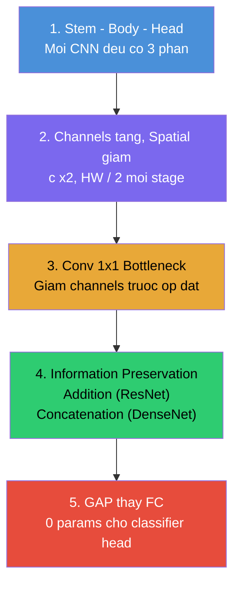

# Tổng ôn D2L: Buổi 25→36 — Builders Guide + CNN + Modern CNN

> [!NOTE] ELI5
> Bạn đã xây xong nền móng (Buổi 8–24): biết training loop, MLP, regularization, nn.Module. 12 buổi tiếp theo là **hành trình CNN hoàn chỉnh**: từ lưu model ra file, chạy GPU → hiểu convolution, pooling → xây CNN đầu tiên (LeNet) → rồi lần lượt đi qua **9 kiến trúc lừng danh** (AlexNet → VGG → NiN → GoogLeNet → BN → ResNet → ResNeXt → DenseNet → RegNet).
>
> File này **dạy lại** từng phần, không chỉ hỏi recall. Nếu thấy "ơ, cái này mình quên" → đọc kỹ đoạn đó, rồi quay lại buổi gốc nếu cần.

---

## 🗺️ Bản đồ kiến thức tổng thể

```mermaid
graph TD
    subgraph "TUAN 7: Builders Guide"
        B25["Buoi 25<br>Save/Load<br>GPU Training"]
    end

    subgraph "TUAN 8a: CNN Fundamentals"
        B26["Buoi 26<br>Convolution<br>Padding, Stride"]
        B27["Buoi 27<br>Pooling<br>Multi-Channel"]
        B28["Buoi 28<br>LeNet<br>CNN dau tien"]
    end

    subgraph "TUAN 8b: Modern CNN"
        B29["Buoi 29<br>AlexNet<br>GPU Revolution"]
        B30["Buoi 30<br>VGG<br>Blocks Design"]
        B31["Buoi 31<br>NiN<br>1x1 Conv, GAP"]
        B32["Buoi 32<br>GoogLeNet<br>Inception"]
    end

    subgraph "TUAN 9: Advanced CNN"
        B33["Buoi 33<br>Batch Norm"]
        B34["Buoi 34<br>ResNet<br>ResNeXt"]
        B35["Buoi 35<br>DenseNet"]
    end

    subgraph "TUAN 10: Design Spaces"
        B36["Buoi 36<br>AnyNet/RegNet<br>Tong on Ch.8"]
    end

    B25 --> B26 --> B27 --> B28
    B28 --> B29 --> B30 --> B31 --> B32
    B32 --> B33 --> B34 --> B35 --> B36

    style B25 fill:#4A90D9,color:#fff
    style B26 fill:#7B68EE,color:#fff
    style B27 fill:#7B68EE,color:#fff
    style B28 fill:#7B68EE,color:#fff
    style B29 fill:#E8A838,color:#000
    style B30 fill:#E8A838,color:#000
    style B31 fill:#E8A838,color:#000
    style B32 fill:#E8A838,color:#000
    style B33 fill:#2ECC71,color:#000
    style B34 fill:#2ECC71,color:#000
    style B35 fill:#2ECC71,color:#000
    style B36 fill:#E74C3C,color:#fff
```



---

## Giai đoạn 1: Builders Guide — Save/Load & GPU (Buổi 25)

> **Câu hỏi trung tâm**: "Train xong thì lưu model thế nào? Làm sao dùng GPU?"

### 1.1 Save/Load Models

> [!NOTE] ELI5
> Lưu model = lưu "bộ não" (trọng số). Khi load lại: (1) xây lại cái đầu (cùng kiến trúc), (2) nhét bộ não vào (`load_state_dict`). PyTorch **chỉ lưu trọng số**, không lưu code kiến trúc.

**Pipeline chuẩn:**

```python
# ══ LƯU ══
torch.save(net.state_dict(), 'model.pt')    # dict {name: tensor}

# ══ LOAD ══
clone = MLP()                                # Tạo model CÙNG kiến trúc
clone.load_state_dict(torch.load('model.pt'))
clone.eval()                                 # BẮT BUỘC: tắt Dropout/BN
```

**3 lỗi phổ biến:**

| Lỗi | Sai | Đúng |
|---|---|---|
| Lưu cả model | `torch.save(net, 'f.pkl')` | `torch.save(net.state_dict(), 'f.pt')` |
| Quên tạo model trước | `clone = torch.load(...)` | `clone = MLP(); clone.load_state_dict(...)` |
| Quên eval | `clone(X)` → dao động | `clone.eval(); clone(X)` → ổn định |

**Checkpointing** — lưu định kỳ khi train lâu:

```python
torch.save({
    'epoch': epoch,
    'model_state_dict': model.state_dict(),
    'optimizer_state_dict': optimizer.state_dict(),  # ← giữ momentum!
    'loss': loss,
}, f'checkpoint_epoch{epoch}.pt')
```

> [!TIP] Tại sao lưu cả optimizer state?
> Adam/SGD+momentum lưu **momentum** cho mỗi parameter. Không lưu → resume training bị reset momentum → train tệ hơn.

### 1.2 GPU Training

> [!NOTE] ELI5
> CPU = 1 đầu bếp giỏi (làm 1 việc nhanh). GPU = 1000 đầu bếp (mỗi người kém hơn, nhưng nấu 1000 món song song). Deep learning = nhân ma trận = rất nhiều phép tính giống nhau → GPU nhanh hơn 10-100×.

**Pattern chuẩn — chỉ 3 dòng:**

```python
device = torch.device('cuda' if torch.cuda.is_available() else 'cpu')
model.to(device)                    # Model → GPU
# Trong training loop:
X, y = X.to(device), y.to(device)  # Data → GPU mỗi batch
```

**Quy tắc VÀNG:** Tất cả tensors tham gia phép tính phải **ở cùng device**. `X_cpu + Y_gpu` → RuntimeError!

**Bẫy hiệu năng:**

| Quy tắc | Lý do |
|---|---|
| Tránh `.item()`, `.cpu()` trong loop | Buộc GPU sync → chậm |
| Tạo tensor trực tiếp trên GPU | `torch.rand(..., device='cuda')` — tránh copy |
| Batch lớn hơn | GPU mạnh ở parallel |

---

## Giai đoạn 2: CNN Fundamentals — Convolution, Pooling, LeNet (Buổi 26-28)

> **Câu hỏi trung tâm**: "Tại sao MLP thất bại với ảnh? CNN giải quyết thế nào?"

### 2.1 Tại sao cần CNN? — 2 nguyên tắc cốt lõi

> [!NOTE] ELI5
> MLP dùng cho ảnh HD (1000×1000) cần **1 tỷ tham số** — bất khả thi. CNN giải quyết bằng 2 nguyên tắc: (1) **mỗi neuron chỉ nhìn vùng nhỏ** (locality), (2) **dùng chung bộ lọc cho mọi vị trí** (translation invariance). Giống đọc sách: bạn rà mắt từng vùng, không nhìn cả trang cùng lúc.

| Nguyên tắc | Ý nghĩa | Hệ quả |
|---|---|---|
| **Translation Invariance** | Cùng pattern trông giống nhau ở mọi vị trí | **Dùng chung kernel** → giảm params cực mạnh |
| **Locality** | Pixel xa nhau không liên quan | Mỗi neuron chỉ nhìn **vùng nhỏ** (3×3, 5×5) |

**Giảm tham số:**

$$\underbrace{10^{12}}_{\text{MLP}} \xrightarrow{\text{Weight Sharing}} \underbrace{10^6} \xrightarrow{\text{Locality}} \underbrace{100}_{\text{Kernel 5x5 + bias}}$$

### 2.2 Cross-Correlation — Phép tính cốt lõi

> [!NOTE] ELI5
> Convolution = trượt bộ lọc nhỏ (kernel) qua ảnh. Tại mỗi vị trí: đặt kernel lên vùng ảnh → nhân từng phần tử → cộng tất cả → được 1 số → trượt tiếp.

**Tính tay ví dụ kinh điển:**

$$\mathbf{X} = \begin{pmatrix} 0 & 1 & 2 \\ 3 & 4 & 5 \\ 6 & 7 & 8 \end{pmatrix}, \quad \mathbf{K} = \begin{pmatrix} 0 & 1 \\ 2 & 3 \end{pmatrix} \quad \Rightarrow \quad \text{Output} = \begin{pmatrix} 19 & 25 \\ 37 & 43 \end{pmatrix}$$

Vị trí (0,0): $0\times0 + 1\times1 + 3\times2 + 4\times3 = 19$ ✓

**Implement from scratch:**

```python
def corr2d(X, K):
    h, w = K.shape
    Y = torch.zeros((X.shape[0] - h + 1, X.shape[1] - w + 1))
    for i in range(Y.shape[0]):
        for j in range(Y.shape[1]):
            Y[i, j] = (X[i:i+h, j:j+w] * K).sum()
    return Y
```

### 2.3 Công thức kích thước output

**Không padding, không stride:**

$$\text{Output} = (n_h - k_h + 1) \times (n_w - k_w + 1)$$

**Có padding + stride (công thức tổng quát):**

$$\text{Output} = \left\lfloor \frac{n_h - k_h + p_h + s_h}{s_h} \right\rfloor \times \left\lfloor \frac{n_w - k_w + p_w + s_w}{s_w} \right\rfloor$$

| Config | Input | Kernel | Padding | Stride | Output |
|---|---|---|---|---|---|
| Giữ kích thước | 28×28 | 3×3 | 1 | 1 | **28×28** |
| Giảm 2× | 28×28 | 3×3 | 1 | 2 | **14×14** |
| AlexNet stem | 224×224 | 7×7 | 3 | 2 | **112×112** |

> [!TIP] Tại sao kernel lẻ (3, 5, 7)?
> Kernel lẻ → padding đối xứng. Để giữ kích thước: $p = (k-1)/2$.

### 2.4 Edge Detection — Kernel tự học

Kernel `[1, -1]` phát hiện cạnh dọc. Quan trọng hơn: model **tự học** kernel tối ưu từ data qua backpropagation — không cần thiết kế tay!

```python
# Sau 10 epochs training, kernel học được ≈ [0.9995, -0.9995] ← gần [1, -1]!
```

### 2.5 Pooling — Rút gọn có chọn lọc

> [!NOTE] ELI5
> Pooling = đọc báo dài 10 trang, chỉ nhớ ý chính mỗi đoạn. Max Pooling giữ giá trị lớn nhất (nổi bật nhất), Average Pooling giữ trung bình.

**Max Pooling vs Average Pooling:**

| | Max Pooling ⭐ | Average Pooling |
|---|---|---|
| Giữ lại | Giá trị **nổi bật nhất** | Giá trị **trung bình** |
| Phổ biến | **Mặc định** ở hidden layers | Tầng cuối (Global Average Pooling) |
| Parameters | **0** — không learnable! | **0** |
| Translation inv. | Tốt hơn | Kém hơn |

**Quy tắc:** Hidden layers → Max Pooling. Tầng cuối trước classifier → Global Average Pooling.

> [!IMPORTANT] Pooling xử lý **từng channel riêng biệt** — không mix channels (khác convolution)!

### 2.6 Multiple Channels — Ảnh RGB & Feature Maps

**Multi-input channels:** Ảnh RGB có 3 channels → kernel cũng **dày 3 lớp**. Conv riêng từng channel, rồi **cộng lại** → 1 feature map.

**Multi-output channels:** Muốn phát hiện nhiều features → dùng **nhiều kernels**. $c_o$ kernels → $c_o$ feature maps.

**Kernel shape đầy đủ:**

$$\text{nn.Conv2d} \Rightarrow \text{Kernel shape} = (c_o, c_i, k_h, k_w)$$

**Đếm params:** `nn.Conv2d(c_i, c_o, k)` có $c_o \times c_i \times k^2 + c_o$ params (weights + biases).

| Layer | Params |
|---|---|
| `Conv2d(1, 6, 5)` | $6\times1\times25 + 6 = 156$ |
| `Conv2d(3, 64, 3)` | $64\times3\times9 + 64 = 1{,}792$ |
| `Conv2d(64, 128, 3)` | $128\times64\times9 + 128 = 73{,}856$ |

### 2.7 1×1 Convolution — FC per pixel

> [!NOTE] ELI5
> 1×1 conv ban đầu nghe vô lý — kernel 1 pixel thì quét gì? Nhưng nó quét **channels**, không quét spatial. Tại mỗi pixel: lấy vector $c_i$ channels → nhân ma trận → ra $c_o$ channels. Tương đương FC layer áp dụng riêng cho từng pixel.

**Ứng dụng:**
- **Giảm channels** (bottleneck): 256 → 64 trước Conv 3×3
- **Tăng channels** (expansion): 64 → 256
- **Cross-channel interaction**: trộn thông tin giữa feature maps

### 2.8 Pattern CNN quan trọng nhất

> [!IMPORTANT] **Channels tăng, Spatial giảm** — xuyên suốt mọi CNN!

| Giai đoạn | Channels | Spatial | Thông tin |
|---|---|---|---|
| Input | 3 | 224×224 | Pixel thô |
| Sau Conv+Pool 1 | 64 | 112×112 | Edges |
| Sau Conv+Pool 2 | 128 | 56×56 | Textures |
| Sau Conv+Pool 3 | 256 | 28×28 | Parts |
| Sau Conv+Pool 4 | 512 | 7×7 | Objects |
| GAP | 512 | 1×1 | Feature vector |

### 2.9 LeNet — CNN đầu tiên hoàn chỉnh (Buổi 28)

> [!NOTE] ELI5
> LeNet = nhà máy có 2 phân xưởng: "Mắt" (Conv+Pool → phát hiện features) và "Não" (FC → phân loại). Được dùng trong máy ATM (1998) để đọc chữ viết tay.

**Kiến trúc LeNet:**

```
Input (1, 28, 28)
 → Conv(1→6, 5×5, p=2) → Sigmoid → AvgPool(2)     → (6, 14, 14)
 → Conv(6→16, 5×5)     → Sigmoid → AvgPool(2)     → (16, 5, 5)
 → Flatten → (400)
 → FC(400→120) → Sigmoid → FC(120→84) → Sigmoid → FC(84→10)
```

**96% tham số nằm ở FC layers** (Não), Conv chỉ 4%! → Sau này thay FC bằng GAP.

**Modern LeNet — 4 nâng cấp:**

| Classic (1998) | Modern | Lợi ích |
|---|---|---|
| Sigmoid | **ReLU** | Gradient không vanish → train nhanh 5-10× |
| AvgPool | **MaxPool** | Giữ features nổi bật |
| — | + **BatchNorm** | Ổn định training, lr cao hơn |
| — | + **Dropout 0.5** | Chống overfitting |

| Model | Params | Fashion-MNIST Accuracy |
|---|---|---|
| MLP 2 layers | ~200K | ~87% |
| LeNet Classic | ~62K | ~84% |
| **Modern LeNet** | ~62K | **~91%** |

**CNN thắng MLP vì inductive bias đúng:** locality + weight sharing + hierarchical features.

### 2.10 Receptive Field — Mạng sâu nhìn rộng

> [!NOTE] ELI5
> Receptive field = vùng ảnh gốc mà 1 pixel output "nhìn thấy". 2 tầng Conv 3×3 liên tiếp có receptive field 5×5 — nhưng chỉ dùng $2\times9=18$ params (thay vì $25$ cho Conv 5×5 đơn lẻ) + thêm 1 ReLU → phong phú hơn. Đây là triết lý VGG.

---

## Giai đoạn 3: Modern CNN — 9 kiến trúc lừng danh (Buổi 29-36)

> **Câu hỏi trung tâm**: "Kiến trúc nào giải quyết vấn đề gì? Mỗi kiến trúc đóng góp ý tưởng nào?"

### 3.1 AlexNet (2012) — GPU Revolution (Buổi 29)

> [!NOTE] ELI5
> LeNet (1998) đã chứng minh CNN hoạt động, nhưng bị lãng quên 14 năm vì thiếu 3 thứ: **data lớn** (ImageNet 1.2M ảnh), **GPU mạnh** (GTX 580), và **kỹ thuật hiện đại** (ReLU, Dropout, Xavier init). AlexNet = LeNet phóng to + nâng cấp linh kiện, thắng ImageNet 2012 với khoảng cách lớn → cả thế giới chuyển sang Deep Learning.

**3 Missing Ingredients trước 2012:**

| Thành phần | Thiếu | Có (sau 2009-2012) |
|---|---|---|
| Data | MNIST 60K ảnh 28×28 | **ImageNet** 1.2M ảnh 224×224 |
| Hardware | CPU ~1 GFLOPS | **GPU** GTX 580, 1.5 TFLOPS |
| Techniques | Sigmoid (vanishing gradient) | **ReLU**, Dropout, Xavier init |

**Bước chuyển tư duy — Representation Learning:**

- **Trước 2012 (Feature Engineering):** Con người tự thiết kế features (SIFT, HOG, SURF) → đưa vào SVM
- **Sau 2012 (Representation Learning):** CNN tự học features từ pixels thô → end-to-end learning

**Kiến trúc AlexNet:** 8 layers (5 Conv + 3 FC), ~47M params

| So sánh | LeNet | AlexNet |
|---|---|---|
| Input | 28×28 | **224×224** |
| Depth | 5 layers | **8 layers** |
| Activation | Sigmoid | **ReLU** |
| Pooling | Average | **Max** |
| Regularization | Weight Decay | **Dropout** + Data Aug |
| Params | ~62K | **~47M** |

**Achilles heel:** FC layers chiếm >56% params (~164MB) → các kiến trúc sau sẽ giải quyết bằng GAP.

> [!IMPORTANT] ReLU thay đổi tất cả
> Sigmoid: gradient max = 0.25. Qua 5 layers: $0.25^5 = 0.001$ → gradient biến mất.
> ReLU: gradient = 1 khi $x>0$. Qua 5 layers: $1^5 = 1$ → gradient giữ nguyên.

### 3.2 VGG (2014) — Networks Using Blocks (Buổi 30)

> [!NOTE] ELI5
> AlexNet thiết kế "thủ công" từng layer riêng lẻ. VGG phát minh ý tưởng **block**: gom nhiều Conv 3×3 + MaxPool thành 1 "khối LEGO", rồi xếp nhiều khối lại. Giống xây nhà bằng gạch thay vì đắp tường tay.

**VGG Block:** N conv layers 3×3 + MaxPool 2×2

```python
def vgg_block(num_convs, out_channels):
    layers = []
    for _ in range(num_convs):
        layers.append(nn.LazyConv2d(out_channels, kernel_size=3, padding=1))
        layers.append(nn.ReLU())
    layers.append(nn.MaxPool2d(kernel_size=2, stride=2))
    return nn.Sequential(*layers)
```

**VGG-11:** `arch = [(1,64), (1,128), (2,256), (2,512), (2,512)]` → 8 conv + 3 FC = 11 layers

**Đóng góp quan trọng:**
1. **Block-based design** — nền tảng cho mọi kiến trúc sau
2. **Chỉ dùng kernel 3×3** — 2 tầng 3×3 = receptive field 5×5 nhưng ít params hơn + thêm ReLU
3. **Channels tăng gấp đôi, spatial giảm nửa** — pattern chuẩn của CNN

### 3.3 NiN (2013) — Network in Network (Buổi 31)

> [!NOTE] ELI5
> AlexNet/VGG có 3 FC layers cuối chiếm hết tham số (96% trong LeNet!). NiN có 2 đột phá: (1) thay conv thường bằng **MLP conv** (conv + conv 1×1 + conv 1×1 — mini MLP trên mỗi pixel), (2) thay FC cuối bằng **Global Average Pooling** — giảm hàng triệu params xuống 0!

**NiN Block:** Conv ww → Conv 1×1 → Conv 1×1 (mỗi conv kèm ReLU)

**Global Average Pooling (GAP):**

$$\text{AdaptiveAvgPool2d}(1): \quad (C, H, W) \to (C, 1, 1)$$

- **Không có tham số** — chỉ lấy trung bình toàn bộ spatial
- Thay thế `Flatten + FC(C×H×W → num_classes)` bằng `GAP + FC(C → num_classes)`
- Giảm overfitting: không có params lớn để "nhớ thuộc"

**Di sản:** Conv 1×1 và GAP được dùng trong mọi CNN hiện đại (GoogLeNet, ResNet, DenseNet, EfficientNet).

### 3.4 GoogLeNet (2014) — Multi-Branch Networks (Buổi 32)

> [!NOTE] ELI5
> Các mạng trước phải **chọn** kernel size cố định: 3×3 hay 5×5? GoogLeNet nói: "tại sao không **dùng tất cả cùng lúc?**" Inception block = chạy song song 4 nhánh (1×1, 3×3, 5×5, MaxPool), rồi ghép kết quả lại. Model tự quyết nhánh nào quan trọng.

**Inception Block — 4 nhánh song song:**

```
Input ──┬── Conv 1×1 ──────────────────┐
        ├── Conv 1×1 → Conv 3×3 ───────┤
        ├── Conv 1×1 → Conv 5×5 ───────┤  → Concat → Output
        └── MaxPool 3×3 → Conv 1×1 ────┘
```

- **Conv 1×1 trước 3×3 và 5×5**: bottleneck — giảm channels trước operation đắt → tiết kiệm params cực lớn
- **Concat** theo channel dimension: gộp outputs từ 4 nhánh

**GoogLeNet (22 layers):** Stem → 9 Inception blocks → GAP → FC

| So sánh | VGG-19 | GoogLeNet |
|---|---|---|
| Depth | 19 | **22** |
| Params | **~138M** | **~5M** (ít hơn 28×!) |
| Chiến lược | Sequential 3×3 | Multi-scale parallel |

### 3.5 Batch Normalization (2015) (Buổi 33)

> [!NOTE] ELI5
> BN = đặt "thanh tra chất lượng" giữa mỗi layer. Thanh tra chuẩn hóa activations về "vị chuẩn" (mean=0, variance=1) trước khi chuyển tiếp. Đầu bếp sau luôn nhận nguyên liệu ổn định → training nhanh hơn, cho phép learning rate cao hơn.

**Công thức BN (2 bước):**

**Bước 1 — Standardize:**

$$\hat{\mathbf{x}} = \frac{\mathbf{x} - \hat{\boldsymbol{\mu}}_\mathcal{B}}{\sqrt{\hat{\boldsymbol{\sigma}}^2_\mathcal{B} + \epsilon}}$$

**Bước 2 — Scale & Shift (learnable):**

$$\mathbf{y} = \boldsymbol{\gamma} \odot \hat{\mathbf{x}} + \boldsymbol{\beta}$$

- $\gamma$ (scale, init=1) và $\beta$ (shift, init=0): **learnable** — cho mạng quyền "veto" nếu normalization không tốt
- Có thể bỏ bias trong Conv/FC trước BN (vì BN trừ mean → bias bị hấp thụ → $\beta$ thay thế)

**FC vs Conv BN:**

| Tiêu chí | FC Layer | Conv Layer |
|---|---|---|
| Input shape | $(N, D)$ | $(N, C, H, W)$ |
| Normalize theo | dim=0 (batch) | dim=(0,2,3) (batch + spatial) |
| Lý do | Per-feature | Per-channel (**translation invariance**) |
| Learnable params | $2D$ | $2C$ |

**Training vs Inference — 2 chế độ khác nhau:**

| | `model.train()` | `model.eval()` |
|---|---|---|
| Mean/Var | Tính trên **batch hiện tại** | Dùng **running statistics** |
| Cập nhật | Có (exponential moving avg) | Không |
| Output | Noisy (regularization) | Deterministic |

> [!WARNING] Quên `model.eval()` khi inference → BN dùng batch test → kết quả sai!

**BN vs Layer Normalization:**

| | Batch Norm | Layer Norm |
|---|---|---|
| Tính trên | Batch (nhiều samples) | 1 sample (tất cả features) |
| Phụ thuộc batch size | Có | **Không** |
| Dùng phổ biến ở | **CNN** | **Transformer**, RNN |

### 3.6 ResNet (2015) — Residual Networks (Buổi 34)

> [!NOTE] ELI5
> Mạng sâu hơn lẽ ra phải tốt hơn, nhưng thực tế mạng 56 layers tệ hơn 20 layers — cả training error lẫn test error đều tăng! Đây KHÔNG phải overfitting mà là **degradation problem**. ResNet giải quyết bằng **skip connection**: cho input "đi tắt" qua block, model chỉ cần học phần khác biệt (residual). Nếu block thừa → chỉ cần $g(\mathbf{x})=0$ (dễ!) thay vì $f(\mathbf{x})=\mathbf{x}$ (khó!).

**Residual Block:**

$$f(\mathbf{x}) = g(\mathbf{x}) + \mathbf{x}$$

```
Input x ──┬── Conv 3×3 → BN → ReLU → Conv 3×3 → BN ──→ (+) → ReLU → Output
           │                                              ↑
           └────────────── Skip Connection ──────────────┘
```

**2 loại:** Identity shortcut (cùng shape) và Projection shortcut (1×1 conv khi đổi channels/size)

**Gradient Flow — Tại sao skip connection giải quyết vanishing gradient:**

$$\frac{\partial L}{\partial x} = \frac{\partial L}{\partial y} \cdot \left(\frac{\partial g(x)}{\partial x} + \mathbf{I}\right)$$

Thành phần $+\mathbf{I}$ đảm bảo gradient **luôn chảy qua** dù $\frac{\partial g}{\partial x} \approx 0$. Qua $L$ blocks → $2^L$ đường đi song song!

**ResNet-18: Stem → 4 stages → Head**

| Stage | Blocks | Channels | Spatial |
|---|---|---|---|
| Stem (b1) | Conv 7×7, s=2 + MaxPool | 64 | 24×24 |
| b2 | 2 × Residual(64) | 64 | 24×24 |
| b3 | 2 × Residual(128) | 128 | 12×12 |
| b4 | 2 × Residual(256) | 256 | 6×6 |
| b5 | 2 × Residual(512) | 512 | 3×3 |
| Head | GAP + FC | 10 | 1×1 |

**Tên gọi:** ResNet-**18** = 1 (stem conv) + 4×4 (conv layers) + 1 (FC) = 18 layers có weights.

**Function Classes lồng nhau:** ResNet đảm bảo $\mathcal{F}_1 \subseteq \mathcal{F}_2 \subseteq ...$ vì mọi layer mới có thể dễ dàng học identity → thêm layers không bao giờ tệ hơn.

### 3.7 ResNeXt — Mở rộng bằng Grouped Convolution (Buổi 34)

> [!NOTE] ELI5
> Thay vì thuê 1 nhóm 100 công nhân (chi phí $100^2$), chia thành 10 nhóm nhỏ 10 người → chi phí $10 \times 10^2 = 1000$ (1/10!). ResNeXt chia convolution thành **nhiều nhóm song song**, rồi ghép kết quả.

**Grouped Convolution:** Chia $c_i$ input channels thành $g$ nhóm, mỗi nhóm xử lý độc lập → giảm params $g$ lần.

**ResNeXt Bottleneck Block:** Conv 1×1 (squeeze) → Conv 3×3 grouped (transform) → Conv 1×1 (expand)

| Cấu hình | Params | So với standard |
|---|---|---|
| Standard Conv 3×3 ($c=256$) | 589,824 | 100% |
| ResNeXt g=32, b=128 | 70,000 | **12%** |

**Cardinality** = số groups song song — chiều thứ 3 của thiết kế mạng (ngoài depth và width). Tăng cardinality hiệu quả hơn tăng depth.

> [!TIP] Ký hiệu ResNeXt-50 (32×4d) = 32 groups × 4 channels/group = 128 bottleneck channels.

### 3.8 DenseNet (2017) — Densely Connected Networks (Buổi 35)

> [!NOTE] ELI5
> ResNet **cộng** features: $y = g(x) + x$. DenseNet **ghép nối** features: $y = [g(x), x]$ (concatenation). Mỗi layer nhận đầu vào từ **TẤT CẢ** layers trước đó — như chat nhóm mà ai cũng đọc được tin nhắn của tất cả người trước.

**Phép so sánh cốt lõi:**

| | ResNet | DenseNet |
|---|---|---|
| **Công thức** | $\mathbf{x}_l = f(\mathbf{x}_{l-1}) + \mathbf{x}_{l-1}$ | $\mathbf{x}_l = f([\mathbf{x}_0, ..., \mathbf{x}_{l-1}])$ |
| **Kết hợp** | Addition (+) | Concatenation ([,]) |
| **Channels** | Giữ nguyên | **Tăng dần** (+k mỗi layer) |
| **Feature reuse** | Chỉ từ layer ngay trước | Từ **tất cả** layers trước |

**Growth Rate ($k$):** Mỗi layer trong Dense Block thêm $k$ channels. Sau $n$ layers từ $c_0$ channels ban đầu:

$$\text{Channels} = c_0 + n \times k$$

$k$ thường nhỏ (12, 24, 32) — mỗi layer chỉ thêm "ít thông tin mới", nhưng tổng hợp từ tất cả layers trước → rất hiệu quả.

**Dense Block:** BN → ReLU → Conv → BN → ReLU → Conv (mỗi conv output $k$ channels, concat với input)

**Transition Layer:** Kiểm soát channels giữa Dense Blocks

$$\text{BN} \to \text{ReLU} \to \text{Conv 1×1} (c \to \lfloor \theta c \rfloor) \to \text{AvgPool 2×2}$$

$\theta=0.5$: giảm channels một nửa + giảm spatial 2×.

**DenseNet Architecture:** Stem → Dense Block 1 → Transition → Dense Block 2 → ... → GAP → FC

### 3.9 AnyNet & RegNet (2020) — Designing CNN Architectures (Buổi 36)

> [!NOTE] ELI5
> Trước đây, mỗi kiến trúc CNN (AlexNet, VGG, ResNet...) được thiết kế thủ công — giống một nghệ nhân tạo ra 1 chiếc xe đẹp. AnyNet/RegNet thay đổi: thay vì tìm 1 model tốt nhất, họ tìm **nguyên tắc thiết kế phổ quát** bằng cách thử hàng trăm nghìn mạng rồi phân tích thống kê. Giống chuyển từ thợ thủ công sang dây chuyền sản xuất.

**AnyNet Design Space:** Template tổng quát cho CNN = **Stem → Body (4 stages) → Head**

Mỗi stage có 4 hyperparameters: $d_i$ (depth), $c_i$ (width/channels), $k_i$ (bottleneck ratio), $g_i$ (group width).

**Thu hẹp design space (AnyNet$_A$ → AnyNet$_E$):**

| Bước | Ràng buộc | Từ → Đến |
|---|---|---|
| AnyNet$_A$ → $B$ | Shared bottleneck ratio: $k_i = k$ | 17 → 14 params |
| AnyNet$_B$ → $C$ | Shared group width: $g_i = g$ | 14 → 11 params |
| AnyNet$_C$ → $D$ | Increasing width: $c_i \leq c_{i+1}$ | 11 → 11 (constrained) |
| AnyNet$_D$ → $E$ | Increasing depth: $d_i \leq d_{i+1}$ | Thêm constraint |

**RegNet — 4 nguyên tắc thiết kế:**

1. **Shared bottleneck ratio** ($k$): cùng tỷ lệ squeeze cho mọi stage
2. **Shared group width** ($g$): cùng kích thước nhóm cho mọi stage
3. **Increasing width** ($c_1 \leq c_2 \leq c_3 \leq c_4$): channels tăng dần
4. **Increasing depth** ($d_1 \leq d_2 \leq d_3 \leq d_4$): depth tăng dần

---

## 📐 Bảng tổng hợp — 9 kiến trúc CNN

| Kiến trúc | Năm | Innovation | Params | Depth |
|---|---|---|---|---|
| **LeNet** | 1998 | CNN đầu tiên, Encoder+Classifier | 62K | 5 |
| **AlexNet** | 2012 | ReLU, Dropout, GPU, ImageNet | 47M | 8 |
| **VGG** | 2014 | Block-based, chỉ 3×3 | 138M | 11-19 |
| **NiN** | 2013 | Conv 1×1, GAP thay FC | Ít | 12 |
| **GoogLeNet** | 2014 | Inception (multi-branch), Bottleneck 1×1 | 5M | 22 |
| **BN** | 2015 | Normalize activations, lr cao hơn | +2C per layer | — |
| **ResNet** | 2015 | Skip connection, identity mapping | 11-60M | 18-152 |
| **ResNeXt** | 2017 | Grouped conv, cardinality | Tùy g | 50+ |
| **DenseNet** | 2017 | Concatenation, feature reuse, growth rate | Ít | 121-264 |
| **RegNet** | 2020 | Design space optimization | Tùy | Tùy |

---

## 🧵 5 Design Patterns xuyên suốt mọi CNN



| Pattern | Xuất hiện từ | Dùng trong |
|---|---|---|
| **Stem-Body-Head** | GoogLeNet | ResNet, DenseNet, RegNet, ViT |
| **Channel doubling + Spatial halving** | VGG | Mọi CNN |
| **1×1 Conv bottleneck** | NiN | GoogLeNet, ResNet-50+, ResNeXt, DenseNet-BC |
| **Skip connection** | ResNet | DenseNet (concat), Transformer, U-Net |
| **GAP thay FC** | NiN | GoogLeNet+, ResNet+, DenseNet+, EfficientNet |

---

## 📐 Công thức cốt lõi

### Convolution

$$\text{Output size} = \left\lfloor \frac{n - k + 2p}{s} \right\rfloor + 1$$

$$\text{Conv params} = c_o \times c_i \times k_h \times k_w + c_o$$

### Pooling

$$\text{Output size (same formula, default stride = pool\_size)}$$

$$\text{Pooling params} = 0 \quad \text{(không learnable!)}$$

### Batch Normalization

$$\hat{\mathbf{x}} = \frac{\mathbf{x} - \hat{\mu}_\mathcal{B}}{\sqrt{\hat{\sigma}^2_\mathcal{B} + \epsilon}}, \quad \mathbf{y} = \gamma \odot \hat{\mathbf{x}} + \beta$$

### Residual Block

$$f(\mathbf{x}) = g(\mathbf{x}) + \mathbf{x}, \quad \frac{\partial L}{\partial x} = \frac{\partial L}{\partial y}\left(\frac{\partial g}{\partial x} + \mathbf{I}\right)$$

### DenseNet

$$\mathbf{x}_l = H_l([\mathbf{x}_0, \mathbf{x}_1, \ldots, \mathbf{x}_{l-1}]), \quad \text{Channels} = c_0 + l \times k$$

### Grouped Convolution

$$\text{Params} = \frac{c_i \times c_o \times k^2}{g} \quad \text{(giảm } g \text{ lần so với standard)}$$

---

## 🏋️ ĐỀ ÔN TẬP — 50 câu hỏi toàn diện

### Nhóm A: Builders Guide — Save/Load & GPU (Buổi 25) — 5 câu

1. Tại sao nên lưu `state_dict()` thay vì lưu cả model? Cho 2 lý do.
2. Viết code lưu checkpoint gồm model + optimizer state + epoch. Tại sao cần lưu optimizer state?
3. `X_cpu + Y_gpu` sẽ xảy ra gì? Sửa thế nào?
4. Tại sao `.item()` trong training loop làm chậm GPU?
5. 3 bước bắt buộc để load model cho prediction?

### Nhóm B: CNN Fundamentals — Convolution, Pooling, Channels (Buổi 26-27) — 10 câu

6. Nêu 2 nguyên tắc khiến CNN ít params hơn MLP hàng triệu lần.
7. Tính tay cross-correlation: Input $\begin{pmatrix} 1 & 0 \\ 0 & 1 \end{pmatrix}$, Kernel $\begin{pmatrix} 1 & 1 \\ 1 & 1 \end{pmatrix}$.
8. Input 224×224, kernel 7×7, padding=3, stride=2 → Output size = ?
9. Max Pooling 2×2 (stride=2) trên $\begin{pmatrix} 1 & 5 & 3 & 2 \\ 8 & 4 & 7 & 6 \\ 9 & 3 & 2 & 1 \\ 0 & 5 & 4 & 8 \end{pmatrix}$ = ?
10. Pooling có bao nhiêu trainable parameters? Tại sao?
11. `nn.Conv2d(3, 64, 3)` → kernel shape? Tổng params (có bias)?
12. 1×1 convolution dùng để làm gì? Cho 2 ví dụ.
13. Tại sao kernel lẻ (3, 5, 7) được ưu tiên?
14. Tại sao CNN pattern luôn "channels tăng, spatial giảm"?
15. Receptive field: 2 tầng Conv 3×3 vs 1 tầng Conv 5×5 — cùng RF, nhưng cái nào tốt hơn? Tại sao?

### Nhóm C: LeNet & AlexNet (Buổi 28-29) — 8 câu

16. LeNet gồm mấy Conv, mấy FC? Tổng params? FC chiếm bao nhiêu %?
17. Modern LeNet nâng cấp 4 thứ gì? Mỗi cái giúp gì?
18. Tại sao CNN 62K params đạt 91% nhưng MLP 200K params chỉ 87%?
19. Kể 3 "missing ingredients" khiến CNN ngủ đông từ 1998-2012.
20. **Representation Learning** khác **Feature Engineering** ở điểm gì?
21. Tại sao AlexNet Conv1 dùng kernel 11×11 stride 4? LÝ DO cụ thể?
22. Sigmoid gradient max = 0.25. Qua 8 tầng → gradient còn?
23. Achilles heel của AlexNet? Giải pháp sau này?

### Nhóm D: VGG, NiN, GoogLeNet (Buổi 30-32) — 7 câu

24. VGG đóng góp ý tưởng gì quan trọng nhất? Tại sao chỉ dùng 3×3?
25. NiN block khác VGG block thế nào?
26. Global Average Pooling: $(512, 7, 7) \to$ shape gì? Bao nhiêu params?
27. GAP giảm overfitting thế nào so với FC head?
28. Inception block có mấy nhánh? Vai trò Conv 1×1 trong Inception?
29. GoogLeNet chỉ 5M params nhưng AlexNet 47M. Tại sao ít hơn 9×?
30. So sánh VGG (single-path) vs GoogLeNet (multi-branch): ưu/nhược?

### Nhóm E: Batch Normalization (Buổi 33) — 8 câu

31. BN normalize theo chiều nào ở FC? Ở Conv? Tại sao khác nhau?
32. BN có bao nhiêu learnable params per layer? Init bằng bao nhiêu?
33. Training vs Eval mode: BN hoạt động khác nhau thế nào?
34. Tại sao có thể bỏ bias trong Conv khi dùng BN?
35. Tại sao BN cho phép learning rate **cao hơn**?
36. BN vs Layer Norm — khi nào dùng cái nào?
37. BN không hoạt động với batch size 1. Tại sao?
38. BN thực sự hoạt động vì lý do gì? (Không phải Internal Covariate Shift!)

### Nhóm F: ResNet, ResNeXt, DenseNet (Buổi 34-35) — 8 câu

39. Degradation problem **khác** overfitting ở điểm cốt lõi nào?
40. Viết công thức gradient flow qua 1 residual block. Giải thích thành phần $+\mathbf{I}$.
41. Khi nào cần `use_1x1conv=True` trong Residual block?
42. ResNet-18 có bao nhiêu residual blocks? Bao nhiêu conv layers?
43. Grouped convolution giảm chi phí bao nhiêu lần? Giải thích.
44. ResNeXt-50 (32×4d): 32 và 4d nghĩa là gì? Tổng bottleneck channels?
45. DenseNet dùng concatenation thay addition. So sánh 2 cách.
46. Growth rate $k=12$, input 64 channels, sau 4 dense layers → bao nhiêu channels?

### Nhóm G: Design Space & Tổng hợp (Buổi 36) — 4 câu

47. AnyNet thu hẹp design space bằng 4 bước nào?
48. Nêu 4 nguyên tắc thiết kế của RegNet.
49. Kể 5 design patterns xuyên suốt mọi CNN hiện đại.
50. Sắp xếp theo thời gian: DenseNet, GoogLeNet, AlexNet, ResNet, VGG, NiN, LeNet.

---

## 📝 Đáp án

> [!NOTE]- 📝 Nhóm A — Builders Guide

> 1. (a) `state_dict()` chỉ lưu trọng số → **portable**, không phụ thuộc đường dẫn code. (b) Lưu cả model dùng pickle → dễ lỗi khi đổi tên/đổi máy, **nguy cơ bảo mật** (arbitrary code execution).
>
> 2. ```python
>    torch.save({'epoch': e, 'model': model.state_dict(),
>                'optimizer': optimizer.state_dict()}, 'ckpt.pt')
>    ```
>    Cần lưu optimizer state vì Adam/SGD+momentum giữ **momentum** cho mỗi param. Không lưu → resume training reset momentum → train tệ hơn.
>
> 3. **RuntimeError** — tensors phải cùng device. Sửa: `X_cpu.cuda() + Y_gpu` hoặc `X_cpu.to(Y_gpu.device) + Y_gpu`.
>
> 4. `.item()` buộc **GPU đồng bộ** (synchronize) với CPU → CPU **chờ** GPU tính xong → phá pipeline song song.
>
> 5. (a) Tạo model **cùng kiến trúc**, (b) `clone.load_state_dict(torch.load('f.pt'))`, (c) `clone.eval()` — tắt Dropout/BN.

> [!NOTE]- 📝 Nhóm B — CNN Fundamentals

> 6. (a) **Translation Invariance** — dùng chung kernel cho mọi vị trí → giảm params. (b) **Locality** — mỗi neuron chỉ nhìn vùng nhỏ (3×3, 5×5) → giảm params.
>
> 7. Output 1×1: $1\times1 + 0\times1 + 0\times1 + 1\times1 = 2$. Output = $(2)$.
>
> 8. $\lfloor(224 - 7 + 6 + 2)/2\rfloor = \lfloor225/2\rfloor = 112$. Output = **112 × 112**.
>
> 9. Stride=2 → không overlap: $\max(1,5,8,4)=8$, $\max(3,2,7,6)=7$, $\max(9,3,0,5)=9$, $\max(2,1,4,8)=8$. Output: $\begin{pmatrix} 8 & 7 \\ 9 & 8 \end{pmatrix}$.
>
> 10. **0** — pooling chỉ lấy max/mean, phép toán cố định, không cần learn. Không có gradient cho params → nhanh.
>
> 11. Kernel shape: $(64, 3, 3, 3)$. Params: $64\times3\times3\times3 + 64 = 1{,}792$.
>
> 12. (a) **Bottleneck**: giảm channels 256→64 trước Conv 3×3 → tiết kiệm compute. (b) **Cross-channel interaction**: trộn thông tin giữa feature maps (NiN, GoogLeNet).
>
> 13. Kernel lẻ → padding **đối xứng** (thêm bằng nhau trên/dưới, trái/phải). Kernel chẵn → padding không đối xứng → phức tạp.
>
> 14. (a) Spatial giảm → receptive field tương đối rộng hơn → nhìn context lớn. (b) Channels tăng → bù thông tin mất do giảm spatial. (c) Giữ tổng computation ổn định: $c \times H \times W \approx \text{const}$.
>
> 15. **2 tầng 3×3 tốt hơn**: (a) Ít params: $2\times9=18$ vs $25$. (b) Thêm 1 ReLU giữa → phi tuyến mạnh hơn. (c) Training dễ hơn. Đây là triết lý VGG.

> [!NOTE]- 📝 Nhóm C — LeNet & AlexNet

> 16. **2 Conv + 3 FC**. Tổng **~62K** params. FC chiếm **96%** (FC1 alone: 400×120 = 48K).
>
> 17. Sigmoid→**ReLU** (gradient không vanish), AvgPool→**MaxPool** (giữ features nổi bật), +**BatchNorm** (ổn định training), +**Dropout** (chống overfitting).
>
> 18. CNN có **inductive bias đúng** cho ảnh: locality, weight sharing, hierarchical features. MLP coi ảnh = vector phẳng → mất thông tin spatial.
>
> 19. (a) **Data thiếu** (chỉ MNIST 60K, 28×28). (b) **Hardware yếu** (chưa có GPU framework cho DL). (c) **Techniques thiếu** (Sigmoid → vanishing gradient, chưa có Dropout, Xavier, Adam).
>
> 20. **Feature Engineering**: con người **tự thiết kế** features (SIFT, HOG) → tốn thời gian, chỉ tốt cho 1 bài toán. **Representation Learning**: model **tự học** representations từ data → nhanh, tổng quát.
>
> 21. Ảnh 224×224 lớn hơn 8× so với 28×28 → cần **receptive field lớn** ở tầng đầu. Stride 4 **giảm nhanh** 224→54, tiết kiệm compute cho tầng sau.
>
> 22. $0.25^8 \approx 1.5 \times 10^{-5}$ → gradient gần 0 → tầng đầu **không học được**!
>
> 23. **FC layers quá lớn** (~164MB, >56% params). Giải pháp: NiN/GoogLeNet thay FC bằng **Global Average Pooling** → giảm hàng triệu params.

> [!NOTE]- 📝 Nhóm D — VGG, NiN, GoogLeNet

> 24. **Block-based design**: gom Conv+ReLU+Pool thành block, xếp nhiều block → dễ mở rộng. Chỉ 3×3 vì: 2 tầng 3×3 = RF 5×5 với ít params + thêm ReLU.
>
> 25. VGG block: N conv ww → MaxPool. NiN block: Conv ww → **Conv 1×1 → Conv 1×1** (thêm 2 lớp 1×1 = mini MLP per pixel).
>
> 26. $(512, 7, 7) \to (512, 1, 1)$. Params = **0** (chỉ lấy mean).
>
> 27. GAP **không có params** → không thể "nhớ thuộc" training data. FC head với hàng triệu params → dễ overfit.
>
> 28. **4 nhánh**: Conv 1×1, Conv 1×1→Conv 3×3, Conv 1×1→Conv 5×5, MaxPool→Conv 1×1. Conv 1×1 = **bottleneck** giảm channels trước operation đắt (3×3, 5×5).
>
> 29. GoogLeNet dùng: (a) **Bottleneck 1×1** giảm channels trước 3×3/5×5; (b) **GAP** thay 3 FC layers lớn; (c) **Inception** multi-scale → ít params cho cùng capacity.
>
> 30. VGG: đơn giản, dễ hiểu, dễ transfer learning. Nhược: params rất lớn (138M). GoogLeNet: ít params (5M), multi-scale. Nhược: phức tạp, khó implement, khó tune.

> [!NOTE]- 📝 Nhóm E — Batch Normalization

> 31. **FC**: dim=0 (across batch, per-feature). **Conv**: dim=(0,2,3) (across batch + spatial, per-channel). Conv khác vì cần **translation invariance** — cùng filter phải nhìn dữ liệu ổn định ở mọi vị trí.
>
> 32. **2 per layer**: $\gamma$ (scale, init=**1**) và $\beta$ (shift, init=**0**). Thêm 2 buffers (moving_mean, moving_var) nhưng không learnable.
>
> 33. **Training**: batch statistics (noisy) + cập nhật running stats. **Eval**: running stats (deterministic) + không cập nhật. Phải gọi `model.eval()` trước inference!
>
> 34. BN trừ mean → bias bị **hấp thụ** vào mean rồi trừ đi → vô nghĩa. $\beta$ của BN **thay thế** bias.
>
> 35. BN giữ activations **ổn định** (mean~0, var~1) → gradients không bùng nổ dù lr cao → optimizer ổn định.
>
> 36. **BN**: CNN (batch đủ lớn, translation invariance). **LN**: Transformer/RNN (batch nhỏ, sequence length thay đổi, cần deterministic). LN không phụ thuộc batch size.
>
> 37. Batch size 1: mean = chính giá trị đó → chuẩn hóa = **0** → mọi activation = 0 → mạng không học được!
>
> 38. Giải thích hiện đại: (a) **Landscape smoothing** — loss surface mượt hơn → optimizer đi hướng tốt. (b) **Implicit regularization** — noise từ batch stats. (c) **Scale stabilization** — ngăn activations phân kỳ.

> [!NOTE]- 📝 Nhóm F — ResNet, ResNeXt, DenseNet

> 39. Degradation: cả **training error lẫn test error đều tăng** khi thêm layers. Overfitting: training error thấp, test error cao. Degradation = **optimization difficulty**, không phải model complexity.
>
> 40. $\frac{\partial L}{\partial x} = \frac{\partial L}{\partial y}(\frac{\partial g}{\partial x} + \mathbf{I})$. Thành phần $+\mathbf{I}$: dù $\frac{\partial g}{\partial x} \approx 0$, gradient **vẫn chảy qua** identity → không vanish. Tạo "đường tắt" cho gradient.
>
> 41. Khi input và output **khác shape** (khác channels hoặc khác spatial size). Ví dụ: stage chuyển từ 64→128 channels và spatial giảm 2× → cần Conv 1×1 stride=2 để match shape.
>
> 42. **8 residual blocks** (2 per stage × 4 stages). **16 conv layers** (2 per block × 8) + 1 stem conv + 1 FC = **18 layers** tổng cộng.
>
> 43. **Giảm $g$ lần.** Standard: mỗi output kết nối tất cả $c_i$ inputs → $c_i \times c_o \times k^2$. Grouped: chia thành $g$ nhóm, mỗi nhóm $c_i/g$ → $c_o/g$ → params = $c_i \times c_o \times k^2 / g$.
>
> 44. "32" = cardinality (32 groups). "4d" = group width (4 channels/group). Tổng bottleneck channels = $32 \times 4 = 128$.
>
> 45. **Addition** (ResNet): giữ channels, ẩn thông tin trước vào gradient. **Concatenation** (DenseNet): channels tăng, giữ features nguyên vẹn, explicit feature reuse. DenseNet hiệu quả params hơn nhưng tốn memory (giữ tất cả features).
>
> 46. $64 + 4 \times 12 = 64 + 48 = 112$ channels.

> [!NOTE]- 📝 Nhóm G — Design Space & Tổng hợp

> 47. (a) Shared bottleneck ratio ($k_i = k$), (b) Shared group width ($g_i = g$), (c) Increasing width ($c_i \leq c_{i+1}$), (d) Increasing depth ($d_i \leq d_{i+1}$).
>
> 48. Shared $k$, shared $g$, increasing $c$, increasing $d$ (4 nguyên tắc trên).
>
> 49. Stem-Body-Head, Channel doubling + Spatial halving, 1×1 Bottleneck, Information preservation (skip/concat), GAP thay FC.
>
> 50. **LeNet** (1998) → **NiN** (2013) → **AlexNet** (2012) → **VGG** (2014) → **GoogLeNet** (2014) → **ResNet** (2015) → **DenseNet** (2017).
>    Chính xác hơn: LeNet → AlexNet → NiN → VGG ≈ GoogLeNet → ResNet → DenseNet.

---

## ✅ Checklist tự đánh giá — "Tôi đã hiểu thật chưa?"

### Builders Guide
- [ ] Tôi viết được Save/Load pipeline không nhìn code mẫu
- [ ] Tôi biết tại sao cần lưu optimizer state khi checkpointing
- [ ] Tôi biết pattern GPU chuẩn (3 dòng code)

### CNN Fundamentals
- [ ] Tôi tính tay được cross-correlation cho input/kernel bất kỳ
- [ ] Tôi tính được output size với padding và stride
- [ ] Tôi phân biệt Max Pooling vs Average Pooling — khi nào dùng cái nào
- [ ] Tôi hiểu 1×1 convolution = FC per pixel
- [ ] Tôi đếm được params cho `nn.Conv2d(c_i, c_o, k)` bất kỳ

### LeNet → AlexNet
- [ ] Tôi viết được LeNet + Modern LeNet từ đầu
- [ ] Tôi giải thích được 3 missing ingredients + representation learning
- [ ] Tôi hiểu tại sao CNN ít params hơn nhưng chính xác hơn MLP

### VGG, NiN, GoogLeNet
- [ ] Tôi giải thích được block-based design (VGG)
- [ ] Tôi hiểu GAP thay FC — và tại sao giảm overfitting
- [ ] Tôi vẽ được Inception block (4 nhánh)

### Batch Normalization
- [ ] Tôi viết được công thức BN (2 bước)
- [ ] Tôi phân biệt FC BN (dim=0) vs Conv BN (dim=0,2,3)
- [ ] Tôi hiểu training vs eval mode — và hậu quả khi quên eval
- [ ] Tôi so sánh được BN vs Layer Norm

### ResNet, ResNeXt, DenseNet
- [ ] Tôi phân biệt degradation problem vs overfitting
- [ ] Tôi viết được gradient flow qua residual block
- [ ] Tôi hiểu grouped convolution — tính params giảm g lần
- [ ] Tôi so sánh được Addition (ResNet) vs Concatenation (DenseNet)

### Design Patterns
- [ ] Tôi kể được 5 design patterns xuyên suốt CNN
- [ ] Tôi sắp xếp đúng timeline 7+ kiến trúc CNN
- [ ] Tôi biết 4 nguyên tắc của RegNet

### Kết quả
- **Dưới 15/28**: Cần ôn lại nhiều — tập trung vào phần chưa đánh dấu
- **15-22/28**: Nền tảng ổn, củng cố chi tiết
- **23-28/28**: Sẵn sàng cho Chapter 9: Recurrent Neural Networks!

---

## 🔗 Liên kết nhanh

| Giai đoạn | Buổi học |
|---|---|
| Builders Guide | [[Buổi 25 - Tuần 7]] |
| CNN Fundamentals | [[Buổi 26 - Tuần 8]], [[Buổi 27 - Tuần 8]], [[Buổi 28 - Tuần 8]] |
| Modern CNN (phần 1) | [[Buổi 29 - Tuần 8]], [[Buổi 30 - Tuần 8]], [[Buổi 31 - Tuần 8]], [[Buổi 32 - Tuần 8]] |
| Advanced CNN | [[Buổi 33 - Tuần 9]], [[Buổi 34 - Tuần 9]], [[Buổi 35 - Tuần 9]] |
| Design Space | [[Buổi 36 - Tuần 10]] |
| Tổng ôn trước | [[Tổng ôn Buổi 8-24]] |
| Concepts | [[Batch Normalization]], [[Residual Connection]], [[Grouped Convolution]], [[Growth Rate (DenseNet)]] |

---

## 📝 Kết luận

Sau 12 buổi (25→36), bạn đã đi qua **toàn bộ hành trình CNN**:

1. **Builders Guide** (Buổi 25): Save/Load models, GPU training → sẵn sàng cho thực chiến
2. **CNN Fundamentals** (26-28): Convolution, Pooling, Channels → hiểu tại sao CNN thắng MLP
3. **LeNet → AlexNet** (28-29): CNN đầu tiên → GPU revolution → representation learning
4. **VGG → NiN → GoogLeNet** (30-32): Block design → Conv 1×1 + GAP → multi-branch Inception
5. **BN → ResNet → DenseNet** (33-35): Normalize activations → skip connection → feature reuse
6. **RegNet** (36): Design space optimization → 4 nguyên tắc phổ quát

**Giai đoạn tiếp theo** (Chapter 9): **Recurrent Neural Networks** — áp dụng DL vào dữ liệu **tuần tự** (text, time series, audio). Từ ảnh 2D sang chuỗi 1D — paradigm mới!

...Bạn nên nghỉ ngơi. Sau đó quay lại làm 50 câu hỏi. Nếu trả lời được 40+/50 → bạn sẵn sàng.
