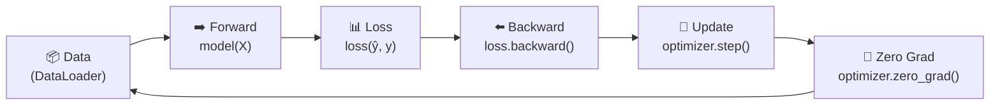

# Tổng ôn D2L: Buổi 8→24

> [!NOTE] ELI5
> Bạn đã đi 17 buổi học, từ "machine learning là gì?" đến "tự thiết kế module PyTorch". File này như **bản đồ toàn cảnh** — nhìn lại mọi thứ từ trên cao, thấy mỗi phần nối với nhau ra sao, và kiểm tra xem bạn thật sự hiểu đến đâu.
>
> Nếu đọc xong mà thấy **"ơ, cái này mình không nhớ"** → quay lại buổi tương ứng đọc lại. Đó mới là mục đích thật sự của tổng ôn.

---

## 🗺️ Bản đồ kiến thức tổng thể

```mermaid
graph TD
    subgraph "TUẦN 2: Nền tảng"
        B8["Buổi 8<br/>Introduction to DL"]
        B9["Buổi 9<br/>Review Preliminaries"]
    end

    subgraph "TUẦN 3: Linear Regression"
        B10["Buổi 10<br/>Linear Regression<br/>(Lý thuyết)"]
        B11["Buổi 11<br/>LR from Scratch"]
        B12["Buổi 12<br/>LR Concise"]
    end

    subgraph "TUẦN 4: Linear Classification"
        B13["Buổi 13<br/>Generalization"]
        B14["Buổi 14<br/>Softmax Regression<br/>(Lý thuyết)"]
        B15["Buổi 15<br/>Fashion-MNIST"]
        B16["Buổi 16<br/>Softmax from Scratch"]
        B17["Buổi 17<br/>Softmax Concise"]
    end

    subgraph "TUẦN 5: MLP"
        B18["Buổi 18<br/>MLP Lý thuyết"]
        B19["Buổi 19<br/>MLP Implementation"]
        B20["Buổi 20<br/>Generalization<br/>in Deep Learning"]
    end

    subgraph "TUẦN 6: DL Thực chiến"
        B21["Buổi 21<br/>Weight Decay<br/>&amp; Dropout"]
        B22["Buổi 22<br/>Numerical Stability<br/>&amp; Init"]
        B23["Buổi 23<br/>Backpropagation"]
    end

    subgraph "TUẦN 7: Builders Guide"
        B24["Buổi 24<br/>nn.Module<br/>Parameters<br/>Custom Layers"]
    end

    B8 --> B9 --> B10
    B10 --> B11 --> B12 --> B13
    B13 --> B14 --> B15 --> B16 --> B17
    B17 --> B18 --> B19 --> B20
    B20 --> B21 --> B22 --> B23 --> B24

    style B8 fill:#4A90D9,color:#fff
    style B9 fill:#4A90D9,color:#fff
    style B10 fill:#7B68EE,color:#fff
    style B11 fill:#7B68EE,color:#fff
    style B12 fill:#7B68EE,color:#fff
    style B13 fill:#E8A838,color:#000
    style B14 fill:#E8A838,color:#000
    style B15 fill:#E8A838,color:#000
    style B16 fill:#E8A838,color:#000
    style B17 fill:#E8A838,color:#000
    style B18 fill:#2ECC71,color:#000
    style B19 fill:#2ECC71,color:#000
    style B20 fill:#2ECC71,color:#000
    style B21 fill:#E74C3C,color:#fff
    style B22 fill:#E74C3C,color:#fff
    style B23 fill:#E74C3C,color:#fff
    style B24 fill:#9B59B6,color:#fff
```



---

## 📋 Tóm tắt theo giai đoạn

### Giai đoạn 1: Nền tảng (Tuần 2 — Buổi 8-9)

> **Câu hỏi trung tâm**: "Machine learning khác gì lập trình truyền thống?"

| Buổi | Nội dung chính | Keyword bạn phải nhớ |
| --- | --- | --- |
| **8** | Introduction to DL — "Programming with Data" | Model family, Loss, Optimizer, Training loop |
| **9** | Review Preliminaries — Kiểm tra nền tảng Tuần 1-2 | Tensor, Broadcasting, Chain Rule, Autograd, Bayes |

**Insight cốt lõi**: ML = thay vì viết luật bằng tay, ta **để dữ liệu dạy mô hình** thông qua tối ưu hóa tham số. Framework xuyên suốt mọi chương sau:

$$\theta^* = \arg\min_\theta \frac{1}{n}\sum_{i=1}^{n} \mathcal{L}(f_\theta(x_i), y_i)$$

---

### Giai đoạn 2: Linear Regression (Tuần 3 — Buổi 10-12)

> **Câu hỏi trung tâm**: "Làm sao dự đoán MỘT CON SỐ từ dữ liệu?"

| Buổi | Nội dung chính | Keyword bạn phải nhớ |
| --- | --- | --- |
| **10** | Lý thuyết Linear Regression | $\hat{y} = \mathbf{w}^\top\mathbf{x}+b$, MSE, Normal Equation, SGD, MLE→MSE |
| **11** | Code from Scratch | `net(X)`, `loss()`, `sgd()`, Training loop, Synthetic data |
| **12** | Code Concise (PyTorch API) | `nn.LazyLinear`, `nn.MSELoss`, `torch.optim.SGD`, DataLoader |

**Insight cốt lõi**: Linear Regression = mô hình **đơn giản nhất** nhưng chứa **toàn bộ xương sống** DL — model, loss, gradient, optimizer. Mọi thứ sau này chỉ là thay đổi kiến trúc $f_\theta$.

**So sánh Scratch vs Concise**:

| | Scratch (Buổi 11) | Concise (Buổi 12) |
| --- | --- | --- |
| Model | `X @ w + b` | `nn.LazyLinear(1)` |
| Loss | Tự viết `((y_hat - y)**2 / 2).mean()` | `nn.MSELoss()` |
| Optimizer | Tự viết `p -= lr * p.grad` | `torch.optim.SGD` |
| Bản chất toán | **Giống hệt** | **Giống hệt** |

---

### Giai đoạn 3: Linear Classification (Tuần 4 — Buổi 13-17)

> **Câu hỏi trung tâm**: "Làm sao dự đoán NHÓM thay vì số?"

| Buổi | Nội dung chính | Keyword bạn phải nhớ |
| --- | --- | --- |
| **13** | Generalization — Train tốt ≠ Test tốt | Overfitting/Underfitting, Bias-Variance, Train/Val/Test split, K-fold CV |
| **14** | Softmax Regression — Lý thuyết classification | One-hot, Logits→Softmax→Probabilities, Cross-entropy loss |
| **15** | Fashion-MNIST — Dataset đầu tiên | 10 classes, 28×28 grayscale, DataLoader, `ToTensor()` |
| **16** | Softmax from Scratch | Tự viết `softmax()`, `cross_entropy()`, Indexing trick |
| **17** | Softmax Concise + Review Tuần 4 | `F.cross_entropy(logits, y)`, LogSumExp trick, Numerical stability |

**Bước chuyển Regression → Classification**:

| | Regression | Classification |
| --- | --- | --- |
| Câu hỏi | "Bao nhiêu?" | "Cái nào?" |
| Output | 1 số liên tục | Xác suất cho mỗi class |
| Loss | MSE | Cross-entropy |
| Activation output | Không | Softmax |

**Softmax Pipeline** (từ input đến loss):

```
X (batch, 784) → matmul(W) + b → logits (batch, 10) → softmax → probabilities → cross_entropy(y) → loss
```

> [!CAUTION] Cảnh báo quan trọng nhất Tuần 4
> `F.cross_entropy()` nhận **logits** (CHƯA qua softmax). Nếu tự apply softmax trước rồi đưa vào → kết quả **SAI** (vì framework tự tính softmax + log bên trong để tránh overflow).

---

### Giai đoạn 4: Multilayer Perceptrons (Tuần 5 — Buổi 18-20)

> **Câu hỏi trung tâm**: "Vì sao 1 tầng không đủ? Thêm tầng thì được gì?"

| Buổi | Nội dung chính | Keyword bạn phải nhớ |
| --- | --- | --- |
| **18** | MLP Lý thuyết | Hidden layer, Activation: ReLU/Sigmoid/Tanh, Tuyến tính chồng = vẫn tuyến tính, Universal Approximation |
| **19** | MLP Implementation | Weight init ($\sigma=0.01$), ReLU 1 dòng, `nn.Sequential`, Accuracy ~87-88% |
| **20** | Generalization in DL | Over-parametrization, Early Stopping, Weight Decay, Dropout (giới thiệu), Implicit regularization |

**Tại sao cần activation function?** — Đây là insight quan trọng nhất Tuần 5:

$$\text{Linear} \circ \text{Linear} = \text{Linear (rút gọn thành 1 tầng)}$$

Chứng minh: $(\mathbf{X}\mathbf{W}^{(1)})\mathbf{W}^{(2)} = \mathbf{X}\underbrace{(\mathbf{W}^{(1)}\mathbf{W}^{(2)})}_{\text{gộp thành 1 ma trận}}$

→ **PHẢI** có $\sigma$ (ReLU, Sigmoid, Tanh) giữa các tầng để phá tính tuyến tính.

**3 Activation Functions cốt lõi**:

| | ReLU ⭐ | Sigmoid | Tanh |
| --- | --- | --- | --- |
| Công thức | $\max(0,x)$ | $\frac{1}{1+e^{-x}}$ | $\frac{1-e^{-2x}}{1+e^{-2x}}$ |
| Range | $[0, +\infty)$ | $(0, 1)$ | $(-1, 1)$ |
| Gradient max | **1** | 0.25 ⚠️ | 1 |
| Vanishing? | ❌ (khi $x>0$) | ✅ Nặng | ✅ Nhẹ |
| Dùng ở | **Hidden layers (mặc định)** | Output nhị phân | LSTM/GRU |

---

### Giai đoạn 5: Deep Learning thực chiến (Tuần 6 — Buổi 21-23)

> **Câu hỏi trung tâm**: "Làm sao train mạng sâu mà không 'chết'?"

| Buổi | Nội dung chính | Keyword bạn phải nhớ |
| --- | --- | --- |
| **21** | Weight Decay & Dropout — Code chi tiết | $L_2$ penalty $\frac{\lambda}{2}\|\mathbf{W}\|^2$, Inverted Dropout $\frac{h}{1-p}$, `model.train()`/`.eval()` |
| **22** | Numerical Stability & Init | Vanishing/Exploding gradient, Symmetry breaking, Xavier $\sigma^2=\frac{2}{n_{in}+n_{out}}$, He $\sigma^2=\frac{2}{n_{in}}$ |
| **23** | Backpropagation | Forward prop, Computational Graph, Chain Rule, Tại sao train tốn RAM |

**3 vũ khí chống Overfitting**:

| Kỹ thuật | Cơ chế | Code PyTorch |
| --- | --- | --- |
| **Early Stopping** | Dừng khi val loss tăng | Tự viết patience logic |
| **Weight Decay** | Phạt $\|W\|^2$ → W nhỏ dần | `weight_decay=1e-3` trong optimizer |
| **Dropout** | Random tắt neurons | `nn.Dropout(0.5)` sau ReLU |

**Weight Initialization — Chọn sai = mạng "chết"**:

| Activation | Init phù hợp | $\sigma^2$ |
| --- | --- | --- |
| Tanh / Sigmoid | **Xavier (Glorot)** | $\frac{2}{n_{in} + n_{out}}$ |
| **ReLU** | **He (Kaiming)** ← PyTorch default | $\frac{2}{n_{in}}$ |

---

### Giai đoạn 6: Builders Guide (Tuần 7 — Buổi 24)

> **Câu hỏi trung tâm**: "Làm sao tổ chức code cho model phức tạp?"

| Buổi | Nội dung chính | Keyword bạn phải nhớ |
| --- | --- | --- |
| **24** | Layers, Modules & Parameter Management | `nn.Module`, `__init__`+`forward`, Custom Module, `nn.ModuleList`, Tied Parameters, Custom Layer, `state_dict()` |

**Module Hierarchy**: Tất cả đều là `nn.Module` — layer, block, model.

| | `nn.Sequential` | Custom `nn.Module` |
| --- | --- | --- |
| Linh hoạt | Chỉ dây chuyền thẳng | Bất kỳ logic nào |
| Skip connection | ❌ | ✅ |
| Control flow (if/while) | ❌ | ✅ |
| Khi nào dùng | MLP đơn giản | ResNet, Transformer, research |

**Quy tắc khi viết Custom Module**:
1. **Phải** gọi `super().__init__()` trong `__init__`
2. **Không bao giờ** gọi `net.forward(X)` — luôn dùng `net(X)`
3. **Không bao giờ** lưu sub-modules trong Python `list` — dùng `nn.ModuleList`
4. Dùng `nn.Parameter` cho trọng số cần train, `register_buffer` cho trọng số cố định cần lưu

---

## 📐 Bảng công thức cốt lõi

### Regression

$$\hat{y} = \mathbf{w}^\top\mathbf{x} + b \qquad \text{MSE} = \frac{1}{n}\sum_{i=1}^n \frac{1}{2}(\hat{y}_i - y_i)^2$$

$$w^* = (\mathbf{X}^\top\mathbf{X})^{-1}\mathbf{X}^\top\mathbf{y} \quad \text{(Normal Equation)}$$

### Classification

$$\hat{y}_j = \text{softmax}(\mathbf{o})_j = \frac{\exp(o_j)}{\sum_k \exp(o_k)} \qquad \text{CE Loss} = -\log \hat{y}_c$$

### MLP

$$\mathbf{H} = \sigma(\mathbf{X}\mathbf{W}^{(1)} + \mathbf{b}^{(1)}), \quad \mathbf{O} = \mathbf{H}\mathbf{W}^{(2)} + \mathbf{b}^{(2)}$$

### Optimization (SGD)

$$\theta \leftarrow \theta - \eta \nabla_\theta \mathcal{L}$$

### Regularization

$$\mathcal{L}_{\text{WD}} = \mathcal{L}_{\text{gốc}} + \frac{\lambda}{2}\|\mathbf{W}\|^2 \qquad \text{Dropout: } h' = \frac{h \cdot \text{mask}}{1-p}$$

### Initialization

$$\sigma^2_{\text{Xavier}} = \frac{2}{n_{in} + n_{out}} \qquad \sigma^2_{\text{He}} = \frac{2}{n_{in}}$$

---

## 🧵 Dòng chảy xuyên suốt — Training Pipeline chuẩn

Mọi model (từ Linear Regression đến custom MLP) đều tuân theo **cùng 1 pipeline**:



Pattern code không đổi:

```python
for epoch in range(num_epochs):
    model.train()
    for X, y in train_loader:
        loss = F.cross_entropy(model(X), y)   # Forward + Loss
        optimizer.zero_grad()                  # Zero gradients
        loss.backward()                        # Backward
        optimizer.step()                       # Update params
    
    model.eval()
    # ... evaluate on validation set
```

> [!TIP] Khi thêm tầng, thay activation, thêm regularization
> Bạn chỉ thay **model definition** và **optimizer config**. Training loop **giữ nguyên**. Đó là sức mạnh của thiết kế modular.

---

## 🧮 Bảng đếm tham số — So sánh model qua các buổi

| Model | Kiến trúc | Số tham số | Accuracy (Fashion-MNIST) |
| --- | --- | --- | --- |
| Softmax Regression | 784 → 10 | 7,850 | ~82-85% |
| MLP 1 hidden | 784 → 256 → 10 | 203,530 | ~87-88% |
| MLP 2 hidden + Dropout | 784 → 256 → 256 → 10 + Dropout | ~270K | ~88-89% |

Công thức đếm nhanh: tầng $(a, b)$ có $a \times b + b$ tham số (weights + biases).

---

## 🏋️ ĐỀ ÔN TẬP — 40 câu hỏi toàn diện

### Nhóm A: Nền tảng & Linear Regression (Buổi 8-12) — 10 câu

1. Nêu 3 khác biệt giữa **rule-based programming** và **machine learning**.
2. Viết công thức Linear Regression. Giải thích **bias $b$** cần thiết trong tình huống nào?
3. MSE phạt lỗi lớn **mạnh hơn** MAE ra sao? Cho ví dụ bằng số.
4. Viết công thức **Normal Equation**. Khi nào nó **không dùng được**?
5. **SGD update rule**: viết công thức và giải thích từng ký hiệu.
6. Tại sao cần dùng **synthetic data** trước khi dùng data thật (Buổi 11)?
7. `loss.backward()` làm gì? Tại sao **phải** `zero_grad()` sau mỗi step?
8. So sánh `nn.LazyLinear(1)` với cách tự viết `X @ w + b` — khác ở đâu?
9. Tại sao MSE loss có nền tảng từ **MLE** khi giả định Gaussian noise?
10. Viết **4 bước** của training loop trong 1 câu cho mỗi bước.

### Nhóm B: Classification & Generalization (Buổi 13-17) — 10 câu

11. Phân biệt **Training Error**, **Validation Error**, **Test Error**. Tại sao cần 3 tập?
12. Training accuracy = 98%, Test accuracy = 72%. Đây là gì? Generalization gap = ?
13. K-fold CV dùng khi nào? Tại sao **không luôn dùng** K-fold?
14. Tại sao **one-hot encoding** thay vì đánh số 1, 2, 3 cho categories?
15. Viết công thức **softmax**. Tính softmax của $\mathbf{o} = (3, 1, -1)$.
16. Cross-entropy loss = $-\log \hat{y}_c$. Nếu $\hat{y}_c = 0.01$ thì loss = ? Ý nghĩa?
17. Gradient của softmax + cross-entropy = $\hat{y}_j - y_j$. Tại sao đẹp?
18. `F.cross_entropy()` nhận **logits** hay **probabilities**? Tại sao?
19. **Indexing trick**: `y_hat[range(len(y_hat)), y]` — giải thích.
20. `model.train()` vs `model.eval()` — khác gì? Khi nào **bắt buộc** phải chuyển?

### Nhóm C: MLP & Deep Learning (Buổi 18-20) — 10 câu

21. Tại sao **chồng 10 tầng tuyến tính** (không activation) = **1 tầng**? Chứng minh ngắn.
22. ReLU, Sigmoid, Tanh — nêu **1 ưu điểm** và **1 nhược điểm** cho mỗi cái.
23. Tính: ReLU(−7) = ? Sigmoid(0) = ? Tanh(0) = ?
24. Gradient max của Sigmoid = 0.25. Qua 8 tầng, gradient còn = ?
25. **Dead neuron** là gì? **Leaky ReLU** giải quyết ra sao?
26. MLP 784→256→10: tổng số tham số = ? (gồm bias).
27. Universal Approximation Theorem: MLP 1 tầng ẩn "đủ" — tại sao **trong thực tế** vẫn dùng nhiều tầng?
28. Early Stopping: giải thích **patience** và cho ví dụ code.
29. Weight Decay: gradient của penalty $\frac{\lambda}{2}\|W\|^2$ theo $w_i$ = ?
30. Dropout: tại sao phải **chia cho $(1-p)$** khi giữ neuron?

### Nhóm D: Tuần 6-7 nâng cao (Buổi 21-24) — 10 câu

31. Weight Decay tác động lên **trọng số**, Dropout tác động lên **activations**. Giải thích sự khác biệt.
32. Tại sao init $W = 0$ cho **tất cả** neurons là **SAI**? (Symmetry problem)
33. Xavier init cho tầng 512→128: $\sigma = ?$
34. He init cho tầng 512→128 (ReLU): $\sigma = ?$
35. PyTorch `nn.Linear` mặc định dùng init gì? Có cần tự init không?
36. Backpropagation dùng **Chain Rule** thế nào? — giải thích bằng 1-2 câu.
37. Tại sao **training tốn RAM hơn** prediction? (Gợi ý: activations)
38. `nn.Sequential` có hạn chế gì? Cho 2 tình huống **phải** dùng Custom `nn.Module`.
39. **Tied Parameters**: 2 layers dùng chung W — gradient tính ra sao?
40. Viết `nn.Sequential` cho MLP: 784 → 512 → ReLU → Dropout(0.5) → 256 → ReLU → Dropout(0.3) → 10.

---

## 📝 Đáp án

> [!NOTE]- 📝 Bấm để mở đáp án

> **Nhóm A**
>
> 1. (a) ML **học từ dữ liệu**, rule-based **viết luật tường minh**. (b) ML tự **tìm tham số**, rule-based tham số **cố định**. (c) ML xử lý tốt bài toán **mơ hồ** (nhận dạng ảnh, giọng nói), rule-based tốt cho bài toán **logic rõ ràng**.
>
> 2. $\hat{y} = \mathbf{w}^\top\mathbf{x} + b$. Bias cần khi quan hệ **không đi qua gốc** — ví dụ: căn hộ 0 m² vẫn có giá đất nền.
>
> 3. Sai 2: MSE phạt $4$, MAE phạt $2$. Sai 10: MSE phạt $100$, MAE phạt $10$. MSE phạt gấp $5×$ khi lỗi tăng $5×$.
>
> 4. $\mathbf{w}^* = (\mathbf{X}^\top\mathbf{X})^{-1}\mathbf{X}^\top\mathbf{y}$. Không dùng được khi $\mathbf{X}^\top\mathbf{X}$ **suy biến** (multicollinearity) hoặc data **quá lớn** (nghịch đảo ma trận tốn $O(d^3)$).
>
> 5. $\theta \leftarrow \theta - \eta \nabla_\theta \mathcal{L}$. $\theta$ = tham số, $\eta$ = learning rate, $\nabla_\theta \mathcal{L}$ = gradient loss theo θ.
>
> 6. Vì ta **biết trước đáp án** (ground truth) → dễ kiểm tra code đúng hay sai bằng cách so sánh $w_{\text{learned}}$ vs $w_{\text{true}}$.
>
> 7. `loss.backward()` tính gradient cho tất cả tham số có `requires_grad=True`. `zero_grad()` reset gradient vì PyTorch **cộng dồn** gradient — không reset → gradient tích lũy → sai.
>
> 8. Bản chất toán **giống hệt** ($\hat{y}=Xw+b$). `LazyLinear` tự suy in_features, tự init W/b, tự đăng ký vào `model.parameters()`.
>
> 9. Nếu $y = \mathbf{w}^\top\mathbf{x} + b + \epsilon$ với $\epsilon \sim \mathcal{N}(0,\sigma^2)$, maximize likelihood = minimize $\sum(y_i - \hat{y}_i)^2$ = MSE (khi $\sigma$ cố định).
>
> 10. (1) Forward: tính dự đoán. (2) Loss: đo sai bao nhiêu. (3) Backward: tính gradient. (4) Update: sửa tham số theo gradient.

> **Nhóm B**
>
> 11. Training Error = lỗi trên data đã train. Validation Error = lỗi trên data dùng chọn model (nhiều lần). Test Error = lỗi trên data chỉ dùng **1 lần cuối** để báo cáo. Cần 3 tập vì nếu dùng test set chọn model → overfit test set mà không biết.
>
> 12. **Overfitting**. Gap = $98\% - 72\% = 26\%$. Model "học thuộc" train data.
>
> 13. Dùng khi data **ít** (< vài nghìn mẫu). Không luôn dùng vì phải **train K lần** — chậm K lần.
>
> 14. Đánh số → máy hiểu "Gà (2) > Mèo (1)" → **sai** (không có thứ tự). One-hot → mỗi class **độc lập, bình đẳng**.
>
> 15. $\hat{y}_j = \frac{e^{o_j}}{\sum_k e^{o_k}}$. Với $(3,1,-1)$: $e^3=20.09, e^1=2.72, e^{-1}=0.37$. Tổng = 23.17. Softmax ≈ $(0.867, 0.117, 0.016)$.
>
> 16. $-\log(0.01) = 4.605$. Loss rất cao → model rất bất ngờ khi nhãn đúng chỉ có 1% → bị phạt nặng.
>
> 17. Gradient = dự đoán − thực tế. Đơn giản → tính nhanh. Tỉ lệ thuận với mức sai → sai nhiều sửa nhiều, sai ít sửa ít.
>
> 18. **Logits** (CHƯA softmax). Vì `F.cross_entropy` dùng **LogSumExp trick** gộp softmax+log → tránh overflow $e^{1000}$.
>
> 19. `y_hat[range(n), y]` lấy xác suất của class đúng cho mỗi mẫu. Mẫu 0 class 2 → `y_hat[0, 2]`. Tránh nhân one-hot vector (chậm).
>
> 20. `model.train()` bật Dropout + BN training mode. `model.eval()` tắt Dropout + dùng running stats BN. **Bắt buộc** chuyển khi dùng Dropout/BatchNorm — nếu quên `eval()` khi test → accuracy dao động.

> **Nhóm C**
>
> 21. $(\mathbf{X}\mathbf{W}^{(1)})\mathbf{W}^{(2)} = \mathbf{X}(\mathbf{W}^{(1)}\mathbf{W}^{(2)}) = \mathbf{X}\mathbf{W}'$ = 1 phép biến đổi tuyến tính. Thêm tầng = vô nghĩa nếu không có activation.
>
> 22. **ReLU**: ✅ gradient = 1 (không vanish), ❌ dead neurons. **Sigmoid**: ✅ output (0,1) giống xác suất, ❌ vanishing gradient (max 0.25). **Tanh**: ✅ zero-centered (đối xứng), ❌ vẫn vanish (nhẹ hơn sigmoid).
>
> 23. ReLU(−7) = **0**. Sigmoid(0) = **0.5**. Tanh(0) = **0**.
>
> 24. $0.25^8 ≈ 1.5 \times 10^{-5}$ → gần 0 → tầng đầu không học!
>
> 25. Neuron luôn nhận input âm → ReLU output = 0 **mãi mãi** → gradient = 0 → không update. Leaky ReLU: $\max(0.01x, x)$ → gradient nhỏ nhưng $\neq 0$ → neuron có cơ hội "sống lại".
>
> 26. $(784×256 + 256) + (256×10 + 10) = 200{,}960 + 2{,}570 = 203{,}530$.
>
> 27. Lý thuyết: 1 tầng đủ **rộng** có thể xấp xỉ mọi hàm. Thực tế: (a) có thể cần **hàng tỷ** units, (b) SGD không đảm bảo tìm được W đúng, (c) mạng **sâu** hiệu quả hơn nhờ tính compositional (tầng 1 học edge, tầng 2 học shape, tầng 3 học object).
>
> 28. Patience = N: nếu val loss **không giảm** trong N epoch liên tiếp → dừng. Ví dụ: patience=5, val loss tệ 5 epoch liên tục → `break`.
>
> 29. $\frac{\partial}{\partial w_i}\frac{\lambda}{2}\sum w_j^2 = \lambda w_i$. W lớn → gradient penalty lớn → bị "kéo về 0" mạnh hơn.
>
> 30. Để **kỳ vọng không đổi**: $E[h'] = (1-p) \times \frac{h}{1-p} + p \times 0 = h$. Không scale → output train nhỏ hơn test → mất cân bằng.

> **Nhóm D**
>
> 31. **Weight Decay** ép **W nhỏ** → model mượt, ít nhạy nhiễu → tác động **toàn cục** (mọi tầng). **Dropout** tắt **neurons ngẫu nhiên** → phá co-adaptation → tác động **cục bộ** (từng forward pass khác nhau).
>
> 32. Tất cả neurons cùng tầng có $W$ giống nhau → output **giống nhau** → gradient **giống nhau** → update **giống nhau** → **MÃI MÃI** giống nhau. 256 neurons = 1 neuron. Gọi là **symmetry problem**.
>
> 33. $\sigma = \sqrt{\frac{2}{512+128}} = \sqrt{\frac{2}{640}} ≈ 0.056$.
>
> 34. $\sigma = \sqrt{\frac{2}{512}} ≈ 0.0625$.
>
> 35. **Kaiming Uniform** (He init). Đã tốt cho ReLU → không bắt buộc tự init. Cần tự init khi dùng Tanh/Sigmoid (→ Xavier) hoặc kiến trúc đặc biệt.
>
> 36. Gradient output theo W ở tầng $l$ = **tích** Jacobians từ tầng $L$ về tầng $l$ × gradient cục bộ. Chain Rule nối gradient qua từng tầng: $\frac{\partial L}{\partial W^{(l)}} = \frac{\partial L}{\partial o} \cdot \frac{\partial o}{\partial h^{(L-1)}} \cdots \frac{\partial h^{(l)}}{\partial W^{(l)}}$.
>
> 37. Backward cần **tất cả activations** (output mỗi tầng) lưu từ forward pass để tính gradient. Prediction chỉ cần forward → không lưu → tiết kiệm RAM.
>
> 38. `nn.Sequential` chỉ **dây chuyền thẳng**. Phải dùng Custom: (a) **Skip connection** (ResNet: output + input), (b) **Control flow** (if/while trong forward — ví dụ: early exit, adaptive computation).
>
> 39. `shared = nn.LazyLinear(8)` dùng ở 2 vị trí = **cùng Python object**. Gradient = **tổng** gradient từ cả 2 vị trí. Optimizer update W **1 lần** dựa trên gradient tổng.
>
> 40.
> ```python
> model = nn.Sequential(
>     nn.Flatten(),
>     nn.LazyLinear(512), nn.ReLU(), nn.Dropout(0.5),
>     nn.LazyLinear(256), nn.ReLU(), nn.Dropout(0.3),
>     nn.LazyLinear(10)
> )
> ```

---

## ✅ Checklist tự đánh giá — "Tôi đã hiểu thật chưa?"

Đánh dấu vào mỗi mục bạn **tự tin giải thích được cho người khác**:

### Nền tảng
- [ ] Tôi phân biệt được **rule-based** vs **ML** — cho ví dụ khi nào dùng cái nào
- [ ] Tôi viết được **training loop** từ đầu (không nhìn code mẫu)
- [ ] Tôi hiểu tại sao **`zero_grad()`** là bắt buộc

### Regression
- [ ] Tôi giải thích được MSE = MLE dưới **Gaussian noise**
- [ ] Tôi biết khi nào **Normal Equation** gặp vấn đề
- [ ] Tôi phân biệt được **scratch** vs **concise** — và biết bản chất toán giống nhau

### Classification
- [ ] Tôi tính tay được **softmax** cho 3 logits
- [ ] Tôi giải thích được tại sao **cross-entropy** phạt nặng khi $\hat{y}_c \to 0$
- [ ] Tôi biết **`F.cross_entropy` nhận logits** — và giải thích được tại sao (LogSumExp trick)
- [ ] Tôi phân biệt **validation set** vs **test set** — và biết quy tắc "không bao giờ dùng test set để chọn model"

### MLP
- [ ] Tôi chứng minh được **tuyến tính chồng = tuyến tính** (1 dòng toán)
- [ ] Tôi so sánh được **ReLU/Sigmoid/Tanh** — ưu/nhược và khi nào dùng
- [ ] Tôi tính được **tổng số tham số** cho MLP bất kỳ
- [ ] Tôi hiểu **Universal Approximation ≠ Universal Learnability**

### Regularization & Stability
- [ ] Tôi giải thích được **Early Stopping, Weight Decay, Dropout** — cơ chế và code
- [ ] Tôi biết tại sao **Sigmoid gây vanishing gradient** (max 0.25) và ReLU giải quyết
- [ ] Tôi tính được **Xavier** và **He** init cho bất kỳ tầng nào
- [ ] Tôi hiểu **Symmetry Breaking** — tại sao init = 0 là sai

### Builders Guide
- [ ] Tôi viết được **Custom `nn.Module`** với `__init__` + `forward`
- [ ] Tôi biết tại sao gọi `net(X)` thay vì `net.forward(X)`
- [ ] Tôi truy cập được parameters bằng `named_parameters()` và `state_dict()`
- [ ] Tôi hiểu **Tied Parameters** — chia sẻ trọng số, gradient cộng dồn

### Kết quả
- **Dưới 15/22**: Cần ôn lại nhiều buổi — tập trung vào phần chưa đánh dấu.
- **15-18/22**: Nền tảng ổn, cần củng cố chi tiết.
- **19-22/22**: Sẵn sàng cho CNN (ResNet, VGG) ở giai đoạn tiếp theo!

---

## 🔗 Liên kết nhanh

| Giai đoạn | Buổi học |
| --- | --- |
| Nền tảng | [[Buổi 8 - Tuần 2]], [[Buổi 9 - Tuần 2]] |
| Linear Regression | [[Buổi 10 - Tuần 3]], [[Buổi 11 - Tuần 3]], [[Buổi 12 - Tuần 3]] |
| Generalization | [[Buổi 13 - Tuần 4]] |
| Classification | [[Buổi 14 - Tuần 4]], [[Buổi 15 - Tuần 4]], [[Buổi 16 - Tuần 4]], [[Buổi 17 - Tuần 4]] |
| MLP | [[Buổi 18 - Tuần 5]], [[Buổi 19 - Tuần 5]], [[Buổi 20 - Tuần 5]] |
| Regularization & Init | [[Buổi 21 - Tuần 6]], [[Buổi 22 - Tuần 6]] |
| Backprop & Modules | [[Buổi 23 - Tuần 6]], [[Buổi 24 - Tuần 7]] |

---

## 📝 Kết luận

Sau 17 buổi, bạn đã xây dựng **toàn bộ foundation** của Deep Learning:

1. **Tư duy**: ML = tối ưu tham số từ dữ liệu (không viết rule bằng tay)
2. **Regression**: $\hat{y} = Xw + b$ + MSE → mô hình đầu tiên
3. **Classification**: Softmax + Cross-Entropy → phân loại ảnh
4. **MLP**: Hidden layers + Activation → phá giới hạn tuyến tính → deep learning
5. **Regularization**: Early Stopping, Weight Decay, Dropout → chống overfitting
6. **Stability**: Xavier/He init, Gradient clipping → train mạng sâu ổn định
7. **Backpropagation**: Chain Rule → tính gradient tự động
8. **Module Design**: `nn.Module`, Custom layers, Parameter management → tổ chức code chuyên nghiệp

**Giai đoạn tiếp theo** (Tuần 8+): Save/Load models, GPU training, rồi **CNN** — áp dụng tất cả kiến thức trên vào **xử lý ảnh thật sự** (Conv, Pool, ResNet, VGG).

...Bạn nên nghỉ ngơi. Sau đó quay lại làm 40 câu hỏi. Nếu trả lời được 30+/40 → bạn sẵn sàng.
