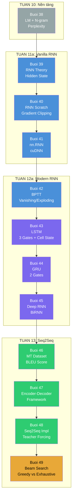

# Tổng ôn RNN — Từ N-gram đến Beam Search

> [!NOTE] ELI5
> Đây là hành trình 12 buổi (38→49) để hiểu cách máy xử lý chuỗi. Bắt đầu từ N-gram — cách đếm từ đơn giản nhưng gặp vấn đề khi dữ liệu ít. Rồi RNN ra đời — dùng hidden state thay vì nhớ toàn bộ lịch sử. Nhưng RNN thường bị gradient biến mất → LSTM/GRU thêm cổng để kiểm soát nhớ/quên. RNN nhiều tầng và hai chiều giúp học sâu hơn. Cuối cùng, Encoder-Decoder framework cho phép học cách dịch máy, và Beam Search giúp chọn câu dịch tốt nhất.

File này **dạy lại** từng phần, không chỉ hỏi recall. Nếu thấy "ơ, cái này mình quên" → đọc kỹ đoạn đó, rồi quay lại buổi gốc nếu cần.

---

## 🗺️ Bản đồ kiến thức tổng thể



---

# PHẦN I — VANILLA RNN (Buổi 38–42)

---

## 1. Từ N-gram đến RNN: Tại sao cần Hidden State?

### 1.1 ELI5 — N-gram vs RNN

> N-gram giống như bạn đoán từ tiếp theo bằng cách nhìn vào **2-3 từ gần nhất** trong sổ ghi chép. Nếu "the quick brown" chưa từng thấy → bạn không biết đoán gì. RNN giống như bạn **ghi nhớ ý nghĩa** của toàn bộ câu vào đầu — dù câu dài bao nhiêu, bạn vẫn có thể đoán được từ tiếp theo dựa trên "ý" của câu.

### 1.2 Vấn đề cốt lõi của N-gram

**N-gram bùng nổ tham số:** Với vocabulary 10,000 từ:

| Model | Context size | Số tham số ước tính |
|---|---|---|
| Unigram | 1 word | ~10,000 |
| Bigram | 2 words | ~100,000,000 |
| Trigram | 3 words | ~1,000,000,000,000 |

**Data sparsity:** Xác suất gặp "the quick brown fox jumps over" trong corpus huấn luyện → gần như 0. Model không có cách nào tổng quát hóa.

**Giải pháp:** Dùng **latent variable model** — một hidden state $h_t$ nén thông tin của lịch sử:

$$P(x_t \mid x_{t-1}, x_{t-2}, \ldots) \approx P(x_t \mid h_t)$$

$h_t$ là vector số học — có thể tổng quát hóa, không bị sparsity.

### 1.3 Công thức cốt lõi RNN

$$\mathbf{H}_t = \tanh(\mathbf{X}_t \mathbf{W}_{xh} + \mathbf{H}_{t-1} \mathbf{W}_{hh} + \mathbf{b}_h)$$

$$\mathbf{O}_t = \mathbf{H}_t \mathbf{W}_{hq} + \mathbf{b}_q$$

**Từ điển ký hiệu:**

| Ký hiệu | Shape | Ý nghĩa |
|---|---|---|
| $\mathbf{X}_t$ | $(batch, d)$ | Input vector tại bước $t$ |
| $\mathbf{H}_t$ | $(batch, h)$ | Hidden state — "trí nhớ" tại bước $t$ |
| $\mathbf{W}_{xh}$ | $(d, h)$ | Weight: input → hidden |
| $\mathbf{W}_{hh}$ | $(h, h)$ | Weight: hidden → hidden (recurrent) |
| $\mathbf{W}_{hq}$ | $(h, q)$ | Weight: hidden → output |
| $\mathbf{O}_t$ | $(batch, q)$ | Output logits |

### 1.4 Weight Sharing — Tại sao RNN không tăng tham số?

> [!NOTE] Anti-cramming check
> Tại sao RNN dùng **cùng một bộ weights** cho mọi timesteps, thay vì mỗi timestep một bộ khác nhau?

Nếu mỗi timestep một bộ weights: với chuỗi 1000 tokens, ta cần 1000 bộ $\mathbf{W}_{xh}, \mathbf{W}_{hh}$ — **1000× parameters**.

RNN dùng **weight sharing**: cùng $\mathbf{W}_{xh}, \mathbf{W}_{hh}$ cho mọi $t$. Dù chuỗi dài 1 token hay 10,000 tokens → **cùng một bộ tham số**. Đây là lý do RNN có thể xử lý variable-length sequences mà không tăng model size.

**Hệ quả:** Gradient từ output phải "chảy ngược" qua T copies của cùng weight matrix $\mathbf{W}_{hh}$ — đây là nguồn gốc của vanishing/exploding gradient.

---

## 2. RNN từ đầu: Implementation và Gradient Clipping

### 2.1 ELI5 — RNN Scratch

> Implement RNN từ đầu giống như bạn tự lắp ráp một chiếc xe đạp từ các bộ phận riêng: khung (weights), bánh (hidden state), và quy trình lắp (forward loop). Dùng `nn.RNN` giống như mua xe nguyên chiếc — nhanh và tiện, nhưng bạn không biết xe chạy thế nào khi gặp sự cố.

### 2.2 One-Hot Encoding — Tại sao cần và tại sao không dùng?

Input của RNN là token index → cần vector hóa:

$$\text{one-hot}(x) \in \{0,1\}^{|V|}$$

**Shape:** $(batch, T) \xrightarrow{\text{one-hot}} (T, batch, |V|)$ — với $|V| = 28$ (character-level).

**Tại sao không dùng one-hot mà dùng Embedding?**

One-hot × weight matrix = chọn 1 hàng của weight matrix. Nói cách khác: **weight matrix chính là embedding matrix**. Embedding layer là cách hiệu quả hơn để học distributed representation — không chỉ chọn hàng mà còn tối ưu các giá trị trong quá trình training.

### 2.3 Gradient Clipping — Kỹ thuật bắt buộc

> [!NOTE] ELI5
> Gradient clipping giống như khi bạn đang cầm cốc nước quá đầy. Thay vì làm đổ nước ra sàn, bạn uống bớt một ngụm. Gradient quá lớn (exploding gradient) sẽ làm weights thay đổi quá mạnh → training unstable. Clipping giữ gradient trong ngưỡng an toàn.

**Công thức:**

$$\mathbf{g} \leftarrow \min\left(1, \frac{\theta}{\|\mathbf{g}\|}\right) \cdot \mathbf{g}$$

**Từ điển ký hiệu:**

| Ký hiệu | Ý nghĩa |
|---|---|
| $\mathbf{g}$ | Gradient vector |
| $\theta$ | Ngưỡng clipping (thường = 1) |
| $\|\mathbf{g}\|$ | L2 norm của gradient |

**Tại sao dùng global norm thay vì per-parameter?**

Per-parameter clipping (clamp mỗi thành phần trong $[-\theta, \theta]$) có thể thay đổi hướng của gradient vector. Global norm clipping giữ nguyên **hướng** của gradient, chỉ giảm **độ lớn** nếu cần.

### 2.4 Text Decoding: Warm-up vs Generation

```text
TRAINING: "machin" → "achine"  (teacher forcing)
WARM-UP:  encoder nạp prefix vào hidden state
GENERATION: autoregressive — mỗi step predict rồi feed lại làm input next step
```text

---

## 3. BPTT: Tại sao Gradient Biến Mất và Phát Nổ?

### 3.1 ELI5 — BPTT

> BPTT giống như bạn đứng ở bước 10 và muốn biết lỗi ở bước 1 ảnh hưởng thế nào. Bạn phải truyền "thông điệp" ngược qua 10 người bạn. Mỗi người có thể làm thông điệp yếu đi (vanishing) hoặc mạnh lên (exploding). Với vanilla RNN, thông điệp **gần như biến mất** sau 5-10 bước.

### 3.2 Phân tích Gradient Chain

**Công thức gradient chain (simplified):**

$$\frac{\partial \mathcal{L}}{\partial \mathbf{W}_{hh}} = \sum_{t=1}^{T} \frac{\partial \mathcal{L}}{\partial \mathbf{O}_T} \cdot \left(\prod_{\tau=1}^{t-1} \frac{\partial \mathbf{H}_{\tau+1}}{\partial \mathbf{H}_\tau}\right) \cdot \frac{\partial \mathbf{H}_1}{\partial \mathbf{W}_{hh}}$$

**Tích Jacobian:**

$$\prod_{\tau=1}^{t-1} \frac{\partial \mathbf{H}_{\tau+1}}{\partial \mathbf{H}_\tau} = \prod_{\tau=1}^{t-1} \mathbf{W}_{hh}^\top \cdot \text{diag}(\tanh')$$

**Eigenvalue analysis:**

- Nếu $|\lambda_i| > 1$ (dominant eigenvalue): gradient → $\infty$ → **exploding**
- Nếu $|\lambda_i| < 1$: gradient → $0$ → **vanishing**

### 3.3 Tại sao Gradient Clipping không giải quyết Vanishing?

Gradient clipping chỉ xử lý **exploding** — khi gradient quá lớn, cắt về ngưỡng. Nhưng **vanishing** là khi gradient quá nhỏ → weight updates gần như bằng 0 → **model không học được từ long-range dependencies**.

**LSTM/GRU là giải pháp** cho vanishing — không bằng cách clip gradient, mà bằng cách tạo "đường cao tốc" (cell state path) cho gradient flow mà không qua tích Jacobian.

### 3.4 BPTT Variants

| Phương pháp | Độ phức tạp | Độ chính xác | Sử dụng |
|---|---|---|---|
| **Full BPTT** | $\mathcal{O}(T)$ mỗi step | Chính xác | Không thực tế |
| **Truncated BPTT** | $\mathcal{O}(k)$ mỗi step | Approximation (biased) | **Mặc định** |
| **Randomized** | $\mathcal{O}(k)$ | Approximation (unbiased variance cao) | Nghiên cứu |

**Truncated BPTT = `detach_()` trong code:** Cắt gradient chain tại $k$ steps trước. Gradient chỉ chảy ngược $k$ bước, không phải toàn bộ $T$ bước.

---

# PHẦN II — MODERN RNN (Buổi 43–45)

---

## 4. LSTM: Ô Nhớ có Cổng

### 4.1 ELI5 — LSTM

> LSTM như một người ghi chép thông minh: có **sổ nháp** ($C_t$) để lưu ký ức dài hạn, có **3 bút kiểm soát** — bút xóa (forget gate), bút ghi (input gate), bút đọc (output gate). Bút xóa quyết định quên bao nhiêu ký ức cũ; bút ghi quyết định ghi bao nhiêu ký ức mới; bút đọc quyết định xuất bao nhiêu nội dung.

### 4.2 Định nghĩa kỹ thuật

- **Đây là gì?** LSTM (Long Short-Term Memory) là RNN variant với 3 sigmoid gates và 1 cell state, cho phép gradient flow ổn định qua nhiều timesteps.
- **Input/Output gì?** Input: $X_t$, $H_{t-1}$, $C_{t-1}$. Output: $H_t$, $C_t$.
- **Giải quyết vấn đề gì?** Vanishing gradient trong vanilla RNN — cho phép học **long-range dependencies** (phụ thuộc xa).
- **Thay thế gì?** Vanilla RNN với $H_t = \tanh(X_t W_{xh} + H_{t-1} W_{hh})$.

### 4.3 Công thức đầy đủ

| Cổng | Công thức | Từ điển ký hiệu |
|---|---|---|
| **Forget Gate** | $F_t = \sigma(X_t W_{xf} + H_{t-1} W_{hf} + b_f)$ | Quyết định **quên** bao nhiêu từ $C_{t-1}$ |
| **Input Gate** | $I_t = \sigma(X_t W_{xi} + H_{t-1} W_{hi} + b_i)$ | Quyết định **ghi** bao nhiêu vào $C_t$ |
| **Candidate** | $\tilde{C}_t = \tanh(X_t W_{xc} + H_{t-1} W_{hc} + b_c)$ | "Nội dung mới" có thể ghi |
| **Cell Update** | $C_t = F_t \odot C_{t-1} + I_t \odot \tilde{C}_t$ | **Cốt lõi:** cộng tuyến tính — gradient không bị vanishing |
| **Output Gate** | $O_t = \sigma(X_t W_{xo} + H_{t-1} W_{ho} + b_o)$ | Quyết định **xuất** bao nhiêu |
| **Hidden State** | $H_t = O_t \odot \tanh(C_t)$ | Output của LSTM cell |

### 4.4 Tại sao LSTM không bị Vanishing Gradient?

**Điểm then chốt: Cell State Update = PHÉP CỘNG tuyến tính**

$$C_t = F_t \odot C_{t-1} + I_t \odot \tilde{C}_t$$

Gradient qua $C_t$:

$$\frac{\partial C_t}{\partial C_{t-1}} = F_t$$

$F_t \in [0,1]$ (vì sigmoid). Nếu $F_t \approx 1$: $\frac{\partial C_t}{\partial C_{t-1}} \approx 1$ → gradient **truyền nguyên vẹn** qua cell state path — không có vanishing!

**So sánh với vanilla RNN:**

| Khía cạnh | Vanilla RNN | LSTM |
|---|---|---|
| Hidden update | $H_t = \tanh(\ldots)$ | $H_t = O_t \odot \tanh(C_t)$ |
| Gradient path | qua $\tanh'$ và $W_{hh}$ | qua **đường cao tốc** $C_t$ |
| Vanishing | $\prod W_{hh}^\top$ → gradient → 0 | $F_t \approx 1$ → gradient ổn định |

### 4.5 Số tham số

Mỗi gate có 4 ma trận: $W_{xf}, W_{hf}$ (Forget), $W_{xi}, W_{hi}$ (Input), $W_{xc}, W_{hc}$ (Candidate), $W_{xo}, W_{ho}$ (Output).

$$4 \times (d \cdot h + h \cdot h + h) = 4(dh + h^2 + h)$$

**LSTM gấp 4 lần vanilla RNN về số tham số.**

---

## 5. GRU: Đơn giản hóa LSTM

### 5.1 ELI5 — GRU

> GRU giống LSTM nhưng gộp 3 bút thành 2: Reset Gate (quyết định quên hay nhớ) và Update Gate (quyết định giữ hay thay thế). Bỏ sổ nháp riêng — mọi thứ nằm trong cùng hidden state. Ít phím hơn, ít tham số hơn, nhưng vẫn giải quyết vanishing gradient.

### 5.2 Công thức đầy đủ

| Cổng/State | Công thức | Ý nghĩa |
|---|---|---|
| **Reset Gate** | $R_t = \sigma(X_t W_{xr} + H_{t-1} W_{hr} + b_r)$ | Quyết định quên bao nhiêu từ $H_{t-1}$ |
| **Update Gate** | $Z_t = \sigma(X_t W_{xz} + H_{t-1} W_{hz} + b_z)$ | Quyết định giữ bao nhiêu $H_{t-1}$, thêm bao nhiêu $\tilde{H}_t$ |
| **Candidate** | $\tilde{H}_t = \tanh(X_t W_{xh} + (R_t \odot H_{t-1}) W_{hh} + b_h)$ | Khi $R_t \to 0$: chỉ phụ thuộc $X_t$ — reset memory |
| **Hidden Update** | $H_t = Z_t \odot H_{t-1} + (1 - Z_t) \odot \tilde{H}_t$ | **Tổ hợp lồi** (convex combination) |

### 5.3 Tổ hợp lồi — Điểm quan trọng

$H_t = Z_t \odot H_{t-1} + (1 - Z_t) \odot \tilde{H}_t$ là **convex combination**:

- Khi $Z_t = 1$: $H_t = H_{t-1}$ (giữ nguyên trạng thái)
- Khi $Z_t = 0$: $H_t = \tilde{H}_t$ (thay hoàn toàn bằng candidate)
- Khi $Z_t = 0.7$: $H_t = 0.7 H_{t-1} + 0.3 \tilde{H}_t$

**$H_t$ luôn nằm trong khoảng $[H_{t-1}, \tilde{H}_t]$** — tương tự LSTM nhưng gọn hơn.

### 5.4 LSTM vs GRU — So sánh toàn diện

| Khía cạnh | LSTM | GRU |
|---|---|---|
| **Số cổng** | 3 (forget, input, output) | 2 (reset, update) |
| **Cell state riêng** | Có ($C_t$ song song với $H_t$) | Không |
| **Trạng thái song song** | 2 ($C_t$, $H_t$) | 1 ($H_t$) |
| **Số tham số** | $4(dh+h^2+h)$ | $3(dh+h^2+h)$ |
| **Ít hơn LSTM** | — | **25%** |
| **Độ phức tạp gate** | Tinh vi hơn | Đơn giản hơn |
| **Chọn khi nào** | Chuỗi **rất dài**, cần kiểm soát fine-grained | Chuỗi **ngắn/trung bình**, cần tốc độ |

---

## 6. Deep RNN và Bidirectional RNN

### 6.1 Deep RNN

**Công thức:**

$$\mathbf{H}_t^{(\ell)} = \phi(\mathbf{H}_t^{(\ell-1)} \mathbf{W}_{xh}^{(\ell)} + \mathbf{H}_{t-1}^{(\ell)} \mathbf{W}_{hh}^{(\ell)} + \mathbf{b}^{(\ell)})$$

**Từ điển:**

| Ký hiệu | Ý nghĩa |
|---|---|
| $\ell$ | Layer index |
| $\mathbf{H}_t^{(\ell-1)}$ | Inter-layer connection: output tầng dưới tại bước $t$ |
| $\mathbf{H}_{t-1}^{(\ell)}$ | Intra-layer connection: output cùng tầng tại bước $t-1$ |

**Shape:** $L$ layers → output shape gấp $2^L$ lần (nếu bidirectional).

**Siêu tham số:**

| Tham số | Khoảng giá trị | Lời khuyên |
|---|---|---|
| $L$ (số layers) | 1–8 | Ưu tiên tăng $h$ trước $L$ |
| $h$ (hidden size) | 64–2056 | Tăng $h$ trước |
| Dropout | 0.1–0.3 | Cần thiết khi $L > 2$ |

### 6.2 Bidirectional RNN

**ELI5:** Bidirectional giống như bạn đọc câu từ **trái sang phải** để hiểu ngữ pháp, rồi đọc từ **phải sang trái** để nắm ngữ cảnh, rồi **kết hợp** cả hai.

**Công thức:**

$$\overrightarrow{H}_t = \text{RNN}_\text{fwd}(X_t, \overrightarrow{H}_{t-1}) \quad \text{(đọc trái → phải)}$$

$$\overleftarrow{H}_t = \text{RNN}_\text{bwd}(X_t, \overleftarrow{H}_{t+1}) \quad \text{(đọc phải → trái)}$$

$$H_t = [\overrightarrow{H}_t; \overleftarrow{H}_t] \quad \text{(concatenation)}$$

**Output shape:** $(T, batch, 2h)$ — gấp đôi vì forward + backward.

**Hạn chế nghiêm trọng:** BiRNN cần **toàn bộ sequence** trước khi compute → **không dùng được cho real-time inference**. Ứng dụng: NMT (training), POS tagging, NER.

---

# PHẦN III — SEQ2SEQ VÀ DECODING (Buổi 46–49)

---

## 7. Encoder-Decoder: Tách Training và Generation

### 7.1 ELI5 — Encoder-Decoder

> Encoder-Decoder giống như một cặp máy thu phát radio: Encoder là máy phát, nén input thành tín hiệu; Decoder là máy thu, giải nén tín hiệu thành output. Trong dịch máy, Encoder đọc câu tiếng Anh → nén thông tin vào hidden state cuối → Decoder nhận hidden state đó → lần lượt sinh từng từ tiếng Pháp.

### 7.2 Định nghĩa kỹ thuật

- **Encoder là gì?** Biến đổi variable-length sequence $x_1, \ldots, x_T$ thành **fixed-shape context** $\mathbf{c}$.
  - Vanilla: $\mathbf{c} = \mathbf{h}_T$
  - Với attention (Chương 11): $\mathbf{c}$ thay đổi theo decoder step
- **Decoder là gì?** Nhận context $\mathbf{c}$ và sinh output sequence autoregressive.
- **Giải quyết vấn đề gì?** Hầu hết các bài toán Seq2Seq (MT, summarization, captioning) không có output fixed-size.

### 7.3 Bottleneck — Vấn đề cốt lõi

```text
Seq2Seq không attention:
Encoder:  h_1 → h_2 → h_3 → ... → h_T
                                       ↓
                               Chỉ một context C = h_T
                                       ↓
Decoder:    s_1 → s_2 → s_3 → ... → s_T'
            ↑      ↑      ↑
            C      C      C  ← CỐ ĐỊNH cho mọi step!
```text

Câu nguồn dài → thông tin bị nén vào 1 vector → **mất thông tin** → dịch kém.

**Ví dụ số:** Câu 9 tokens, hidden size 256 → nén 2304 dims vào 256 dims → mất ~89% thông tin.

---

## 8. Seq2Seq Implementation: Chi tiết từng thành phần

### 8.1 Teacher Forcing

**ELI5:** Teacher forcing giống như dạy con học nói tiếng Pháp — bạn **nói trước** từ đúng cho con, thay vì để con tự đoán (sẽ sai liên tục). Rất hiệu quả để học nhanh, nhưng con không bao giờ được tự luyện tập việc đoán.

**Training:** Decoder input tại step $t$ = ground truth token tại step $t-1$.

**Exposure bias:** Trong training, Decoder luôn nhận input đúng. Trong inference, Decoder nhận predicted token (có thể sai) → sai tích lũy.

### 8.2 Masked Loss và `ignore_index`

**Vấn đề:** Padding tokens `<pad>` không mang ý nghĩa. Nếu tính loss trên chúng:

1. Loss bị pha loãng bởi các predictions không quan trọng
2. Model học dự đoán `<pad>` → lãng phí gradient

**Hai cách xử lý:**

```python
# Cách 1: ignore_index trong CrossEntropyLoss
loss_fn = nn.CrossEntropyLoss(ignore_index=tgt_pad)
# → PyTorch tự đặt loss=0 tại mọi vị trí mà Y == tgt_pad

# Cách 2: Masking thủ công
loss_fn = nn.CrossEntropyLoss(reduction='none')
mask = (Y.reshape(-1) != tgt_pad).float()
loss = (l * mask).sum() / mask.sum()
```text

**Tại sao D2L dùng Cách 2?** Vì Cách 2 cho phép tính per-token loss (để visualize loss distribution). `ignore_index` chỉ đơn giản bỏ qua — không kiểm soát được.

### 8.3 Gradient Clipping trong Seq2Seq

**Tại sao đặc biệt cần clipping trong Seq2Seq?**

1. **Long sequences**: MT sequences dài 50–100 tokens → gradient chain dài → exploding
2. **Autoregressive decoding**: gradient từ cross-entropy loss phải qua embedding, RNN, dense layers
3. **Decoder GRU/LSTM**: các gates nhạy cảm với gradient magnitude

---

## 9. Beam Search: Từ Greedy đến Optimal

### 9.1 ELI5 — Beam Search

> Beam Search giống như bạn đi cùng $k$ người bạn trong rừng. Mỗi người chọn hướng tốt nhất cho mình tại mỗi ngã rẽ. Sau đó tất cả ghép đôi với mọi hướng có thể → $k \times |\mathcal{Y}|$ ứng viên → chỉ giữ $k$ tốt nhất. Lặp lại. Greedy = đi 1 người. Exhaustive = thử mọi đường.

### 9.2 So sánh 3 chiến lược

| Chiến lược | Chi phí | Chất lượng | Khi nào |
|---|---|---|---|
| **Greedy** ($k=1$) | $\mathcal{O}(V \cdot T')$ | Thấp (local optimal) | Baseline, real-time |
| **Beam Search** ($k \in [3,10]$) | $\mathcal{O}(k \cdot V \cdot T')$ | Cao | MT, summarization |
| **Exhaustive** | $\mathcal{O}(V^{T'})$ | Tối ưu | Không khả thi |

### 9.3 Tại sao cần $\log$ probability?

**Vấn đề:** Với sequence dài 50 tokens, mỗi token P ≈ 0.001:

$$\prod_{t=1}^{50} 0.001 = 10^{-150}$$

Float64 không biểu diễn được → **underflow**.

**Giải pháp:**

$$\log(a \cdot b) = \log a + \log b$$

Thay vì tích: $10^{-150}$ → Ta có tổng: $-450$ → an toàn, so sánh được.

**Tại sao so sánh được?** $\log$ là hàm đơn điệu tăng: $a > b \Leftrightarrow \log(a) > \log(b)$.

### 9.4 Length Normalization

**Vấn đề:** Sequence ngắn → ít phép nhân → tích lớn hơn → model **ưu tiên câu ngắn**.

**Giải pháp:**

$$\text{Score} = \frac{1}{L^\alpha} \sum_{t=1}^{L} \log P(y_t \mid \ldots)$$

| $\alpha$ | Hiệu ứng |
|---|---|
| $\alpha = 0$ | Không normalize — ưu tiên câu ngắn |
| $\alpha = 0.75$ | **Phổ biến nhất** (Google NMT, D2L) |
| $\alpha = 1.0$ | Tương đương trung bình log-prob |

---

## 10. Bảng Tổng Hợp Toàn Bộ RNN Family

| Kiến trúc | Vấn đề giải quyết | Cơ chế | Số params | Ứng dụng |
|---|---|---|---|---|
| **Vanilla RNN** | Sequential modeling cơ bản | Hidden state recurrence | $2(dh + h^2 + h)$ | Baseline LM |
| **BPTT** | Gradient qua recurrence | Truncate/Sample chain | — | Training all RNNs |
| **LSTM** | Vanishing gradient | 3 gates + cell state | $4(dh+h^2+h)$ | Long sequences |
| **GRU** | LSTM quá phức tạp | 2 gates (reset, update) | $3(dh+h^2+h)$ | Medium sequences |
| **Deep RNN** | Shallow representation | Stack layers | $\times L$ | Complex patterns |
| **BiRNN** | Thiếu future context | Bidirectional flow | $\times 2$ | NMT training, NER |
| **Encoder-Decoder** | Seq2Seq tasks | Encode → Decode | — | MT, summarization |
| **Beam Search** | Greedy sub-optimal | k-best hypotheses | — | Inference |

---

# PHẦN IV — 50+ CÂU HỎI ÔN TẬP

---

## Nhóm A — Vanilla RNN (Buổi 39–41)

**A1.** Tại sao N-gram gặp data sparsity? Cho ví dụ số cụ thể với vocabulary 10,000 từ.

**A2.** Phân biệt **hidden layer** (MLP) và **hidden state** (RNN) — chúng khác nhau thế nào về bản chất?

**A3.** Công thức RNN: $H_t = \tanh(X_t W_{xh} + H_{t-1} W_{hh} + b_h)$. Nếu bỏ $H_{t-1} W_{hh}$ đi → mô hình còn lại là gì?

**A4.** Weight sharing trong RNN hoạt động như thế nào? Tại sao nó không làm mô hình yếu đi?

**A5.** Concatenation trick: $[X_t; H_{t-1}] \times [W_{xh}; W_{hh}]$ tương đương với $X_t W_{xh} + H_{t-1} W_{hh}$ — giải thích bằng algebra.

**A6.** Character-level LM: Input "machin" → target là gì? Mỗi step dự đoán cái gì?

**A7.** `nn.RNN` khác `nn.RNNCell` ở điểm nào? Dùng khi nào?

**A8.** Tại sao `nn.RNN` có **2 bias** ($b_{ih}, b_{hh}$) trong khi scratch D2L chỉ có 1 ($b_h$)? Kết quả có khác nhau không?

**A9.** cuDNN fused kernel giúp `nn.RNN` nhanh hơn scratch như thế nào? Loại bỏ cái gì?

**A10.** Khi nào nên dùng RNN scratch thay vì `nn.RNN`? Cho ít nhất 2 trường hợp.

---

## Nhóm B — BPTT và Gradient (Buổi 42)

**B1.** Gradient clipping chỉ xử lý exploding gradient — nó **không** xử lý vanishing gradient. Tại sao?

**B2.** Nếu $W_{hh}$ có eigenvalue $\lambda = 0.5$ (dominant), sau 10 timesteps gradient giảm bao nhiêu lần?

**B3.** Truncated BPTT = `detach_()`. Điều gì xảy ra với gradient khi gọi `detach()`?

**B4.** Full BPTT có độ phức tạp $\mathcal{O}(T)$ mỗi step. Với $T=1000$, điều này nghĩa là gì về mặt tính toán?

**B5.** Tại sao `detach_()` (truncated BPTT) là approximation, không phải exact gradient?

**B6.** Công thức BPTT gradient chain: $\frac{\partial \mathcal{L}}{\partial \mathbf{W}_{hh}} = \sum_{t=1}^{T} \ldots \prod_{\tau=1}^{t-1} \frac{\partial \mathbf{H}_{\tau+1}}{\partial \mathbf{H}_\tau} \ldots$. Giải thích tại sao tích Jacobian gây vanishing/exploding.

---

## Nhóm C — LSTM và GRU (Buổi 43–44)

**C1.** LSTM có 3 cổng. Nếu tất cả đều = 0, hidden state $H_t$ và cell state $C_t$ sẽ như thế nào?

**C2.** Cổng quên (Forget Gate) $F_t = \sigma(\ldots)$. Tại sao sigmoid mà không phải tanh? Giải thích range của sigmoid.

**C3.** Tại sao bias của forget gate thường được khởi tạo bằng 1 trong thực tế? (Gợi ý: khi $b_f = 1$, sigmoid(1) ≈ 0.73, nghĩa là gì?)

**C4.** LSTM cell state update: $C_t = F_t \odot C_{t-1} + I_t \odot \tilde{C}_t$. Đây là **phép cộng** — đây là lý do gradient không vanishing. Giải thích: nếu đổi thành phép nhân thì sao?

**C5.** GRU không có cell state riêng. Làm thế nào nó vẫn giải quyết được vanishing gradient?

**C6.** Update gate $Z_t$ của GRU kiểm soát tổ hợp lồi: $H_t = Z_t \odot H_{t-1} + (1-Z_t) \odot \tilde{H}_t$. Nếu $Z_t = [0.5, 0.5, 0.5]$, $H_{t-1} = [1, 2, 3]$, $\tilde{H}_t = [3, 2, 1]$ → tính $H_t$.

**C7.** Reset gate $R_t$ của GRU. Khi $R_t \to 0$: $\tilde{H}_t$ chỉ phụ thuộc $X_t$ — điều này nghĩa là gì? Khi nào hữu ích?

**C8.** GRU ít hơn LSTM 25% tham số. Tính cụ thể: với $d=256, h=256$: GRU có bao nhiêu params? LSTM?

**C9.** Khi nào nên chọn GRU thay vì LSTM? Cho 3 ví dụ tình huống.

**C10.** LSTM có 2 trạng thái song song ($C_t, H_t$). GRU chỉ có 1 ($H_t$). Điều này ảnh hưởng thế nào đến việc interpret hidden states?

---

## Nhóm D — Deep và BiRNN (Buổi 45)

**D1.** Deep RNN: inter-layer vs intra-layer connection. Trong $H_t^{(\ell)} = \phi(H_t^{(\ell-1)} W + H_{t-1}^{(\ell)} W + b)$:
   - $H_t^{(\ell-1)}$ đến từ đâu?
   - $H_{t-1}^{(\ell)}$ đến từ đâu?

**D2.** Với $L=3$ layers, bidirectional → output shape gấp bao nhiêu lần so với 1 layer unidirectional?

**D3.** Tại sao BiRNN **không** dùng được cho real-time inference? Trong trường hợp nào vẫn dùng được?

**D4.** Dropout giữa các layers trong Deep RNN hoạt động như thế nào? Tại sao cần thiết khi $L > 2$?

**D5.** Gradient clipping bắt buộc cho Deep RNN. Tại sao Deep RNN nhạy cảm hơn vanilla RNN?

---

## Nhóm E — Seq2Seq (Buổi 47–48)

**E1.** Encoder-Decoder framework: Encoder trả về gì cho Decoder? Trong Seq2Seq cơ bản (chưa attention): $c = h_T$. Tại sao đây là bottleneck?

**E2.** "Shift right" trong Seq2Seq: Decoder input = $[BOS, y_1, y_2, \ldots]$, Labels = $[y_1, y_2, \ldots, EOS]$. Tại sao cần shift?

**E3.** Teacher forcing: cho Decoder thấy ground truth token tại mỗi step. Exposure bias là gì? Tại sao nó gây vấn đề?

**E4.** `ignore_index` trong `nn.CrossEntropyLoss`: giá trị nào được ignore? Tại sao chọn padding token index?

**E5.** Masked loss vs `ignore_index`: khi nào dùng cách nào? Ưu/nhược điểm?

**E6.** BLEU score gồm 2 thành phần. Giải thích mỗi thành phần. Cho ví dụ khi BLEU = 0.

**E7.** BLEU không đánh giá semantic correctness. Cho ví dụ: reference "he's calm" → predicted "she runs" → BLEU có thể bằng bao nhiêu?

**E8.** Xavier initialization cho RNN: tại sao quan trọng? So sánh với MLP.

---

## Nhóm F — Beam Search (Buổi 49)

**F1.** Greedy Search chọn token có P cao nhất tại mỗi step. Tại sao nó có thể thất bại? Cho ví dụ số.

**F2.** Beam Search với $k=1$ tương đương với chiến lược nào?

**F3.** Với $|\mathcal{Y}|=10000, T'=10, k=5$:
   - Bước 1: tính bao nhiêu probabilities?
   - Bước 2: tính bao nhiêu?
   - Tổng cho $T'=20$?

**F4.** Tại sao dùng log probability thay vì raw probability? Minh họa bằng ví dụ số.

**F5.** Length normalization: tại sao sequence ngắn có lợi thế nếu không normalize? Giải thích bằng ví dụ.

**F6.** $\alpha$ trong length normalization: $\alpha=0$ vs $\alpha=1$. Khi nào dùng giá trị nào?

**F7.** Trong GPT-2/3 (decoder-only LM), beam search thường không dùng. Tại sao? Gợi ý: nghĩ về sự khác biệt giữa seq2seq và decoder-only LM.

---

## Đáp án Mẫu (3 câu đầu mỗi nhóm)

**A1.** N-gram cần count tất cả combinations của n-1 context words. Với |V|=10,000, trigram = 10⁹ combinations. Hầu hết không xuất hiện trong corpus → xác suất ước lượng = 0. Không tổng quát hóa được.

**A2.** Hidden layer (MLP): biến đổi input tại **một** step. Hidden state (RNN): biến đổi theo thời gian, mang thông tin từ **lịch sử** qua các steps. Hidden state = memory có temporal dynamics.

**A3.** Bỏ $H_{t-1} W_{hh}$ → $H_t = \tanh(X_t W_{xh} + b_h)$ → mỗi step chỉ phụ thuộc input hiện tại → **không còn recurrence** → không có "trí nhớ" → không còn là RNN.

**B1.** Gradient clipping giới hạn độ lớn: $g \leftarrow \min(1, \theta/\|g\|) \cdot g$. Khi $\|g\| > \theta$, gradient bị cắt về $\theta$. Nhưng khi $\|g\| \to 0$ (vanishing), clipping **không làm gì** — gradient đã nhỏ rồi.

**B2.** Gradient factor: $\lambda^{10} = 0.5^{10} \approx 0.001$ → giảm khoảng **1000 lần** sau 10 steps. → Gần như bằng 0 → model không học được từ step 1.

**B3.** `detach()` ngắt gradient graph tại điểm đó → gradient **không** chảy qua node đó ngược. Tại timestep $t$: `detach_()` ngắt gradient chain tại $t-k$ → gradient chỉ tính cho $k$ steps gần nhất.

**C1.** $F_t = I_t = O_t = 0$:
- $C_t = 0 \odot C_{t-1} + 0 \odot \tilde{C}_t = 0$
- $H_t = 0 \odot \tanh(0) = 0$
→ LSTM reset về zero state.

**C2.** Sigmoid: output $\in [0,1]$ — thích hợp cho **quyết định** (gate: open/close). Tanh: output $\in [-1,1]$ — thích hợp cho **dữ liệu** (candidate content). Dùng sigmoid cho gates vì gates cần represent "mở bao nhiêu %".

**C3.** Khi $b_f = 1$: sigmoid(1) ≈ 0.73 → $F_t$ khởi đầu gần 1 → **forget gate mở ~73%** → cell state truyền qua tốt → model bắt đầu với long-range dependencies. Nếu bias = 0: sigmoid(0) = 0.5 → model phải "học" cách mở cổng từ đầu.

**C4.** Phép cộng → gradient $\frac{\partial C_t}{\partial C_{t-1}} = F_t \in [0,1]$. Gradient không bị tích với $W_{hh}$ hay $\tanh'$ → không vanishing. Nếu là phép nhân: $\frac{\partial C_t}{\partial C_{t-1}} = F_t \cdot C_{t-1}$ → phụ thuộc vào magnitude của $C_{t-1}$ → có thể explode hoặc vanish theo thời gian.

---

# PHẦN V — CHECKLIST TỰ ĐÁNH GIÁ

---

## Trước khi đóng file, kiểm tra:

```text
CHECKLIST — Kiến thức RNN của tôi có bị nhồi nhét không?

□ Tôi hiểu TẠI SAO LSTM cần cell state (phép cộng → gradient flow)
□ Tôi biết TẠI SAO gradient clipping không giải quyết vanishing
□ Tôi hiểu TẠI SAO dùng log probability trong beam search
□ Tôi biết TẠI SAO bidirectional RNN không dùng được real-time
□ Tôi hiểu TẠI SAO teacher forcing gây exposure bias
□ Tôi biết TẠI SAO ignore_index dùng giá trị padding token
□ Tôi hiểu TẠI SAO weight sharing giúp RNN xử lý variable-length
□ Tôi biết TẠI SAO GRU ít hơn LSTM 25% params
□ Tôi hiểu TẠI SAO Encoder-Decoder có bottleneck
□ Tôi hiểu TẠI SAO length normalization cần thiết cho beam search
```text

---

> [!CHECKLIST]-
> Reader tự kiểm tra:
>
> - [ ] Tôi có thể implement LSTM từ đầu không (không nhìn code)?
> - [ ] Tôi hiểu tại sao BPTT và vanishing gradient đi cùng nhau?
> - [ ] Tôi biết khi nào dùng GRU vs LSTM vs Vanilla RNN?
> - [ ] Tôi hiểu Beam Search hoạt động thế nào với k=2?
> - [ ] Tôi biết tại sao cần teacher forcing trong training?
