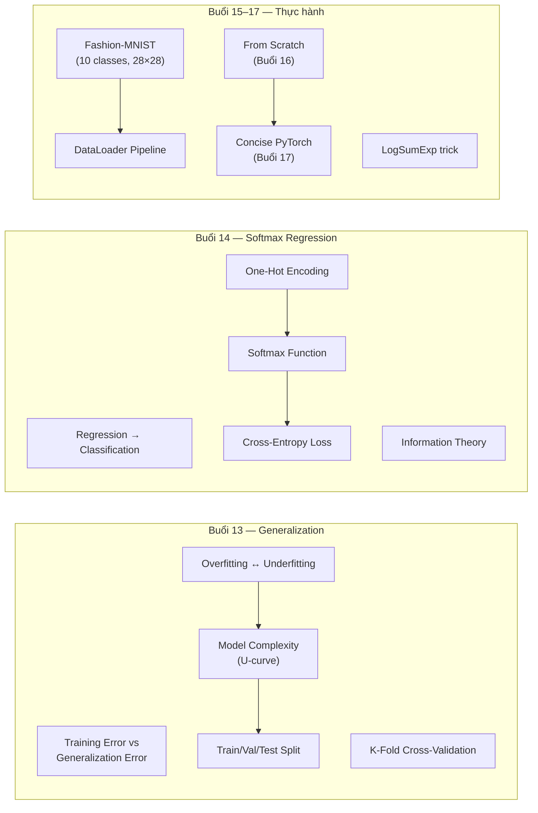

# 📋 Tổng ôn Tuần 4 — Linear Classification

> [!NOTE] Mục tiêu tổng ôn
> Tuần 4 trả lời 3 câu hỏi lớn:
> 1. Train xong rồi, có **thật sự tốt** không? → **Generalization** (Buổi 13)
> 2. Làm sao dự đoán **nhóm** thay vì số? → **Softmax + Cross-Entropy** (Buổi 14)
> 3. Làm sao **code & train** trên dữ liệu thật? → **Fashion-MNIST, Scratch, Concise** (Buổi 15-17)

---

## 🗺️ Bản đồ kiến thức Tuần 4



---

## 📝 Tóm tắt từng buổi

### Buổi 13 — Generalization

| Khái niệm                | Một câu tóm tắt                                                 |
| ------------------------ | --------------------------------------------------------------- |
| **Training Error**       | Lỗi trên data đã dùng train — "điểm bài tập"                    |
| **Generalization Error** | Lỗi trên data mới — "điểm thi thật" — không tính chính xác được |
| **IID**                  | Train & test từ cùng phân phối, độc lập                         |
| **Overfitting**          | Train tốt, test kém — gap lớn — model quá phức tạp              |
| **Underfitting**         | Cả train lẫn test đều kém — model quá đơn giản                  |
| **U-curve**              | Error vs Complexity: underfitting ← sweet spot → overfitting    |
| **Train/Val/Test**       | 60/20/20 — val để chọn model, test chỉ dùng 1 lần               |
| **K-Fold CV**            | Xoay vòng validation khi data ít                                |

### Buổi 14 — Softmax Regression (Lý thuyết)

| Khái niệm          | Một câu tóm tắt                                                       |
| ------------------ | --------------------------------------------------------------------- |
| **Classification** | Dự đoán "cái nào?" thay vì "bao nhiêu?"                               |
| **One-Hot**        | Mèo=(1,0,0), Gà=(0,1,0), Chó=(0,0,1) — không có thứ tự                |
| **Logits**         | Điểm thô $\mathbf{o} = \mathbf{Wx} + \mathbf{b}$ — chưa phải xác suất |
| **Softmax**        | $\hat{y}_i = \frac{e^{o_i}}{\sum_j e^{o_j}}$ — biến logits → xác suất |
| **Cross-Entropy**  | $-\log \hat{y}_c$ — đo loss dựa trên class đúng                       |
| **Gradient**       | $\hat{y}_j - y_j$ — đẹp, giống MSE                                    |
| **Entropy**        | "Mức bất ngờ trung bình" của phân phối                                |

### Buổi 15 — Fashion-MNIST

| Khái niệm | Một câu tóm tắt |
| --- | --- |
| **Fashion-MNIST** | 70k ảnh quần áo, 10 class, 28×28 grayscale |
| **Tensor shape** | $(n, c, h, w) = (64, 1, 28, 28)$ |
| **ToTensor()** | 0-255 → 0.0-1.0 |
| **DataLoader** | Chia batch, shuffle, iterate |
| **Shuffle** | Train=True (tránh nhớ thứ tự), Test=False |

### Buổi 16 — From Scratch

| Khái niệm | Một câu tóm tắt |
| --- | --- |
| **Flatten** | $(28,28) → (784,)$ — mất thông tin không gian |
| **Model** | $\hat{\mathbf{y}} = \text{softmax}(\mathbf{Wx} + \mathbf{b})$, W: 784×10 |
| **Indexing trick** | `y_hat[range(n), y]` thay vì nhân one-hot |
| **Training loop** | forward → loss → backward → update → zero_grad |
| **zero_grad** | Bắt buộc! PyTorch cộng dồn gradient |

### Buổi 17 — Concise + Review

| Khái niệm | Một câu tóm tắt |
| --- | --- |
| **nn.Sequential** | Pipeline: Flatten → LazyLinear(10) |
| **F.cross_entropy** | Nhận **logits** (không phải probabilities!) |
| **LogSumExp** | $\log\hat{y}_j = o_j - \bar{o} - \log\sum e^{o_k-\bar{o}}$ — tránh overflow |
| **model.eval()** | Tắt dropout/batchnorm khi evaluate |

---

## 🧮 Công thức cần nhớ

### 1. Softmax

$$\hat{y}_i = \frac{\exp(o_i)}{\sum_{j=1}^q \exp(o_j)}, \qquad \sum_{i=1}^q \hat{y}_i = 1$$

### 2. Cross-Entropy Loss

$$l(\mathbf{y}, \hat{\mathbf{y}}) = -\sum_{j=1}^q y_j \log \hat{y}_j \xrightarrow{\text{one-hot}} -\log \hat{y}_c$$

### 3. Gradient (Softmax + Cross-Entropy)

$$\frac{\partial l}{\partial o_j} = \hat{y}_j - y_j$$

### 4. SGD Update

$$\mathbf{W} \leftarrow \mathbf{W} - \eta \cdot \frac{\partial l}{\partial \mathbf{W}}$$

### 5. LogSumExp (Numerical Stable)

$$\log \hat{y}_j = o_j - \underbrace{\max_k o_k}_{\bar{o}} - \log \sum_k \exp(o_k - \bar{o})$$

---

## ⚠️ Sai lầm phổ biến

| # | Sai lầm | Hậu quả | Cách tránh |
| --- | --- | --- | --- |
| 1 | Dùng test set để chọn hyperparameters | Overfit test set | Dùng validation set |
| 2 | Quên `zero_grad()` | Gradient tích lũy → sai | Luôn gọi trước backward |
| 3 | Apply softmax rồi đưa vào `F.cross_entropy` | Double softmax → kết quả sai | Đưa logits thẳng vào |
| 4 | Training error thấp = model tốt | Có thể overfitting | So sánh train vs val |
| 5 | Dùng label integers (1,2,3) cho classification | Tạo thứ tự giả | Dùng one-hot |
| 6 | Shuffle test set | Kết quả không reproducible | `shuffle=False` cho test |

---

## 🧪 Bài tập tổng hợp

### Bài 1: Lý thuyết (Trắc nghiệm)

**1.1.** Training loss = 0.01, Validation loss = 2.5. Đang xảy ra:
- a) Underfitting
- b) **Overfitting** ✅
- c) Good fit

**1.2.** `F.cross_entropy(logits, y)` gộp sẵn:
- a) Sigmoid + MSE
- b) **Softmax + NLL (negative log-likelihood)** ✅
- c) ReLU + L1 loss

**1.3.** Fashion-MNIST shape sau DataLoader (batch=64):
- a) (64, 28, 28)
- b) **(64, 1, 28, 28)** ✅
- c) (64, 784)

**1.4.** Softmax output luôn thỏa mãn:
- a) Tổng = 0
- b) Mọi giá trị ∈ [-1, 1]
- c) **Mọi giá trị ∈ (0,1) và tổng = 1** ✅

### Bài 2: Tính tay

**2.1.** Cho $\mathbf{o} = (2, 1, 0)$. Tính softmax.

> [!NOTE]- Đáp án
> $e^2 = 7.389,\ e^1 = 2.718,\ e^0 = 1.000$
> Sum = 11.107
> $\hat{\mathbf{y}} = (0.665, 0.245, 0.090)$

**2.2.** Nhãn thật = class 0. Tính cross-entropy loss.

> [!NOTE]- Đáp án
> $l = -\log(0.665) = 0.408$

**2.3.** Nhãn thật = class 2. Tính cross-entropy loss.

> [!NOTE]- Đáp án
> $l = -\log(0.090) = 2.408$
> Loss cao hơn nhiều vì model đoán sai!

### Bài 3: Code

**3.1.** Viết hàm `softmax(X)` từ đầu (3 dòng).

> [!NOTE]- Đáp án
> ```python
> def softmax(X):
>     X_exp = torch.exp(X)
>     partition = X_exp.sum(dim=1, keepdim=True)
>     return X_exp / partition
> ```

**3.2.** Viết model softmax regression concise bằng PyTorch (2 dòng model).

> [!NOTE]- Đáp án
> ```python
> model = nn.Sequential(nn.Flatten(), nn.LazyLinear(10))
> loss = F.cross_entropy(model(X), y)
> ```

**3.3.** Tại sao code này **BUG**?

```python
probs = F.softmax(model(X), dim=1)
loss = F.cross_entropy(probs, y)
```

> [!NOTE]- Đáp án
> `F.cross_entropy` đã **gộp softmax bên trong**. Apply softmax 2 lần = double softmax → kết quả sai + mất numerical stability.

---

## 🔗 Concept Notes tạo trong Tuần 4

| Concept | File |
| --- | --- |
| [[Training Error vs Generalization Error]] | 🆕 |
| [[Overfitting and Underfitting]] | 🆕 |
| [[Cross-Validation]] | 🆕 |
| [[Generalization]] | ✏️ |
| [[Softmax Function]] | 🆕 |
| [[Cross-Entropy Loss]] | 🆕 |
| [[One-Hot Encoding]] | 🆕 |
| [[Fashion-MNIST Dataset]] | 🆕 |
| [[DataLoader (PyTorch)]] | 🆕 |

---

## ➡️ Tuần 5 Preview

Tuần 5 bắt đầu **Deep Learning thật sự** — Multilayer Perceptrons (MLP):

- **Buổi 18**: MLP lý thuyết — hidden layers, activation functions
- **Buổi 19**: MLP from scratch
- **Buổi 20**: MLP concise
- **Buổi 21**: Overfitting trong DL + Weight Decay + Dropout

Những gì học trong Tuần 4 (softmax, cross-entropy, training loop) sẽ **được dùng lại hoàn toàn** — chỉ thêm **hidden layers** ở giữa input và output.
