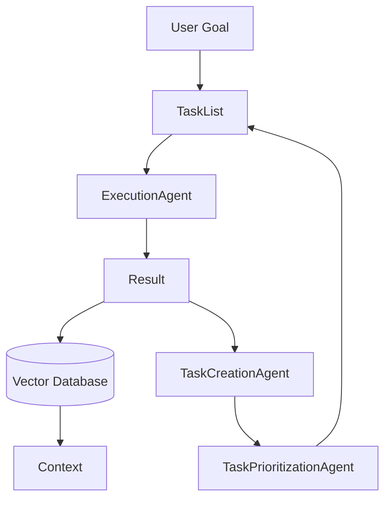

---
tags:
  - AI/Agent
  - AI/History
  - Concept
aliases:
  - Task-driven Autonomous Agent
created: 2026-01-04
---

### Định nghĩa

**BabyAGI** là một trong những dự án mã nguồn mở tiên phong về [[Autonomous Agents]], được tạo ra bởi Yohei Nakajima. Nó minh họa một kiến trúc đơn giản nhưng mạnh mẽ để tạo ra một "Agent tự hành" có khả năng tự quản lý danh sách công việc (Task List) để đạt được một mục tiêu lớn.

### Cơ chế hoạt động

BabyAGI hoạt động dựa trên một vòng lặp vô tận (Infinite Loop) gồm 3 Agent con phối hợp với nhau:

1.  **Execution Agent:** Thực hiện công việc đầu tiên trong danh sách (Task List) dựa trên ngữ cảnh và mục tiêu. Kết quả được lưu vào Memory (Vector DB).
2.  **Task Creation Agent:** Dựa trên mục tiêu chung và kết quả vừa thực hiện, tạo ra các công việc *mới* cần làm.
3.  **Task Prioritization Agent:** Sắp xếp lại thứ tự ưu tiên của danh sách công việc.

### Sơ đồ luồng dữ liệu

### Ý nghĩa

Mặc dù đơn giản, BabyAGI đã chứng minh khả năng của LLM không chỉ là một công cụ trả lời câu hỏi mà có thể đóng vai trò là "người quản lý dự án" và "người thực thi" đồng thời. Nó là tiền đề cho các mô hình [[Plan-and-Execute Agents]] phức tạp hơn sau này.
