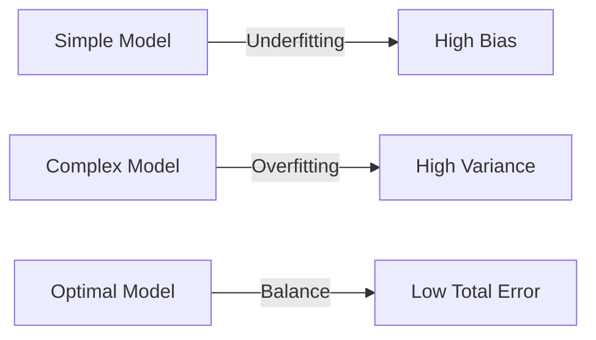

---
tags:
  - AI/Training
  - AI/Concept
  - Concept
alias:
  - Bias-Variance Decomposition
  - Overfitting vs Underfitting
created: 2026-01-04
---

### Định nghĩa

**Bias-Variance Tradeoff** (Đánh đổi Thiên kiến - Phương sai) là một vấn đề kinh điển trong Supervised Learning, giải thích tại sao mô hình lại mắc lỗi và làm thế nào để tối ưu hóa độ phức tạp của mô hình (Model Complexity).

Tổng lỗi dự đoán (Total Error) của một mô hình có thể phân rã thành:
$$\text{Error} = \text{Bias}^2 + \text{Variance} + \text{Irreducible Error}$$

### Phân tích thành phần

#### 1. Bias (Thiên kiến - Lỗi do giả định sai)
*   **Định nghĩa:** Sai số do việc sử dụng một mô hình quá đơn giản để biểu diễn một vấn đề thực tế phức tạp.
*   **Hệ quả:** Dẫn đến **Underfitting** (Mô hình không học được gì cả).
*   *Ví dụ:* Dùng đường thẳng (Linear) để mô tả quỹ đạo hình sin. Dù có huấn luyện bao nhiêu dữ liệu, đường thẳng không bao giờ uốn cong được. -> **High Bias**.

#### 2. Variance (Phương sai - Lỗi do quá nhạy cảm)
*   **Định nghĩa:** Sai số do mô hình quá nhạy cảm với những thay đổi nhỏ (nhiễu) trong tập dữ liệu huấn luyện.
*   **Hệ quả:** Dẫn đến **Overfitting** (Học vẹt, học cả nhiễu).
*   *Ví dụ:* Một học sinh học thuộc lòng đáp án đề cương. Nếu đề thi đổi số một chút, học sinh đó làm sai ngay. Kết quả điểm số biến động rất mạnh tùy vào đề. -> **High Variance**.

### Mối quan hệ đánh đổi (The Tradeoff)

*   **Mô hình đơn giản (Simple Model):** High Bias, Low Variance. (Ổn định nhưng không chính xác).
*   **Mô hình phức tạp (Complex Model):** Low Bias, High Variance. (Chính xác trên tập train nhưng dao động mạnh trên tập test).

### Giải pháp tối ưu

Mục tiêu là tìm điểm cân bằng ("Sweet Spot") nơi tổng lỗi là thấp nhất.

1.  **Để giảm Bias:**
    *   Tăng độ phức tạp mô hình (thêm layers, thêm neurons).
    *   Thêm đặc trưng (features) mới.
    *   Giảm Regularization.
2.  **Để giảm Variance:**
    *   Thêm dữ liệu huấn luyện (More Data).
    *   Sử dụng Regularization (L1/L2, Dropout).
    *   Giảm số lượng features (Feature Selection).
    *   Ensemble Learning (Bagging, Boosting).

