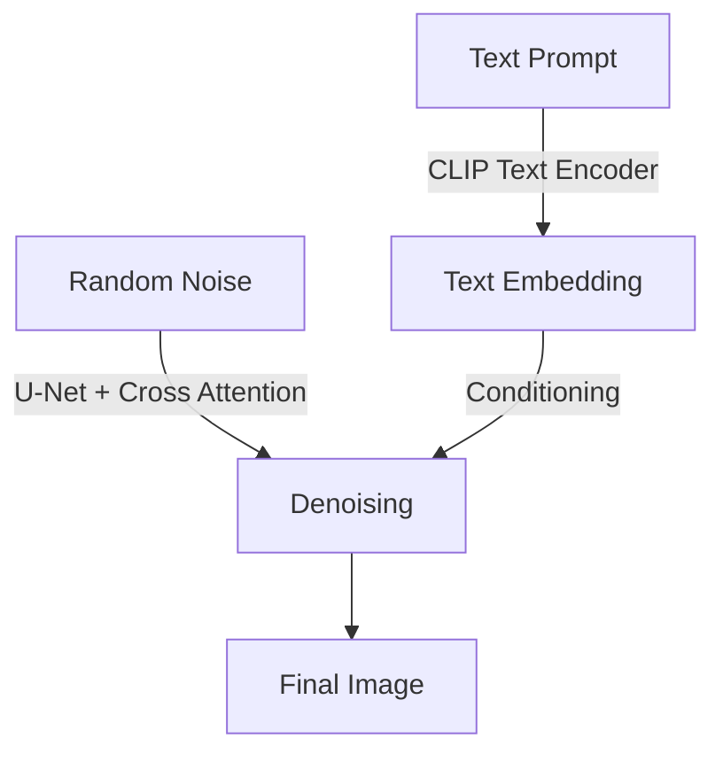

---
tags:
  - AI/Model
  - AI/Multimodal
  - Concept
aliases:
  - Contrastive Language-Image Pre-training
created: 2026-01-04
---

### Định nghĩa

**CLIP** (Contrastive Language-Image Pre-training) là một mô hình mạng neural do OpenAI phát triển, có khả năng học mối liên hệ giữa hình ảnh và văn bản. Nó đóng vai trò là "cây cầu" nối giữa ngôn ngữ tự nhiên và thị giác máy tính.

### Cơ chế hoạt động

CLIP được huấn luyện trên hàng trăm triệu cặp (Ảnh, Văn bản) từ internet. Nó sử dụng cơ chế **Contrastive Learning**:
1.  **Image Encoder:** Chuyển đổi ảnh thành một vector embedding.
2.  **Text Encoder:** Chuyển đổi văn bản mô tả thành một vector embedding.
3.  **Objective:** Tối ưu hóa sao cho vector của ảnh và vector của văn bản mô tả đúng *nằm gần nhau* (maximize similarity), còn vector của các văn bản sai *nằm xa ra* (minimize similarity).

### Vai trò trong Image Generation

Trong các hệ thống như **[[Stable Diffusion]]** hay **[[DALL-E]]**, CLIP đóng vai trò là **Text Encoder**:
1.  Người dùng nhập prompt: "Một con mèo đang lái xe đạp".
2.  CLIP chuyển prompt này thành một vector ngữ nghĩa.
3.  Vector này được đưa vào quá trình Diffusion (thông qua cơ chế Cross-Attention) để hướng dẫn (guide) quá trình khử nhiễu, đảm bảo ảnh sinh ra khớp với mô tả.

Nếu không có CLIP, mô hình Diffusion vẫn có thể sinh ra ảnh đẹp, nhưng nó sẽ không biết ảnh đó có nội dung gì hay có khớp với yêu cầu của người dùng không.
