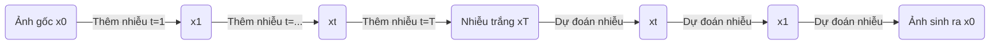

---
tags:
  - AI/ImageGeneration
  - AI/Model
  - Concept
aliases:
  - Denoising Diffusion Probabilistic Models
  - DDPM
created: 2026-01-04
---

### Định nghĩa

**Diffusion Models** (Mô hình Khuếch tán) là một lớp các mô hình sinh (generative models) hoạt động dựa trên nguyên lý nhiệt động lực học không cân bằng. Ý tưởng cốt lõi là:
1.  **Phá hủy dữ liệu (Forward Process):** Thêm nhiễu (noise) Gaussian dần dần vào một bức ảnh cho đến khi nó trở thành nhiễu trắng hoàn toàn.
2.  **Khôi phục dữ liệu (Reverse Process):** Huấn luyện một mạng neural để "gỡ bỏ" lớp nhiễu đó từng bước một, qua đó tái tạo lại bức ảnh gốc từ nhiễu.

### Cơ chế hoạt động (Technical Deep Dive)

Quá trình này có thể được hình dung qua hai giai đoạn:

1.  **Forward Diffusion (Quá trình thêm nhiễu):**
    *   Giả sử ta có ảnh gốc $x_0$.
    *   Tại mỗi bước thời gian $t$, ta thêm một lượng nhỏ nhiễu Gaussian $\epsilon$.
    *   $x_t = \sqrt{1 - \beta_t} x_{t-1} + \sqrt{\beta_t} \epsilon$
    *   Sau $T$ bước (thường là 1000), $x_T$ xấp xỉ phân phối chuẩn tắc $N(0, I)$.

2.  **Reverse Diffusion (Quá trình khử nhiễu - Denoising):**
    *   Đây là giai đoạn "sáng tạo". Mô hình bắt đầu từ một vector nhiễu ngẫu nhiên $x_T$.
    *   Mạng neural (thường là **[[U-Net]]**) dự đoán lượng nhiễu đã được thêm vào ở bước trước đó.
    *   Lấy ảnh hiện tại trừ đi nhiễu dự đoán để có ảnh "sạch" hơn $x_{t-1}$.
    *   Lặp lại cho đến khi về $x_0$.

### So sánh với GANs (Generative Adversarial Networks)

| Đặc điểm | Diffusion Models | GANs |
| :--- | :--- | :--- |
| **Cơ chế** | Khử nhiễu tuần tự (Iterative Denoising) | Đối nghịch (Generator vs Discriminator) |
| **Chất lượng ảnh** | Rất cao, chi tiết, đa dạng (Diversity) | Cao, nhưng dễ bị Mode Collapse (lặp lại mẫu) |
| **Tốc độ sinh** | Chậm (do phải chạy nhiều bước khử nhiễu) | Nhanh (sinh 1 lần - Single pass) |
| **Huấn luyện** | Ổn định, dễ hội tụ | Khó huấn luyện, không ổn định |

### Ứng dụng

Diffusion Models là nền tảng của các công cụ tạo ảnh AI hiện đại như **[[DALL-E]]**, **[[Midjourney]]**, và **[[Stable Diffusion]]**.