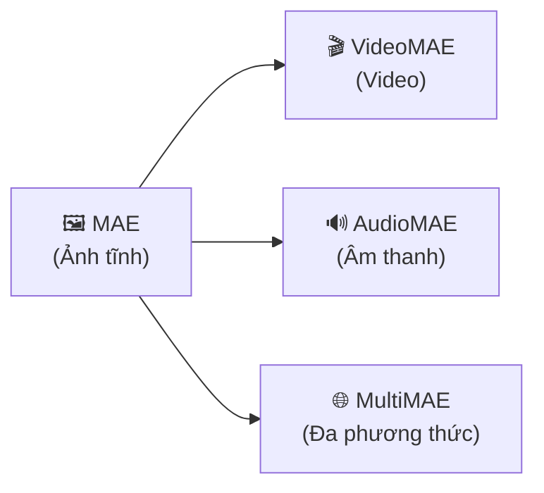
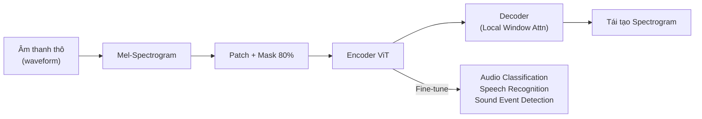
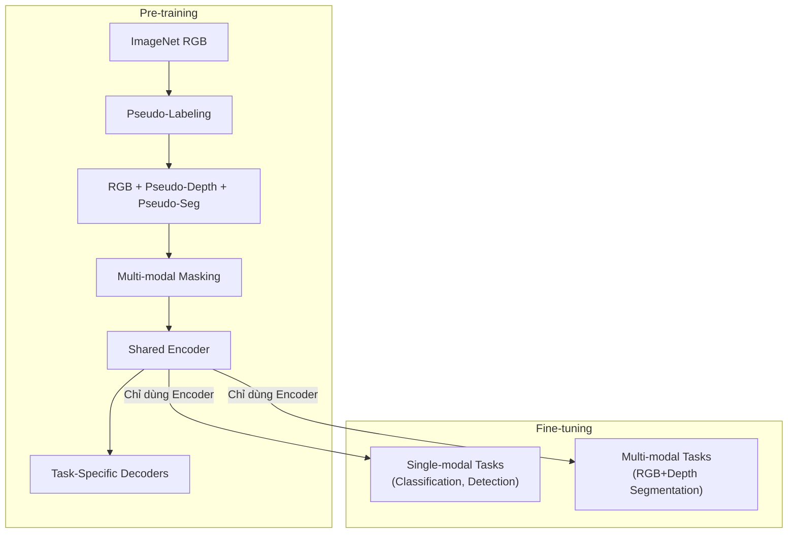

,
# Masked Autoencoders (MAE) — Tổng quan & Các biến thể

> [!NOTE] Mục đích tài liệu
> Tài liệu này trình bày chi tiết về **Masked Autoencoders (MAE)** — một phương pháp học tự giám sát (**self-supervised learning**) đột phá cho thị giác máy tính. Nội dung bao gồm mô hình gốc (MAE) và 3 biến thể quan trọng: **VideoMAE**, **AudioMAE**, **MultiMAE**. Viết cho người mới bắt đầu, mỗi khái niệm đều có giải thích ELI5 rồi mới đi sâu.

---

## Phần I — MAE gốc: Masked Autoencoders Are Scalable Vision Learners

### 1. Bài toán MAE giải quyết là gì?

> [!TIP] ELI5 — Hãy tưởng tượng thế này
> Bạn có một bức ảnh ghép 196 mảnh (14×14 lưới). Ai đó giấu đi 147 mảnh (khoảng 75%), chỉ để lại 49 mảnh. Nhiệm vụ của bạn: **đoán bức tranh gốc trông như thế nào**. Để đoán đúng, bạn không thể chỉ nhìn một mảnh và tô theo màu bên cạnh — bạn phải thực sự **hiểu** bức tranh đang vẽ cái gì: con mèo, ngôi nhà, hay bầu trời? MAE dạy máy tính học theo cách chính xác như vậy.

**Phân tích sâu:**

Trong NLP, các phương pháp như **BERT** (che từ, dự đoán từ bị che) và **GPT** (dự đoán từ tiếp theo) đã cực kỳ thành công cho **self-supervised pre-training**. Câu hỏi tự nhiên là: **Liệu ý tưởng tương tự có hoạt động cho ảnh không?**

Câu trả lời không đơn giản vì 3 khác biệt cốt lõi giữa ảnh và ngôn ngữ:

| Khía cạnh | Ngôn ngữ (NLP) | Ảnh (Vision) |
|-----------|----------------|--------------|
| **Kiến trúc** | Transformer từ đầu | CNN thống trị → ViT mới xuất hiện |
| **Mật độ thông tin** | Rất cao (mỗi từ mang nghĩa) | Thấp (pixel lân cận gần giống nhau) |
| **Vai trò decoder** | Dự đoán từ = dự đoán ngữ nghĩa | Dự đoán pixel = dự đoán giá trị số |

MAE (Kaiming He et al., CVPR 2022) giải quyết cả 3 vấn đề này bằng thiết kế thông minh.

---

### 2. Kiến trúc MAE — Chi tiết từng thành phần

![[assets/attachments/He_Masked_Autoencoders_Are_Scalable_Vision_Learners_CVPR_2022/img-001.png]]
*Figure 1: Kiến trúc MAE. Trong pre-training, 75% patch bị che. Encoder chỉ xử lý patch nhìn thấy. Mask tokens được thêm sau encoder, và toàn bộ set được xử lý bởi decoder nhẹ để tái tạo ảnh gốc.*

> [!TIP] ELI5 — Hai phần của MAE
> Hãy nghĩ MAE như hai nhân vật: **Bộ não** (Encoder) và **Họa sĩ** (Decoder).
> - **Bộ não** chỉ nhìn 25% mảnh ghép thật và cố gắng hiểu bức tranh.
> - **Họa sĩ** nhận sự hiểu biết từ Bộ não, cộng thêm các "ô trống" đánh dấu vị trí mảnh bị giấu, rồi cố vẽ lại toàn bộ bức tranh.
> - Sau khi học xong, ta vứt Họa sĩ đi, chỉ giữ Bộ não để làm việc thực sự (nhận dạng, phát hiện đối tượng, v.v.).

#### 2.1 Bước 1: Chia ảnh thành Patch

Giống [[Vision Transformers (ViT)]], ảnh đầu vào kích thước $H \times W$ được chia thành lưới các **patch** không chồng lấp, mỗi patch kích thước $P \times P$. Tổng số patch:

$$N = \frac{H \times W}{P^2}$$

Với ảnh $224 \times 224$ và patch $16 \times 16$:

$$N = \frac{224 \times 224}{16 \times 16} = 196 \text{ patches}$$

#### 2.2 Bước 2: Masking — Che ngẫu nhiên

MAE **lấy mẫu ngẫu nhiên** (random sampling, phân phối đều, không hoàn lại) một tập con patch và **loại bỏ** các patch còn lại. Tỉ lệ masking (masking ratio) rất cao: **75%** là mặc định.

> [!IMPORTANT] Tại sao 75% mà không phải 15% như BERT?
> Ảnh có **dư thừa không gian lớn** (spatial redundancy). Nếu chỉ che 15% patch, máy có thể "nhìn trộm" các patch xung quanh và nội suy đơn giản — giống tô màu bên cạnh. Che 75% buộc máy phải **hiểu cấu trúc tổng thể** (gestalt) của đối tượng và cảnh mới có thể tái tạo.
>
> Ngược lại, ngôn ngữ đã sẵn nén thông tin cao — che 15% từ đã đủ khó.

**Triển khai đơn giản (Simple Implementation):**

```python
1. Linear Projection: mỗi patch → token (vector embedding)
2. Thêm Positional Embedding cho mỗi token
3. Shuffle ngẫu nhiên danh sách tokens
4. Loại bỏ 75% tokens cuối danh sách (do đã shuffle)
   → Chỉ giữ 25% tokens cho encoder
5. Sau encoding, thêm mask tokens + unshuffle
6. Decoder xử lý danh sách đầy đủ
```

Không cần sparse operations phức tạp — shuffle/unshuffle là đủ.

#### 2.3 Bước 3: MAE Encoder

> [!TIP] ELI5
> Encoder là "bộ não" — lớn, mạnh, nhưng **chỉ nhìn các mảnh thật** (25%). Vì [[Self-Attention]] có chi phí $O(n^2)$, nhìn ít hơn 4 lần nghĩa là nhanh hơn ~16 lần!

**Chi tiết kỹ thuật:**

Encoder là một **ViT chuẩn**, áp dụng **chỉ trên patch nhìn thấy** (visible patches). Quy trình:

1. **Patch Embedding**: Linear projection ánh xạ mỗi patch $\mathbf{x}_i \in \mathbb{R}^{P^2 \cdot C}$ sang vector $\mathbf{z}_i \in \mathbb{R}^{D}$:
$$\mathbf{z}_i = \mathbf{E} \cdot \mathbf{x}_i + \mathbf{e}_{pos}^{(i)}$$
   với $\mathbf{E}$ là ma trận projection, $\mathbf{e}_{pos}^{(i)}$ là positional embedding.

2. **Transformer Blocks**: Chuỗi $L$ block, mỗi block gồm Multi-Head Self-Attention (MHSA) và Feed-Forward Network (FFN):
$$\mathbf{z}' = \text{MHSA}(\text{LN}(\mathbf{z})) + \mathbf{z}$$
$$\mathbf{z}'' = \text{FFN}(\text{LN}(\mathbf{z}')) + \mathbf{z}'$$

> [!IMPORTANT] Thiết kế quan trọng: Không có mask token trong encoder
> Nếu đưa mask token `[M]` vào encoder (như BERT), sẽ có **distribution mismatch**: khi pre-training, encoder thấy nhiều token giả `[M]`; khi fine-tuning/deployment, encoder thấy ảnh đầy đủ không có `[M]`. Điều này gây **giảm 14% accuracy** trong linear probing.
>
> Bằng cách loại bỏ mask token khỏi encoder, MAE đảm bảo encoder **luôn thấy patch thật** → không bị "ngạc nhiên" khi triển khai.

| Cấu hình | Fine-tuning | Linear Probing | FLOPs |
|----------|-------------|----------------|-------|
| Encoder **có** `[MASK]` | 84.2% | 59.6% | 3.3× |
| Encoder **không** `[MASK]` | **84.9%** | **73.5%** | **1×** |

→ Vừa chính xác hơn, vừa nhanh gấp **3.3×**.

#### 2.4 Bước 4: MAE Decoder

> [!TIP] ELI5
> Decoder là "họa sĩ" — nhỏ, nhẹ, chỉ phục vụ việc tái tạo ảnh trong lúc học. Sau khi học xong, ta vứt decoder đi.

**Đầu vào decoder** là **toàn bộ set tokens**:
- **(i)** Các encoded visible patches (đầu ra encoder)
- **(ii)** Mask tokens — một vector **học được, chia sẻ** (shared, learned) cho mỗi vị trí patch bị che

$$\text{Input}_{\text{decoder}} = \text{Concat}(\text{Encoded Patches}, \text{Mask Tokens}) + \mathbf{E}_{pos}$$

**Positional Embedding** được thêm vào **tất cả** tokens — nếu không, mask tokens sẽ không biết vị trí của mình trong ảnh.

**Đặc điểm:**

| Thuộc tính | Encoder (ViT-L) | Decoder (mặc định) |
|-----------|-----------------|---------------------|
| Số blocks | 24 | **8** |
| Width (dim) | 1024 | **512** |
| FLOPs/token | 100% | **~9%** |

→ Decoder chỉ chiếm **<10% computation/token** so với encoder. Toàn bộ 196 tokens (cả visible và mask) chỉ được xử lý bởi decoder nhẹ này.

#### 2.5 Bước 5: Reconstruction Target & Loss

MAE tái tạo **giá trị pixel** cho mỗi patch bị che:

1. Output layer cuối của decoder: Linear projection ánh xạ mỗi token → vector $P^2 \cdot C$ pixel
2. Reshape thành ảnh
3. **Loss function** — Mean Squared Error *chỉ trên patch bị che*:

$$\mathcal{L} = \frac{1}{|\mathcal{M}|} \sum_{i \in \mathcal{M}} \| \hat{\mathbf{x}}_i - \mathbf{x}_i \|^2$$

với $\mathcal{M}$ là tập patch bị che, $\hat{\mathbf{x}}_i$ là dự đoán, $\mathbf{x}_i$ là pixel gốc.

> [!NOTE] Chuẩn hóa pixel (Per-patch Normalization)
> Biến thể cải tiến: chuẩn hóa pixel trong mỗi patch ($\mu = 0, \sigma = 1$) trước khi tính loss. Điều này tăng contrast cục bộ và **cải thiện chất lượng biểu diễn**:
>
> $$\tilde{\mathbf{x}}_i = \frac{\mathbf{x}_i - \mu_i}{\sigma_i}$$
>
> | Target | Fine-tuning | Linear Probing |
> |--------|-------------|----------------|
> | Pixel (không norm) | 84.9% | 73.5% |
> | **Pixel (có norm)** | **85.4%** | **73.9%** |

---

### 3. Kết quả chính của MAE

#### 3.1 Hiệu năng trên ImageNet-1K

| Phương pháp | Dữ liệu Pre-train | ViT-B | ViT-L | ViT-H | ViT-H₄₄₈ |
|-------------|-------------------|-------|-------|-------|-----------|
| Train from scratch | — | 82.3% | 82.6% | 83.1% | — |
| DINO | IN1K | 82.8% | — | — | — |
| MoCo v3 | IN1K | 83.2% | 84.1% | — | — |
| BEiT | IN1K+DALLE | 83.2% | 85.2% | — | — |
| **MAE** | **IN1K** | **83.6%** | **85.9%** | **86.9%** | **87.8%** |

> [!IMPORTANT] Ý nghĩa kết quả
> - **87.8%** là state-of-the-art cho các phương pháp chỉ dùng ImageNet-1K
> - MAE scale lên tốt: ViT-B → ViT-H, accuracy tăng đều
> - So với BEiT: MAE đơn giản hơn (không cần dVAE tokenizer), nhanh hơn **3.5× per epoch**

#### 3.2 Transfer Learning

| Task | Dataset | MAE (ViT-L) | Supervised (ViT-L) | Chênh lệch |
|------|---------|-------------|---------------------|------------|
| Object Detection | COCO | **53.3** APbox | 49.3 | **+4.0** |
| Instance Segmentation | COCO | **47.2** APmask | 43.9 | **+3.3** |
| Semantic Segmentation | ADE20K | **53.6** mIoU | 49.9 | **+3.7** |

→ MAE vượt trội so với supervised pre-training trên **mọi downstream task**.

---

### 4. Tại sao MAE hoạt động? — Phân tích trực giác

> [!TIP] ELI5
> Khi bạn giấu 75% bức ảnh, phần còn lại quá ít để "cheat" (nội suy đơn giản). Máy buộc phải **tưởng tượng** toàn bộ bức tranh — giống như cách bạn nhìn vài mảnh ghép và hình dung ra bức tranh hoàn chỉnh. Quá trình "tưởng tượng" này buộc encoder phải xây dựng **biểu diễn phong phú** về thế giới thị giác.

**Phân tích cơ chế:**

1. **High masking = High-level understanding**: Che 75% loại bỏ dư thừa không gian, tạo nhiệm vụ đòi hỏi **hiểu toàn cục** (holistic understanding) — không chỉ nội suy cục bộ.

2. **Asymmetric design = Efficiency**: Encoder lớn chỉ xử lý 25% tokens → giảm compute bậc hai. Decoder nhẹ xử lý toàn bộ → chi phí thấp. Tổng: **speedup 3–4×**.

3. **No mask token in encoder = No distribution gap**: Encoder luôn thấy patch thật → biểu diễn học được tốt hơn khi deploy.

4. **Random masking thay thế data augmentation**: Mỗi iteration có mask khác nhau → tạo training sample mới tự nhiên, giảm nhu cầu augmentation phức tạp.

---

## Phần II — Ba biến thể quan trọng của MAE

Ý tưởng cốt lõi của MAE — **che một phần dữ liệu, học tái tạo phần bị che** — có thể mở rộng sang nhiều dạng dữ liệu khác nhau. Ba biến thể quan trọng nhất là:



---

### 5. VideoMAE — Masked Autoencoders cho Video

> **Paper:** *VideoMAE: Masked Autoencoders as Data-Efficient Learners for Self-Supervised Video Pre-Training* (NeurIPS 2022)

#### 5.1 Bài toán

> [!TIP] ELI5
> Nếu MAE che các mảnh trong **một bức ảnh**, VideoMAE che các mảnh trong **một đoạn phim**. Nhưng phim khó hơn ảnh ở chỗ: các khung hình liên tiếp gần giống nhau (bạn nhìn frame 1 là đoán được frame 2). Vì vậy VideoMAE phải **che nhiều hơn** (90–95%) và **che theo ống** (tube masking) để video thực sự khó.

**Vấn đề cốt lõi:** Video có **dư thừa thời gian rất lớn** (temporal redundancy). Nếu chỉ che ngẫu nhiên từng frame riêng lẻ, máy có thể "nhìn trộm" frame bên cạnh (cùng vị trí không gian ở frame khác) để đoán frame bị che → học rất ít.

#### 5.2 Kiến trúc VideoMAE

```
Video (T×H×W) → Chia thành Spatiotemporal Tubes
→ Tube Masking (90-95%) → Encoder (ViT) → Decoder nhẹ → Tái tạo pixel
```

**Các thành phần chính:**

**a) Tokenization không-thời gian:**

Video $T \times H \times W$ được chia thành các **cuboid** (khối 3D) kích thước $t \times h \times w$, tạo ra $N_{video}$ tokens:

$$N_{video} = \frac{T}{t} \times \frac{H}{h} \times \frac{W}{w}$$

Ví dụ: Video 16 frames × 224×224, cuboid 2×16×16:
$$N_{video} = \frac{16}{2} \times \frac{224}{16} \times \frac{224}{16} = 8 \times 14 \times 14 = 1568 \text{ tokens}$$

**b) Tube Masking — Chiến lược che đặc biệt:**

> [!IMPORTANT] Tube Masking vs Random Masking
> **Random masking** trong video cho phép "rò rỉ thông tin thời gian": nếu patch $(x, y)$ bị che ở frame $t$ nhưng không bị che ở frame $t+1$, máy dễ đoán pixel ở frame $t$ bằng cách copy từ $t+1$.
>
> **Tube masking** giải quyết vấn đề này: nếu patch $(x, y)$ bị che, nó bị che ở **tất cả frames**. Tức là mask không thay đổi theo thời gian — tạo "ống" (tube) che xuyên suốt video.

```
Tube Masking (ống che):
Frame 1:  ■ □ ■ ■ □     ■ = che
Frame 2:  ■ □ ■ ■ □     □ = nhìn thấy
Frame 3:  ■ □ ■ ■ □     (cùng pattern qua mọi frame)
Frame 4:  ■ □ ■ ■ □
```

**c) Tỉ lệ masking cực cao: 90–95%**

Video dư thừa nhiều hơn ảnh → cần che nhiều hơn:

| Dạng dữ liệu | Masking ratio tối ưu | Lý do |
|---------------|---------------------|-------|
| Ảnh (MAE) | 75% | Dư thừa không gian |
| **Video (VideoMAE)** | **90–95%** | Dư thừa không gian **+ thời gian** |

**d) Encoder-Decoder bất đối xứng:**

Giống MAE gốc: encoder (ViT) chỉ xử lý tokens nhìn thấy (5–10%), decoder nhẹ tái tạo toàn bộ video. Với 95% masking, encoder chỉ xử lý ~78 tokens (thay vì 1568) → **giảm compute rất lớn**.

#### 5.3 Kết quả chính

| Phương pháp | Pre-train Data | Kinetics-400 (Top-1) | Something-Something V2 |
|-------------|---------------|----------------------|------------------------|
| Train from scratch | — | ~73% | ~55% |
| BEVT | IN1K+K400 | 81.1% | — |
| **VideoMAE** | **K400** | **81.5%** | **70.8%** |

> [!NOTE] Ý nghĩa
> VideoMAE đạt kết quả cạnh tranh **chỉ với dữ liệu K400** (không cần dữ liệu ngoài), chứng minh tính data-efficient. Something-Something V2 đòi hỏi hiểu **temporal reasoning** (hành động phải hiểu trình tự) — VideoMAE mạnh ở task này cho thấy nó học được biểu diễn spatiotemporal tốt.

#### 5.4 VideoMAE V2 — Cải tiến

VideoMAE V2 giới thiệu **dual masking**:
- **Running mask trên encoder**: Mask khác nhau ở mỗi frame (tăng đa dạng)
- **Reconstruction mask trên decoder**: Chỉ tái tạo subset patches (giảm compute)

→ Cho phép scale lên **ViT-giant** (1B+ parameters) với hiệu quả tốt hơn.

---

### 6. AudioMAE — Masked Autoencoders cho Âm thanh

> **Paper:** *Masked Autoencoders that Listen* (NeurIPS 2022)

#### 6.1 Bài toán

> [!TIP] ELI5
> Thay vì nhìn **bức ảnh**, AudioMAE nhìn **bức ảnh của âm thanh** — gọi là **spectrogram** (phổ tần số theo thời gian). Spectrogram trông giống bản đồ nhiệt: trục ngang là thời gian, trục dọc là tần số, màu sắc biểu thị cường độ âm thanh. AudioMAE che một phần spectrogram và yêu cầu mô hình đoán phần bị che.

**Ý tưởng cốt lõi:** Âm thanh có thể được biểu diễn dưới dạng **Mel-spectrogram** — một ảnh 2D. Khi đó, ý tưởng "che patch, tái tạo patch" của MAE có thể áp dụng trực tiếp.

#### 6.2 Kiến trúc AudioMAE

```
Waveform → Mel-Spectrogram (T_mel × F_mel)
→ Chia thành Patch 2D → Masking (80%) → Encoder (ViT)
→ Decoder (có Local Window Attention) → Tái tạo spectrogram
```

**Các thành phần chính:**

**a) Từ âm thanh sang "ảnh":**

Tín hiệu âm thanh thô (waveform) được chuyển thành **Mel-spectrogram**:

$$S(t, f) = |\text{STFT}(x(t))|^2 \cdot \mathbf{M}_{\text{mel}}$$

với $\text{STFT}$ là Short-Time Fourier Transform, $\mathbf{M}_{\text{mel}}$ là bộ lọc Mel. Kết quả là ma trận 2D có trục thời gian $t$ và trục tần số Mel $f$.

**b) Patch Embedding:**

Mel-spectrogram được chia thành patch 2D (ví dụ $16 \times 16$), mỗi patch được embed thành token — giống hệt ViT cho ảnh.

**c) Masking tỉ lệ cao: ~80%**

| Dạng dữ liệu | Masking ratio | Lý do |
|---------------|---------------|-------|
| Ảnh (MAE) | 75% | Dư thừa không gian |
| **Âm thanh (AudioMAE)** | **~80%** | Dư thừa thời gian-tần số tương tự |

**d) Decoder với Local Window Attention:**

> [!IMPORTANT] Khác biệt quan trọng so với MAE gốc
> Trong spectrogram, thông tin **tương quan cục bộ rất mạnh**: dải tần gần nhau và khoảng thời gian gần nhau có giá trị tương tự. Decoder của AudioMAE sử dụng **Local Window Attention** (chỉ attend trong cửa sổ cục bộ) thay vì Global Attention.
>
> **Tại sao?** Spectrogram có cấu trúc cục bộ mạnh: harmonics (bội số tần số cơ bản) nằm ở các dải tần liền kề, formants (đặc trưng nguyên âm) tập trung trong vùng tần số nhất định. Local attention phù hợp hơn global attention cho tái tạo spectrogram.

```
MAE gốc (ảnh):     Decoder dùng Global Self-Attention
AudioMAE (âm thanh): Decoder dùng Local Window Attention
```

#### 6.3 Quy trình sử dụng



- **Pre-training**: Encoder + Decoder tái tạo spectrogram
- **Fine-tuning**: Bỏ decoder, chỉ dùng encoder cho downstream tasks (phân loại âm thanh, nhận dạng giọng nói, phát hiện sự kiện âm thanh)

#### 6.4 Kết quả chính

| Phương pháp | AudioSet (mAP) | ESC-50 (Acc) |
|-------------|----------------|--------------|
| Supervised baseline | 38.4 | 85.7% |
| SSAST | 31.0 | 88.8% |
| **AudioMAE** | **47.3** | **94.1%** |

> [!NOTE] Ý nghĩa
> AudioMAE vượt trội cả supervised baseline lẫn các phương pháp self-supervised trước đó. Đặc biệt mạnh trên **AudioSet** (phân loại âm thanh đa nhãn) — dataset lớn nhất cho audio classification.

---

### 7. MultiMAE — Masked Autoencoders Đa phương thức Đa tác vụ

> **Paper:** *MultiMAE: Multi-modal Multi-task Masked Autoencoders* (ECCV 2022)

#### 7.1 Bài toán

> [!TIP] ELI5
> Hãy tưởng tượng bạn đang học nhìn thế giới, nhưng thay vì chỉ có **mắt** (ảnh RGB), bạn còn có **máy đo độ sâu** (depth map) và **khả năng nhận biết bề mặt** (semantic labels). MultiMAE che một phần **mỗi loại thông tin** và yêu cầu mô hình đồng thời tái tạo tất cả. Giống như giấu một phần bức tranh VÀ một phần bản đồ địa hình, rồi bắt bạn đoán cả hai.

**Ý tưởng:** Mở rộng MAE theo **hai hướng** cùng lúc:
1. **Multi-modal** (đa phương thức): Nhận đầu vào từ nhiều nguồn — RGB, depth, semantic segmentation, v.v.
2. **Multi-task** (đa tác vụ): Đầu ra tái tạo nhiều loại thông tin cùng lúc

#### 7.2 Kiến trúc MultiMAE

```
Input:  RGB patches + Depth patches + Segmentation patches
        (mỗi loại bị mask riêng)
                    ↓
        Shared Transformer Encoder
                    ↓
        Task-Specific Decoders
        ├── RGB Decoder → Tái tạo RGB
        ├── Depth Decoder → Tái tạo Depth
        └── Seg Decoder → Tái tạo Segmentation
```

**Các thành phần chính:**

**a) Multi-modal Tokenization:**

Mỗi phương thức (modality) có **tokenizer riêng**:

$$\mathbf{z}_i^{(m)} = \mathbf{E}^{(m)} \cdot \mathbf{x}_i^{(m)} + \mathbf{e}_{pos}^{(i)} + \mathbf{e}_{mod}^{(m)}$$

với:
- $\mathbf{E}^{(m)}$: Linear projection riêng cho modality $m$
- $\mathbf{e}_{pos}^{(i)}$: Positional embedding (chia sẻ giữa các modality)
- $\mathbf{e}_{mod}^{(m)}$: **Modality embedding** — vector học được cho biết token thuộc loại dữ liệu nào

**b) Cross-modal Masking:**

Masking diễn ra **độc lập cho mỗi modality**. Điều này tạo ra **cross-modal predictive coding**: mô hình phải dùng thông tin từ modality A (ví dụ RGB) để đoán modality B (ví dụ depth) — buộc encoder học biểu diễn liên kết các nguồn thông tin.

```
RGB:    □ ■ □ □ ■ ■ □     (mask pattern 1)
Depth:  ■ □ ■ □ □ ■ ■     (mask pattern 2 — khác RGB!)
Seg:    □ □ ■ ■ □ □ ■     (mask pattern 3)
```

> [!IMPORTANT] Tại sao mask khác nhau giữa các modality?
> Nếu mask giống nhau, mô hình chỉ cần tái tạo mỗi modality từ chính nó. Khi mask **khác nhau**, một patch RGB bị che nhưng patch depth cùng vị trí lại nhìn thấy → mô hình phải học **mối quan hệ giữa RGB và depth** (ví dụ: vật gần thường lớn hơn, bầu trời thường ở xa).

**c) Shared Encoder + Task-Specific Decoders:**

- **Encoder**: Một Transformer encoder **duy nhất** xử lý tất cả tokens từ mọi modality. Self-attention cho phép cross-modal interaction tự nhiên.
- **Decoders**: Mỗi modality/task có decoder riêng. Decoder cho RGB tái tạo pixel, decoder cho depth tái tạo depth map, v.v.

**d) Pseudo-labeling — Giải quyết vấn đề dữ liệu:**

> [!NOTE] Vấn đề thực tế
> Dataset có **aligned multi-modal data** (ảnh RGB + depth + segmentation cho cùng một cảnh) rất hiếm và đắt. MultiMAE giải quyết bằng **pseudo-labeling**: dùng các mô hình off-the-shelf (ví dụ MiDaS cho depth, segmentation model cho labels) để tạo nhãn giả cho ImageNet.
>
> → Có thể pre-train trên **ImageNet thuần** (chỉ có RGB) mà vẫn học multi-modal representation!

#### 7.3 Quy trình sử dụng



#### 7.4 Kết quả chính

| Task | Dataset | MultiMAE | MAE (RGB only) | Supervised |
|------|---------|----------|----------------|------------|
| Classification | ImageNet | 83.3% (ViT-B) | 83.6% | 82.3% |
| Semantic Seg | ADE20K (RGB) | 46.2 mIoU | 48.1 | 47.4 |
| Semantic Seg | ADE20K (RGB+Depth) | **49.0 mIoU** | — | — |
| Depth Estimation | NYUv2 | **0.378 RMSE** | — | 0.416 |

> [!NOTE] Ý nghĩa
> - Trên **single-modal tasks** (chỉ RGB), MultiMAE cạnh tranh với MAE gốc
> - Trên **multi-modal tasks** (RGB + Depth), MultiMAE vượt trội rõ rệt — đây là thế mạnh chính
> - Tính **linh hoạt**: cùng một encoder pre-trained có thể fine-tune cho cả single-modal và multi-modal

---

## Phần III — So sánh tổng hợp

### 8. Bảng so sánh MAE và các biến thể

| Đặc điểm | MAE | VideoMAE | AudioMAE | MultiMAE |
|-----------|-----|----------|----------|----------|
| **Dạng dữ liệu** | Ảnh tĩnh (2D) | Video (3D: không gian + thời gian) | Âm thanh (spectrogram 2D) | Đa phương thức (RGB + Depth + Seg) |
| **Tokenization** | Patch 2D ($16 \times 16$) | Cuboid 3D ($2 \times 16 \times 16$) | Patch 2D trên spectrogram | Patch 2D × nhiều modality |
| **Masking ratio** | 75% | 90–95% | ~80% | ~75% mỗi modality |
| **Chiến lược masking** | Random | **Tube masking** (xuyên frame) | Random | **Cross-modal** (khác nhau/modality) |
| **Decoder** | Transformer nhẹ, global attention | Transformer nhẹ | **Local window attention** | **Task-specific** decoders |
| **Reconstruction target** | Pixel (normalized) | Pixel | Spectrogram | Pixel + Depth + Seg |
| **Encoder** | ViT | ViT | ViT | **Shared** ViT |
| **Thách thức chính** | Dư thừa không gian | Dư thừa thời gian | Tương quan cục bộ mạnh | Thiếu dữ liệu aligned |

### 9. Nguyên lý chung — "Che và Đoán"

> [!TIP] ELI5 — Tổng kết
> Tất cả các biến thể MAE đều tuân theo **một ý tưởng duy nhất**: giấu một phần lớn dữ liệu, và bắt mô hình "đoán" phần bị giấu. Cách đoán tốt nhất chính là **hiểu sâu** dữ liệu. Mỗi biến thể chỉ thay đổi **cách giấu** và **cách biểu diễn dữ liệu** cho phù hợp với loại tín hiệu riêng:
> - **Ảnh**: Giấu patch 2D → đoán pixel
> - **Video**: Giấu "ống" 3D xuyên frame → đoán pixel theo thời gian
> - **Âm thanh**: Giấu patch trên spectrogram → đoán tần số-thời gian
> - **Đa phương thức**: Giấu khác nhau ở mỗi nguồn → đoán chéo giữa các nguồn

**Công thức tổng quát cho tất cả biến thể:**

$$\mathcal{L} = \sum_{m \in \text{modalities}} \frac{1}{|\mathcal{M}_m|} \sum_{i \in \mathcal{M}_m} \ell\left(\hat{\mathbf{x}}_i^{(m)},\ \mathbf{x}_i^{(m)}\right)$$

với $\mathcal{M}_m$ là tập patches bị che của modality $m$, $\ell$ là loss function (MSE cho pixel/spectrogram, cross-entropy cho semantic labels).

---

## Phần IV — Ứng dụng và Tầm nhìn

### 10. Ứng dụng thực tế

| Lĩnh vực | Biến thể phù hợp | Ứng dụng cụ thể |
|-----------|-------------------|------------------|
| Y tế | MAE | Phân tích ảnh X-ray, CT scan (ít dữ liệu có nhãn) |
| Xe tự lái | VideoMAE + MultiMAE | Nhận dạng hành động, hiểu cảnh 3D |
| Trợ lý ảo | AudioMAE | Nhận dạng giọng nói, phát hiện cảm xúc |
| Robot | MultiMAE | Kết hợp camera + LIDAR + cảm biến |
| Giám sát | VideoMAE | Phát hiện hành vi bất thường |

### 11. Tầm nhìn: Self-Supervised Learning cho Vision

> [!NOTE] Xu hướng lớn
> MAE và các biến thể đánh dấu bước ngoặt: **self-supervised learning cho vision có thể theo quỹ đạo tương tự NLP**. Trong NLP, BERT/GPT đã thay đổi mọi thứ bằng pre-training trên dữ liệu không nhãn. MAE cho thấy điều tương tự có thể xảy ra trong vision — với thuật toán đơn giản, scale tốt, và không cần dữ liệu có nhãn.

---

## Tham khảo

1. He, K. et al. *"Masked Autoencoders Are Scalable Vision Learners."* CVPR 2022.
2. Tong, Z. et al. *"VideoMAE: Masked Autoencoders as Data-Efficient Learners for Self-Supervised Video Pre-Training."* NeurIPS 2022.
3. Huang, P.-Y. et al. *"Masked Autoencoders that Listen."* NeurIPS 2022.
4. Bachmann, R. et al. *"MultiMAE: Multi-modal Multi-task Masked Autoencoders."* ECCV 2022.
5. Wang, L. et al. *"VideoMAE V2: Scaling Video Masked Autoencoders with Dual Masking."* CVPR 2023.

---

> [!NOTE] Liên kết
> - [[30_Resources/Papers/Masked Autoencoders Are Scalable Vision Learners]] — Source Note chi tiết bài báo gốc
> - [[Vision Transformers (ViT)]] — Kiến trúc encoder
> - [[Self-Supervised Learning (Computer Vision)]] — Bối cảnh lý thuyết
> - [[Contrastive Learning]] — Nhánh SSL đối lập để so sánh
> - [[BERT]] — Nguồn cảm hứng từ NLP
> - [[Autoencoders]] — Họ phương pháp gốc
